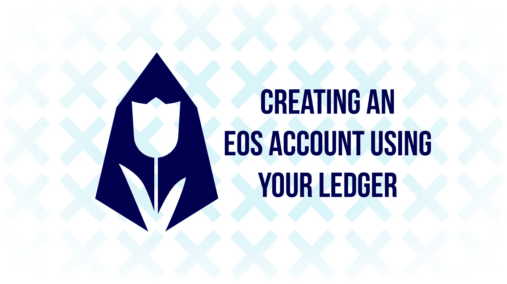
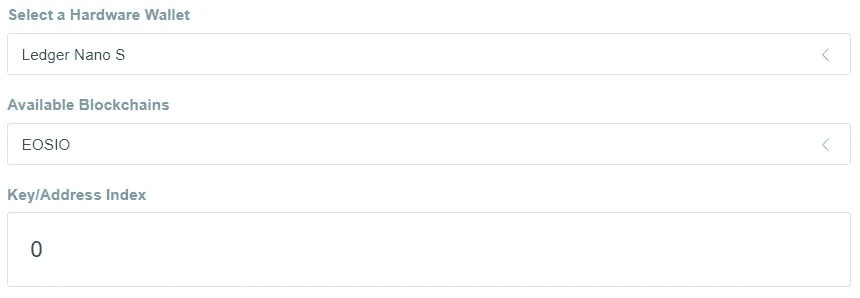

# 使用您的分类帐创建 EOS 帐户

> 原文：<https://medium.com/hackernoon/creating-an-eos-account-using-your-ledger-7169ba45bff1>

创建一个默认的 EOS 帐户可能非常容易，但通常缺乏使用硬件钱包(如 Ledger (Nano S ))创建 EOS 帐户所提供的安全性。由于许多人不确定如何做到这一点，我们创建了这篇文章，以指导您通过使用您的分类帐设备创建一个 EOS 帐户的过程。如果你想创建一个没有分类账的账户，看看我们的另一篇文章！

# 准备您的分类帐

开始吧！首先，我们建议您熟悉 EOS 账户的工作方式。如果你还不熟悉 EOS 账户的工作方式，我们建议在继续之前阅读[我们关于理解 EOS 账户工作方式的文章](/@eos_amsterdam/the-ultimate-guide-to-understanding-eos-accounts-a44b58ba5601)。

现在让我们继续准备你的账本。在开始使用您的分类帐创建新帐户之前，您需要确保您的分类帐安装了最新的固件和 EOS 应用程序。如果您已经完成了这一步，请继续下一部分。如果没有，首先下载并安装[官方总账实时应用](https://shop.ledger.com/pages/ledger-live)。

安装好 Ledger Live 应用程序后，连接并解锁您的分类帐，然后打开 Ledger Live 应用程序。然后导航到“管理器”，接受您的分类帐上的操作，并验证您的分类帐没有可用的固件更新，如果有，请按照步骤将固件更新到最新版本。

You may have a newer version of the EOS application

完成上一步后，从同一个“管理器”页面在您的设备上安装 EOS Ledger 应用程序。它将看起来像上面的图像。应用程序安装后，您可以继续下一部分，并开始生成您的密钥！

# 使用您的分类帐生成关键字

Ledger Live 应用程序不支持密钥的生成，所以我们将使用 [Scatter](https://get-scatter.com/) 来生成我们的密钥(并且还使用我们的帐户，我们将在后面解释)。Scatter 是一个支持 EOS 的桌面应用程序，用于访问大多数 EOS dapps 和工具包。散点可以从[这里](https://get-scatter.com/)下载。

Your password alternative represents your password as a phrase

继续下载并安装 Scatter，并按照说明进行操作。首先选择一个密码。请确保安全地存储它，因为您将需要它来访问您的分散。然后，系统会提示您进入“替代密码”屏幕，该屏幕会显示一个代表您的密码的短语。安全可靠地存储它(最好离线/纸质)，因为只有在您丢失原始密码时才需要它。

存储完密码和备用密码后，您可以继续。接受条款和协议，并选择自动备份的目标文件夹。

下一步是将您帐户的密钥导入 Scatter。单击“导入现有密钥”，然后单击“从硬件钱包导入”。这将带您进入以下屏幕:

Write the index of your key down!

在继续之前，请确保您的分类帐已连接、解锁并且 EOS 分类帐应用程序已打开。这样做后，选择任何关键指数，点击“导入关键”并接受你的分类帐的关键。我们建议记下您的密钥索引，因为您可能希望将来在不同的设备上导入相同的密钥。

Write down the associated permission with the key at your chosen index

导入密钥后，您可以给密钥起一个容易识别的名称，并通过在“帐户名”部分输入**your _ desired _ Account _ Name*@ owner****将其链接到您未来 EOS 帐户的*所有者*权限。您可以通过检查帐户(具有该名称)是否存在于像 [Bloks](https://bloks.io/) 这样的块资源管理器中来确保您的帐户名称可用。我们还建议在您选择的索引处记下相关的权限(在本例中是*所有者*)。然后点击左上角的“返回”。*

*恭喜你！您刚刚将您的第一把钥匙导入到散点中。您现在必须将第二个密钥添加到您的帐户中。点击散点图中的“添加键”,按照之前相同的步骤操作，但是在导入键时选择不同的键索引。然后，当您到达上图中的页面时，给密钥取一个不同的、容易识别的名称，并通过在“帐户名称”部分输入**your _ desired _ Account _ Name*@ active***将密钥链接到您未来 EOS 帐户的*活动*权限。*

*完成后，您已经将我们将用于创建帐户的密钥导入到 Scatter 中，您可以继续下一步。两个键现在都可以在散布中看到。*

# *创建帐户*

*下一步将是使用我们刚刚导入的密钥创建一个帐户。创建 EOS 账户有多种方法，有些方法非常简单，而有些方法可能更安全也更复杂。我们将讨论创建 EOS 帐户的两种最佳和最简单的方法。*

## *帐户生成器*

*创建您自己的 EOS 帐户的第一个也是最简单的方法是使用帐户生成器创建您自己的 EOS 帐户。一个帐户生成器只要求你的钥匙，一个帐户名称，然后要求你支付帐户，然后自动创建。*

**

*Entering your keys in the account generator*

*在本教程中，我们将使用 EOS Vibes 的[帐户生成器。要开始创建您的帐户，首先输入您想要的帐户名称(您已经在 Scatter 中输入)，然后一旦您选择了一个可用的名称，请单击“继续”并输入您之前生成的密钥。公共密钥可以通过点击分散中的密钥，然后转到“密钥&区块链”来找到。输入链接到您帐户的所有者权限的密钥作为所有者公钥，并输入链接到您帐户的活动权限的密钥作为活动公钥。一旦您验证了您的密钥，您可以继续下一步，这将是支付帐户。选择您喜欢的付款方式，并按照说明进行操作。当付款收到后，帐户将被创建，您可以使用您的密钥来访问该帐户。](https://eos-account-creator.com/)*

## *工具包*

*创建你自己的 EOS 账户的第二种方法是使用 EOS 工具包。一个 EOS 工具包可以被看作是许多 EOS 功能的接口，例如创建和管理一个帐户。虽然这种方法比前一种方法更简单，并且有更多的选择，但它要求您已经有一个 EOS 帐户(或者认识一个有 EOS 帐户的人)。在本教程中，我们将使用 GenerEOS 的[工具包。](https://eostoolkit.io/account/create)*

*首先，你/已经有一个 EOS 帐户的人必须使用[散布](https://get-scatter.com/)将他们的 EOS 帐户附加到工具包。如果他们还没有 Scatter，他们应该下载它并导入他们的帐户。一旦分散配置和解锁点击“附加帐户”在工具包的左上方。然后导航到“创建帐户”部分。*

**

*Creating an account using a toolkit*

*填写您想要的帐户名称(创建者名称将在您连接散点后自动填写)和密钥。输入链接到您帐户的所有者权限的密钥作为所有者公钥，并输入链接到您帐户的活动权限的密钥作为活动公钥。您可以将 CPU 份额、净份额和 RAM 购买量保留为默认设置，因为这些设置对大多数用户来说都很好。最后，确保打开“转账”选项，以确保新账户与原始账户完全分离，单击创建并使用分散确认交易，以执行新账户的创建。*

*始终确保您用来创建新帐户的 EOS 帐户包含足够的 EOS 来创建新帐户。创建新帐户的成本(使用上述设置)可以通过以下方式计算:([当前 RAM 价格/Kb](https://www.eosrp.io/))*(8192/1024)+0.1+0.1 =创建新帐户所需的 EOS 的最小数量*

*现在你可以开始使用你最喜欢的 dapps 和工具包了。在您开始使用 dapps 之前，请确保解锁您的分散应用程序，并在 EOS Ledger 应用程序打开的情况下连接和解锁您的分类帐。完成后，所有应用程序都可以通过点击“分散登录”来访问，然后您必须在您的分类帐中接受。不过，在使用 dapps 和工具包时一定要小心，并且在接受之前一定要检查一个(trans)动作。*

## *关于我们*

*EOS Mainnet 的基础模块生产商。欧洲连锁姐妹连锁店的合作伙伴。区块链项目的投资者。治理、跨文化合作和安全专家。你可以在这里找到我们:
EOS Block 制作人名称:eosamsterdam
[网站](https://eosamsterdam.net/)
[推特](https://twitter.com/eosamsterdam)
Youtube
[Steem](https://steemit.com/@eosamsterdam)*

**作者* [*亚尼克·斯兰特*](https://www.linkedin.com/in/yannick-slenter/) *作者* [*EOS 阿姆斯特丹*](https://eosamsterdam.net/)*