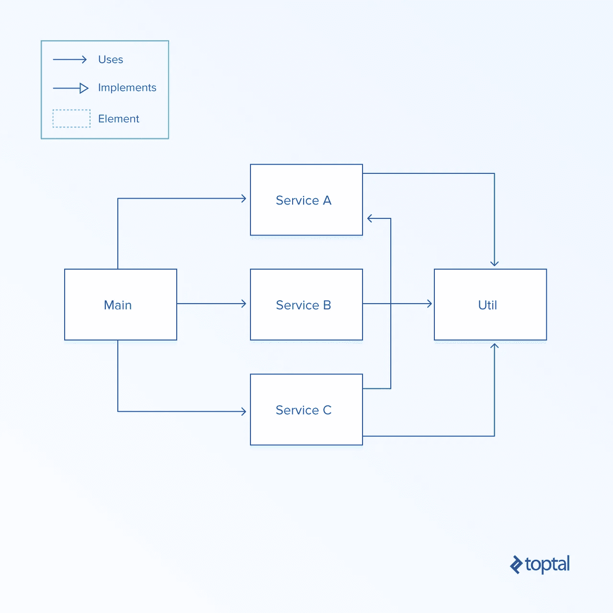
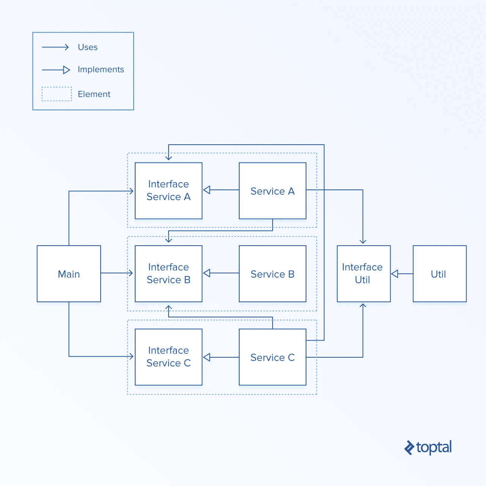
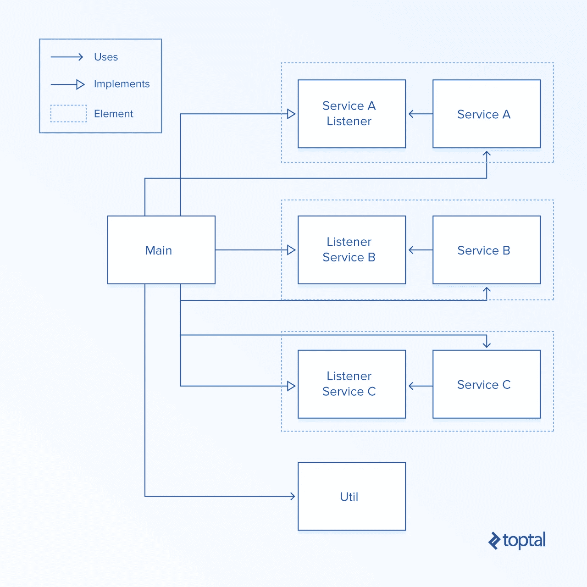
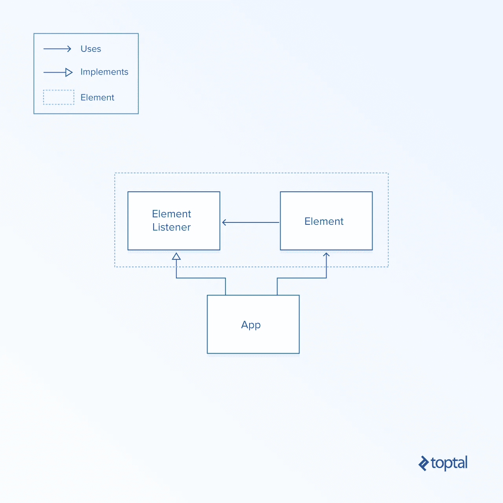
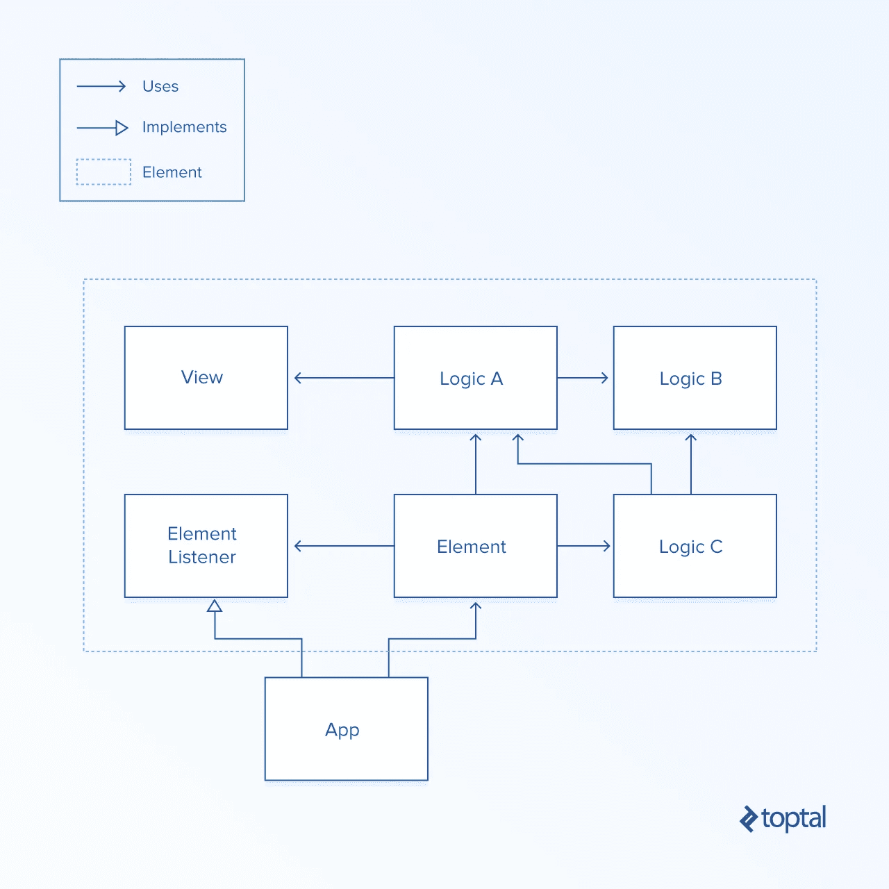

# 创建没有依赖性的模块化代码

> 原文：<https://medium.com/hackernoon/creating-truly-modular-code-with-no-dependencies-16f8f784d4a6>


Photo by [Aleksandar Cvetanović](https://www.pexels.com/@lemonzandtea) on [Pexels.com](http://www.pexels.com)

注意:我之前在[的博客](https://www.toptal.com/software/creating-modular-code-with-no-dependencies#catch-just-dynamite-developers)上发表了这篇文章。

开发软件是伟大的，但是…我想我们都同意这有点像情绪过山车。开始的时候，一切都很棒。你可以在几天甚至几小时内一个接一个地添加新特性。你好运连连！

快进几个月，你的开发速度降低。是因为你没有以前努力了吗？不完全是。我们再快进几个月，你的发展速度进一步下降。在这个项目上工作不再有趣，已经成为一种拖累。


情况变得更糟。您开始在应用程序中发现多个 bug。通常，解决一个 bug 会产生两个新的 bug。此时，你可以开始唱了:

> 代码中的 99 个小错误。
> 99 只小虫子。
> 取下一个，贴在周围，
> 
> …代码中的 127 个小错误。

你觉得现在做这个项目怎么样？如果你和我一样，你很可能开始失去动力。开发这个应用程序是一件痛苦的事情，因为对现有代码的每一次更改都可能产生不可预知的后果。

这种经历在软件世界中很常见，并且可以解释为什么这么多程序员想要扔掉他们的源代码并重写一切。

# 软件开发随时间变慢的原因

那么这个问题的原因是什么呢？

主要原因是日益增加的复杂性。从我的经验来看，总体复杂性的最大贡献者是这样一个事实，在绝大多数软件项目中，一切都是相互联系的。因为每个类都有依赖关系，如果你改变了发送邮件的类中的一些代码，你的用户会突然不能注册。这是为什么呢？因为您的注册码取决于发送电子邮件的代码。现在，如果不引入 bug，你就无法改变任何东西。跟踪所有的依赖关系是不可能的。

所以你有它；我们问题的真正原因是我们的代码所具有的所有依赖性增加了复杂性。

# 大泥球及如何减少

有趣的是，这个问题已经为人所知很多年了。这是一种常见的反模式，称为“大泥球”多年来，我在多家不同公司参与的几乎所有项目中都见过这种类型的架构。

那么这个反模式到底是什么呢？简单地说，当每个元素都与其他元素有依赖关系时，你会得到一个大泥球。下面，你可以看到一个著名的开源项目 Apache Hadoop 的依赖关系图。为了形象化这个大球泥(或者更确切地说，这个大球纱)，您画了一个圆，并将项目中的类均匀地放置在上面。在每一对相互依赖的类之间划一条线就行了。现在你可以看到问题的根源了。


Apache Hadoop’s “big ball of mud”

# 模块化代码的解决方案

所以我问了自己一个问题:有没有可能降低复杂性，但仍然像项目开始时一样充满乐趣？说实话，你不可能消除*所有*的复杂性。如果你想增加新的特性，你总是不得不增加代码的复杂性。然而，复杂性是可以移动和分离的。

# 其他行业是如何解决这个问题的

想想机械行业。当一些小型机械商店在制造机器时，他们购买一套标准元件，制造一些定制元件，然后将它们组装在一起。他们可以完全独立地制造这些部件，最后再组装起来，只需要做一些调整。这怎么可能呢？他们知道如何通过设定行业标准(如螺栓尺寸)和预先决策(如安装孔的尺寸和它们之间的距离)将每个元件装配在一起。


上述组件中的每个元件都可以由一个独立的公司提供，该公司对最终产品或其其他部分一无所知。只要每个模块元件都是按照规格制造的，你就能按计划制造出最终的设备。

我们能在软件业复制这一点吗？

我们当然可以！利用接口和控制原理的反演；最好的一点是，这种方法可以用于任何面向对象的语言:Java、C#、Swift、TypeScript、JavaScript、PHP——这个列表还在继续。应用这种方法不需要任何花哨的框架。你只需要坚持一些简单的规则，保持纪律性。

# 控制反转是你的朋友

当我第一次听说控制反转的时候，我立刻意识到我找到了一个解决方案。这是一个概念，利用现有的依赖关系，并通过使用接口来转换它们。接口是方法的简单声明。它们没有提供任何具体的实现。因此，它们可以用作两个元素之间关于如何连接它们的协议。如果你愿意，它们可以用作模块化连接器。只要一个元素提供接口，另一个元素为它提供实现，它们就可以在不了解对方的情况下一起工作。太棒了。

让我们看一个简单的例子，我们如何解耦我们的系统来创建模块化代码。下图是作为简单的 Java 应用程序实现的。你可以在这个 [GitHub 库](https://github.com/konrad-g/architectures)上找到它们。

# 问题

假设我们有一个非常简单的应用程序，只包含一个`Main`类、三个服务和一个`Util`类。这些要素以多种方式相互依赖。下面，您可以看到一个使用“大泥球”方法的实现。类之间简单的互相调用。它们是紧密耦合的，你不能简单地取出一个元素而不触及其他元素。使用这种风格创建的应用程序允许您最初快速增长。我相信这种风格适合于概念验证项目，因为您可以轻松地处理事情。然而，它并不适合生产就绪的解决方案，因为即使是维护也可能是危险的，任何单一的更改都可能产生不可预测的错误。下图展示了这个泥制建筑的大球。



# 为什么依赖注入完全错了

在寻找更好的方法时，我们可以使用一种叫做依赖注入的技术。这种方法假设所有组件都应该通过接口使用。我看过有人声称它可以解耦元素，但真的是这样吗？没有。请看下图。



目前的情况和一大团泥巴的唯一区别是，现在，我们不是直接调用类，而是通过它们的接口调用它们。它稍微改善了元素之间的分离。例如，如果你想在不同的项目中重用`Service A`，你可以通过去掉`Service A`本身，连同`Interface A`，以及`Interface B`和`Interface Util`来实现。如你所见，`Service A`仍然依赖于其他元素。因此，我们仍然会遇到在一个地方更改代码而在另一个地方搞乱行为的问题。这仍然产生了一个问题，如果你修改了`Service B`和`Interface B`，你将需要改变所有依赖于它的元素。这种方法不能解决任何问题；在我看来，它只是在元素之上增加了一层接口。你不应该注入任何依赖，而是应该一劳永逸地摆脱它们。为独立欢呼！

# 模块化代码的解决方案

我认为这种方法通过完全不使用依赖关系解决了依赖关系的所有主要问题。您创建了一个组件及其侦听器。侦听器是一个简单的接口。每当需要从当前元素外部调用方法时，只需向侦听器添加一个方法并调用它。该元素只允许使用文件、调用其包中的方法以及使用主框架或其他使用的库提供的类。下面，您可以看到一个修改后的应用程序图，它使用了元素架构。



请注意，在这个架构中，只有`Main`类有多个依赖项。它将所有元素连接在一起，并封装了应用程序的业务逻辑。

另一方面，服务是完全独立的元素。现在，您可以从这个应用程序中取出每个服务，并在其他地方重用它们。他们不依赖其他任何东西。但是等一下，情况会变得更好:只要不改变它们的行为，就不需要再修改这些服务。只要这些服务做了它们应该做的事情，它们就可以一直保持原样，直到时间结束。它们可以由专业的软件工程师创建，也可以由第一次编写代码的人用最糟糕的混合了`goto`语句的代码编写而成。没关系，因为他们的逻辑是封装好的。尽管这可能很可怕，但它绝不会波及到其他职业。这也给了你在多个开发人员之间分割项目工作的权力，每个开发人员可以独立地工作在他们自己的组件上，而不需要打断另一个开发人员，甚至不需要知道其他开发人员的存在。

最后，你可以再次开始编写独立的代码，就像你上一个项目的开始一样。

# 元素模式

让我们定义结构元素模式，以便我们能够以可重复的方式创建它。

元素的最简单版本由两部分组成:一个主元素类和一个侦听器。如果您想使用一个元素，那么您需要实现监听器并调用主类。下面是最简单的配置图:



显然，你最终需要增加元素的复杂性，但是你可以很容易地做到。只要确保您的逻辑类不依赖于项目中的其他文件。他们只能使用主框架、导入的库和该元素中的其他文件。当涉及到图像、视图、声音等资产文件时。，它们还应该被封装在元素中，以便将来易于重用。你可以简单地将整个文件夹复制到另一个项目中，就这样了！

下面，您可以看到一个显示更高级元素的示例图。请注意，它由它正在使用的视图组成，并且不依赖于任何其他应用程序文件。如果您想知道检查依赖项的简单方法，只需查看导入部分。当前元素之外有文件吗？如果是这样，那么您需要通过将它们移动到元素中或者通过向侦听器添加适当的调用来移除这些依赖关系。



让我们来看一个用 Java 创建的简单的“Hello World”示例。

```
public class Main { interface ElementListener {
    void printOutput(String message);
  } static class Element { private ElementListener listener; public Element(ElementListener listener) {
      this.listener = listener;
    } public void sayHello() {
      String message = "Hello World of Elements!";
      this.listener.printOutput(message);
    }
  } static class App { public App() {
    } public void start() { // Build listener
      ElementListener elementListener = message -> System.out.println(message); // Assemble element
      Element element = new Element(elementListener);
      element.sayHello();
    }
  } public static void main(String[] args) {
    App app = new App();
    app.start();
  }
}
```

最初，我们定义`ElementListener`来指定打印输出的方法。元素本身的定义如下。在元素上调用`sayHello`时，它简单地使用`ElementListener`打印一条消息。请注意，该元素完全独立于`printOutput`方法的实现。它可以打印到控制台、物理打印机或漂亮的 UI 中。元素不依赖于实现。由于这种抽象，这个元素可以很容易地在不同的应用程序中重用。

现在看看主要的`App`级。它实现侦听器，并将元素与具体实现组装在一起。现在我们可以开始使用它了。

[你也可以在这里用 JavaScript 运行这个例子](https://codepen.io/konrad-g/pen/JyBQYE)

# 元素架构

让我们来看看在大规模应用中使用元素模式。在小项目中展示是一回事，应用到现实世界是另一回事。

我喜欢使用的全栈 web 应用程序的结构如下所示:

```
src
├── client
│   ├── app
│   └── elements
│   
└── server
    ├── app
    └── elements
```

在源代码文件夹中，我们最初将客户机和服务器文件分开。这样做是合理的，因为它们运行在两种不同的环境中:浏览器和后端服务器。

然后我们将每一层中的代码拆分到名为 app 和 elements 的文件夹中。Elements 由具有独立组件的文件夹组成，而 app 文件夹将所有元素连接在一起，并存储所有业务逻辑。

这样，元素可以在不同的项目之间重用，而所有特定于应用程序的复杂性都封装在一个文件夹中，并且经常简化为对元素的简单调用。

# 动手示例

相信实践总是胜过理论，让我们看看用 Node.js 和 TypeScript 创建的真实例子。

[现实生活中的例子](https://github.com/konrad-g/ten)

这是一个非常简单的 web 应用程序，可以用作更高级解决方案的起点。它遵循元素架构，并且使用广泛的结构化元素模式。

从 highlights 中，您可以看到主页已经被区分为一个元素。此页面包含其自己的视图。因此，例如，当您想要重用它时，您可以简单地复制整个文件夹并将其放入不同的项目中。只需将所有东西连接在一起，就万事大吉了。

这是一个基本的例子，说明您现在就可以开始在自己的应用程序中引入元素。你可以开始区分独立的组件，分离它们的逻辑。你目前正在处理的代码有多乱并不重要。

# 开发更快，复用更多！

我希望，有了这套新工具，您将能够更容易地开发更易于维护的代码。在开始实际使用元素模式之前，让我们快速回顾一下所有要点:

*   软件中的许多问题都是由于多个组件之间的依赖而发生的。
*   通过在一个地方进行更改，您可以在其他地方引入不可预测的行为。

三种常见的架构方法是:

*   大泥球。这对快速开发来说很好，但对稳定生产来说就不那么好了。
*   依赖注入。这是一个不成熟的解决方案，你应该避免。
*   元素架构。该解决方案允许您创建独立的组件，并在其他项目中重用它们。对于稳定的产品发布来说，它是可维护的和出色的。

基本的元素模式由一个主类和一个侦听器组成，主类包含所有的主要方法，侦听器是一个简单的接口，允许与外部世界进行通信。

为了实现全栈元素架构，首先要把前端和后端代码分开。然后，在每个文件夹中为应用程序和元素创建一个文件夹。elements 文件夹包含所有独立的元素，而 app 文件夹将所有元素连接在一起。

现在你可以开始创建和分享你自己的元素了。从长远来看，它将帮助您创建易于维护的产品。祝你好运，让我知道你创造了什么！