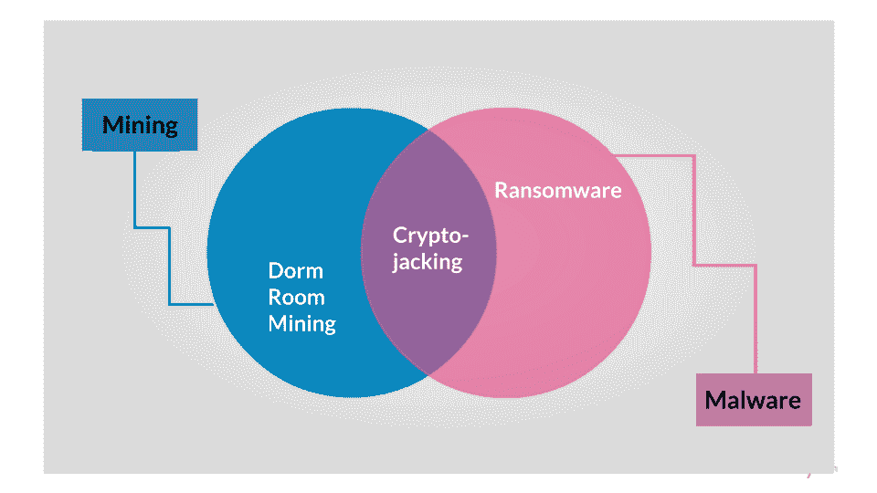
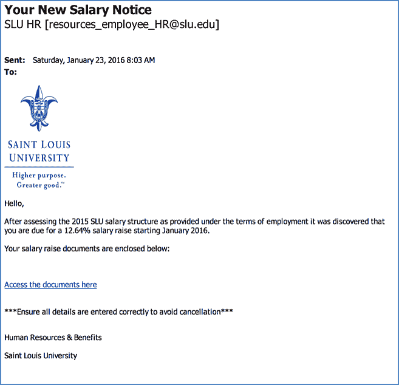
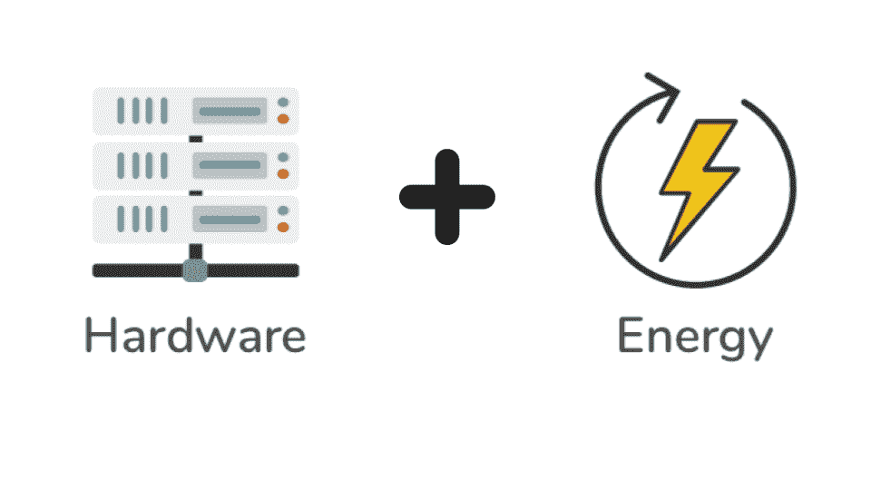
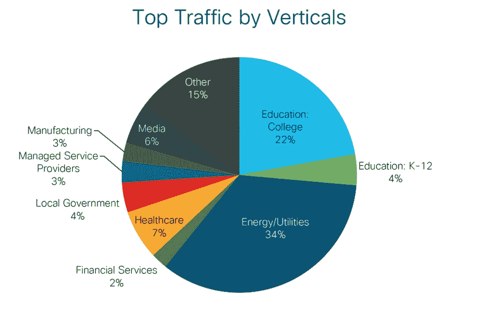
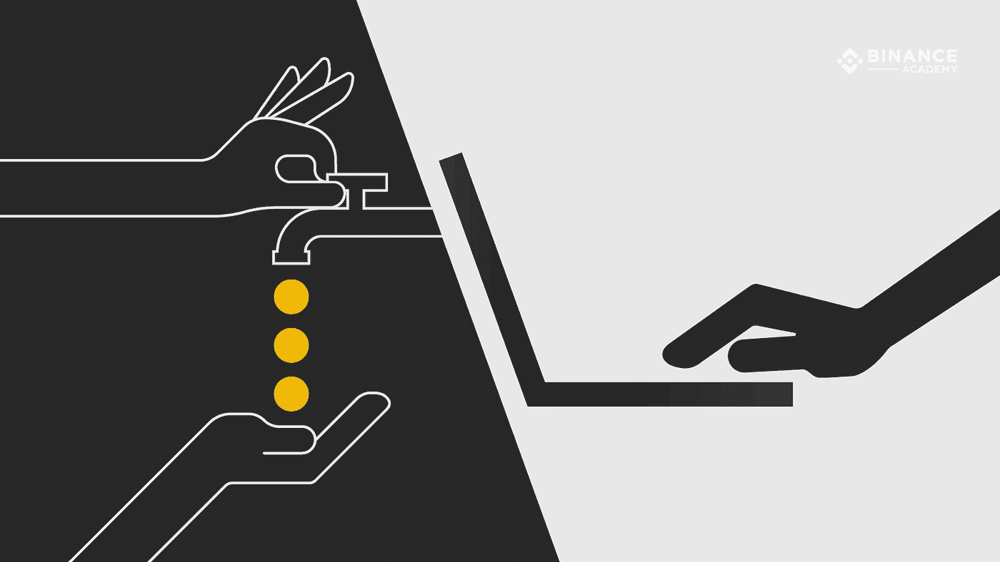

# 加密对大学构成了新的威胁

> 原文：<https://medium.com/hackernoon/crpyto-is-posing-new-threats-to-universities-f67eaccc2bae>

Photo by [Bernard Hermant](https://unsplash.com/@bernardhermant?utm_source=medium&utm_medium=referral) on [Unsplash](https://unsplash.com?utm_source=medium&utm_medium=referral)

不管喜欢与否，由于加密货币的到来，大学处于独特的位置，容易受到各种各样的利用和数字攻击。最具挑战性的部分是，这些威胁很难识别，直到事后。

当你把无拘无束的电力供应、庞大的内部计算机网络、大量拥有管理权限的员工和精通技术的年轻人结合在一起时，事情会很快变得有趣起来。

威胁来自两个方面- **恶意软件**和**矿业**。稍后我们将进入*什么，如何*和*为什么*。但是首先看看这张我花了 7 分钟做的维恩图。

# 恶意软件

如果你是第一次接触恶意软件，让我来解释一下……啊，去它的。“嘿，Siri…”

所以基本上，恶意软件只是恶意软件的简称。它可能通过数字管道传播，感染一台主机或整个网络。有许多类型的恶意软件存在；广告软件、间谍软件、特洛伊木马。然而，有一种类型正在经历爆炸式的增长。进入勒索软件。

# 勒索软件

需要理解的最重要的技术转变是，比特币首次带来了一种数字原生价值。随后，其他加密货币(其中一些是匿名的)大量涌现，这意味着攻击者有一种方便且难以追踪的支付方式来利用安全漏洞。

> “网络罪犯一直面临的问题是如何将数据转化为货币。现在数据就是货币。”
> 
> *-奥利弗·罗奇福德，Tenable 网络安全公司的研究总监*

请这样想——以前，如果有人可以侵入你的电子邮件帐户，他们就可以阅读你的电子邮件或从你的地址发送垃圾邮件。今天，有人可能会侵入你的电子邮件账户，并从本质上将其作为人质，要求你向他们支付费用(以加密货币的形式)以重新获得访问权限。这听起来可能没什么大不了的，但是如果你用同样的方法来研究一家大型国际航空公司的订票系统。妈的。获取。真实的。

勒索软件是如何进入一个系统的？嗯，最初是通过包含在网络钓鱼电子邮件中的恶意链接或附件。将此与运行过时且可被利用的操作系统的联网计算机相结合，您可能会放弃对大量敏感数据的访问。在有针对性的攻击中，这些可能很难识别，如下例所示*(来源:*[*EDTS*](https://www.edts.com/edts-blog/15-examples-of-phishing-emails-from-2016-2017)*)。*

像许多大型组织一样，大学可能有数千名员工需要定期访问私有共享数据库(员工福利、课程表、学生账户等)。有人意外下载恶意文件的可能性很高，它是否感染系统取决于网络安全等级和现有协议。

这是最近头条新闻的简短列表-

 [## 卡尔加里大学向网络攻击者支付 2 万美元赎金以解锁计算机系统| CBC 新闻

### 在最初的袭击发生一周后，这所大学于周二宣布支付赎金。“作为维护……

www.cbc.ca](https://www.cbc.ca/news/canada/calgary/university-calgary-ransomware-cyberattack-1.3620979)  [## 洛杉矶谷学院向黑客支付 2.8 万美元比特币赎金

### 洛杉矶社区大学区上周支付了 28000 美元的比特币赎金给控制了一个…

www.latimes.com](https://www.latimes.com/local/lanow/la-me-ln-los-angeles-valley-college-hacking-bitcoin-ransom-20170111-story.html)  [## 卡尔顿大学计算机系统被黑客攻击，要求支付比特币

### 卡尔顿大学成为勒索软件攻击的最新受害者，黑客要求学校支付…

ottawacitizen.com](http://ottawacitizen.com/news/local-news/demands-for-payment-in-bitcoins-after-some-computers-hacked-at-carleton) 

我希望你没有点击这些链接！放松，我在开玩笑。

最近一连串的事件表明，联邦调查局坚决反对向攻击者支付任何形式的赎金，因为无法保证数据会被解锁(解密)。尽管在某些情况下，关键数据的备份不可用，但一些教育机构认为他们别无选择。

# 采矿

这是一个更容易理解的问题。某些加密货币是通过一种叫做工作证明的功能来累积的，这种功能通常被称为“挖掘”。基本上，这意味着花费计算能力来解决一个确定的问题，以便有可能获得新硬币的奖励。你可能会在新闻中看到这样的画面:巨大的仓库堆满了微型黑匣子，为了追逐比特币，它们一周 7 天 24 小时不停地嗡嗡作响，但还有其他加密货币不需要如此大的规模来实现成本效益。事实上，某些加密货币可以使用中等功能的游戏笔记本电脑来挖掘。

所以你在这里的主要投入成本是**硬件**和**能源**。

# 宿舍采矿

现在考虑一下，大学从本质上来说会创造相当高的技术娴熟的个人集中度。他们经常囊中羞涩，只能靠稳定的拉面和牛磺酸维持生活。一些人很快就意识到，他们可以利用宿舍里提供的看似“免费”的电力，将其与硬件相结合，从而将其转化为密码。如果你不把电力成本考虑在内，你可以开采某些普通人可能会亏本的加密货币。以下是 2018 年按行业细分的加密挖掘流量来源。这些数据是由思科捕获的，思科监控着一些合作客户的网络连接。

是的，随着时间的推移，这是一笔由其他学生通过学费上涨支付的巨额能源账单。我能感觉到你骨子里的失望。

# 挖掘+恶意软件=

当你把这两个概念结合起来，你就创造了一个全新的威胁。如果可以使用普通的台式电脑来挖掘某些加密货币，那么任何未得到充分利用、安全性较弱的大型计算网络都会成为有吸引力的劫持目标。

# 密码劫持

正如劫车涉及未经授权使用您的车辆一样，密码劫持涉及未经授权使用您的计算硬件。在这种情况下，你可能甚至没有意识到它正在发生。当你使用电脑(笔记本电脑、个人电脑、智能手机)时，很可能你没有使用所有可用的计算能力。这种额外的权力现在可以通过这种新的恶意软件进行货币化，以达到采矿的目的。新斯科舍省的圣弗朗西斯泽维尔大学在 2018 年末就经历了这样的事情。

加密劫持攻击始于 11 月 1 日，目标是该大学庞大的网络基础设施，用于未经授权挖掘一种尚未被识别的加密货币。在检测到恶意软件后，学校立即将其整个网络离线，有效地瘫痪了与其在线课程系统、云存储、电子邮件服务、借记交易和 Wi-Fi 相关的所有活动。”— 雅虎财经

关闭整个大学网络一周并不理想。圣弗朗西斯泽维尔在安全升级、生产力损失、名誉损害等方面的成本将是巨大的。最令人担忧的部分是，发动这种攻击的成本可以忽略不计。因此，如果你从这篇文章中有所收获的话，那就是过剩的能力(电力或计算)和数据现在都有了货币价值。

# 成功

严酷的事实是，情况在好转之前很可能会变得更糟。随着匿名在线身份的出现，以及现在匿名和不可追踪的支付方式的出现，我们在准备防范这些行为和攻击的策略时，必须简单地研究这些行为和攻击背后的经济动机。有一件事非常清楚，那就是大学将处于不幸的境地，成为第一批被迫找出解决这些新威胁的方法的人。幸运的是，这恰好是他们最大的能力之一。

# 来源

 [## 免费货币:学生如何在宿舍挖掘加密货币

### 加密挖掘似乎在学生中很受欢迎，但这种“免费”的钱真的有用吗？

cointelegraph.com](https://cointelegraph.com/news/free-money-how-students-mine-cryptocurrency-in-their-dorm-rooms)  [## 2016-2017 年的 15 个钓鱼邮件示例

### 当大多数人想到网络攻击和数据泄露时，他们会想到一个戴着头套的黑客在敲打键盘…

www.edts.com](https://www.edts.com/edts-blog/15-examples-of-phishing-emails-from-2016-2017)  [## 大学生正在利用校园电力挖掘密码

### 大学校园不仅仅产生新的大学毕业生。他们也在大量生产加密货币…

www.pcmag.com](https://www.pcmag.com/news/366952/college-kids-are-using-campus-electricity-to-mine-crypto)  [## 加密货币和网络犯罪经济学的革命。Com

### 比特币和以太坊等加密货币彻底改变了网络犯罪的经济学，产生了显著的影响…

www.securityweek.com](https://www.securityweek.com/cryptocurrencies-and-revolution-cybercrime-economics)  [## 密码劫持攻击迫使加拿大大学关闭整个网络

### 加拿大新斯科舍省的圣弗朗西斯泽维尔大学已经成为加密货币挖掘恶意软件的目标…

ca.finance.yahoo.com](https://ca.finance.yahoo.com/news/cryptojacking-attack-forces-canadian-university-234718550.html)