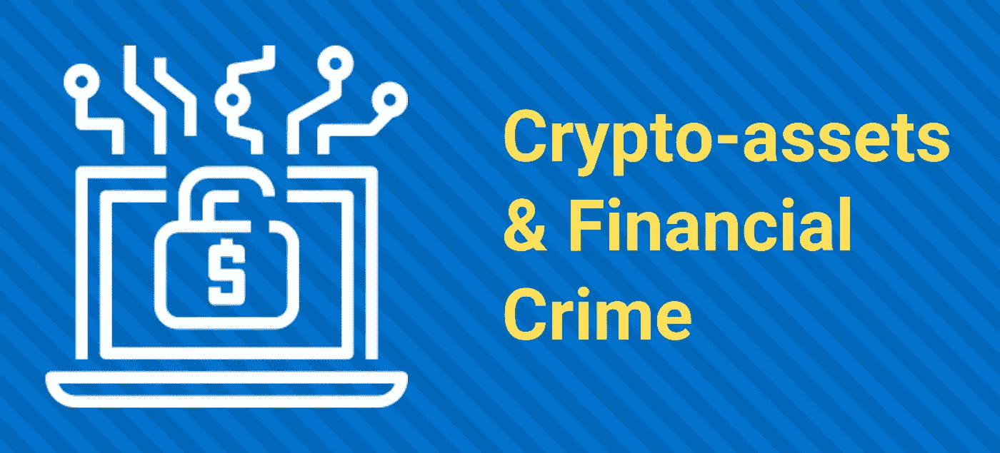

# 秘密资产与金融犯罪

> 原文：<https://medium.com/hackernoon/crypto-assets-financial-crime-be60008d1dfd>

***犯罪分子将加密资产视为金融犯罪的绝佳媒介。这是因为当人们使用比特币和类似货币时，他们享受着匿名的感觉。但有证据表明加密货币正被用于金融犯罪吗？如果是这样的话，对此采取了什么措施？***

Cover icon by dDara from flaticon.com

# 为什么是加密货币？

为什么白领犯罪分子和诈骗分子会选择使用加密货币？媒体的看法是，比特币等货币为犯罪分子提供了一定程度的隐私，这是他们在使用现金或银行转账时享受不到的。

在某种程度上，确实如此。比特币钱包的 ID 是一串字符，它本身不可能与任何一个人相关联，不管这个人是不是罪犯。一个人在交易所使用的名字也不一定与一个人相关联，只要他们不使用可识别的东西。

但是加密货币的匿名性被区块链破坏了。每笔交易都记录在一个可公开访问、不可编辑的分类账中。就目前情况而言，通过不倒翁伪装资金及其最终目的地是可能的，但只要有足够的时间和努力，任何金额的资金都可以被跟踪。

然而，不管匿名声明有多准确，这些声明都是犯罪分子对加密货币感兴趣的原因。比特币声名鹊起，引起了企业、个人和欺诈者的关注。

# 哪些金融犯罪？

加密货币几乎可以用于任何类型的犯罪:最知名、最引人注目的犯罪是那些与黑暗网络有关的犯罪。任何与黑客攻击和“网络犯罪”、恐怖主义和性犯罪有关的内容都被广泛强调。

没有突出显示的是任何没有抓住想象力的东西。简单的欺诈和洗钱不会像上面列出的那样激发想象力，所以尽管它们比恐怖分子融资更常见，但它们在很大程度上被忽略了。

就金融犯罪而言，有几个需要注意的问题，包括:

1.**洗钱**

2.**银行欺诈，**即欺诈性地获取银行资产

3.**冒充银行**欺骗受害者向你汇款(也称为“银行诈骗”)

4.**支付欺诈**，这是一种从受害者处窃取钱财的骗局，例如网络钓鱼、身份盗窃或页面劫持

5.**欺诈性退款，**即在不必要时从企业处获得退款，但仍保留该商品

6.**资助犯罪，**例如[资助恐怖分子](/@sd.casadeibernardi/the-terrorist-use-of-cryptocurrencies-f44088ca12fe)。

洗钱可以通过加密货币轻松完成。硬币是通过交易所购买的，然后放入平底玻璃杯中。然后，它们被成批地转发到另一个已知的人以前没有使用过的钱包中。

至于资助恐怖主义，媒体对此进行了广泛报道。尽管它发生的频率可能被高估了，但这并不意味着它没有发生。

# 加密货币是否都参与了金融犯罪？

话虽如此，但并非所有加密货币都与金融犯罪有很大关联。比特币因成为市场上的第一名以及其令人难以置信的价值增长而受到了很多关注。但这并不是最受希望匿名的人欢迎的。

Monero 和 Z-Cash 是目前最受欢迎的以隐私为中心的加密资产。这些以隐私为导向的加密货币都参与了恐怖主义融资，特别是 ISIS。

目前还不清楚这些货币在多大程度上被用于不那么光彩、引人注目的金融犯罪。绝对明确的是，这些货币背后的人否认有问题。和所有加密货币一样，这两种货币都建立在区块链的基础上。

但任何了解加密资产的罪犯都会被这些以隐私为中心的货币所吸引，而不是比特币等其他货币。

# 正在做什么？

执法机构开始意识到加密货币的可能性和危险性。例如，国际刑警组织正在积极准备应对这些危险。他们已经成立了一个专门研究加密货币的特别小组(国际刑警组织暗网和加密货币工作组)。

在 [2018 年](https://www.interpol.int/en/News-and-Events/News/2018/Challenges-of-Altcoins-for-investigations-prosecutions-focus-of-INTERPOL-meeting)他们举行了一次会议，强调替代硬币是一个特别关注的问题。但目前有超过 2000 种加密货币可用，他们的工作是识别哪些最有可能被犯罪分子使用。特别是，他们强调了 Monero 和 Z-Cash——我们上面描述的两种加密资产——值得研究。

然而，除了调查个别犯罪，国际刑警组织能做多少还不清楚。这项任务留给了金融科技、加密公司和常规金融机构，让它们尽可能地识别欺诈交易。

# 额外的政府监管是答案吗？

一些加密货币法规已经存在，减少了金融犯罪的机会。

例如，在美国，比特币交易所必须在美国财政部的[金融犯罪执法网络](https://www.fincen.gov/)注册。但是，在能够发现金融犯罪和欺诈的工具出现之前，更严格的监管并不是解决问题的办法。

尽管区块链记录了每一笔交易，但这种能力是存在的。我们所需要的是正确的工具来分析我们面前的所有数据。目前市场上有许多 IT 解决方案，其中一些提供了足够的可靠性。

你也可以争辩说，政府至少需要对调查这些白领犯罪的指控发出更大的声音。即使他们目前没有能力抓住每一个诈骗犯，但表明他们正在努力至少可以阻止未来的罪犯。

但就监管而言，政府能做的不违反加密货币基本要点的事情很少。这个想法是，每枚硬币都是独立的，被转移，不受政府干预。

在完全放松监管和防范金融犯罪之间取得平衡将会很困难。

本文不应被解释为任何形式的推荐、认可、意见或批准。它仅供参考，不应作为法律依据。**在根据提供的信息采取行动之前，应始终寻求专业建议。**