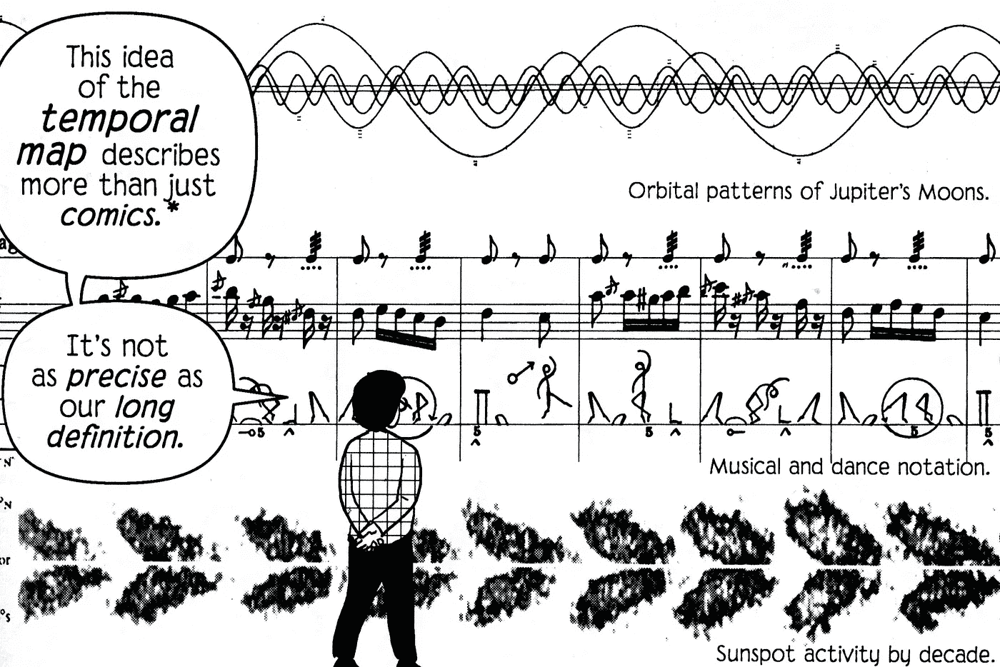
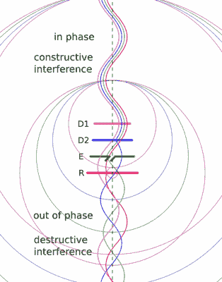

# 超越资本主义的密码:第五部分

> 原文：<https://medium.com/hackernoon/crypto-beyond-capitalism-part-5-ff7386c09095>

## 信任、时间和协调我们共同的未来

这是一篇长文的第五部分，概述了我对新兴的秘密生态系统如何适应生物、文化和经济进化的宏观观点。我打算最初分别出版每一期。之后，我会以电子书的形式发布全部内容，包括额外的笔记和研究材料。

*如果您还没有阅读过本系列的* [*第一篇*](https://hackernoon.com/crypto-beyond-capitalism-the-rise-of-distributed-valerism-7e3c1285a308) [*第四篇*](https://hackernoon.com/crypto-beyond-capitalism-part-2-9309829247b2) [*第八期*](https://hackernoon.com/crypto-beyond-capitalism-part-3-c6128853ebba)***第八期，您可能应该在继续阅读本文之前先阅读它们，因为每一期都建立在更早的概念之上。***

** [## 超越资本主义的密码(马修·皮尔科夫斯基所有论文)

### 亚当·斯密从来没有预料到加密货币的兴起，但正如我们所知，加密将改变资本主义…

hackernoon.com](https://hackernoon.com/crypto-beyond-capitalism/home) 

否则，系好安全带，因为这是一次漫长而曲折的旅程。

> 在漫长的历史长河中，美国知道，我们这个越来越小的世界必须避免成为一个充满恐惧和仇恨的社区，而应该成为一个相互信任和尊重的自豪联盟。
> 
> —德怀特·戴维·艾森豪威尔

信任和正直在人类价值观中占据着受人尊敬的地位。然而，就像金钱的概念一样，我们很少停下来考虑它们的基本含义。我们每个人心中都有一种根深蒂固的感觉，那就是信任某人意味着什么，即使我们不能准确地表达这种感受意味着什么。毕竟，这是一种我们从某些人那里得到的感觉，而不是其他人。此外，大多数人觉得自己有能力识别那些正直的人，不管他们自己是否获得了伦理学博士学位。再说一次，这是一种我们人类凭直觉理解的能力——甚至是在语言出现之前。

虽然我们觉得随意使用这些术语来描述我们周围的人很舒服，但我们并不经常将信任和诚信的概念与时间本身联系起来。在这里，我们发现另一个例子，一个概念的基本功能如此深刻地支持我们生活现实的结构，以至于它变得或多或少地不为我们的心灵所见。但是这种隐形并不适合我们的需要；相反，我们必须发掘并有意识地审视这些信任和诚信的概念。作为人类价值及其表现的探索者，我们有责任阐明和讨论时间、信任和诚信之间不断发展的关系，因为这是所有其他复杂的人类互动的基石。

那么，*什么是信任*？这个词指向哪一类人际关系？我认为*信任是一种奢侈的信任——在没有强制的情况下——相信另一个人会准确地代表他们未来的行为意图和他们之前行为路径的细节。缺乏信任意味着相反的情况:相信有人会歪曲他们未来的意图或过去的行为。除了人与人之间的信任，我们用正直这个词来形容那些证明自己值得我们信任的人——也就是说，值得信任—*——尽管在遭遇中，他们的直接动机诱使他们做出其他行为。例如，如果你委托*帮*帮你拿杂货的朋友去了当地的赌场，把你买杂货的钱花在赌马上，你就不太可能*信任*他们再次处理这项任务。这是因为，尽管他们声称他们打算带来一个你可以做饭的未来现实状态，但他们无法抗拒偏离他们承诺的道路——他们无法抗拒自己的诱惑。从这个意义上说，正直证明了对违反信任纽带的诱惑的持续抵制。记住这些定义，让我们考虑信任、诚信和时间在经济领域中扮演的角色。**

*如果我们把信任和正直的个体特征提升到社会水平，我们可以进一步阐明它们与时间的关系。正如在第二部分中所讨论的，考虑一下那些很久以前就开始将他们的精神价值外化的小规模社会。这些团体将重要事件的记录编码成能够在个人意识之外的共享领域内象征和标志价值的格式。他们发明了象征性的系统，如贝壳交易、绳结或珠宝的创造，以便*增加他们的整体一致性——*扩展他们的能力，以平衡团体的集体代理与提供更大的个人自主权*。集体代理和个人自主之间的这种张力增加了社会的适应能力，并在社会完整性的支点上保持不稳定的平衡。因此，我们外在化的价值符号承担了巨大的负担，然而没有信任它们就无法发挥作用。这是因为信任和正直是一个群体相信其过去和未来的共同表现的有效性的基础。但是，当一个群体的成员由于缺乏诚信而开始破坏对这些符号的信任时，价值符号就失去了促进一致性的力量。如果没有人相信符号化的过去的真实性，就没有人会使用这些符号来规划未来。**

## *信任作为时间映射*

**

*Courtesy of [Scott McCloud](https://en.wikipedia.org/wiki/Scott_McCloud)’s excellent tour de force, [Reinventing Comics](https://www.amazon.com/Reinventing-Comics-Evolution-Art-Form/dp/0060953500/ref=pd_sim_14_2?_encoding=UTF8&pd_rd_i=0060953500&pd_rd_r=5f950235-12a7-11e9-aa93-791c7bad081c&pd_rd_w=oBqK6&pd_rd_wg=WjLiY&pf_rd_p=18bb0b78-4200-49b9-ac91-f141d61a1780&pf_rd_r=6GDXNMJT3M21F1STYR1J&psc=1&refRID=6GDXNMJT3M21F1STYR1J)*

*换句话说，一个社会中高度的信任和诚信让其成员对其*时间图*的保真度有信心。每个成员可以信任关于过去事件的信息的有效性，即使他们没有亲身经历所述事件，并且因此可以利用*集体持有的时间图*来协调未来的计划。有了他们*值得信赖的* *地图*在手，一个高度诚信社会的计划不会因为有意的谎言和欺骗而变得更加复杂——超越自然的熵。很难夸大这种能力的价值，这就是为什么我们将这种状态的直觉知识深深嵌入到我们的合作语言中:例如，在同一页上的*本质上定义了在给定的社会背景下拥有共享的时间地图的含义*。*在一个不可预测的世界中，信任和诚信随着时间的推移增加了复杂社会系统的保真度、可预测性和稳定性。这些因素赋予能够保持高度信任和诚信的社会强大的适应优势。简而言之，信任是最强大的自然资源。**

*不幸的是，维护一个高完整性的时态地图被证明是极具挑战性的。随着地图的改善，社会的集体经济潜力增加，利用信任的短期价值也会增加。其他人越是努力创造连贯的社会价值，就越有可能享受这种价值的好处，而自己却不承担贡献的机会成本。这就是所谓的[搭便车问题](https://en.wikipedia.org/wiki/Free-rider_problem)，通常从集团经济效率低下或无力管理局部负外部性的角度来讨论。虽然这些框架仍然有效，但我认为这个问题的根源要深得多，并且似乎在时间本身的层面上得到最充分的概念化。*

*通过时间透镜，我们看到个体和集体最优行为之间的紧张关系出现在他们各自的时间视野的优先级之间的不匹配。换句话说，我们涌现的现实的不同层面已经适应了不同的[时间偏好](https://en.wikipedia.org/wiki/Time_preference)，每一层都与各自层面的环境因素对称。今天对个人有益的，下周对群体未必有益，反之亦然。更复杂的是，在任何给定的时刻，集体和个人的需求和直觉都可能不同，而且还不清楚哪一层的偏好应该优先。因此，我们使用我们的行动进行实验，并记录随着时间的推移证明有用的结果。然而，如果这些成果要随着时间的推移茁壮成长并开花结果，我们必须*信任我们用来记录过去结果的工具*。*

*随着我们对这些概念的深入探究，直观地把握时间紧张的问题将变得越来越有必要。因此，为了帮助构建关于*嵌套时间张力*的直觉，让我们更仔细地检查它的分层结构的进化起源。作为基线，让我们建立几个这样的层，生活在 2018 年的人可能会发现自己被嵌入其中。在这里，我们检查了一个美国公民的临时嵌套的粗略漫画:*

*   *平均雇佣期为 3-5 年。*
*   *平均婚姻持续 10-15 年。*
*   *美国人的平均寿命约为 80 岁。*
*   *美国自成立以来已有 250 年了。*
*   *西方社会的起源可以追溯到大约 2500 年前。*
*   *大规模的文明可以追溯到至少 10，000 年前。*
*   *人类本身也有 30 万年了。*
*   *我们的灵长类祖先在几百万年前就出现了。*

*让我们假设这些时间类别中的每一个都代表了连贯的社会组织的*层，并且每一层都对嵌套在其中的那些施加了独特的行为约束。例如，大多数美国人都有头发，因为美国人是灵长类动物，头发带来了各种各样的行为限制。由于这些限制，再加上其他路径依赖，大多数美国人使用洗发水。因此，如果文明是从海豚群体而不是黑猩猩群体中出现的，我们就不太可能有洗发水行业。显然，洗发水的使用是一个微不足道的例子，但人们可以很容易地想象，作为我们特定的时间嵌入的结果，大量不平凡的约束可能会出现。但是现在我们将探索这个过程的*动力学*，而不是具体的例子和反事实。为此，想象一下，随着这种嵌套的约束结构与进化压力相互作用并适应进化压力，幸存下来的层越来越多地反映出一种动态稳定性，这种稳定性是由集体代理和个人自治之间的*张力所驱动的*在*不同的进化时间范围内*。**

*在对这种结构进行更仔细的研究后，人们可能会注意到，随着我们在列表中从长时间间隔到短时间间隔向上移动，我们也从一般稳定的模式转向越来越动态的——或脆弱的——进化实验。也就是说，每天都有数以千计的美国人死去，然而这些人赖以生存的深层却保持着连贯性。这种动态个体在稳定集体中的嵌套也意味着，当我们作为个体出现时，我们携带了来自集体凝聚力深层的分形模式印记。此外，我们可能仍然不知道我们是否使用 DNA 媒介在生物学上或通过语言媒介在文化上印记这些模式。*重要的是图案，而不一定是图案在其上穿越时间的载体基底*。换句话说，作为个体，我们是由深度嵌套的互动模式组成的——*分层的行为沉淀*——由先于并约束我们当前行为的稳定集体编码。有点违反直觉，这意味着个人同时是系统中最受约束的一层，也是可能出现新模式的唯一一层。*

## *时间共振与生物文化编码*

**

*Benjamin Franklin’s favorite invention: the armonica. [Watch it](https://www.youtube.com/watch?v=eEKlRUvk9zc) sing.*

*为了更好地理解这种嵌套印记过程如何影响行为，可以把每个人想象成一件由许多嵌套认知层组成的乐器——可以说是俄罗斯嵌套认知玩偶。当一个人向内走向这个神经抽象玩偶的核心时，每个认知层都对应于一个连贯社会组织的嵌套层，其稳定性在越来越长的时间内保持其完整性。表面上，一首歌停留在一个人的脑海里。最重要的是，一个人的呼吸能力。这有点像吉他，其中粗规格的弦产生更长的波长[，能够在时间和空间中传播更远](https://physics.stackexchange.com/questions/87751/do-low-frequency-sounds-really-carry-longer-distances)。这些*低音*也*主观上对我们感觉更深*。*

*进一步扩展音乐隐喻:同样的方式，当另一个设备播放自己的频率时，吉他弦会振动，嵌套的进化玩偶中的认知层会在遇到相应的环境背景时产生共鸣。这种对应意味着一个人大脑中的认知结构和一个人或其祖先的有意义的环境特征之间的对称守恒。然而，因为这种共振对称可能在几千年前就被编码了，在不同的进化压力下，它可能在当代现实中呈现为不和谐。现代与食品的关系就是一个这样的例子:大批博士和营销人员花了整个职业生涯来生产产品和信息，旨在以推动现在和未来销售的名义，拉拢深层进化共鸣——让糖尿病见鬼去吧。当然，这些共振对称并没有清晰的界线，因此很难分离出来。当一个人回到过去，我们看到每一个嵌套层都与许多其他层交织在一起，从紧密相连的进化深度中浮现出来。最终，这些路径在我们的生物编码中变得模糊不清，让我们逆向工程它们对更高级结构和行为的因果贡献路径。*

*重要的是，当一个人越来越深入这个嵌套的玩偶时，这些层会以一种越来越普遍的方式产生共鸣。例如:不管一个人的母语是什么，我们都需要食物和水，并携带着必要的认知机制来寻求它们的定期供应。在这一层的稍上方是另一层，它驱使我们通过性来追求繁衍后代(*不管你是否相信你在做爱的时候在做什么*)。事实上，当我们深入到这个结构的深处时，就很难将基本的生物因素与我们认为的文化因素区分开来。尽管如此，基本模式仍然存在:这种进化结构的每一个稳定层都代表了它自己的三重张力，即个体有机体的行为、它们所属的集体、以及约束该层中个体和集体行为的更深层之间的张力。正是在这个意义上，我们可以将这样的嵌套层视为它们自己的进化角色——每个都适应一组特定的需求——所有都与它们的邻居合作和竞争，以根据它们的需求产生共鸣的时间和弦来调整个体的内在行为。*

*上述动态追踪了一种多层次谱系选择的形式。尽管仍在科学辩论中，但我站在 E.O .威尔逊、詹姆斯·夏皮罗和布雷特·温斯坦等研究人员一边，相信血统选择的生物文化编码机制在所有这些时间尺度之内和之间都在起作用——除了上面列出的那些尺度之外。根据 Wilson 对[双重遗传理论](https://en.wikipedia.org/wiki/Dual_inheritance_theory)的研究，交错层的*连贯行为电位*通过产生新的行为反应来响应[适应性景观](https://en.wikipedia.org/wiki/Fitness_landscape)内的变化。为了响应一个人所处环境的特定性质，基因和文化的递归交响乐组合地产生了行为模式的分布；这些模式代表了我们非常熟悉的文化适应性假说。任何给定的适应性假说保持一致的能力决定了它的持久性。以这种方式，适应性特征的文化重组仍然是可能的，因为在我们内心深处，由遗传和文化之间的相互作用编码的每一层都保持着参与的准备。每个*分层角色*都准备好了，等待被环境触发器召唤到行为前线，这些触发器的模式与其独特的*感知频率*产生共鸣。*

*这个嵌套的框架解释了为什么搭便车问题，以及更普遍的集体行动问题，证明了适应不同时间范围的行为模式之间的利益冲突。例如，对稀缺和短期生存敏感的深层[生物模式](https://en.wikipedia.org/wiki/Limbic_system)支配着那些勉强维持生计的人的头脑，而那些拥有更大经济保障的人拥有将他们的[意识能量](https://en.wikipedia.org/wiki/Prefrontal_cortex)导向稳定脆弱的更高层次文化模式的自由，这是在更大的时空尺度上实现人类集体行为潜力所必需的。通过这个镜头，我们可以看到在一个群体的成员之间出现的矛盾动机，以及在一个人自己的头脑中出现的矛盾动机，这些动机是同一[机制无关的](https://static1.squarespace.com/static/58ed4773d482e9c96b524401/t/5b55e3e48a922d868e0ffa98/1532355582851/occulture_boris+delanda_philosophy_and_simulation_the_emergence_of_synthetic_reason__2011.pdf)现象在不同时间尺度上的表现。个人利用他们的时间图来衡量竞争*内部角色*的行为后果，集体也同样管理他们个人的行为欲望。这种现象有助于在一个人自己的头脑中，以及在一个人所贡献的社会系统中保持时间的连贯性。*

*因此，通过打破人际信任的纽带，一个人不仅侵蚀了他们自己的时间地图，也侵蚀了他们所嵌入的每个集体层的时间地图。这种侵蚀与个人在集体中的中心地位成比例地降低了整体适应能力——例如，一个[两极分化的政治人物](https://en.wikipedia.org/wiki/Donald_Trump)由于相对较低的信任度和较高的中心地位而拥有较高的侵蚀商数。没有足够的一致性，新的适应性层就无法出现，系统就有退回到稳定一致性的旧模式的风险。相反，过高的一致性倾向于无法适应的刚性决定论。这些动态也适用于地缘政治。例如，我们可以将核战争的威胁视为一种游戏，在这种游戏中，单个民族国家试图建立一个共享的时间地图。在这个尺度上，彻底的去相干意味着将我们的物种打回文明之前的相干水平——如果我们还能生存的话。*

## *时间不一致和去相干风险*

**

*Left: Consonant frequencies [generating “harmonicity” in the auditory cortex](http://www.pnas.org/content/109/48/19858). Right: Dissonant frequencies give rise to “inharmonic beating”.*

*请注意，我们添加的每一个集体连贯层——尽管相对于其新近稳定的时间连贯性而言是最脆弱的——都扩展了个体有意识地代表过去和未来的能力。例如，黑猩猩集体凝聚的生物文化层在数百万年间保持了完整性，尽管单个黑猩猩的时间图与人类相比相形见绌。这是因为黑猩猩缺乏人类在其进化旅程中产生并稳定的许多额外的社会和技术连贯性。除了扩展我们的时间地图的范围和分辨率，似乎增加一个新的文化连贯层也加速了连贯强化的**【CoCI】*周期。但这一过程不会在所有地方同时发生，局部加速意味着扩展的时间地图在我们不同的人类社会之间甚至内部是不平等的。正如威廉·吉布森的名言:**

> **“未来已经到来，只是分布不均匀”**

**考虑到时间地图必须*以连贯结构*的形式出现，并且这些结构扩展了我们感知时间本身的现象学透镜，这句话可以从字面上理解，而不是象征性的。**

**此外，我们最近的相干模式的集中加速和强化，在它们的尾流层中留下了我们过去发展中部分激活的模式。在许多方面，我们仍然是学习如何分裂原子的黑猩猩。这些更原始的社会凝聚力模式在今天的国内和地缘政治现实中为生存而斗争，就像根深蒂固的对脂肪和糖的进化欲望在闻到比萨饼的味道或看到蛋糕时努力主导我们的个人行为一样。其他人已经观察到这一现象，并制定了框架，试图阐明其过程的动力。一个这样的框架是克莱尔·格雷夫斯的*生物-心理-社会进化双螺旋模型，*后来更名为*螺旋动力学。*格雷夫斯*—*60 多年前，当个人和他们所属的集体之间的紧张关系在越来越复杂的新兴稳定层中展开时，这些分层模式可能如何演变和相互作用的理论。不幸的是，这样的理论只是最近才进入集体意识，在科学和文化上都处于边缘地位。也许这反映了这些理论的深层过程性，而不是还原的本质。毕竟，我们非常熟悉亚伯拉罕·马斯洛的超还原框架，他是格雷夫斯的同时代人、合作者和朋友。看起来有些想法出现得太超前了，以至于那些与这些想法产生共鸣的人发现自己供应太少，分布太分散，以至于无法围绕想法本身建立起连贯性。在这方面，互联网似乎降低了人类一致性的*障碍，*无论好坏。**

**在任何情况下，即使是粗略的思考，很明显当代人类是由社会和个人在完全不同的时间一致性模式下组成的。比如，治理稳定、经济稳健、债务水平低的国家拥有长期规划的特权。相反，就像前面提到的小偷一样，政府不稳定、经济脆弱、债务水平高的国家倾向于按照缩短的时间范围行事。这种视角冲突引入了波动性，就像汽车在高速公路上以大不相同的速度行驶增加了事故的可能性一样。无论我们讨论的是货币政策还是驾驶心理，这些动态都成立——就两种行为模式的激励景观不同而言，它们在接触时会产生不协调。在高速公路上，这种不和谐意味着事故。在社会中，这通常意味着一种或另一种形式的群体间冲突。**

**这种时间干扰加剧了第四部分中讨论的货币信号粒度的局限性，因为给定游戏中的玩家现在必须沿着两个维度协调行动:当前价值的一致表示、*加上*关于与玩家独立持有的时间地图相关的*价值的额外维度*。从这个有利的角度，我们可以开始看到波动性和冲突是如何与这些维度的复杂性成比例地出现的。除了凯恩斯经济学的通胀仓鼠轮之外，财富差距等问题表明，有两个宏观因素降低了一部分人口所持时间地图的保真度和延展性。当然，无数的因素存在于其他尺度上。随着这些地图的新兴保真度出现分歧——特别是在民主社会中——干涉模式出现了。**

**从这个角度来考虑气候变化问题。我们的气候变化会在几代人的时间范围内发生，并产生广泛的后果。那些目前没有储蓄和很少经济机会的人很少有(如果有的话)动机为 100 年后全球社会的长期利益采取行动。无论人们如何叫嚣着试图妖魔化目标的道德直觉，这一点都将保持不变，并且源于这样一个基本事实，即那些使用截短的时间地图来指导他们的选择的人*不会像那些拥有时间和资源来思考人类共同未来的相互依存性的人*那样强烈地引起对未来的呼吁。更令人担忧的是，这种模式似乎是分形的。也就是说，即使在对时间的偏好低到足以有意义地考虑问题的个人类别中，相对于其他优先事项，对问题的时间紧迫性也会产生不同的解释。正如我们在我们的政治景观中看到的，这种分形分裂产生了无尽的冲突。此外，当这些时间干扰模式堆积得足够高时，由此产生的摩擦会产生心理上的挫败感，变异成怨恨，并表现为暴力。如果任其发展，这种暴力会迅速超出我们当前范式的协调能力的设计规格，整个结构将开始颤抖和瓦解，有崩溃的危险。**

**危险的是，我们通过沟通平台和经济激励放大了这种突然出现的波动，这些平台和经济激励针对的是我们以稀缺为导向的生物触发器，越来越多地将我们锚定在当下的即时性上。然而，一系列公司故意设计心理暗示——旨在将财富集中在季度时间范围内——侵蚀并包含我们长期协调的微妙机制，主要与短期激励产生共鸣。当然，在某种程度上，这种短期模式主导了个人的思维，它们将与任何建立代理间合作和一致性的长期模式的尝试背道而驰。在这个舞台上，脸书无意中参与破坏政治领域稳定的行为跃入脑海，但这绝不是唯一的例子。**

**在宏观层面上，我们国家过度消费的经济导向也以债务快速增长的形式在短期和长期国家利益之间产生了暂时的干扰。通过这种方式，我们在短期企业关键绩效指标的祭坛上牺牲了国家未来的主权行动能力。因此，美国为其主权长期利益服务的强烈愿望不仅与其外国债务人的眼前利益相冲突，也与其本国公司的利益相冲突。出于这些原因，将美元视为世界上最大的 CDO——全球金融激励格局中的定时炸弹，主要由其他主权行为者对美国政府未来行为的信任作为担保，这并不是不合理的。只要我们不能调和这些干扰模式，这颗炸弹的引信就会一直亮着。**

## **保持一致性:人类的行为免疫系统**

****

**[A Yagi-Uda Antenna](https://en.wikipedia.org/wiki/Yagi%E2%80%93Uda_antenna). The radio waves from each element are emitted with a phase delay, so that the individual waves emitted in the forward direction *(up)* are in phase, while the waves in the reverse direction are out of phase. Therefore, the forward waves add together, ([constructive interference](https://en.wikipedia.org/wiki/Constructive_interference)) enhancing the power in that direction, while the backward waves partially cancel each other ([destructive interference](https://en.wikipedia.org/wiki/Destructive_interference)), thereby reducing the power emitted in that direction.**

**如果没有足够能力的时间协调机制，这种干扰就会从外到内侵蚀一致性，从最新和最微妙的合作结构开始。随着这些正和结构的侵蚀，越来越多的零和互动扭曲和缩小了我们集体持有的时间地图。换句话说，如果没有正确的工具来帮助我们协调价值流，我们就会走向不可避免的冲突。如果随着时间的推移而得不到解决，即使是最小的冲突也会吸引能源和资源远离应该被视为无限可玩游戏的**。这些博弈论油膏中的苍蝇将越来越多地锚定其他玩家的参考框架到有限的领域。在有限游戏的时间范围内，焦点集中在赢得的*结局上，外部性是该死的。因此，只要我们优先考虑那些由民族国家或企业自身利益框定的游戏，我们进化的上限将仍然受到它们零和性质最终不和谐的束缚。毫无疑问:这种宏观尺度的不和谐所释放出的不稳定火花很有可能点燃火种，而我们正是在这火种上建造了 21 世纪人类的弹药库。*****

**然而，在每个个体和每个集体中，也存在着以最大限度减少干扰的方式进行协调和竞争的潜力，勇敢地塑造行为模式，使我们能够扩展我们时间地图的完整性，并发现增加人类基本适应能力的互动模式。但由于纳什均衡在抽象的国家和经济利益的低分辨率层面上仍然如此难以处理，我们必须自下而上地播种这些正和奖励的无限游戏。为了证明它们的恢复力和再生能力，我们必须先在小范围内接种这些模式。我们必须将它们注入创新文化的细胞基质中，在那里，政治体的延迟免疫反应为实验提供了更多的空间。最终，随着这些新的互动模式的发展壮大——随着它们正式嵌入到可扩展的技术基础中——它们取代和解散无法适应的社会机构的能力也将增长，我们发现自己目前就嵌入在这些社会机构中。**

**在这里，人们可以开始看到密码适合图片。除了[增加我们用来表示时刻](https://hackernoon.com/crypto-beyond-capitalism-part-4-c75c541b207a)价值的系统的粒度，我们还必须改进我们用来在不同的时间一致性层之间交流和协调价值的工具。换句话说，提高自适应信号的分辨率，却淹没在时间干扰模式的噪声中，这将是一个悲剧。此外，我们必须以分布式的方式完成这种协调，同时提高人类的集体凝聚力，同时增加个人的自主权和自由。但是，在我们深入研究去中心化的经济结构如何平衡这两种需求之前，有必要对人类社会迄今为止如何试图缓解时间一致性问题有一个基本的了解。**

**随着人类扩大其社会的规模和复杂性，出现了两种主要策略来抵消零和诱惑，这种诱惑可能会侵蚀其共享时间地图的保真度。**

*   **首先，我们开发了社会认可的工具和程序来惩罚那些行为违反信任纽带的人，信任纽带构成了社会的*整体结构*。因此，集体抑制、伤害或驱逐那些利用我们社会的信任和诚信的个人，与其行为的严重程度成比例。**
*   **第二，我们*将文化价值观*编码在神话、宗教和哲学叙事中。几千年来，这些文化机制通过微妙地塑造特定社会个体的行为可能性空间，帮助新兴人类文明保持其集体完整性。**

**虽然惩罚和文化参数化的策略在执行上有所不同，但它们代表了一个硬币的两面。它们都是防御机制，被集体有机体用来防止它的时间地图在它自己的成员手中瓦解。毕竟，一致的集体必须保护其个体协调其合作和竞争的社会经济游戏的地图——它必须保持构成其自身代谢活动的那些过程的完整性。如果新兴的集体在这一必要条件上失败了，它不仅会面临自身瓦解的风险(文明崩溃)，还会极大地降低组成其“细胞”的个体的生存能力。从这个角度来看，通过制度和文化机制对时间地图的保护非常类似于[行为免疫系统](https://en.wikipedia.org/wiki/Behavioral_immune_system)。这是一个免疫系统，它寻求保护集体有机体的完整性，防止模因感染的增长，这种感染能够以威胁丧失能力或死亡的方式改变其成员的行为。可以想象，这种感染通常以短期优化个人和群体行为的形式出现，破坏了元有机体的长期适应能力。**

**然而，区分罪犯和英雄的行为，区分从根本上威胁社会凝聚力的行为模式，以及导致短期不稳定但最终增加其整体适应能力的行为模式，并不是一项简单的任务。为了解决根本威胁行为和更像疫苗的行为之间的模糊性，文明倾向于集中这种歧视性责任。我们将这种权力赋予萨满、皇室、领主、法官和其他权威人物，最终将他们纳入我们的*社会机构*。这些社会核心成员构成了我们更广泛的社会神经系统的大脑。为了服务于集体的整体凝聚力和成长——不管是有意识的还是无意识的——他们的工作是建立明确的行为规则，并修剪掉他们认为具有威胁性的文化中出现的方面。因此，他们的选择的总和，随着时间的积累，产生了我们在整个现代文明中观察到的许多不同的法律和文化经典的结晶。**

**如果正式机构充当社会的大脑，那么我们的故事代表了它的本能——一种更古老、更本能的智力形式，它的信号在整个集体的意识中产生深刻的共鸣。作为类似大脑的中央集权结构的补充，文化叙事将我们对中央集权等级的*经验熟悉度编码为文明的普遍特征。从突现的角度来看，这是有意义的，因为我们是根据我们所知道的来工作的；考虑到等级结构在我们进化根源中根深蒂固的本质，我们对它了如指掌。除了这种进化直觉，人类文化越来越多地用*象征性地代表了等级社会组织的意义。总的来说，我们共享价值观的故事反映了人类等级涌现趋势的优点和缺点。当然，这些故事往往会反馈到正式的制度中，就像内脏和大脑参数化彼此的行为一样。因此，在一个时间上连贯的社会中，文化中蕴含的故事的智慧将指导关于新颖行为的可接受性的决定。通过这种方式，等级制度从字面上*加强了*自上而下的社会时间地图的完整性，同时也包含了自下而上流动的文化信息——叙事编码。内部持有的等级地图是正典，而它的故事反映了经验教训，因为文明总是在正典和小说复杂性的交叉点上遇到不稳定的文化经历。这种紧张最终会产生必要的先决条件，以正式更新层级的规范地图，并重新开始循环过程。****

但是，随着文明规模的扩大，等级制度底部(即外围)的表面积也在增加，因此中央当局必须开始在其正式的治理结构中纳入更大程度的自下而上的信号处理。毕竟，如果大脑不断忽略它们的输入，神经末梢有什么用？孩子们很快就知道，当一个人的手发出热锅和各种尖锐物体的声音时，倾听它会有所帮助，因为根据定义，这种神经末梢比大脑本身更直接地接触外部现实。简而言之，忽视它们，后果自负。

当然，单个神经末梢并不拥有整个画面，它讲述的故事必须在整个神经*系统*建立的背景下理解。也许疼痛的来源是一根绳子的摩擦，在绳子的末端，你的孩子危险地悬挂在悬崖上。在这种情况下，你显然会试图忍受痛苦，同时在更高的层面上寻求解决问题的方法，而不是简单地放开绳子。虽然最终，当一个人可能需要选择性地忽略来自一组特定的感觉输入的信号，以便有利于更高优先级的兴趣时，准确的感觉图仍然允许更高质量的选择。因此，虽然它可能会带来短期的痛苦或迷失方向，但我们必须努力激活和整合那些最直接受到集权决策影响的人的观点。否则——作为个体和作为一个新兴的集体——我们就冒着与我们自己的本质[脱离的唯我主义风险。](http://royby.com/philosophy/pages/dasein.html)

在人类戏剧化自身社会结构的早期，权威人物占据了叙事层级的神圣顶峰。这些神王自上而下的权威是绝对的。*不管你喜不喜欢，你的手都要抓住锅！但是，随着时间的推移，这种对神性的宣称变弱了，权威的绝对中心地位也变弱了。鉴于我们的[自动生成](https://books.google.com/books?id=nVmcN9Ja68kC&dq=Maturana++Varela+Autopoiesis+Cognition&printsec=frontcover&source=bn&hl=en&ei=vN1YS_eUGqD20wSjzLHxBA&sa=X&oi=book_result&ct=result&resnum=4&ved=0CBkQ6AEwAw#v=onepage&q&f=false)的环境越来越复杂，两者都被证明是不适应的。因此，随着文明的发展，它们的等级跨越了空间和时间。这种时空分布迫使中央当局通过日益复杂的官僚延伸(如罗马帝国和蒙古帝国)在外围追求和执行他们的意图。但由于不稳定性的增加与等级社会的复杂性及其工具集的适应能力之间的不匹配成比例，并且由于这种复杂性几乎总是超过过度集中的管理结构的能力，人类煞费苦心地开始投资于日益分散的政治治理模式:民主和共和国。*

尽管民主和共和政体是一个巨大的进步，因为它们正式承认了去中心化的价值，但与我们今天观察到的社会技术复杂性的指数增长相比，它们仍然是相当集权的。事实上，有人可能会说它们是最集中的政治分权形式。我的意思是，虽然这种形式的治理以投票的形式实例化了自底向上信息流的正式机制，但它们是以保留高度正式编码的层次结构的方式进行的。人们只要注意到这样一个事实就可以证实这一点:地方治理结构通常被日益抽象的政治和经济组织领域所取代——每增加一个阶层都会减少有意义行动者的数量——最终形成一小部分集中节点，大部分政治、社会和经济资本通过这些节点流动。

## 紧急协调的极限

In Kenya, informal dispute resolution is nested inside the formal legal structures of the State, [giving rise to a certain dissonance, or interference, between modes](http://www.accord.org.za/ajcr-issues/traditional-natural-resource-conflict-resolution-vis-vis-formal-legal-systems-east-africa/).

为了应对日益增长的复杂性，民主和共和范式的出现——首先在希腊和罗马出现，然后再次在法国和美国出现——代表了人类第一次试图阐明适用于治理层级的[自我创造](https://monoskop.org/images/3/35/Maturana_Humberto_Varela_Francisco_Autopoiesis_and_Congition_The_Realization_of_the_Living.pdf)原则。这些最初的实验允许对自上而下的控制机制进行微调，由自下而上反馈的最小可行结合来提供信息。然而，尽管形成了一定程度的自下而上的校准，这些新的治理结构仍然坚持一个基本上集中的模板。他们的本质仍然是单一的，大规模的金字塔。然而，这并不是说这些限制代表了制定者的犬儒主义。对于那些首先将这种系统概念化的人来说，以一种能够确定顶层结构组成的方式正式体现信息从层级的底层流向顶层的能力的想法是极端的，令人难以置信。然而，几个世纪后，我们坐在这里，引入更直接形式的自下而上的控制仍然感觉激进。为什么要保持这种情况？

这种自上而下的行为参数化模式持续存在，因为——缺乏自上而下的执行— *我们尚未发现能够快速扩展人类文明发展的明确的自下而上的治理形式*。在我们设法扩展它们的程度上，当冲突在它们的边界内出现时，举例说明*非强制* *自组织*的系统已经趋向于去相干，因此需要某种程度的自上而下的稳定，以在失控之前包含*紧急去相干点*。此外，这种*自下而上的动荡*威胁着它产生于其中的上层框架的稳定性，而它的诞生依赖于上层框架的稳定能力。

那么，这些冲突点是从哪里出现的呢？完整的答案超出了本文的范围，但是根据我们之前对时态地图的探索，我们可以利用*冲突的简写作为时态干涉*的出现模式。当历史因素将更多的个体置于一个共享的时空背景中时，每个个体的时间地图越来越多地叠加在他们邻居的地图上。因此，如果我们用来实现人际和谐的系统没有相应的进化，干扰模式就会出现。当这些模式在一个社会中出现时，它们首先在感知上表现为每个人各自的现象学框架中相互冲突的激励和欲望。但最终，如果系统内的个体和群体未能产生足够强大的一致性机制，这些主观体验的干扰模式将作为客观的——即主体间可观察的——行为冲突模式爆发*。*

*这在一定程度上解释了为什么互联网——与最初的乌托邦信念相反——似乎增加了普通用户经历的短期人际和群体间冲突的程度。毫无预警地，我们已经将人类的一个重要部分置于一个共享的现象学框架中，并且才刚刚开始观察紧急干扰的许多结果来源。正如托马斯·弗里德曼(Thomas Friedman)的著名观察，我们日益增长的技术连通性已经使世界变得扁平。然而，世界上的人们——以及他们各自的时间地图——仍然是高维度的，因此很难适应这个技术平原。*

*换句话说，冲突产生于这样一个基本事实，即我们在时间和空间上仍然在现象上彼此不同，但却依赖于同样的维持生命的能量流。随着时间的推移，人类之间的这种基本分离导致了观点的分歧，因此——只要我们保持一定程度的个性——某种程度的突发干扰仍然是不可避免的。因为每个时态地图都充当了一个不同的透镜，通过它它的所有者可以理解世界的意义，所以当我们试图在越来越多样化和数量越来越多的时态地图之间协调激励时，就会出现根本性的挑战和权衡。在所涉各方本身无法达成一致解决方案的情况下，人类集体似乎集中于两种一般情况下的解决方案，这两种解决方案允许不对称的解决方案状态，其中一种观点取代另一种观点:*

*   *首先，那些体现不同地图的人可能直接诉诸武力本身，如身体暴力。让我们称这种策略为*直接冲突。*想想酒吧斗殴、持械抢劫、决斗和战争。当然，*直接冲突*会立即导致不稳定，并且通常是两条解决途径中可扩展性较差的一条。*
*   ***其次，也是最近，那些卷入争端的人可能会将冲突的解决委托给一组在高级时间图内运作的行为者或仪式**——或者换句话说，他们可能会将*解决过程*委托给一个双方都承认对封装的现象学框架拥有合法权力的行为者或系统。让我们称这种策略为抽象冲突。*

*如果一味追求，直接冲突会引发暴力的恶性循环，演变成足以激怒整个社会的私刑主义和恶性争斗。如果这种行为病毒的传播超出了集体的解决能力，其螺旋上升的副作用可能会引发更广泛的退相干。当这发生时，集体有机体将沿着 *CoCI* 倒退到先前的*相干状态*，这种状态具有足够的稳定性来阻止坠落，就像一张网会在一个致命错误后接住坠落的空中飞人。除了在退相干驱动回归的情况下，在一个足够完整的层内恢复稳定以阻止下跌之前，有可能撕裂相当多的网。此外，也不能保证这种新奇的稳定性会让习惯于高度复杂性的居民感到熟悉。人类永久地记录了对这种倒退的恐惧，正如我们的世界末日文物动物园所证明的。*

*社会系统中冲突的抽象拥有更丰富、更微妙的历史，以及更具潜在适应性的结果。我们可以将*抽象冲突*的遗产追溯到狩猎采集部落，其中部落内和部落间的争端被委托给部落长老，或者萨满教仪式，其目的是去*融合*——或者更准确地说:生物化学*扩散*——直接冲突*的紧急干涉模式*。毫不夸张地说，这种进程形成了当代个人及其所属民族国家内部和相互之间更明显的冲突解决法律结构的根深蒂固的文化根源。*

*类似于集权和分权之间的动态相互作用，这两个解决争议的行为极之间的相互流动催化了一个循环，在这个循环中，新的*抽象冲突解决*层产生了新形式的*直接冲突*，最终上升到管理我们当代现实的抽象层。然而，如果这种冲突驱动的循环作为过程公理存在于我们的行为阶段空间中，那么我们似乎更倾向于授予*抽象冲突*的领域特权。这源于这样一个事实，即[日益复杂的*冲突抽象*赋予](https://en.wikipedia.org/wiki/Opponent-process_theory)集体更大的*内部一致性*的可能性，如果持续下去，这将增加他们的*适应能力*。抽象权威的每一个涌现点都充当了一个自上而下的围堵场，限制了代价高昂的直接冲突的自下而上的传播。这些社会围堵场抑制了失控的正反馈循环，这些正反馈循环是由不能*自主* *解决冲突*的个人或团体播下的，这些个人或团体未能解决当地的干扰，从而在集体智慧的社会底层内部和之间产生了*直接冲突*。因此，自上而下的遏制——以其健康的形式——有助于稳定并最终治愈潜在的去相干源，允许所讨论的集体的进一步完善、成长和整体发展。*

*但是，尽管这种抽象遏制模式拥有维持大规模一致性的能力，但它也展示了一个潜在的致命弱点:当最高权力框架内的行为者发现自己需要遏制时，他们会向谁求助？当部落领袖、君主、最高法院或国家最终将不同的时态地图应用于重叠的时空域时，会发生什么？*当然是战争。*因此，当*直接冲突*侵蚀近似一致性——潜在地触发*回归消相干* — *抽象冲突解决*引入了在最高抽象域内操作的实体之间的*破坏性越来越大的直接冲突的可能性。**

*困难在于:连贯的系统总是发现自己被困在两个潜在的灾难性结果之间。他们的动态稳定性岌岌可危地建立在刀刃上，在*直接冲突*的众所周知的岩石和超越社会最外层遏制机制的*冲突抽象*升级所带来的存在风险的*困境*之间保持平衡。一个连贯的集体必须永远在个人的冲突倾向限制和高阶抽象集体的不相称激励之间的张力中航行，高阶抽象集体的冲突频率更低，但存在灾难的可能性更大。通过这个镜头，我们可以将治理机制视为主体间技术的*集合*，我们试图用它来稳定跨时间*的突发*干扰模式*。*因此*政府*仅仅是我们给*贴上的一个历史偶然的标签，它管理着我们关于冲突抽象的适当尺度的视角不一致之间的生成张力*。*

*在探索时空抽象的不同尺度之间的这种张力时，重要的是要注意到那些利用抽象能力的人可能不会以任意的时间分辨率这样做；指导自上而下行动的抽象系统的动态约束保证了相对于渐进粒度域的刺激的响应的一定减速。并非巧合的是，我们在嵌套的生物系统中观察到了同样的模式。例如，它[需要大约 300 毫秒](https://www.ncbi.nlm.nih.gov/pmc/articles/PMC4829156/)的时间让人脑*感知*一个*事件*，更不用说*对其做出*反应了。然而，在同样长的时间内，人体内的核糖体[可以合成两种或更多种复杂的蛋白质](http://book.bionumbers.org/what-is-faster-transcription-or-translation/)(这是一项重要的任务，其[模拟需要大量的计算资源](https://www.sciencedaily.com/releases/2017/03/170316092943.htm))。*

*这种时间扩张源于时间成本的分层累积，这些时间成本与协调许多具体行为相关，而这些具体行为是实质性地制定一个连贯的抽象集体的目标所必需的。考虑一下，人类开始将非平凡复杂的目标导向任务比作“赶猫”。我们对这种过程模式进行格言式的编码，表明我们对具体个体的行为可预测性和时间-能量*——即成功协调行为以服务于共同目标所需的力量*——之间的关系深感兴趣。我们对这些动态的理解仍然是低分辨率的，但出于我们的目的，我们可以将这种面向目标的时间成本累积概括为给定抽象层和必须实施具体行动以追求实现意图的层之间的*时间距离*。*

*此外，我们必须以圈为单位测量这个*时间距离*，而不是线。为了让一个面向目标的系统完成任何事情，信息必须不间断地流过不同长度的时间循环。为了理解这些循环，考虑它们过程中的必要步骤:首先，一个给定的抽象层必须检测和感知其感觉中枢内的模式。接下来，它必须使用其内部的感觉系统来解释这种模式，并将所述解释投射到相关的[意义图](https://www.amazon.com/Maps-Meaning-Architecture-Jordan-Peterson/dp/0415922224)上。最后，它必须收敛于优选的未来状态和可用动作之间的适当映射，然后将所述映射绑定到它自己的上下文约束能力的模型，使得存在完成所讨论的任务的非零概率。更复杂的是，当它的行为反馈到并改变原来的环境时，它们会产生新的行为模式，重新开始循环。这种跨越感觉、感知、决策和行动阶段的循环流动——由[约翰·伯伊德上校的 OODA 循环](https://en.wikipedia.org/wiki/OODA_loop#Overview)合理地近似——在给定的时空尺度上，将“意识”的*时间分辨率*绑定到所讨论的时间循环的长度上。根据经验:一个复杂领域的抽象程度越高，感觉和行动之间的时间距离就越大(即连贯嵌套抽象的程度≈时间尺度)。*

*例如，总统作为抽象民族国家对美国*的行为负责。就像大船比小船需要更多的时间来驾驶一样，大规模的等级协调的人类群体也比他们更小、更紧密协调的同伴需要更多的时间来驾驶。这就是为什么从个人或相对较小的群体的角度来看，适应扩展的时空尺度(例如政府)的抽象一致性机制在决策空间中的导航速度似乎比首选的要慢。这些相互冲突的时间偏好可以追溯到这样一个事实，即观察者自己的连贯机制——与他们发现自己嵌套在其中的层的连贯机制相反——拥有缩写时间上下文的对称性。我向那些不断声称对 T2 政府缓慢的改革步伐感到失望的人道歉，但是这个问题看起来更像是一个物理问题，而不是政治问题。**

## *强制一致性:一个有漏洞的抽象*

**

*Unto each, said the other: “meet your maker”.*

*如前所述，嵌套抽象层之间的这种时间干扰模式引入了*退相干风险*，并因此激励高阶、移动较慢的抽象系统使用*稳定力*。当然，从高阶抽象的角度来看，所讨论的力似乎是合理的。此外，那些代表抽象结构的人会倾向于相信他们必须施加力量来维持连贯性。从他们自上而下的观点来看，似乎正在讨论的抽象必须强制约束组成其整体结构的移动更快、分辨率更高、但往往目光短浅的新兴组件。毕竟，维持现状的管理者通常将他们的身份与这种抽象联系在一起；事实上，最外层抽象的生存依赖于个人内化这种身份绑定的倾向。如果一位总统的国家不团结，或者一位家长的身份因家庭分裂而受到威胁，那他会怎么样？我们经历了抽象框架的分解，我们认为这是死亡的一种形式，因此本能地寻求保持它们的完整性。因此，通过*强制*——强加意图的同义词——“国家”约束其公民的行为，“父母”约束其子女的行为，而“大脑”约束其宿主身体的行为*,以服务于凝聚*他们最认同的抽象层。*

*这些层间的紧张关系切中了为什么复杂社会依靠使用武力来促进发展的核心。通过*冲突抽象*的镜头，我们可以观察到，武力的使用经常来自那些寻求合成——在现有堆栈之上或之内——更有能力的连贯复杂性层的人的短期需求。但是为了使这个候选层稳定并持续存在，它必须通过以下三种方式之一来提高系统的整体适应能力:*

*   *它可能会激发一种自下而上的自发行为模式的重组，这种模式会引发直接冲突。*
*   *它可能会产生一种自上而下的力量，强大到足以遏制与嵌套在其边界内的个人或群体之间的冲突相关的*退相干风险*。*
*   *它可以尝试前两种选择的新组合。*

*由于自下而上的重组极其困难——无论在何种程度上他们都采用了这种策略——大多数候选解决方案严重依赖自上而下的力量。当我们试图扩展自上而下的系统时，这种情况是必然的，这些系统的组成部分拥有相对较低程度的时间一致性，因为如果没有在越来越小的规模上实施*合规性的机制，那些管理抽象层的高阶计划将永远不会实现。随着问题领域的复杂性增加，摩擦也随之增加，导致许多人认为他们必须用武力支持意图，要么激发*自主* *冲突解决*，要么将昂贵的*直接冲突*转化为*抽象冲突*，后者可以在抽象一致性层的*道德规模经济中以较低的成本解决。*这些动态表明，在一个社会中，武力的使用和自下而上的一致性机制的健康之间存在反比关系:也就是说，随着文化规范、共享时间地图和值得信赖的价值交换市场等自下而上的机制开始瓦解，运用自上而下的力量来维护高阶抽象概念的诱惑迅速增加。**

*因为退相干引发的冲突可以归结为时间干涉，反之亦然。当一个系统中的个体增加了他们自己的能力来统一他们的时间地图以服务于*自主冲突解决*时，他们也减少了提取和解决任何剩余冲突所需的能量，因此减少了*感知的需要*自上而下的力量以服务于保持一致性。换句话说，从某种程度上说，一个社会建立了自下而上一致凝聚其众多嵌套的时间地图的能力，它减少了集体施加自上而下的力量以服务于*重新凝聚*曾经涌现的价值的失败模式的高阶诱惑。*

*对自上而下的力量的需求和突发一致性水平之间的这种反比关系意味着:*

*   *我们可以通过放松增长来减少对抽象力的直接需求，因为增长引入了新的复杂性，而复杂性通过增加自下而上的时间地图解析的难度来限制现有的一致性机制。尽管这种方法伴随着陷入直接冲突的先前模式的风险，因为稀缺心态开始主导现象学景观。*

*或者，最好是:*

*   *我们可以通过播种、稳定和扩展自下而上连贯的技术文化模式来减少对抽象力量的需求，这种模式能够随着复杂性的增加而保持其完整性。*

*最终，武力的使用最终会导致更高层次的抽象偏好强加给个人。通过这个镜头，我们可以看到为什么我们当代景观中的大型机构——其中许多缺乏有机的一致性机制，如人际信任或共享文化——如此严重地依赖武力来维持可预测的运作。例如，考虑军队要求的强制纪律的高基线，或者那些经济成功取决于与任务关键流程密切联系的工人的行为可预测性的人对有组织的劳工所持的普遍敌对态度。*

*但是这种模式会延伸到什么程度呢？为了明白这一点，让我们更深入地了解社会阶层，通过同样的视角来审视家庭单位的动态。随着时间的推移，家庭成员处于不断的人际谈判状态，在一个和谐的家庭单位的利益与其个体成员的需求和贡献之间进行平衡。在这个进化的子空间中，我们看到同样的分形模式出现:抽象权威的中心自上而下地存在于出生时的父母身上。然后，随着孩子们表现出他们越来越有能力保持心理(内在)和行为(外在)的一致性*，他们的父母将越来越多的*权力转移给他们，让他们在家庭膜中展现自己独特的视角*；随着他们的成熟，无论是在家庭膜内还是在家庭膜外，孩子们都可以被托付以更大的责任。更广泛地说，随着儿童发展其在信任和诚信的人际空间中导航的能力，他们对自下而上一致性机制的初步理解允许放松自上而下的家长权威，并允许他们在更高层次的社会抽象中进行建设性的参与。**

**正如这些例子所表明的——从民族国家到家庭单位——某些行为模式倾向于在个人和他们所属的抽象集体之间产生，不管抽象的规模或程度如何。然而，即使我们在每一层中实现了稳定的一致性，我们也不能保证整个系统的稳定性。这是因为每一层都与许多其他层通信，构成了一个更大的控制论环境。每一层中的动作不断地反馈给上面和下面的层，改变它们的行为，这反过来改变那些层的邻居的行为，等等。换句话说，即使一层收敛到稳定的相干性，其走向稳定的路径可能导致另一层内的去相干，或者本身可能受到嵌套自适应结构中其他地方发生的过程的影响。因此，在可能的情况下，以跨规模一致性为目标需要上下文敏感和全球一体化的方法，因为每个相关层在任何给定时刻都可能表现出完全不同的需求，并且给定层的变化将以无数种不可预测的方式波及其他层。然而不知何故，尽管塑造我们个人和集体行为的层层控制论网络有着明显的异质性和深不可测的复杂性，我们还是开始相信单神话的政治叙事，自信地断言:**

> **“我的一维政党符号不仅完全合格，而且绝对比你的一维政党符号更合格！你会问，为了什么？一切！我们更有资格解决每一项任务，在这个涌现结构的每一层，跨越所有可测量的时间尺度！”**
> 
> **—投票公众中不可忽视的一部分**

**当然，投票公众不会*实际上* *说*这一点，但这肯定是我们的[普遍不变](http://www.donaldgreen.com/wp-content/uploads/2015/09/Schickler-Green-1997-CPS.pdf) [党派忠诚](https://www.jstor.org/stable/586469?seq=1#page_scan_tab_contents) *所暗示的*。话说回来，有限的菜单项和菜单本身的结构严格限制了我们的选择范围。这种沿着一个维度的政治情绪表达——正如两党制所汇聚的那样——只反映了我们进化上保守的心理特征的最粗略的轮廓。正如我们在第 4 部分中看到的，这种低分辨率的党派方法与所讨论系统的时空规模和复杂性成比例地变得越来越荒谬，并将随着时间的推移趋向于不稳定的极性水平(即*直接冲突*)。**

**假设一个人的时间地图不足以解决所有的个人问题，为什么一方的时间地图应该包含一个足以解决所有层面所有问题的现实的表示？然而，我们坚持将过于一般化的抽象应用于日益复杂的领域。就像一个没有耐心的消费者没有阅读他们的宜家说明，而是宁愿把现实的方钉塞进他们自己有限的心智模型的圆孔中，我们社会的管理——当对不够明确的抽象概念采取行动时——需要不断提高自上而下的执行水平，以维持越来越脆弱的一致性幻觉。根据这一观察，我们回到我们暂时解决的信任定义:**

> **信任是一种奢侈，即相信——无需强制——另一个人会准确地代表他们未来的行为意图和他们之前行为路径的细节。**

**人类努力解决的基本问题是时空尺度内和跨时空尺度的多层次一致性。就像俄罗斯的个人思维嵌套玩偶一样，我们生活在社会、政治和经济紧张的临时嵌套结构中，这种结构同时允许和约束我们作为个人和集体抽象成员的行动。在连贯性上，这些进化的层次和张力可能形成涌现的自组织和集体智慧的模式。但是正如我们所见，*抽象执行*的内部逻辑引入了一个我们再也无法承受的问题，因为在社会抽象的最高层次上的*直接冲突*现在代表了对人类自身的*存在威胁*。这就只剩下一个可行的长期选择:我们必须努力改善有利于自下而上繁荣人际和集体间信任的机制。通过创建更强大的工具来协调我们的时间地图，我们可以大大减少表现为直接冲突的时间干扰。幸运的是——尽管在加密社区中*盲目崇拜* *不信任*——这正是即将到来的*所谓的不信任*基础设施浪潮所承诺提供的。**

## **被编码的信任:一致性的博弈论扭曲驱动**

****

**栖息在分散化技术的实验地平线上，许多声音唱和促进*无信任交互的概念。*正如歌曲所唱，通过在分散基础设施层面提供行为保证，我们可以在不直接信任交易对手或不依赖可信第三方的情况下与其他参与者进行交易。在我们概述的术语中，这种*不信任*的想法映射到交易和争议的解决，而不求助于使用*直接冲突*或*高级(即集中式)抽象层*。**

**虽然我同意这种技术将证明其巨大的价值，能够帮助我们更可持续地在我们不一致的时间地图的多样性之间保持一致，但我们不应该将这种模式描述为不可信的。称之为*无信任*混淆了从支撑我们人际关系的所有系统中去除信任——这是一个不可能的壮举——与现有信任机制的技术封装，这些机制塑造了整个经济领域的价值流动。我们之前对信任的定义阐明了这一点，因为所谓的*无信任*技术并没有消除人类表达关于过去事件和协调未来行为意图的主体间视角的需求。换句话说，我们仍然在处理潜在冲突的时态地图之间的一致性问题。**

**这两条透视路径——即*这样的不信任和*编码信任的协调——导致了有意义的不同未来。由于进化系统的路径依赖性质，混淆我们瞄准的目标会带来无意中破坏从今天的胚胎环境中诞生的技术的风险，这样它们的伤疤将在未来几代人身上留下。考虑到利害关系，我们的投资和选择标准既可以作为长期营养和关怀的来源，也可以作为以短期和集中利益为名进行轻率伤害的工具，这一点至关重要。因为支持和选择标准将对当前现实的感知与期望目标进行比较，瞄准*不信任*首先会预先偏向投资激励，然后随着时间的推移扭曲贡献者、早期采用者和后来投资者的选择标准。**

**这一点很抽象，但却是必须要把握的: ***我们不是在省却信任；我们正在将我们当前建立和利用信任的模式纳入一个技术基础层，在此基础上，我们可以建立适应能力更强的人类信任网络*** 。这个技术过程类似于一种被称为 [*组块*](https://en.wikipedia.org/wiki/Chunking_(psychology)) 的认知过程的集体形式。对于那些不熟悉这个术语的人来说，组块描述了一种加速获得新认知技能的行为模式。简单地说，它是如何工作的:当我们在一个给定的领域学习新技能时，我们将相关信息的网络压缩成抽象的*块，*从而减少访问和利用先前*块化的*能力所需的认知负荷，并以工作记忆和注意力的形式释放能量。组块将以前需要外显理解的信息压缩到内隐理解的领域。这释放了有意识的注意力，然后我们可以在我们先前压缩的理解模式上建立更大的能力。研究人员观察到这种现象在国际象棋大师中最受欢迎的例子，随着时间的推移，他们将特定领域知识(新手明确依赖的知识)的许多维度压缩到潜意识直觉的空间中，从而释放出明确的认知能量，用于游戏中日益增长的战略考虑。**

**类似地，通过将信任机制编码成分散的和高度可访问的网络，集体分块信任机制的高阶过程允许提升人类作为自组织集体智慧的能力。更准确地说，这些新生的工具让人类能够更好地解决一类有害但广泛存在的博弈理论症结，即所谓的 [Newcomb 式问题](https://www.lesswrong.com/posts/TejMdvF9XTNP5pGDR/real-world-newcomb-like-problems)。如链接文章中所述，决策理论中出现 Newcomb 式的问题是因为:**

> **除非你会在特定的结果分支(包括坏的结果分支)中*对自己造成*伤害，否则你将无法享受更大的利益。**

**在这个难题中，我们听到了[第四部](https://hackernoon.com/crypto-beyond-capitalism-part-4-c75c541b207a)对*勇敢牺牲*的描述的回声:为了长期的成功，我们必须有时愿意在短期内承担个人成本*，尽管我们立即意识到它们的不合理性*。为了更全面地理解这个问题，想象以下场景:**

****桥梁难题****

**你和一个好朋友在柬埔寨的荒野里迷失了三天。第二天晚些时候，又累又饿的你们两个决定去[偷一些蟒蛇卵](https://www.youtube.com/watch?v=ZwrPlAgVciQ)来充饥。现在，蟒蛇妈妈要来复仇了。你开始有点领先，但不知何故，这条疯狂报复的蛇正在接近你。不幸的是，你刚刚偶然发现了一个峡谷，它太宽了，无法独自穿越。在快速探索了岩架之后，你发现了一个位置，那里有一座看起来很差的绳索桥横跨在桥上。峡谷对面有一个标志，它的标记似乎很重要，但它太远了，从峡谷的这一边看不清任何文字。**

**跨度是由看起来破旧的绳子和木头制成的；它看起来肯定承受不了两个人的重量，所以你和你的朋友决定，因为你比较轻，行动也比较快，所以你会尝试先带着一小部分鸡蛋过去。毕竟，如果你不过桥，蛇最终会抓住并吃掉你俩。屏住呼吸，你开始过桥…**

**在几次千钧一发和不祥的吱嘎声之后，你接近了桥的尽头，现在可以看到另一边的标志了。至少可以说，它传达的信息发人深省:**

***这座桥遭受了纽康的诅咒，
如果还有人想过去，除了第一个人，
他们必须牺牲一只手，把它放进钱包里，
否则一切都将满足大自然母亲的渴望。***

***P.S .没有回头路***

**除了是个糟糕的诗人之外，作者似乎还有点虐待狂的味道。当你犹豫地回头看你的朋友时，你会发现这不太可能是个玩笑。尽管你之前没有注意到，一个风化的背包状物体悬挂在桥扶手的远端，方便地放在你朋友的右手边。**

***做什么？***

**你给你的朋友读信息了吗？你会告诉他们如果他们把手放进包里会发生什么吗？如果他们相信你，他们可能会为了你们的共同逃脱而牺牲他们的手。当然，他们会失去一只手，但你们两个都可以用自己的生命逃离这条蛇，更不用说它所有的蛋了，完好无损。然而，如果你的朋友出于任何原因认为你在撒谎，他们可能会试图过桥，也许会导致你们两个过早的死亡。真是进退两难。**

**但是如果你对他们撒谎呢？你可能会告诉你的朋友，这首诗要求他们从钱包里拿些东西来过桥，而不是准确地传达你学到了什么。**你真聪明！他们当然会对失去手感到十分惊讶。此外，在缺乏相关上下文的预知的情况下，他们可能会使用(并因此失去)他们喜欢的手牌。但从好的一面来看，这基本上消除了他们决定不穿越，或者在没有做出适当牺牲的情况下试图穿越的可能性。在前一种情况下，你会失去一个朋友和一些鸡蛋，而在后一种情况下，你们都会失去一切——这是你宁愿避免的两种结果。****

**当然，如果你真的撒谎了，而你的(曾经的)朋友在失去他们的手后仍然决定过桥，你们已经摧毁了彼此的信任。也许他们会原谅你，但很可能不会。即使你们两个设法团结在一起，以某种方式避免了致命的宿怨，如果你们偶然遇到了另一个类似的情况，但角色互换了，怎么办？你不再相信你的朋友会提供关于他们过去经历或未来行为的准确信息。换句话说，你们两个都不会忠实地在外部呈现你们内部持有的时间地图，因此*去除了你们曾经一致的共享地图，并降低了你们两个中任何一个可能活着离开苦难的可能性。***** 

**那么，亲爱的读者，你是做什么的？理想的情况是——你的朋友自愿为你们共同的长期利益牺牲一只手——需要足够大的信任和诚信来抵制天真地选择短期确定性而不是长期可能性的理性策略(T4)。毕竟，从纯粹理性的角度来看，如[因果决策理论](https://plato.stanford.edu/entries/decision-causal/)，让你的朋友承受失去一只手的损失是没有意义的，因为你对星座信息的准确传达只是一种可能性，而不是确定性。相反，为了获得理想的结果，你必须自愿让你的个人理性屈从于高阶元理性，这种高阶元理性来自于*信任凝聚共享时间地图的倾向*，从而赋予你的两人[组合](https://www.amazon.com/Assemblage-Theory-Speculative-Realism-DeLanda/dp/1474413633)引导两个人走向长期正和结果的能力。这种突现的观点展示了一种卓越的理性，能够利用这样一个事实，即假设连贯的两人组合可以满足其更大的能量需求，当探索未知和潜在的敌对领域时，两个大脑、四条腿和三只手[提供了超过一个大脑、两条腿和两只手的超线性优势](https://www.youtube.com/watch?v=zyJJPuKF814)。当然，这种连贯的组合仍然更喜欢四肢完好无损地离开，但在你过桥并阅读标志的那一刻，这种选择就不存在了。正如标语所说，在生活的游戏中没有回头路； [*你已经全在*](https://www.youtube.com/watch?v=h0aA2dQqt08) *了。***

**虽然上面的寓言可能看起来是人为的，但这种看法——尽管可以理解——未能理解这个故事与支配人类新兴社会和经济景观的基本博弈论张力的同构映射。正如这个优秀的系列文章所解释的，大多数人类互动符合 Newcomb 类游戏的基本标准。换句话说，大多数社会互动都有和我们寓言一样的基本限制。**

**这些制约因素是:**

*   **自愿承担一定的短期成本以获得更大(尽管不确定)的长期利益的选择。**
*   **一个[信息不对称](https://en.wikipedia.org/wiki/Information_asymmetry)有利于建立决策环境的人。**
*   **一种机制，通过这种机制，可以知道这种信息不对称在逻辑上(虽然不是因果关系)影响决策者的选择。**

**此外，通过利用时态地图的概念，我们可以将这些标准的相关性扩展到超出最初的[博弈论问题](https://wiki.lesswrong.com/wiki/Newcomb's_problem)的边界。这是因为大多数对纽科姆悖论的解释——包括上面链接的论文系列——都假设一个人必须将关于他们未来可能行为的信息实际泄露到环境中，作为出现类似纽科姆游戏的先决条件。换句话说，通常假设某人必须获得关于你的新信息，特别是将你置于一个类似 Newcomb 的游戏中。但是，正如上面的场景所显示的，一个人作为路径依赖探索的函数而获得的任何信息不对称都可能为 Newcomb 式的悖论创造条件。只要获得信息优势的行动者——换句话说，拥有更高分辨率时间图的行动者——也拥有关于信息劣势行动者的足够知识以在行为上利用新的时空信息，就可以获得这种洞察力。这也给处于优势的行动者留下了一个选择:他们可能会利用他们的优势为自己的切身利益服务，或者为连贯的两人组合的更高层次的优势服务，将切身利益置于对该组合更大的未来潜力的尊重。**

**对于玩策略游戏的人来说可能显而易见的是，从地图探索中获得的知识可能产生相对于第三方的信息不对称，而所述知识并不特别与所讨论的人相关。简而言之，一个人可能通过获得*广泛适用的知识*而获得相对于其他人的不对称优势，而与他互动的玩家*仍然不知道这些知识。*因此*只要所学的东西在某种程度上限制了信息劣势行动者的可能性空间，单独的个性化和时间扩展的学习就足以引发 Newcomb 类游戏的出现。这个深刻的博弈论真理很可能就是为什么人类对自己行为越来越自觉的观察产生了像 [*知识就是力量*](https://en.wikipedia.org/wiki/Scientia_potentia_est) 这样的格言式编码。如果我们将权力定义为更大的博弈杠杆的位置，或者更准确地说，有效执行博弈工作的能力，我们会看到，保真度越高，一个人对时间地图的了解越广泛，他就越有能力在社会中介的 Newcomb 类游戏中把其他玩家置于有利或不利的位置。***

*这种博弈论的嵌套似乎是不可避免的，但事实是这样吗？假设我们每个人都在基本不对称和不相交的路径上穿越时空，而且我们刚刚证明了这种不对称是如何产生 Newcomb 类游戏的，那么我们必须时刻发现自己嵌套在一组不断进化的 Newcomb 类游戏中。推测起来，这些游戏拥有一定程度的对称性，与我们在早期讨论*时间共振*和*生物文化编码*时遇到的不同时空尺度的社会一致性。事实上，这种 Newcomb 式游戏的分形嵌套——在无限的时空层面上进行，并由个体代理人之间的一致性需求和代理人之间的交互产生的集体集合来参数化——可能是对我们社会景观的最佳描述。但是，虽然这些观察结果似乎加强了博弈论中筑巢的不可避免性，但它们也留下了一扇后门。这个后门虽然不能提供完全的逃脱，但确实产生了超越我们发现自己被嵌入其中的当前巢穴的程度。事实上，我们已经遇到了这个后门；这是为了更大的长期一致性而做出的勇敢的短期牺牲。*

*让我们在这里暂停一下，花一分钟时间重温一下我们之前叙述的主要含义:****个人纯粹理性的决策——缺乏关于未来状态的线索——通常会阻止集体实现最理想的结果*** *。*这是因为这种策略通常会损害信任，降低每个个体将其独特的(即*perspective*)时间地图与其他人的时间地图有意义地配对的能力，从而降低涌现的集体作为连贯集合的整体能力。相反，如果信任得以维持，足够多的个体自愿做出*勇敢的牺牲*，就有可能逃脱吸引子的极限拉力，这些吸引子控制着个体最接近行为的相干层的博弈论拓扑。以这种方式，*依赖信任的合作*揭示了它本身是一种工具，允许多智能体集合达到相对于次优博弈论奇点的逃逸速度。**

**当与其他博弈论概念的见解配对时，这种见解变得更加明显，例如[纳什均衡](https://en.wikipedia.org/wiki/Nash_equilibrium)和[帕累托最优](https://en.wikipedia.org/wiki/Pareto_efficiency)状态。对于那些不熟悉的人来说，这两个框架描述了迭代博弈的结果，其中个体的行为策略固定不变，因为玩家要么没有改变策略的直接动机，要么因为他们当前策略的改变分别以零和的方式对其他玩家产生不利影响。但是这些次优策略还有一个共同点:*它们无法发现更有能力的行为策略，这源于不合作的假设*。正如我们所有人都凭直觉理解的那样，在上文中已经明确阐述过，并且在其他创造性艺术形式中已经在神话传说故事中进行了文化编码，合作使我们能够解决一类存在主义问题，否则这些问题对于个人来说将是棘手的。诗人约翰·多恩对人类合作性相互依存的永恒思考雄辩地表达了这种情感:**

> **没有人是一座孤岛；每个人都是这块大陆的一部分，主要的一部分；如果一个土块被海水冲走，欧洲就少了，就像一个海角一样，就像你的朋友或你自己的朋友一样；任何人的死亡都是我的损失，因为我与人类息息相关。因此永远不要派人去打听丧钟为谁而鸣；它为你而鸣。**
> 
> **“没有人是一座孤岛”——约翰·多恩，1624 年**

**我们轻视和忽视人类合作能力的适应潜力，这是对我们自己的威胁。这似乎是显而易见的。然而，合作如何解决上面概述的博弈论问题，特别是关于人类今天面临的特定的 Newcomb 型问题，这有点不太明显。这就是我们对信任的新定义——生成共享时态地图的能力——变得非常有用的地方。这是因为持续的合作依赖于信任。正如我们所见，信任是在没有强制成本的情况下共享时态地图的能力。实际上，合作是一个过程，通过这个过程，我们可以最大限度地降低合并和解决时态地图之间不一致的成本，从而扩展所有各方先前拥有的地图的容量。请记住，纯粹理性的决策排除最佳结果的主要原因是因为它不能为了未来的潜力而牺牲现在的确定性。它的逻辑经常无法解释这样一个事实:从一个人直接和独特的视角看起来合理的东西，如果通过一个更广泛的时间透镜并与其他人的时间图结合起来看，往往被证明是相当不合理的*。一个理性的决策者在目前有限的信息下运作，他不能确定今天*做出一个明显理性的决定*会阻止他们在未来*获得更好的结果*。但是如果他们可以呢？***

*而事实上，*通过有效的合作，他们(和我们)可以*。从一个非常真实的意义上来说——对于那些持有简略地图的人来说——合作很像是获得了窥视未来的力量。正如我们在上面的桥梁难题中所看到的:对于那些持有高保真扩展地图的人来说，合作提供了开启最佳可能全球结果的钥匙。冒着把这个概念说得太细的风险，让我们进一步充实正在讨论的动态。考虑一种情况，其中 Alice 和 Bob 玩一个需要迭代决策的游戏。假设 Alice 的地图是 8 级——这意味着她可以在决策树中看到 8 步——而 Bob 的地图只有 3 级。作为参考，这个场景具体地举例说明了前面抽象中遇到的 [*信息不对称*](https://en.wikipedia.org/wiki/Information_asymmetry) 的概念。现在，假设 Alice 看到，根据她的扩展地图，为了在步骤 7 达到一个决策点，允许双方获得更大的结果，Bob 必须在步骤 3 做出*看似不合理的* *牺牲选择*。从一个无所不知的观察者的角度来看，Alice 在第 3 步说服 Bob*为团队*做一件事，这样双方都可以在第 7 步受益，这对双方都有利。但是鲍勃*怎么知道*爱丽丝是可以信任的呢？也许如果鲍勃同意在第 3 步接受打击，爱丽丝将能够拿走所有的奖金，留下鲍勃和他的家人挨饿。然而，如果我们给爱丽丝一个工具，让她能够保证——绝对确定——她说的是实话，并承诺她将在第 3 步和第 7 步之间进行公平的游戏，否则将她的很大一部分财富牺牲给鲍勃，会怎么样？通过这种方式，她可以与 Bob 共享她的时态地图，缓解信息不对称，并打开一种合作形式的大门，如果没有这样的技术，这种合作是不可能的。通过*利用这个合作工具*，Alice 和 Bob 获得了包含最理想结果的以前无法获得的可能性集合。*

*在非正式的人类互动领域，我们称这种分享地图的能力为*信任，*它允许跨时间的有效合作。但是很像[第二部分](https://hackernoon.com/crypto-beyond-capitalism-part-2-9309829247b2)中概述的*人际一致性*的过程，我们的直接信任能力受限于我们开始持有不同路径依赖观点的程度，因此我们必须开发技术来帮助我们努力将这种基本的人类能力具体化。我们必须建立工具来帮助我们扩展信任的能力，从而增加我们协调合作的净能力。根据*时间图共享*重新构建信任后，我们现在可以看到，除了增加价值表示的分辨率，加密经济系统还可以通过将先前不稳定的信任机制编码到可证明可信的基础层中，来扩展人类在时间上*一致合作的程度*。当然，这代表着一个几乎无法形容的巨大价值的机会。*

*我们将在下一期文章中全面介绍 cryptoeconomic toolkit 如何实现这一价值，但一个高层次的概述如下:*

*   *通过经由神谕输入和可证明诚实的协商协议将观察到的现实映射到编码的信任层，以一种紧急和自组织的方式。*
*   *通过引入廉价沟通和保证的能力——通过降低执行、交易和协调成本——承诺与未来行为有关，以观察到的现实为条件。*
*   *通过增加跨时态框架的价值流的可见性，允许新的经济游戏出现在编码的信任层上，因此扩展了我们共享的时态地图的分辨率和时间整合能力。*
*   *通过保证上下文敏感的原子性，其中我们可以保证主体间偶然的经济行为序列完全执行，或者根本不执行，从而降低了在迭代执行中复合的风险，因为观察者响应于基于观察者自身的不对称信息优势发起经济游戏序列的行为者。*

*因此，通过将*信任一致性*的执行委托给数学上合理且操作上分布式的基础层——在过度集中的实体操纵的正式范围之外的*——今天开发中的加密经济工具有望大幅降低我们自组织收集智能中新兴价值视角多样性之间的时间协调成本。只要我们避免自我终结，我们可能会继续见证一个行为阶段的变化，其后果将在后代看来是一次创造性的爆发，其规模只有地球上生命的出现才能与之匹敌。这种比较不是任意的。我这样说是因为生命的起源代表了同样的模式，只是在更小的时空尺度上。35 亿年前，酶的出现为复杂的自催化组的出现开辟了可能性空间，这些自催化组的过程可以变化，但也可以预测，在试剂间的相互作用方面可以上调和下调。随着时间的推移，这产生了能够自我复制和分化的复杂细胞结构，这是一个生物多样性创造的失控过程，我们现在称之为进化。正如我们将在下一部分看到的，密码经济学的基本原理允许我们在人类自身的规模上利用这些相同的模式。**

*正如酶调节迅速扩大了多聚合物相互作用的可能性空间——允许以前不可能的结构出现——建立和管理我们的时间价值图的秘密经济能力也将扩大人类的经济可能性空间。至关重要的是，这种可能经济结构的扩张打开了反竞争结果的大门，能够同时加速目前贫困人口的经济轨迹，同时也扩大了创新和财富先锋的经济机会。虽然不是万灵药，但这些升级的能力为协调人类集体行动提供了强有力的新工具，否则人类集体可能会发现自己被困在棘手的纳什均衡中，无法以足够的效率合作，在世界上最棘手的集体行动问题上取得有意义的进展。以这种方式，不断发展的加密经济工具集有可能像博弈论的“曲速驱动”一样运行，允许弯曲近似的激励时空，从而有可能摆脱死胡同行为吸引子，并朝着人类互动的日益一致的状态前进。*

*换句话说，这些工具将成为人类最强大的时间一致性机制，将允许共享的时间地图在更大的时间范围内全面扩展，并将为规划和协调我们最近的祖先以前无法想象的共享未来开辟新的可能性。*

*让我们认识并珍惜这个机会。让我们牢记其责任的重大。但最重要的是，为了纪念我们的祖先做出的许多勇敢的牺牲，让我们自己的行动让他们感到骄傲——让我们在今天和未来的几千年里过着繁荣和平的生活。*

***你坚持到了最后！感谢阅读！我知道这一期的时间很长，但是如果您发现内容很有价值，请花一点时间阅读** [**这篇文章并关注我的 Medium，这样您就不会错过下一期了。在那里，我们将进一步揭示加密货币的当前发展趋势如何与第四和第五部分介绍的概念相关联**](https://help.medium.com/hc/en-us/articles/115011350967-Claps)*

****如果你用 Twitter，可以找我***[***@ mattpirkowski***](https://twitter.com/MattPirkowski)***。****

****我现在也在 YouTube 上制作*** [***视频***](https://www.youtube.com/channel/UCC4UfbipldLRBMXEuctd5qQ?view_as=subscriber) ***，更频繁地发布是我 2019 年及以后的目标之一。****