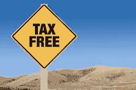

# 加密货币和免税国家

> 原文：<https://medium.com/hackernoon/crypto-currency-and-tax-free-states-2d1e99136398>

在美国，无论是联邦政府还是各州政府，税收都是人们在居住地和新企业开业时的重要考虑因素。目前，有 7 个免税收入州，值得检查他们与加密和虚拟货币相关的法律和法规，以便我们可以从这些信息中推断这些州的加密业务领域的未来预测。问题会是:收入自由等同于商业友好吗？

没有所得税的 7 个州是:

1.阿拉斯加

2.佛罗里达州

3.内华达州

4.南达科他州

5.得克萨斯州

6.华盛顿

7.怀俄明州

**阿拉斯加**

阿拉斯加法律没有任何具体的加密货币法规。阿拉斯加银行和服务部门发布了指导意见，即只有涉及法定货币的交易才受该州《汇款法》的管辖。

**佛罗里达州**

佛罗里达州的《汇款法》没有明确包括“虚拟货币”或“货币价值”的概念，但佛罗里达州金融监管办公室表示，加密货币活动可能受该州《汇款法》的管辖。

2018 年 6 月，该州任命了一位“加密沙皇”，我们将不得不关注未来几年这位沙皇如何试图监管加密货币的使用。

**内华达州**

加密货币和虚拟货币目前不属于内华达州《汇款法》的管辖范围。此外，内华达州的商业和工业部并不持有特定的立场，因为它缺乏对虚拟货币监管问题的公开评论。尽管如此，2019 年 2 月提出的参议院第 195 号法案(如果该法案成为法律)规定，“从事涉及虚拟货币的某些商业活动的人必须从工商部获得许可证或在工商部注册。”

**南达科他州**

南达科他州的劳动和法规部对虚拟货币没有公开评论，南达科他州的法律也不包括货币传输者法律没有明确包括“货币价值”或交换媒介的概念。

**得克萨斯**

德克萨斯州是第一个发布比特币官方立场的州，备忘录 1037 澄清了出售比特币不需要货币传输商的许可。比特币和其他虚拟货币在德克萨斯州不被视为合法货币。

**华盛顿**

华盛顿州在其 2013 年的《统一货币服务法》中纳入了虚拟货币。生于 1327 年。2017 年 7 月，参议院 5031 号法案。S.B. 5031 增加了对虚拟货币更具限制性的法律，因为它们现在受州货币转移规则和法规的管辖。它们被认为与法定货币属于同一类。

**怀俄明州**

2018 年 3 月，被称为“公用事业令牌法案”的 H.B. 70 签署成为法律，使怀俄明州成为美国对加密货币最友好的州之一。该法案本身免除了“公用代币”受该州证券法规定的约束；

1.  代币的开发者或销售者没有将代币作为金融投资出售给初始购买者。
2.  代币的目的是用于消费目的，代币只能用于交换或接收商品、服务或内容，包括获取商品、服务或内容的权利；
3.  代币的开发商或销售商，或开发商或销售商的注册代理人，向怀俄明州的州务卿提交通知。

正如我们所见，7 个免所得税州中有 6 个对加密和虚拟货币友好，允许企业和个人使用和交易这些货币，而不受州政府的干预。从而促进各州之间的自由贸易和商业。在我看来，这一事实将允许加密货币作为一种合法的货币形式得到发展和接受，同时为这些国家带来收入和未来的业务。对大家来说都是双赢。问题是，为什么华盛顿不效仿其他收入自由的州呢？这个问题的答案，似乎是它的位置如同西海岸的尖端。因为，华盛顿的接壤各州有更多定义的加密货币法律，而且似乎西海岸的思维过程不同于许多思想更独立的免税州。