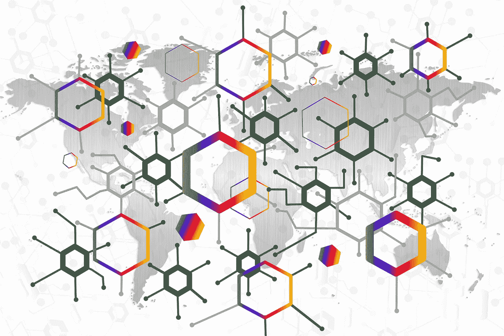

# 可扩展的部落式协作

> 原文：<https://medium.com/hackernoon/crypto-economic-networks-as-technological-enablers-of-scalable-tribe-like-collaboration-6ab197d60337>

Source: [Pixabay](https://pixabay.com/)

# 不可扩展的部落协作

> “智人统治世界，因为它是唯一能够相信纯粹存在于自己想象中的事物的动物，比如神、国家、金钱和人权。”
> 
> 尤瓦尔·诺亚·哈拉里

人类是群居动物，在我们历史的大部分时间里([直到大约 12000 年](https://en.wikipedia.org/wiki/Human))进化成不超过 [150 人的部落](https://en.wikipedia.org/wiki/Dunbar%27s_number)。我们物种的快速繁衍是由语言促成的，通过语言我们能够创造故事。宗教、民族国家和金钱都是故事的例子，这些故事使我们能够创建更大的社会，最终征服更小的、类似部落的社区，这些社区没有随着时间的推移充分进化。

当生活在部落中时，[自我管理](https://en.wikipedia.org/wiki/Self-governance)作为一种在相互认识的人之间建立强大声誉网络的方式是可能的。通过这种方式，人们自我监管，不需要任何中央实体。当人类通过讲故事聚集在越来越大的群体中时，我们能够与我们不一定认识的人合作。在[十字军](https://en.wikipedia.org/wiki/Crusades)并肩作战的基督徒不需要互相了解，他们只需要相信同一个故事，圣经的故事。

# 可扩展的中央协调

自治社区的问题在于它们无法扩展。更大的人群在设计正确的社会结构以建立秩序和最大化社会福利方面的挑战。尽管基于市场的经济能够实现资源的有效配置，但通常情况是**市场激励与社会价值观不一致**。一个明显的例子是金融危机期间利润私有化和损失社会化的机制。金融决策者并不像整个社会那样为他们的行为承担太多的后果。这是游戏中缺乏[皮肤的明显例子。](https://en.wikipedia.org/wiki/Skin_in_the_game_(phrase))

> "给我看动机，我会给你看结果."
> 
> 查理·芒格

# 可扩展的部落协作

直到最近( [2009](https://bitcoin.org/bitcoin.pdf) )，如果没有任何中央实体来协调交互并确保人们的行为符合系统设计者的预期，就无法协调世界各地互不相识的人们。

比特币是第一个例子。它由一系列激励措施(激励结构)组成，写在一份 [9 页的白皮书](https://bitcoin.org/bitcoin.pdf)中，嵌入到每个人都可以访问的代码中。这是一种点对点的方式，将钱从一个人转移到另一个人，没有任何人需要信任的中心实体，以可靠的方式交换价值。通过这种方式，一个秘密经济网络应运而生。

互联网实现了信息的自由流动，比特币实现了资金的自由流动。秘密经济网络更广泛地促进了信任的自由流动。

有很多方法来看待一个秘密经济网络。我发现最能压缩这个概念的是把它定义为一个**可信任的激励** **机器**(更多关于这个**)。**

> "软件仅仅是人类思想的编码，因此拥有几乎无限的设计空间."
> 
> [克里斯·迪克森](/s/story/why-decentralization-matters-5e3f79f7638e)

## 可信赖的

网络中的计算机在人们之间提供了部落般的信任，这样无论何时他们做了什么，他们都知道他们会得到预期的报酬。这类似于部落声誉网络，除了人们不需要相互了解和信任，他们将信任转移到网络机制。作为安全通信技术集合的加密技术实现了这一点。在网络上被跟踪的人类活动可以是转账、提供服务、借款或投资实物资产，或者是包括某种表示价值交换的交易的任何其他活动。

## 激励

计算机使个人能够信任网络，因为提供计算资源来保护在网络上执行的交易是有经济回报的。

## 机器

它由网络创建者嵌入到软件中，并在世界各地的不同计算机上自动执行。

> 本质上，它们可以让人做事

# 行动中的分散协作

考虑到所有这些，今天有哪些实际的例子可以实现以前不可能实现的人与人之间的可扩展协作？在这篇文章中，我将关注信息或数据的共享。这一选择背后的理由是，这往往是缺乏合作动力的地方。通过提供这两个例子，我们可以理解这将引领我们走向未来。

## 海洋议定书

数据是[新石油](https://www.economist.com/leaders/2017/05/06/the-worlds-most-valuable-resource-is-no-longer-oil-but-data)已经是旧闻了。谷歌、脸书、优步和其他科技巨头经常开源他们技术栈的部分内容(例如 [Tensorflow](https://www.tensorflow.org/) 、 [Prophet](https://research.fb.com/prophet-forecasting-at-scale/) 、 [Pyro](https://pyro.ai/) )，但他们的数据绝对不是这样。这背后的原因是，这些公司积累的数据中有大量的潜在价值。他们拥有的数据越多，他们的产品(可能)提供的用户体验就越好。由于拥有庞大的用户群，而且由于网络效应，这个用户群还会不断扩大，他们建立了数据垄断。这取决于具体的用例，但本质是一样的:公司没有分享数据的动机。有办法改变这种情况吗？

[海洋协议](https://oceanprotocol.com/)以开放数据经济的形式构建了一个密码经济网络。参与者被激励与他人分享他们积累的数据。根据共享数据产生的估计价值，他们将获得经济补偿。这有可能打破目前存在的信息孤岛。由于缺乏数据，这也降低了小公司与大公司竞争数据科学人才的能力。在数据科学中，[数据往往比算法更重要](https://static.googleusercontent.com/media/research.google.com/en//pubs/archive/35179.pdf)。共享数据经济的一个例子是汽车制造商联盟，它们正在汇集数据，以训练自动驾驶汽车模型。另一个例子是[海洋协议公司与罗氏诊断公司](https://blog.oceanprotocol.com/roche-diagnostics-and-ocean-protocol-partner-to-improve-care-for-heart-disease-patients-through-71cf3e678dc)合作“通过安全可靠的数据共享改善心脏病患者的护理”通过这种方式，数据所有者能够为他们的数据定价，并了解数据如何被使用以及被谁使用。数据科学家能够对这些数据运行算法，同时这些数据在本地保持加密存储。Ocean 创建了问题解决者(数据科学家、人工智能研究人员)和问题所有者(非政府组织、企业、政府)之间的连接基底，通过它可以创建一个[人工智能公共资源](https://blog.oceanprotocol.com/the-web3-data-economy-b6fd8ecac4c4)。因此，可扩展的部落式协作是由一个可信的网络实现的，这个网络是由协作的经济激励驱动的。

## 数字

投资行业是一个典型的例子，市场上的不同参与者之间没有什么合作的动机。成功(ROI)取决于投资者和市场之间的某种[信息不对称](https://en.wikipedia.org/wiki/Information_asymmetry)(非共识权)。这可以通过对金融市场的基本面或技术面分析来实现(除了其他事情之外还有[)。分享一个人赚钱的投资策略意味着失去市场上的信息优势，](https://en.wikipedia.org/wiki/Insider_trading)[一个零和游戏](https://en.wikipedia.org/wiki/Zero-sum_game)(为了一方获利，另一方需要损失)。再问一次，有办法改变这种情况吗？

数字公司以人工智能对冲基金的形式建立了一个秘密经济网络，改变了分享金融信息的激励结构。他们利用[拍卖](https://en.wikipedia.org/wiki/Dutch_auction)和[竞拍](/numerai/numerai-reveals-erasure-unstoppable-peer-to-peer-data-feeds-4fbb8d92820a)的机制来激励数据科学家使用提供的数据贡献他们的预测。他们因对对冲基金元模型整体表现的贡献而获得报酬。为数据科学家提供了抽象的数据，这意味着他们不知道这些数据代表什么。这消除了人为偏见和过度拟合(根据可用数据进行良好预测，但不根据看不见的和/或新的数据进行进一步推广)。这也使得人们无法在不返还贡献的情况下获取数据。加密令牌使得提交过度拟合的模型在经济上变得不合理。这不是告诉人们他们应该做什么。这是为了激励他们出现想要的网络行为。

他们将金融市场的潜在激励结构从竞争转变为“构建元模型的无形合作”。他们利用集成原理(结合许多不同的模型)，这使得“机器学习的错误率更低，单个交易的回报率更高，投资组合的波动性更低，投资组合的风险敞口更高”。

# 包扎

秘密经济网络使我们组织社会的方式发生了根本性的转变，而没有任何中央实体为个人之间的互动建立信任和激励。与此同时，正如任何技术一样，它越强大，我们就越需要小心实施。然而，了解如何利用它的唯一方法是通过修补。

我们很容易将当前的社会组织与某种理想化的替代方案进行比较。人们很容易将新技术应用到我们今天拥有的每一个业务用例中。优步需要分权吗？或者分散的脸书？这需要满足很多条件，因为构建分布式应用程序比构建集中式应用程序要复杂得多。在构建这些应用时，在每一个[层](https://www.usv.com/blog/fat-protocols)都需要考虑明确的权衡(例如，去中心化的价值与可伸缩性)。此外，将会有一些我们今天甚至无法想象的应用程序被构建出来，类似于 Web 2.0 技术所发生的情况。尽管分散每个集中的软件产品是可能的，但这并不意味着我们应该这样做。

最后，一个我们都可以定期重温的想法，以提醒我们自己加密经济网络的长期潜力，特别是在所有加密泡沫期间:

请注意，这篇文章中提出的许多观点都是在探索秘密社区“兔子洞”时从他人那里借来的。

# 有趣的阅读

*   [介绍分散式人类协作的构建模块](https://blog.goodaudience.com/rewriting-the-story-of-human-collaboration-c33a8a4cd5b8)
*   [作为工程学科的加密经济网络设计](http://tokenengineering.net/)
*   [Outlier Venture 关于海洋协议的投资论文](https://outlierventures.io/why-we-are-investing-in-ocean-protocol/)
*   [海洋协议激励数据经济的机制](https://blog.oceanprotocol.com/curated-proofs-markets-a-walk-through-of-oceans-core-token-mechanics-3d50851a8005)
*   [numeria 的总体规划](/numerai/numerais-master-plan-1a00f133dba9)
*   [Web 2.0 与 Web 3.0 的层价值创造差异](https://www.usv.com/blog/fat-protocols)
*   [Web 3.0:基础设施阶段还是应用阶段？](https://www.usv.com/blog/the-myth-of-the-infrastructure-phase)