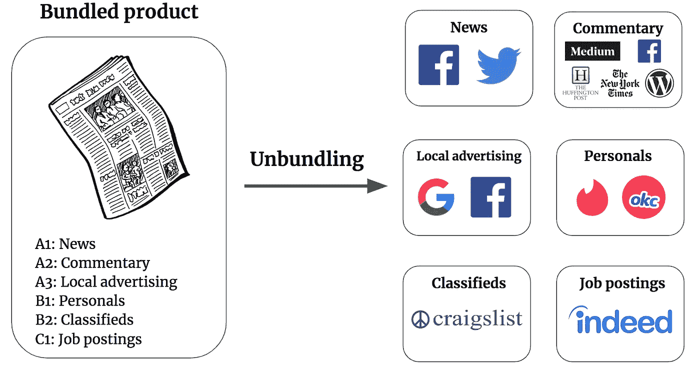
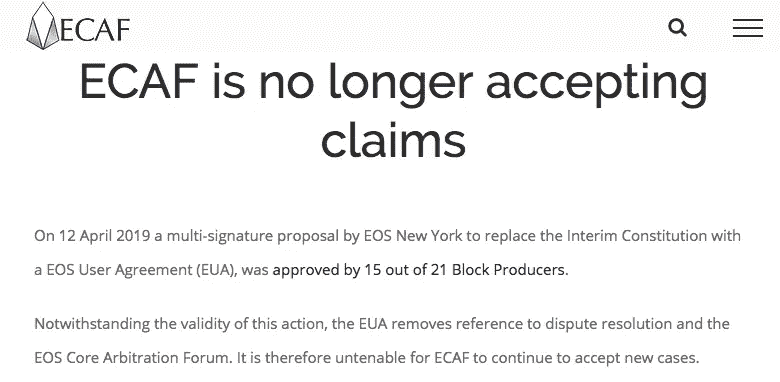

# 加密是金融分拆

> 原文：<https://medium.com/hackernoon/crypto-is-financial-unbundling-fedaa4f5f534>

这里有个问题:为什么转账这么贵？

Visa 对每笔美国交易收取 3%+0.30 美元的费用。对于在一些数据库中移动数字来说，这是很高的收费。毕竟，信用卡交易中的一切都已经数字化了——从在线支付网关，到信用卡公司的系统，到银行的数据库，再到银行存放准备金的联邦账户。它是一路向下的数据包和字节。

那么所有的成本从哪里来呢？

答案隐藏在层层中介的背后。但实际上，两个最容易命名的成本中心是法规遵从性和欺诈预防。

人们希望支付具有退款保护。他们希望在遭到黑客攻击、身份被盗或银行某个人搞砸的情况下有追索权。他们想要联邦存款保险公司的保险以防金融不稳定。

如果没有选择这些，你就不可能真正付钱给某人*。*

但是 crypto 把钱从这些功能中分离出来。我相信，毫无疑问，这是 crypto 价值主张的一大部分。

# 捆绑理论

捆绑销售是定价理论中的一个经典概念。在捆绑服务中，许多产品被打包在一个包装中出售。一些经典的例子是有线电视(80 多个频道，30 美元/月)和网飞(7000 多个节目和电影，10 美元/月)。

拆分则是相反的过程，传统的捆绑产品是按菜单销售的，比如 iTunes 将 99 首单曲从各自的专辑中拆分出来。

在两个方向上重新包装市场是一种永恒且经常具有破坏性的商业模式。例如，在过去的 20 年里，报纸行业经历了大范围的分拆。

一个[的经验法则](https://hbr.org/2010/02/the-pros-and-cons-of-bundled-p)是，对于商品化的商品，捆绑倾向于有利于卖方，而拆分倾向于有利于客户。在捆绑产品中，销售者可以隐藏昂贵的商品，并说服顾客购买超出他们需求的商品。通过一套非捆绑产品，客户可以自由地只为他们重视的服务付费，每项服务都可以更好地扩大其核心价值主张。(对于非商品化的商品，[捆绑销售可以带来更多的利益](http://cdixon.org/2012/07/08/how-bundling-benefits-sellers-and-buyers/)，这就是为什么他们倾向于在捆绑销售和非捆绑销售之间摇摆不定。)

这都是教科书式的经济学。但这如何适用于金钱呢？

# 非绑定退款

当我在 Airbnb 的时候，我负责处理支付欺诈，所以我花了很多时间考虑退款。拒付是指银行在付款后撤销信用卡交易。这可能是因为欺诈，如盗卡，或者只是因为客户觉得他们受到了不公平的待遇。退款对任何商家来说都是灾难——当在线交易被退款时，公司既损失了产品又损失了钱。这是金融上的双重打击。

加密没有退款的概念。每笔付款都是最终的。如果我们在 Airbnb 只接受加密支付，我们就可以避开退款问题。这会改善现状吗？

很难说。

在加密领域，退款的缺乏导致了许多无法补救的黑客攻击。每次秘密抢劫，逃跑都是有保证的。这就把安全的责任推给了用户或他们的钱包提供商。但在信用卡领域，负责检测和阻止欺诈的是商家。

信用卡网络为这种模式辩护说:看，商家是最有能力发现欺诈的。他们了解客户行为，能够发现异常。他们已经有数据，所以让他们做欺诈预防。没有理由让客户承担这种责任。

这是一个合理的论点！但是这种设置不仅仅是一个责任问题:它要求商家对他们的顾客进行监督。商家被激励去获取每个顾客的数据档案，这样他们就可以准确地模拟好的和坏的行为。这也意味着商家和他们的模式最终决定了[你是否被允许使用他们的平台](https://onemileatatime.com/google-fi-review/)。它将我们引向肖莎娜·祖博夫所谴责的“[监视资本主义](https://en.wikipedia.org/wiki/Surveillance_capitalism)”

当然，这也意味着欺诈比其他情况下要少。顾客可以更放心地用信用卡购物，而无需对商家进行尽职调查。但是我们为这种保证付出了什么代价呢？

这里有另一种方式来考虑它:能够收回购买基本上意味着你有一个保险政策对你的付款。该保险的承保人是商家——他们被迫决定你是否值得承保。如果出了什么问题，你向银行投诉，他们会强迫商家支付保单。

这个庞大的保险系统是 3%+0.30 美元所购买的很大一部分。你不能退出。这是任何现代支付系统都包含的一项费用。这就像要求任何人乘坐任何航班都必须购买旅行保险一样。

强迫每个人去做是一件很奇怪的事情。

现在，我并不是想说你不应该想要可逆支付。我的观点很简单，不是每个人都一直想要它们。但是现在，可逆性包含在支付给某人的捆绑包中。

加密消除了一捆钱的可逆性。这就是为什么在强制保险单仅作为商业税的情况下，加密成为更好的结算形式。这就是为什么在 crypto 中，向某人发送 0.10 美元的成本与向其发送 1000 万美元的成本相同。

# 这捆钱里有什么？

我们来算一下今天和钱捆绑在一起的是什么:

*   主权支持的价格担保
*   可逆性
*   FDIC 保险(在某些账户中)
*   广泛的反洗钱/KYC 要求( [BSA](https://en.wikipedia.org/wiki/Bank_Secrecy_Act) )
*   金融监督( [FATCA](https://en.wikipedia.org/wiki/Foreign_Account_Tax_Compliance_Act) 、[特区报告](https://en.wikipedia.org/wiki/Suspicious_activity_report))
*   法院禁令可以改写平衡
*   非常缓慢的沉降
*   某些类型支付的高成本
*   集成较差的系统(工资单与支票账户、信用卡与 Venmo)

如果你今天想使用法定货币，你必须注册一整套。很难选择退出任何一个组件。

一位评论家会正确地指出:如果你不喜欢所有这些功能，为什么不用现金呢？但是现金不是数字的。数字支付对于全球互联经济的运行至关重要。甚至像 ACH 这样的系统也为个人提供 60 天的计费窗口。

如果我只想在美联储开个账户呢？没有银行系统强加给我的任何花哨的数字美元？运气不好。美联储强有力地维持其金融捆绑政策，其理论是，否则将对金融系统造成“系统性压力”。

在经典经济学中，一个持续的、不可拆分的捆绑包通常是垄断的标志。微软反垄断案是一个典型的例子。非捆绑产品允许个人服务在自由市场中竞争。它还为服务接种疫苗，防止不断增加的意外复杂性和监管捕获。当国家控制的货币体系不断积累法律上的黏糊糊和监管上的割据时，密码却将它们抛弃了。

这是弗里德里希·哈耶克在《货币非国有化》一书中的核心观点。根据哈耶克的说法:

> “为什么政府垄断货币供应被普遍认为是不可或缺的，这个问题在现有的文献中没有答案。……它具有所有垄断企业的缺陷:即使产品不令人满意，人们也必须使用它们的产品，最重要的是，它阻碍了发现更好的方法来满足垄断者没有动机的需求。”

货币应该像其他市场一样是一个自由市场，允许货币竞争。比特币就是存在的证明:比特币是第一种展示对无负担非主权货币需求(如果不是效用)的主要货币。

比特币说:别管国家支持的钱。这只是纯价值。你想怎么发就怎么发，想发多少就发多少。我们所做的唯一保证是账本将是安全的——本质上是产权的保证。对于给定的事务，如果需要的话，您可以在它的基础上自由构建。

这不仅仅是一个抽象点。让我举一个例子来帮助兑现这个观点。

# 链上仲裁是捆绑的一种形式

[EOS 核心仲裁论坛](https://eoscorearbitration.io/) (ECAF)是 EOS 的治理系统，是一个著名的智能合同平台和十大令牌。通过 ECAF，如果受害者向 ECAF 提出索赔，任何连锁交易都可以恢复。ECAF 并没有直接控制潜在的区块链，而是对大宗商品生产商施加软实力，以执行他们的判决。

不出所料，这一切在几周前破裂了，ECAF 已经被从 EOS 的“宪法”中抹去

所以 ECAF 已经不存在了，它现在被认为是一个糟糕的机构。但是我想更进一步:这不仅仅是一个糟糕的机构，而且是一个机构的*坏主意。这是很重要的一点，因为有很多类似它的提议系统，比如 DFINITY 的“[区块链神经系统](/dfinity/the-dfinity-blockchain-nervous-system-a5dd1783288e)”我们可以称这类系统为“链上仲裁系统”*

我反对链上仲裁系统的主要理由是:**这是金融捆绑**。加密的整个事业就是发明一种新的货币，不受传统金融体系中主权利益的约束。

Vitalik Buterin 在这一点上有很好的洞察力:有可能在今天的以太坊上建立一个类似 ECAF [的系统(尽管有很高的天然气成本)。您可以将 ETH 封装到一个 ERC-20 令牌中，通过一个分散的仲裁过程，该令牌的交易在 90 天内是可逆的。他把这个假想的系统称为可逆 ETH 的 *RETH* 。](https://programtheblockchain.com/posts/2018/06/09/reversible-ether/)

那么 RETH 有什么问题呢？什么都没有！如果人们想要它，它是好的。所以让我们提供它，**但是让它在市场上与 ETH 竞争**。让人们选择是想要不捆绑的钱，还是具有可逆性的捆绑。这只有在基础层被拆分的情况下才有可能——你不能在可逆的基础层上建立不可逆的货币，但你可以在不可逆的基础上建立可逆的货币。

这是分拆背后的整个前提:它让消费者选择适合他们需求的产品，从而使他们受益。

当然，crypto 还处于初级阶段。它还需要弄清楚可扩展性、UX 或引人注目的产品。但是，如果你认识到这种拆分模式，你就能感受到 crypto 试图捕捉的潜在价值冰川。

最终，如果你想在没有传统金融系统强加给你的一切的情况下进行交易，crypto 会给你一个选择退出的方法。它将允许您调整产权、货币政策的滑块，以及您喜欢的金融应用程序吞吐量和安全性之间的任何权衡。

在多元化的市场经济中，更多的选择只会是一件好事。