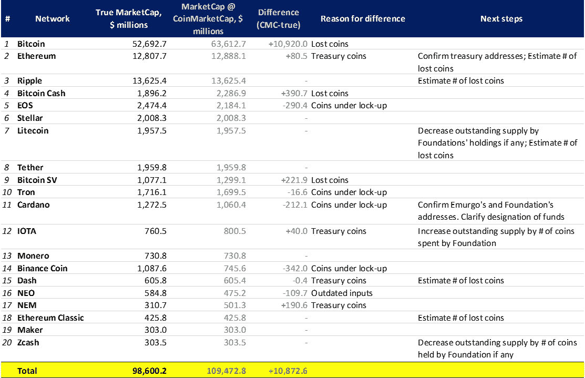
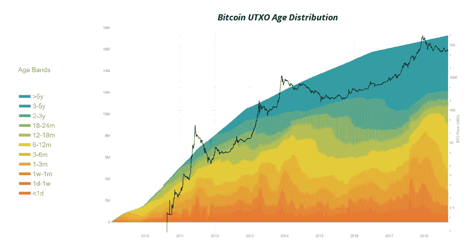
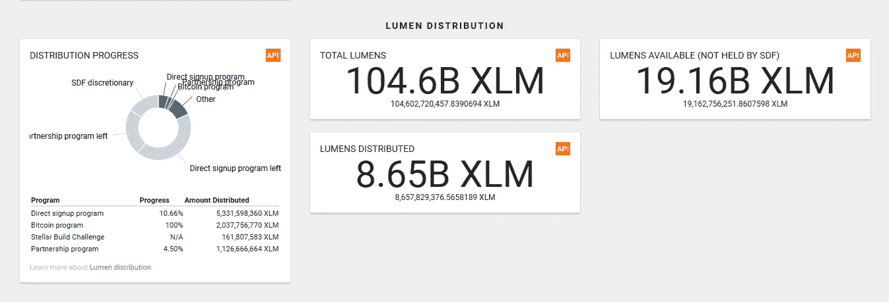

# 加密市场规模估计:流通供给与流通硬币供给

> 原文：<https://medium.com/hackernoon/crypto-market-size-overestimated-by-10-billions-11-f64e21e8bb63>

*   CoinMarketCap 上显示的前 20 名硬币的市值被高估了 108.7 亿美元(11%)
*   根据**流通供应量**计算市值是不正确的
*   **杰出的硬币供应**应该被用来代替

在这篇文章中，我们解释了为什么加密网络的市值必须根据流通硬币的供应量来计算。

我们继续详细计算前 20 种加密货币的未偿供应量和市值。

前 20 名硬币的正确市值可以在我们的加密价格聚合器【https://thesilicoin.com/ THE silicon(T5)上找到。

# 词汇表

> **总硬币供应量**——现在*存在*的所有硬币。

协议可能会发行新硬币。例如，比特币协议发行硬币作为对矿工的奖励。尚未发行的硬币不包括在总供应量中。

> **最大硬币供应量** —协议将发出的所有硬币。

一些协议对可能出现的硬币数量有一个编码限制。比特币协议将发行近 2100 万枚硬币——这是比特币的最大硬币供应量。

其他协议对硬币数量没有限制(例如以太坊)。对于这种协议，没有定义最大硬币供应量。

请注意，最大电源是一个确定性数字。如果最终存在的硬币的最大数量取决于一些未来的不确定事件，最大供应量被认为是不确定的。这就是本文相应部分中解释的 Dash 的情况。

> **未偿硬币供应** —计入加密网络市值的所有硬币。

流通硬币供应量的定义类似于[流通股票](https://en.wikipedia.org/wiki/Shares_outstanding)的定义。但是它有一些不同，因此应该单独定义。

未偿硬币供应包括网络中(1)现在存在的和(2)有权获得最终受益人的所有硬币。

在一段时间内不能出售(即锁定)但有权获得最终受益人的硬币必须包括在流通硬币供应量中。

流通硬币供应量不包括国库硬币。

**国库硬币**是指(1)现存的和(2)由促进网络发展的组织(如 Ripple Labs、Stellar Development Foundation、Tron Foundation 等)持有的硬币。).

国库硬币用于增加加密网络的价值。当国库硬币被发展组织使用时，它们就变成了优秀的硬币。

# 为什么我们必须用流通中的硬币供应量而不是流通中的供应量来计算市值？

简而言之，循环供给在这里根本不合适。

让我们来看看为什么。

以下是 CoinMarketCap 对循环供应使用的解释(参见其[方法](https://coinmarketcap.com/methodology/)的第 7 项):

*“我们发现，在确定市场资本总额方面，流通供应量是一个比* [*总供应量*](https://coinmarketcap.com/glossary/#total-supply) *更好的指标——锁定、保留或不能在公开市场上出售的硬币是不能影响价格的硬币，因此也不应被允许影响市场资本总额。使用流通供应量的方法类似于在传统投资中使用* [*公众持股量*](https://en.wikipedia.org/wiki/Public_float) *来确定公司市值的方法。”*

**公众持股法不能用于衡量公司规模。模拟循环供给不能用于测量加密网络的大小。**

你见过亚马逊、微软、谷歌或苹果的公众持股市值比吗？号码

公司通过所有[已发行股票](https://en.wikipedia.org/wiki/Shares_outstanding)的市场资本总额[进行比较](https://en.wikipedia.org/wiki/List_of_public_corporations_by_market_capitalization)。

公众持股(或最广泛地称为“自由持股”)方法确实被所有主要股票指数所采用，包括 [S & P 500](https://en.wikipedia.org/wiki/S%26P_500_Index) 和 [MSCI](https://en.wikipedia.org/wiki/MSCI_World) 。原因如下:

指数基金是股票指数数据的主要消费者。

直到 2004 年，标准普尔 500 指数是以总市值加权的。然后他们过渡到自由浮动调整。以下是 S&P 指数委员会主席如何解释向自由浮动调整的过渡:

“大多数指数用户的感觉是，浮动调整降低了运行指数基金和 ETF 的成本，因为浮动较小的股票——因此流动性较小——在指数中的权重较低，”标准普尔指数委员会主席大卫·布利泽在接受采访时说。

换句话说，指数基金必须复制它们追踪的指数构成。如果一家有 10%流通股的公司被完全纳入指数，基金将很难购买足够数量的该公司股票，因为只有 1/10 可供购买。

如果我们要创建一个加密指数，那么流通供给是衡量指数成分的适当指标。在其他情况下，我们必须使用流通股来计算加密网络的市值。

# 1.比特币

截至 2019 年 1 月 11 日，该议定书释放了 [17，475，975 辆 BTC](https://blockchain.info/q/totalbc) 。

比特币的最大供应量被编码在协议中。它将汇聚成 2100 万枚硬币。

然而，一些比特币永久“丢失”是常识。严格来说，一些比特币钱包的私钥丢失了。

没有办法恢复比特币钱包的私钥。因此，丢失的比特币将永久无法使用。换句话说，他们抓住存在。

对丢失的比特币数量最可靠的估计是由[链分析](https://www.chainalysis.com/)提供的。根据[他们的研究](https://blog.chainalysis.com/reports/money-supply)，**230-370 万比特币丢失**。

Delphi Digital 最近的研究使用了来自 Chainalysis 的数据，这些数据似乎更新了。他们对丢失的比特币数量的估计大致相同。

如果硬币超过 5 年没有改变钱包，Chainalysis 认为 BTC 丢失了。下图显示了自上次移动以来硬币的时间分布。蓝色区域描绘了丢失的硬币。

Source: [Delphi Digital research](https://www.delphidigital.io/bitcoin)

尽管我们不知道丢失的比特币的确切数量，但有理由假设约有**300 万 BTC 被查获存在**。

我们所知道的所有服务都是通过将价格乘以所有 1750 万枚发行的硬币来计算比特币的市值。这是不正确的。

比特币的实际市值应该是价格乘以流通在外的硬币，即大约 1450 万。

比特币的总供应量和最大供应量也要相应调整。

Source: THE SILICOIN analysis, CoinMarketCap

# 2.以太坊

截至 2019 年 1 月 11 日，该议定书释放了 [104，315，205 个 ETH](http://api.etherscan.io/api?module=stats&action=ethsupply) 。

一些 ETH #明显丢失。不幸的是，我们还不知道任何可靠的关于丢失 ETH 的报告。

私钥丢失的问题实际上适用于所有硬币(除非硬币有类似 [EOS](https://github.com/EOSIO/Documentation/blob/master/TechnicalWhitePaper.md#recovery-from-stolen-keys) 的工具来找回丢失的密钥)。然而，这个问题的严重程度可能非常不同。虽然我们表明丢失的硬币占比特币未偿供应量的 21%，但对于更年轻的硬币(除了比特币叉子)，丢失的硬币数量可能可以忽略不计。以太坊就是这种情况。

与比特币不同，以太坊有以太坊基金会持有的国库币。

以太坊基金会没有披露其持有的 ETH 的数量。唯一的信息来源是[这个 Reddit 线程](https://www.reddit.com/r/ethereum/comments/6b39sc/has_the_ethereum_foundation_released_any/)。2017 年 5 月，Vitalik Buterin 声称以太坊基金会持有约 80 万 ETH。

我们还[知道以太坊 ICO 时收到 1200 万 ETH 的智能合约地址](https://forum.ethereum.org/discussion/comment/12771/#Comment_12771)。截至 2019 年 1 月 11 日，该合同持有 [651，492 **。** 84 ETH](https://www.reddit.com/r/ethereum/comments/6b39sc/has_the_ethereum_foundation_released_any/) 。

可以肯定的是，以太坊基金会自 2017 年 5 月以来花费了约 15 万 ETH。因此合同 0x de 0 b 295669 a 9 FD 93 D5 f 28d 9 EC 85 e 40 f 4c b 697 BAE 确实持有以太坊基金会的硬币。

以太坊基金会的持股应被视为国库硬币，并从以太坊市值的计算中排除。

Source: THE SILICOIN analysis, CoinMarketCap

# 3.XRP

市场对 XRP 流通供给争论激烈。幸运的是，大多数市场参与者都做对了。

最初创建了 99，991，724，864 个([参见“总计”字段](https://data.ripple.com/v2/network/xrp_distribution))。在这一数额中，只有 41，040，405，095 XRP 分配给最终持有人(“分配”领域)。剩余部分由 Ripple 保管([托管或未分配](https://ripple.com/insights/ripple-to-place-55-billion-xrp-in-escrow-to-ensure-certainty-into-total-xrp-supply/))。

托管和未分配的 XRP 是国库硬币。因此，它们不计入市值。

Source: THE SILICOIN analysis, CoinMarketCap

# 4.比特币现金

截至 2019 年 1 月 11 日，该议定书释放了 [17，560，502 枚 BCH。](https://api.blockchair.com/bitcoin-cash/stats)

比特币现金是在大部分比特币丢失后分叉的。

因此，可以有把握地认为，丢失的 BCH 的数量等于丢失的 BTC 的数量——大约 300 万枚硬币。

除了丢失的硬币，一些 BCH 自叉子后就没人认领了。根据一些估计，大约有 926 万 BCH 被索赔。

然而，所有可以访问 BTC 的比特币持有者仍然可以申请 BCH。因此，将无人认领的硬币排除在流通中是不正确的。

Source: THE SILICOIN analysis, CoinMarketCap

# 5.黎明的女神

截至 2019 年 1 月 11 日，共有 [1，028，677，308 家 EO](https://eospark.com/)。

CoinMarketCap 报告的总供应量为 1，006，245，120 EOS，这显然已经过时。

CMC 上的 EOS 流通供应量比总供应量少 1 亿。那显然是 Block.one 持有的创始人代币(关于创始人代币的更多细节，参见 [EOS F.A.Q.](https://eos.io/faq) 第 4 项)。

Block.one 是这些硬币的最终受益者。然而，Block.one 不能立即出售这些硬币，由于锁定条件。根据 IPO ，硬币锁定类似于[股票锁定。](https://en.wikipedia.org/wiki/Lock-up_period)

Block.one 是一个以盈利为目的的开发者，通过开发 EOS 获得报酬。因此，Block.one 持有的 EOS 没有资格获得库币。

我们应该把锁定的硬币排除在流通硬币之外吗？编号
仅应排除国库硬币和丢失的硬币。

所以 EOS 的突出供应量是 1，028，677，308？不完全是。

EOS 有一个专门的 eosio.ramfee 账户，从所有 RAM 交易中收取 0.5%的费用。目前还不清楚这些硬币会被烧掉还是重新分配。

我们认为，值得假设的是，焚烧这些硬币的初步计划将得到实施。在这种情况下，我们应该从所有 EOS 供应指标中排除这些硬币。

截至 2019 年 1 月 11 日，eosio.ramfee 账户中有 [1，941，498 份 EO(不到 EO 总数的 0.2%)。](https://bloks.io/account/eosio.ramfee)

Source: THE SILICOIN analysis, CoinMarketCap

# 6.主要的

截至 2019 年 1 月 11 日，共有 [104，622，670，393 个 XLM](https://dashboard.stellar.org/) 。

只有 19，126，368，543 XLM*不是*由恒星发展基金会(SDF)持有。

我们注意到关于 XLM 的一件奇怪的事情——分布式流明(86.5 亿)和可用流明之间存在巨大差异，即不由 SDF 持有(191.6 亿)。

Source: [Stellar dashboard](https://dashboard.stellar.org/). Retrieved on 4 January 2019

根据 SDF 的要求，基金会可以将 1000 亿流明的 5%用于运营需求。最重要的是，它清楚地表明，自卫队给条纹 20 亿 XLM。

总计 70 亿英镑。加上分发的 86.5 亿，我们的可用 XLM 总数为 156.5 亿。这比仪表板上提供的可用数字少了 35.1 亿。这 35 亿 XLM 去哪了？

我们没有找到答案。Reddit 用户似乎也很关心这个问题。

Stellar 是第六大加密网络。没有人知道它的 3.5%的硬币去了哪里。加密的狂野西部..

至少 Stellar 的市值是正确的。

Source: THE SILICOIN analysis, CoinMarketCap

# 7.莱特币

截至 2019 年 1 月 11 日，共有 [59，972，225 家土地租赁公司](http://explorer.litecoin.net/chain/Litecoin/q/totalbc)。

[莱特币基金会](https://litecoin-foundation.org/)没有披露其持有的 LTC。我们不知道有任何选项来跟踪有多少 LTC 由基金会处置。

众所周知，Litecoin 创始人查理·李[在 2017 年 12 月](https://www.chepicap.com/en/news/5844/why-did-charlie-lee-sell-all-of-his-litecoin-in-december-2017-.html)卖掉了他所有的 LTC。

我们可以把这些信息推断到查理·李主持的莱特币基金会。因此，所有发出的 LTC 应被视为未完成。

Source: THE SILICOIN analysis, CoinMarketCap

# 8.极限

截至 2019 年 1 月 11 日，共有 1，940，407，128 家 LTC(参见[总负债行](https://wallet.tether.to/transparency))。

请注意，没有 API 来回收循环供应的系绳。因此，价格汇总网站上的供应数字可能会稍微过时。

Source: THE SILICOIN analysis, CoinMarketCap

# 9.比特币服务

截至 2019 年 1 月 11 日，共有 17，559，714 个 BSV。

就像比特币和比特币现金一样，一些 BSV 丢失了。最好的估计是 300 万。

Source: THE SILICOIN analysis, CoinMarketCap

# 10.创

截至 2019 年 1 月 11 日，共有 [99，245，561，553 名 TRX](https://tronscan.org/#/blockchain/stats/supply) 。

创把它的硬币分成三个桶:

1.  基金会准备金-32 599 211 655
2.  Tronics 支持计划— [652，719，724](https://tronscan.org/#/blockchain/foundation)
3.  其他— 66，646，353，546

桶 1 指创基金会持有的硬币。这些是财政部发行的硬币，不应该包括在流通中。

水桶 2 指的是交给给创基金会捐款的人的硬币。这些硬币有锁定期。然而，它们归最终受益人所有。因此，它们应包括在未清供应中。

有趣的是，创还在继续接受“捐赠”以换取创币。这种机制在我们看来非常像 ICO(无论如何都不是法律意见)。

桶 3 是用户持有的硬币。

Source: THE SILICOIN analysis, CoinMarketCap

# 11.卡尔达诺

截至 1 月 14 日，共有 31，112，484，646 名残疾人士。这个#是固定的，直到铸币被激活。

最初，卡尔达诺向 ICO 参与者发放了 [25，927，070，538 阿达](https://cardanodocs.com/cardano/monetary-policy/)。除此之外，分配金额的 20%或 [5，185，414，108 ADA](https://cardanodocs.com/cardano/monetary-policy/) 交给了卡达诺生态系统内的三个实体——IOHK、Emurgo 和卡达诺基金会。

IOHK 是 Cardano 协议的营利性开发者。拥有[2463071701 ADA](https://iohk.io/blog/statement-on-iohks-ada-holdings/)。IOHK ADA holdings 应被视为 Block.one 持有的 EOS。开发人员是分配给他们的硬币的最终受益者。因此，这些硬币应该包括在未清供应量中。

Cardano 基金会和 Emurgo 持有 ADA 股份的确切数额不得而知。这在社区内引起了极大的不满，并导致 IOHK 向 Cardano Fiundation 发送了一封公开信。

卡尔达诺社区成员甚至猜测卡尔达诺基金会和 Emurgo 在卡尔达诺区块链的账户地址。尽管巧合的概率很低，但账户地址仍未得到确认。

Emurgo 的 ADA 股份应被视为与 IOHK 的股份相似。Emurgo 是一家风险基金，投资于 Cardano 相关项目。尽管 Emurgo 的投资授权并不完全透明，但它们很可能是一只盈利性投资基金。因此，他们是分配资金的最终受益者。

如果卡尔达诺基金会如预期的那样运作，它的资产应该被视为国库硬币。然而，考虑到围绕卡尔达诺基金会的争议，ADA 在基金会处置中的名称和数量仍不清楚。所以卡尔达诺基金会的阿达控股应该算是优秀的。

CoinMarketCap 根据 25，927.07 万的发行在外供应量计算 Cardano 的市值。根据上面的解释，应该使用的正确 ADA 数是 31，112.48 百万 ADA。

Source: THE SILICOIN analysis, CoinMarketCap

# 12.极微小

截至 1 月 14 日，共有 2779530283277761 人。这个#是固定的。

所有 IOTA 最初都分发给众筹参与者。

随后，IOTA 创始人[要求 IOTA 持有者向 IOTA 基金会捐赠代币](https://www.iota.org/the-foundation/the-iota-foundation)。IOTA 基金会[成立于 2017 年 11 月](https://blog.iota.org/iota-foundation-fb61937c9a7e)。据报道，IOTA 基金会持有约 5%的 IOTA 总供应量。

正如 IOTA 联合创始人[(视频从 29:40 开始)](https://www.youtube.com/watch?v=pDD96FXQkkg&feature=youtu.be&t=29m40s)所指出的，使用 IOTA 协议，由于数据泄露，人们不能多次使用私钥。因此，没有固定的钱包地址来存放 IOTA 基金会的硬币。我们不知道 IOTA 基金会披露其持有的 IOTA 股份。

IOTA 生态系统发展基金持有 [21，695，582，234，595 ADA](https://fund.iota.org/transparency) 。这个数额只是基金会总持有量的一小部分。

据我们所知，IOTA 基金会的资金用途并不向公众公开。

根据现有信息，IOTA 总供应量的 5%应被视为国库硬币，直到进一步的信息。

Source: THE SILICOIN analysis, CoinMarketCap

# 13.莫内罗

截至 2019 年 1 月 14 日，共有 [16，697，486.93 XMR](https://moneroblocks.info/api/get_stats) 。

Monero 没有任何专门的发展机构。现有的所有 XMR 都应被视为未完成。

Source: THE SILICOIN analysis, CoinMarketCap

# 14.币安硬币

截至 2019 年 1 月 14 日，共有 190，799，308 台 BNB ( [见合同](https://etherscan.io/address/0xb8c77482e45f1f44de1745f52c74426c631bdd52#readContract)总供应字段)。

BNB 硬币的总量逐渐减少，因为币安每个季度都会焚烧一些硬币(例如参见[第五次焚烧公告](https://support.binance.com/hc/en-us/articles/360018044252-Binance-Completes-5th-Quarter-Token-Burn))。BNB 的起拍价是 [2 亿](https://www.reddit.com/r/BinanceExchange/comments/88rbbi/circulating_supply_increased_from_99014000_to/)。因此，迄今已有 920 万人被烧毁。

最初给创始团队拨款 8000 万 BNB。其中 4800 万仍被锁定在合同范围内。您可以通过将“所有者”字段(0x 00 C5 e 04176d 95 a 286 fcce 0 e 68 c 683 ca 0 bfec 8454)中的地址插入合同的 [freezeOf 字段来验证这一点。](https://etherscan.io/address/0xb8c77482e45f1f44de1745f52c74426c631bdd52#readContract)

4800 万枚锁定硬币没有资格获得国库硬币，因为它们由最终受益人持有。

因此，BNB 的未偿供给等于现存硬币的总数。

CoinMarketCap 根据 1.308 亿的发行量计算币安硬币的市值。这个数字似乎是在假设 6000 万枚硬币处于锁定状态的情况下计算出来的。这种假设本身已经过时并且不正确。

Source: THE SILICOIN analysis, CoinMarketCap

# 15.破折号

截至 2019 年 1 月 14 日，共有 [8，571，303.69 DASH](https://explorer.dash.org/chain/Dash/q/totalbc) 。

DASH 有一个内置的资金系统。 [10%的奖金](https://docs.dash.org/en/latest/governance/understanding.html#understanding-governance)自动分配给国库。每个月 DASH 社区[都会对可能由财政部资助的投资提案进行投票](https://www.dashcentral.org/budget)。在每个月底，为获得批准的提案创建硬币，并分配给各个团队。请注意，硬币直到支付事件才被创建。如果支付的硬币数低于上个月累积的国库硬币数，则不会生成多余的硬币。

因此，DASH 未完成供应的最准确估计值是当前总供应量加上将在月末[分配给](https://dashnexus.org/leaderboard)已批准提案的 DASH 数量(参见下图中的“已分配资金”字段)。

CoinMarketCap 使用总供应量数字。月初，未完成的供应量等于总供应量。因此，市值差异永远不会高于每月 DASH 资金余额总额。

Source: [DashNexus Leaderboard](https://dashnexus.org/leaderboard)

DASH 的最大供应量是不确定的。它[取决于](https://dashpay.atlassian.net/wiki/spaces/DOC/pages/1867875/Legacy+FAQ#LegacyFAQ-Monetaryissuance)国库分配和网络的散列率。DASH 的最大供应量假定为 1600 万至 2130 万枚硬币。最大供应需要一个确定的数字。因此，该指标不适用于 DASH。

Source: THE SILICOIN analysis, CoinMarketCap

# 16.新的

截至 2019 年 1 月 14 日，共有 [1 亿个近地天体](https://docs.neo.org/en-us/whitepaper.html)。

5000 万分配给了众筹的参与者。其余股份由近地天体基金会持有，受锁定条款约束(近地天体委员会于 2018 年 4 月 1 日[重组为近地天体基金会](https://neo.org/blog/details/3083))。

近地天体基金会持有的 5000 万近地天体应被视为国库硬币，因为它们应用于协议的开发([见白皮书](https://docs.neo.org/en-us/whitepaper.html)的分配机制部分)。

但是，我们不知道近地天体基金会提供了关于其令牌使用情况的报告。这意味着不可能找到哪些近地天体库存令牌应包含在未偿供应中，哪些仍在库存中。

众所周知，2017 年 10 月 16 日有 1500 万近地天体[被释放给近地天体委员会。每年都会有 1500 万人从禁闭室获释，直到所有 5000 万人都被提供给委员会。](https://neo.org/blog/details/3016)

近地天体理事会通过近地天体全球资本进行了[多项投资。基于这一信息，我们认为，近地天体基金会的大部分代币已发放给最终受益人。](http://ngc.fund/hb.php)

因此，从锁定状态释放的近地天体国库硬币应被视为未兑现。

CoinMarketCap 根据 6500 万枚流通硬币计算近地天体的市值。这一数字已经过时，因为截至 2018 年 10 月 16 日，额外的 1，500 万个近地天体国库令牌应该已经从锁定状态释放。

Source: THE SILICOIN analysis, CoinMarketCap

# 17.能母

截至 2019 年 1 月 14 日，存在 [8，999，999，999 XEM](https://en.bitcoinwiki.org/wiki/NEM#Supply_structure) 。

为了计算 NEM 市场资本总额，货币市场资本使用了 XEM 的总供应量。那是不正确的。

从创世纪开始，XEM 的大#被分配到内部基金，为协议和社区的发展提供资金。你可以在这里找到 XEM 向基金分配资金的细节。

基金账户仍然持有大量 XEM 股票。总有一天，这些硬币会被用于协议的开发。因此，它们应该被视为国库硬币。

截至 2019 年 1 月 9 日，基金账户中持有 34.2 亿 XEM(约占总供应量的 38%)。检索 NEM 富豪榜[此处](https://nemnodes.org/richlist/)，核实账户余额[此处](http://chain.nem.ninja/#/search/NDEVPOSK4OMR4PRTLYFHX4W5QTOND7TZDT2DTU4Q)。

Source: [XEM Rich List](https://nemnodes.org/richlist/)

Source: THE SILICOIN analysis, CoinMarketCap

# 18.以太博物馆经典

截至 2019 年 1 月 14 日，存在 [107，514，064 ETC](https://api.gastracker.io/v1/status) 。

与以太坊不同，以太坊经典的最大供应量被限制在[2 . 1 亿枚硬币](https://github.com/ethereumproject/ECIPs/blob/master/ECIPs/ECIP-1017.md)。

刀被黑后，[有人声称](https://www.bokconsulting.com.au/blog/the-dao-hackers-booty-is-on-the-move/)刀被盗的资金存放在[这个 ETC 地址](https://gastracker.io/addr/0x5e8f0e63e7614c47079a41ad4c37be7def06df5a)。这个地址还保存着 336 万等。从这个地址发出的最后一笔交易发生在 2016 年 12 月 7 日。

两年的时间还不足以让这些硬币具备“丢失”的资格。因此，在进一步澄清它们的地位和所有权之前，它们应该包括在未完成的供应中。

应该对以太坊经典网络上丢失的硬币进行研究，以调整突出的供应数字。

Source: THE SILICOIN analysis, CoinMarketCap

# 19.制造者

截至 2019 年 1 月 14 日，共有 [1，000，000 辆 MKR](https://etherscan.io/token/0x9f8f72aa9304c8b593d555f12ef6589cc3a579a2#tokenInfo) 。

创客道基金会持有 [271，772.23](https://etherscan.io/token/0x9f8f72aa9304c8b593d555f12ef6589cc3a579a2?a=0x7bb0b08587b8a6b8945e09f1baca426558b0f06a#tokenTrade)。制造商代表在 Reddit 帖子中确认了这一信息。他们是财政部的代币，因为基金会的目标是开发制造商协议和生态系统。

Source: THE SILICOIN analysis, CoinMarketCap

# 20.Zcash

截至 2019 年 1 月 14 日，共有 [5，670，443.75 ZEC](https://api.gastracker.io/v1/status) 。

ZCash mainnet 于 2016 年 10 月 28 日[激活](https://z.cash/ru/support/schedule/)。[前 4 年(至 2020 年 10 月 28 日)](https://z.cash/blog/funding)，所有 ZEC 矿的 20%将分配给[创始人奖励](https://z.cash/support/faq/#founders-reward)基金。

创始人奖励的两个最大受益者是 Zcash 公司战略储备获得 [1.19%](https://z.cash/support/faq/#founders-reward-recipients) 和非盈利的 Zcash 基金会获得 1.44%。战略储备基金将用于新项目，以增加 Zcash 公司的价值，而基金会基金将有利于 Zcash 协议的维护和发展，以符合现在和未来所有用户的利益(参见 [Zcash 常见问题](https://z.cash/support/faq/#founders-reward-recipients))。

截至 2019 年 1 月 14 日，1，134，088.75 ZEC 用于创始人奖励。

基金会持有的硬币应被视为国库硬币。然而，该基金会不报告何时使用资金以及剩余余额是多少。基金会的钱包地址不详。

因此，我们应该假设 ZEC 转到基金会是收到即花，并要求基金会进一步澄清。

ZEC 的最大供应量是 2100 万(见 Zcash FAQ 的[经济部分](https://z.cash/support/faq/))。

Source: THE SILICOIN analysis, CoinMarketCap

我们鼓励社区投入，以找到所有主要硬币的正确的突出供应数字。

如果您对本文有任何问题或评论，请随时通过 [Twitter](https://twitter.com/THE_SILICOIN) 或[电子邮件](mailto:support@thesilicoin.com)联系我们。

透明的你，硅[团队](https://thesilicoin.com/)