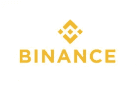

# 加密货币:骗局还是真实交易？

> 原文：<https://medium.com/hackernoon/cryptocurrencies-scam-or-the-real-deal-bfee139ead92>

Photo by [Daniel van den Berg](https://unsplash.com/photos/rss7GCL_KVo?utm_source=unsplash&utm_medium=referral&utm_content=creditCopyText) on [Unsplash](https://unsplash.com/?utm_source=unsplash&utm_medium=referral&utm_content=creditCopyText)

## 它可能是一颗子弹，但除非你尝试，否则你永远不会知道。有些人因为没有自学而吃了苦头。这是加密货币的错吗？大概不会。

# 英国骗局

如果某件事听起来好得难以置信，那它很可能是真的。在英国，今年已经有近 3000 万英镑[损失在比特币和加密资产投资上](https://www.telegraph.co.uk/technology/2019/05/08/bitcoin-safety-spotlight-hackers-steal-30-million-digital-currency/)。过去几年里，这种类型的投资越来越受欢迎，这种现象已经司空见惯。

*对于加密货币的倡导者以及它将如何塑造我们的未来世界来说，这是一个令人担忧的时代。*

随着 2018-19 年报告的诈骗数量从上一财年的 530 起攀升至近 2000 起，人们对这一趋势充满担忧。伦敦金融城警方和金融行为监管局(FCA)联手提供了一项名为行动欺诈的服务，该服务提供了令人沮丧的统计数据。

> “加密货币是一个骗局，政府可能会关闭这些货币(加密货币)，因为无力控制它们。”
> 
> —杰米·戴蒙，摩根大通首席执行官

平均而言，大多数投资者通过外国投资和加密货币计划总共损失了 14600 英镑。根据 FCA 执法和市场监督执行主任马克·斯图尔特的说法，其中“90%是加密资产。”

加密货币作为计算机代码和价值储存手段存在，不受 FCA 的监管。支持这种货币的人说，这就是问题的关键。信息技术的分散化和联合使用将确保货币保持放松管制，而不像法定货币那样，不会被市场操纵。

# 欺诈磁铁

随着受欢迎程度的激增，越来越多的人开始投资以太坊和比特币等加密货币，这自然吸引了诈骗者。

骗子通常在城市监管机构的管辖范围之外活动，在那里他们可以肆无忌惮地实施不诚实的计划。他们倾向于向没有经验的加密货币投资者提供极其美妙的投资回报承诺，正如 Steward 先生所引用的，“回报好得不像真的。”

Bernie Madoff, King of the Fraudsters. Source: Wikicommons

**然而，许多人会说，加密货币和其他任何形式的投资一样安全，任何商业领域都可能被刺痛。**

唯一需要的是尽职调查。

比特币作为一个品牌是最强的之一。未来它是否能保持霸主地位，谁也说不准。就在我们说话的时候，许多公司和认真的投资者正在围绕比特币构建他们的协议和商业战略，试图获得尽可能多的比特币。

# 新企业

此外，在加密领域涌现出了一些公司，它们看到了加密货币在未来的潜力。一个这样的例子是[币安](https://www.binance.com/en)，一家总部位于中国的全球加密货币交易所，成立于 2017 年，截至 2018 年 1 月，其市值为 13 亿美元。

**随着比特币和其他加密货币的流行，这些数字只会攀升。**

然而，就连币安也不能幸免成为犯罪的受害者——就在本月，它声称黑客窃取了价值 4000 万美元的 7000 个比特币。

# 信任问题

无论你持何种观点，重要的是要考虑大局。秘密景观是一个逐渐建立起来的生态系统。这是一个缓慢的过程，但随着更多的投资者和机构加入进来，随着他们开始对人民币的运行方式更有信心，信任将会增长。从这一经验中获得的框架将建立可靠性战略，就像我们今天在股票市场看到的法定货币一样。总之，所有比特币和任何其他加密货币需要的，用迈克·伯顿的话说，就是*时间、爱和温柔*。

How’s my hair? Oh, Michael, you look lovely! Source: Wikicommons

世界上只会有 2100 万枚比特币存在，随着它们变得越来越稀缺，其价值将会上升。一些人认为，因为比特币是市场上最古老的加密货币，所以它永远不会消失。尊重将坚持它保持存在。未来新加密货币的建立(截至 2018 年 8 月，共有 1600 种其他加密货币，称为 altcoins)不会改变这一点。

> 比特币似乎是一个非常有前途的想法。我喜欢将安全性建立在诚实参与者的 CPU 能力超过攻击者的假设之上的想法。这是一个非常现代的概念，利用了长尾的力量。
> 
> **——哈尔·芬尼**

# 聪的梦

无论喜欢与否，比特币革命——以及中本聪的梦想——就在眼前。无论我们在未来几个月或几年内是否会看到更多的骗局发生(我们会的，你可以放心)，这都不会从这项将改变我们做生意和交换商品的方式的创新技术中带走任何东西。

未来几年，加密货币运行的基础技术区块链将如何发展，这可能是一个问题。许多计算机科学家和投资者将区块链安全视为加密货币彻底普及的最重要领域，加密货币是未来的现金。到目前为止，即使是技术最先进的超级计算机，我们也不具备破解它们的计算能力。

那么是什么让区块链变得安全呢？

# 螺母和螺栓

B 简单来说，每一笔比特币交易都存储在一个账户账上。然后，这些分类账被多次存储在计算机网络上的所谓节点中。当有另一个事务时，网络上的所有节点检查该事务是否有效。完成这些事务的子集后，它们将作为一个块添加到区块链中。

**该协议的理论安全性在于区块链上每个区块独有的密码指纹，也称为共识协议。此时，共享网络上的节点同意区块链内有效事务的统一历史记录。**

Source: instockphoto.com

加密可靠性的关键在于指纹，也称为散列。哈希函数证明，运营商/矿工做了赚取比特币所需的计算脑力工作。这是一种“工作证明”协议，作为额外的安全层，因为尝试更改数据块需要新的哈希。共识协议中最简单的工作是当区块链中的所有节点用新块更新它们的区块链副本时。

使区块链在安全方面独一无二的是，散列也链接到区块链。每个块的蓝图包含前一个块的散列。以任何方式改变这一点都会导致您不仅需要为有问题的块创建新的散列，还需要为链中之前的所有块创建新的散列。为了进一步增加操作的难度，您还必须比其他节点能够向链中添加新块的速度更快，这使得操作在操作上是不可能的，因为现有的计算机中没有能够如此快速计算的。

# 量子接管

许多计算机科学家认为经典计算的力量永远不足以攻破区块链技术的加密堡垒。然而，其他人认为，通过进入另一个方向——量子计算机——这项技术将足够强大，足以打破哈希函数，这意味着区块链和他们的协议将毫无用处。

Source: Wikicommons

*然而，目前这种先进的“无处不在”的技术还处于起步阶段，对我们正在见证的加密货币革命不构成威胁。*

因此，这不应该让我们对货币和商业的未来感到恐惧。就像生活中的所有事情一样，总会有风险。前进的道路是未知的，有无数的岔路口。可以肯定的是，比特币和其他加密货币将会误入陌生的土地，陷入泥淖，但就像所有的旅程一样，将会有一个目的地。

我们必须到达那里。

> 坚持和决心将是先决条件。