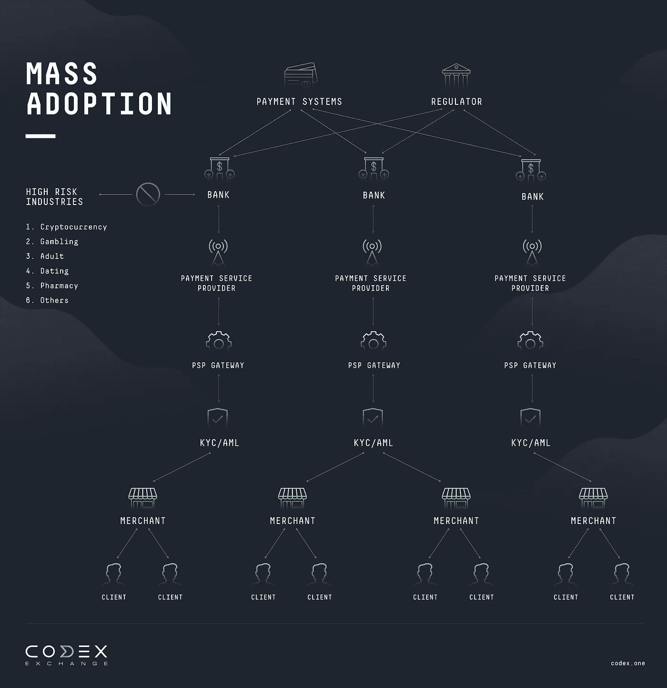

# 加密货币的采用已经开始。但是什么时候会走向全球呢？

> 原文：<https://medium.com/hackernoon/cryptocurrency-adoption-is-already-happening-but-when-it-will-get-global-46e5283f0fee>

## 全球采用是我们几乎每天在加密媒体上听到的一句话。不幸的是，由于技术复杂性导致的普遍无能，无法完全掌握事物的全貌。

此外，加密货币禁令和世界各地收紧的监管也造成了额外的混乱。但一切并不像许多人想象的那样具有毁灭性，而且当前的法律框架和一些金融机构已经允许通过加密货币进行金融操作，这听起来可能令人惊讶。那么，缺失的谜团是什么，为什么事情进展如此缓慢？

## **紧密债券——银行、监管机构、支付系统**

为了把握全局，我们必须了解从监管者和银行开始，到商人结束的实体如何在金融环境中相互作用。作为 Alliance Bank 和 SmartBank 董事长的顾问，我工作了几年，发现所有市场参与者之间都有根深蒂固的旧金融关系，实际上不允许颠覆性技术发生。

**有一种不可动摇的实体等级制度，这些实体之间相互影响，银行在这里并不占据主导地位。**基本上，真正为银行制定所有规则的是*监管者*，他们在许多司法管辖区有不同的名称，以及各种支付系统，如 Visa、MasterCard 等。这些实体对银行实施严格的监管，如果他们发现某家银行不遵守这些规定，就会受到严厉的处罚。这就是银行必须管理风险的原因。

监管机构实施严格的规则，并颁发银行执照，允许银行经营金融业务。真正重要的是要知道这种许可证的价格，根据管辖范围的不同，这种许可证的价格通常超过数千万美元，银行需要花费大量的时间来获得它。让我们假设一家银行不遵守监管机构的规定，执照被吊销了。这意味着一家银行将在很长一段时间内无法开展任何金融业务，此外，它还必须支付 Visa/MasterCard 施加的巨额罚款。除此之外，它还必须再次支付许可证费用，在某些情况下还要支付额外的罚款。这就是银行在选择商业伙伴时如此谨慎的原因。

## **支付服务提供商和商户**

这些业务合作伙伴非常不同，但在本材料的背景下，我们将谈论*支付服务提供商(PSP)*，他们在在线和线下业务中扮演着金融守门员的角色，或者简称为*商家*。基本上，PSP 是为企业提供支付网关的中介，这样他们才能运营。简而言之，经营在线业务的商家转向 PSP，以获得支付网关，允许他们处理信用卡并接受 PayPal 等支付方式。

支付服务提供商关心他们在银行眼中的声誉，因为如果银行发现非法活动，它会立即关闭自己和 PSP 之间的所有网关。这就是为什么支付提供商在为商家提供金融服务时会如此警惕。基本上，PSP 负责检查商家是否遵守他们的严格规则，他们经常进行检查。最终，如果商家确实被抓住了，那么对支付网关的访问就会被切断，商家就无法运营。*此外，几乎所有公司的总业务量中都有 1%的退款红线和 10%的提留额。*

此外，PSP 和商家都不会受到太多的惩罚，与银行相比，他们的责任更小。因此，在这种情况下，所有各方都希望以各种可能的方式严格控制对方。此外，有些高风险行业是银行不想服务的，因为它们往往存在不道德或不正当的活动，没有人愿意涉足这些行业，因为相应的风险远远高于实际利润。

## **高危行业及现状**

目前，银行不想处理高风险行业，如:赌博、成人、加密货币、约会、制药、游戏和其他。最后，银行必须填写有关其活动和资金来源的报告。这些行业确实给银行带来了失去昂贵执照的重大风险。

在这种情况下，商家根本不在乎，他们讨厌银行，因为银行不允许他们开展业务。但是，如果对于一个传统的业务来说，一切都如此复杂，那么加密货币就更难了。这个问题主要是在加密货币兴起时出现的，当时它们主要被犯罪分子用来洗钱和进行不道德的活动。最重要的是，加密货币的不稳定性导致人们损失金钱，其新的货币工具形式在法律层面上引发了无数次辩论。整个行业被标记为高风险，因为它有太多的陷阱。**所以现在你可能会问，加密货币的空间在哪里？**

## **一切都设置好了。但是没有主动性**

阻止 PSP 处理与加密货币相关的支付的唯一原因是缺乏关于资金来源和谁拥有特定数字货币的知识。*这个问题的答案很简单——银行和 PSP 必须为加密货币金融业务开发和实施一套非常有效的 KYC/反洗钱程序，这将显著降低所有相关风险。*当商家转向 PSP 提供加密货币网关时，将不会给非法或可疑交易留下任何空间。一旦开发了这种验证程序，那么银行将不会承担任何风险或其中微不足道的部分，这可以与处理传统业务相提并论。

可以肯定地说，从法律角度来看，不可能实现这种创新，但考虑到现有的法律框架，它已经适合在许多国家开展这种活动的需要。真正重要的是，目前许多 PSP 已经可以开始开发这样的 KYC/反洗钱程序，并与感兴趣的银行合作，在市场上占据主导地位。不用说，目前这样的银行并不多，但即使是现有的传统金融体系也不是一夜之间建立起来的，我们花了很多年才采用了信用卡和其他一些对我们这个时代来说相当简单的东西。

目前，商家可以接受加密货币作为支付形式进行交易，像 [CoinPayments](https://www.coinpayments.net) 或 [BitGo](https://medium.com/u/8a3098b11fe8?source=post_page-----46e5283f0fee--------------------------------) 这样的公司允许这种情况发生。一旦大量商家要求网关支持加密货币和法定货币，我们正在谈论的广泛采用将被触发。但对于大多数商家甚至客户来说，加密货币只是一个时髦词，而不是他们日常活动的货币工具。

总结我们所做的一切，我们需要通过加密货币开展业务，在未来几年，更多的 PSP 和银行应该能够容忍这种新的资产类别。我们将慢慢过渡到新的数字市场。

**在** [**Twitter**](https://twitter.com/sergattic) **或**[**LinkedIn**](https://www.linkedin.com/in/sergii-vasylchuk/)**中加入对话。查看我们的项目:** [**阁楼实验室**](https://medium.com/u/7ba3f2d3b40f?source=post_page-----46e5283f0fee--------------------------------) **，**[**ever stake**](https://medium.com/u/fe93bae695a1?source=post_page-----46e5283f0fee--------------------------------)**，** [**抄本交易所**](https://medium.com/u/bc89e07772d1?source=post_page-----46e5283f0fee--------------------------------) **。**