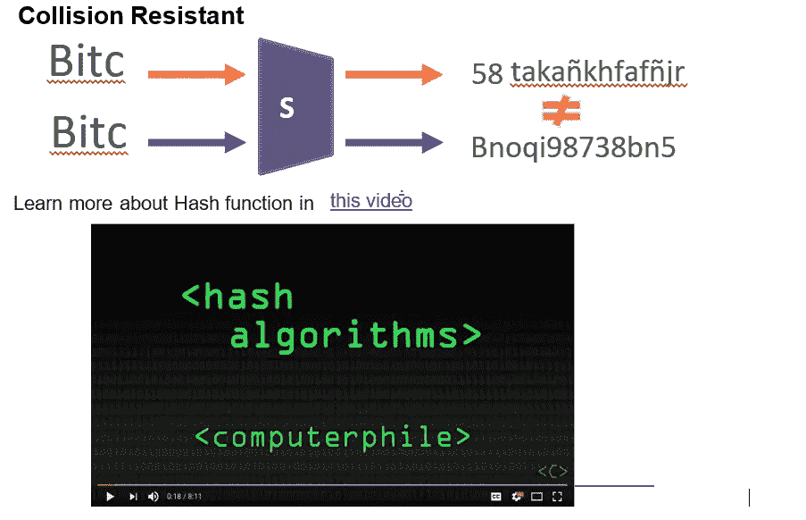

# 比特币的密码学本质第一部分:什么是哈希函数？

> 原文：<https://medium.com/hackernoon/cryptographic-essence-of-bitcoin-part-1-what-is-a-hash-function-f468e7f72daa>

# 什么是哈希？

加密哈希函数是在数字数据上运行的数学运算。在比特币中，所有的操作都使用 [SHA256](http://en.wikipedia.org/wiki/SHA-2) 作为底层的[加密哈希函数。](http://en.wikipedia.org/wiki/Cryptographic_hash_function)

SHA(安全哈希算法)是由美国国家安全局(NSA)设计的一组加密哈希函数。

简单来说，Hash 函数就像一个*黑盒*，你在里面输入任意种类任意大小的数字信息，结果(输出)就是一个字母数字串(例如:0x e 3 b 0 c 44298 fc 1c 149 AFB F4 c 8996 FB 92427 AE 41 e 4649 b 934 ca 495991 b 7852 b 855)。在 SHA-256 的情况下，输出是 32 字节。该功能有两个特点:

1) **明确:**hash(输出)就像输入数据的指纹。从一个人的指纹，你不能创造人。因此，从数字输入的散列中，您无法创建原始的数字输入。

2) **抗冲突:**没有人能够找到导致相同散列输出的两个不同输入值。换句话说，对于任何不同的输入，总会有不同的输出。这允许使用该函数来检查**数据完整性**通过将计算的“散列”(算法执行的输出)与已知和预期的散列值进行比较，人**可以确定数据的完整性。**例如，计算下载文件的哈希并将结果与之前发布的哈希结果进行比较，可以显示下载是否被修改或篡改。

《SHA-2——维基百科》[https://en.wikipedia.org/wiki/SHA-2.](https://en.wikipedia.org/wiki/SHA-2)

[https://www.youtube.com/watch?v=b4b8ktEV4Bg](https://www.youtube.com/watch?v=b4b8ktEV4Bg)

但是为什么 hash 在区块链如此重要呢？

这是因为这是挖掘过程和挖掘者责任的一部分:挖掘者挑选一些事务，并将它们用作输入的一部分，他们尝试计算一个散列函数，以向链提供一个新块。

> 加密哈希算法

有许多加密散列算法。下面列出了一些比较常用的算法。在包含加密散列函数的[比较的页面上可以找到更详细的列表。](https://en.wikipedia.org/wiki/Comparison_of_cryptographic_hash_functions)

# 讯息摘要 5

MD5 是由 Ronald Rivest 在 1991 年设计的，以取代早期的散列函数 MD4，并在 1992 年被指定为 [RFC 1321](https://tools.ietf.org/html/rfc1321) 。针对 MD5 的冲突可以在几秒钟内计算出来，这使得该算法不适合需要加密哈希的大多数使用情况。MD5 生成一个 128 位(16 字节)的摘要。

# SHA-1

SHA-1 是美国政府顶点工程的一部分。该算法的原始规范(现在通常称为 SHA-0)于 1993 年由美国政府标准机构 NIST(国家标准与技术研究所)以“安全散列标准，FIPS 出版 180”的标题发布。出版后不久，它被美国国家安全局撤回，并被 1995 年在 FIPS 出版公司 180-1 出版的修订版所取代，通常被称为 SHA-1。使用[粉碎攻击](https://en.wikipedia.org/wiki/SHA-1#SHAttered_%E2%80%93_first_public_collision)可以产生与全 SHA-1 算法的冲突，哈希函数应该被认为是被破坏的。SHA-1 产生 160 位(20 字节)的散列摘要。

文档可能只将 SHA-1 称为“SHA ”,即使这可能与其他标准哈希算法(如 SHA-0、SHA-2 和 SHA-3)相冲突。

# RIPEMD-160

RIPEMD(RACE Integrity Primitives Evaluation Message Digest)是由比利时鲁汶大学 COSIC 研究组的 Hans Dobbertin、Antoon Bosselaers 和 Bart Preneel 在 1996 年首次发布的一系列加密哈希函数。RIPEMD 基于 MD4 中使用的设计原则，其性能类似于更流行的 SHA-1。然而，RIPEMD-160 还没有被破解。顾名思义，RIPEMD-160 产生 160 位(20 字节)的哈希摘要。

# 漩涡

在计算机科学和密码学中，Whirlpool 是一种加密哈希函数。它是由 Vincent Rijmen 和 Paulo S. L. M. Barreto 设计的，他们在 2000 年首次描述了它。惠而浦是基于高级加密标准(AES)的实质性修改版本。Whirlpool 产生 512 位(64 字节)的散列摘要。

# SHA-2

SHA-2(安全哈希算法 2)是由美国国家安全局(NSA)设计的一组加密哈希函数，于 2001 年首次发布。它们是使用 Merkle–damg rd 结构从单向压缩函数本身构建的，使用 Davies–Meyer 结构从(分类)专用块密码构建的。

SHA-2 基本上由两种哈希算法组成:SHA-256 和 SHA-512。SHA-224 是 SHA-256 的变体，具有不同的起始值和截断的输出。SHA-384 和不太出名的 SHA-512/224 和 SHA-512/256 都是 SHA-512 的变体。在诸如 [AMD64](https://en.wikipedia.org/wiki/X86-64) 这样的 64 位机器上，SHA-512 比 SHA-256 更安全，并且通常比 SHA-256 更快。

以位为单位的输出大小由“SHA”名称的扩展名给出，因此 SHA-224 的输出大小为 224 位(28 字节)，SHA-256 产生 32 字节，SHA-384 产生 48 字节，最后，SHA-512 产生 64 字节。

# 沙-3

SHA-3(安全哈希算法 3)由 NIST 于 2015 年 8 月 5 日发布。SHA-3 是更广泛的加密原始族 Keccak 的子集。凯克算法是吉多·贝尔托尼、琼·代蒙、迈克尔·皮特和吉勒·范·阿舍的作品。Keccak 基于海绵结构，也可以用于构建其他加密原语，如流密码。SHA-3 提供与 SHA-2 相同的输出大小:224、256、384 和 512 位。

使用 SHAKE-128 和 SHAKE-256 功能也可以获得可配置的输出大小。这里，名称的-128 和-256 扩展名意味着函数的安全强度，而不是以位为单位的输出大小。

# BLAKE2

2012 年 12 月 21 日公布了 BLAKE 的改进版 BLAKE2。它是由 Jean-Philippe Aumasson、Samuel Neves、Zooko Wilcox-O'Hearn 和 Christian Winnerlein 创建的，目标是取代广泛使用但已被破坏的 MD5 和 SHA-1 算法。在 64 位 x64 和 ARM 架构上运行时，BLAKE2b 比 SHA-3、SHA-2、SHA-1 和 MD5 更快。虽然 BLAKE 和 BLAKE2 还没有被标准化为 SHA-3，但它已经被用于许多协议，包括 [Argon2](https://en.wikipedia.org/wiki/Argon2) 密码哈希，因为它在现代 CPU 上提供了高效率。由于 BLAKE 是 SHA-3 的候选产品，BLAKE 和 BLAKE2 都提供了与 SHA-3 相同的输出大小，包括可配置的输出大小。