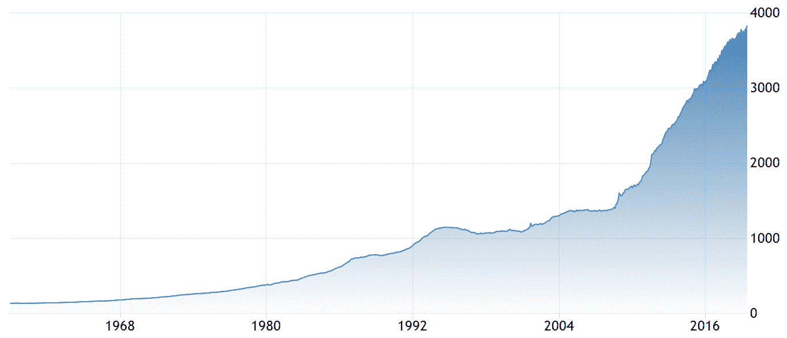
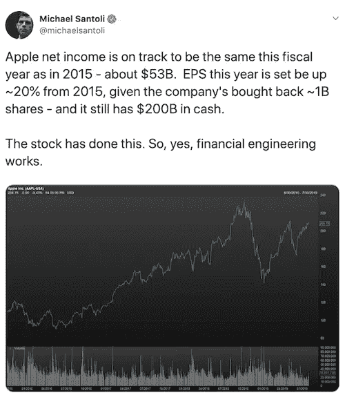
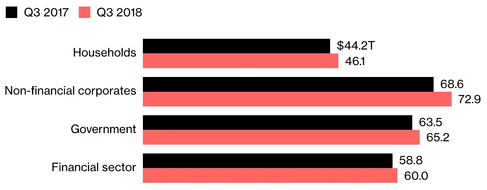
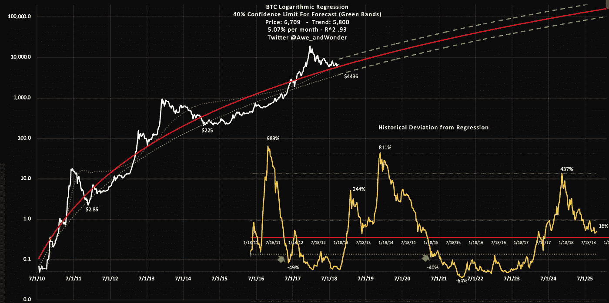

# Crypto 的分水岭时刻

> 原文：<https://medium.com/hackernoon/cryptos-watershed-moment-33163380747b>

## 对冲全球金融不稳定

([image source](https://www.deviantart.com/iangelrice/art/Wave-698110129))

2008 年的大金融危机导致全球经济陷入停滞。它被诊断为流动性问题，因此美联储迅速做出反应，推出了 6000 亿美元的“量化宽松”计划。在接下来的四年里，美联储又向经济注入了 4 万亿美元。

USD M1 money supply ([source](https://tradingeconomics.com/united-states/money-supply-m1))

危机的余波蔓延到了美国境外，世界各地的央行都推出了自己的量化宽松计划。

基于防止另一次系统性冲击的既定目标，量化宽松取得了成功。除颤器工作了。今天，经济复苏了，在许多方面都欣欣向荣。那么问题出在哪里？

## 经济金融化

中央银行已经成为股票市场的最大玩家。价值投资已经过时了。现在，利率和刺激计划推动着股票估值。仅仅是围绕美联储未来将做什么的叙述，被称为“前瞻性指引”，这是美联储在 2008 年后创造的一种新工具，因为其现有的工具箱不够有效，比任何其他传统的经济指标都更能推动市场。这是前所未有的。

## 金融工程

这种新货币思潮的另一个副作用是企业囤积了央行提供的所有廉价资本。公司现在持有创纪录的 3 万亿美元现金，并且越来越不愿意花掉。

央行无法控制的一点是公司如何花钱，因此公司没有投资于有利于更广泛经济(及其自身长期增长)的计划，而是将刺激资金用于股票回购、收购和其他资产负债表套利以提振股价。

以苹果为例。它的净收入在四年内没有变化，但因为它回购了 10 亿股股票，并拥有 2000 亿美元的战争基金，所以它的每股收益(EPS)在这段时间内增长了 20%。

股东们欣喜若狂。对其他人没什么好处。

([source](https://twitter.com/michaelsantoli/status/1156307107077132291))

我们可以结束“涓滴经济学”的神话了吗？

## 债务

所有这些量化宽松、金融刺激，或者不管它被贴上什么样的标签，都鼓励政府、企业和个人把一切都放在信贷上。全球债务达到了 244 万亿美元的历史最高水平，相当于 GDP 的 318%。

([source](https://www.bloomberg.com/news/articles/2019-01-15/global-debt-of-244-trillion-nears-record-despite-faster-growth))

为什么不呢？以最低利率轻松赚钱。每个人都在做。

最初的紧急政府行动已经变成了永久性的政府政策。华尔街喜欢现状，因为这对股价有好处，华尔街高兴，政客们也高兴。在这一点上，政策制定者自愿改变体系的可能性接近于零。

这是我们游泳的水。

直到除了改变别无选择。

# 根本性的变化

这个故事最近越来越受关注。迄今为止，我读过的最好的分析是雷伊·达里奥的，他是世界上最大的对冲基金 Bridgewater Associates 的创始人。

在他几天前放弃的这部[史诗巨著](https://www.linkedin.com/pulse/paradigm-shifts-ray-dalio/)中，达利奥说我们正在接近一个“范式转变”。

根据 Dalio 的说法，继续过去十年的宽松货币政策是不可持续的。展望未来，各国央行将发现很难降低利率，因为利率已经处于或接近 0%。此外，量化宽松正在失去效力，因为企业不把钱投资到更广泛的经济领域。所有这些都意味着更激进的宽松形式，如货币贬值和债务货币化，越来越有可能。

这里值得直接引用达利奥的话:

> “我认为，很有可能在未来几年的某个时候，1)当经济疲软时，央行将耗尽刺激市场和经济的手段，2)将有大量债务和非债务负债(如养老金和医疗保健)越来越多地到期，无法用资产融资。换句话说，我认为我们所处的范式最有可能在以下情况下结束:a)实际利率回报被压低到如此之低，以至于持有债务的投资者不想持有它，并将开始转向他们认为更好的东西；b)与此同时，为债务融资的大量资金需求将导致“大挤压”"

基本上，在过去的十年里，我们一直在为一个我们再也负担不起的世界融资。

达利奥接着抓住了问题的关键，他说，“在这样一个世界里，**把钱存成现金和债券将不再安全。**

随着货币价值和债务回报的下降，债权人最终将需要寻找更安全、更有利可图的前景。

最后，达利奥说，“当大多数储备货币央行行长希望在法定货币体系中贬值货币时，这也是一个询问下一个最佳货币或财富储备的好时机。”

他的答案是:黄金。

# 价值的替代储存

Dalio 以他特有的简洁易懂的风格出色地描述了范式转变的复杂性。但他忽略了房间里的大象。此时此刻，另一个强大的范式转变正在展开，不管是不是巧合，它从 10 年前金融危机的废墟中崛起。我说的是比特币。

在过去的十年里，比特币已经从少数几个小打小闹者发展成为一个全球现象，目前价值近 2000 亿美元。比特币社区的大多数人最初设想它是一种交换媒介，类似于一种全球货币。从那时起，这一愿景转向了一个分阶段的演变，从价值储存开始——类似于黄金——只有当大规模采用和价格稳定时，它才会开始成为交换媒介。这种观念的转变主要是一种务实的认识，即没有人愿意今天花掉一项明天可能价值更高的资产。

关于比特币和黄金的区别和相似之处，已经有很多笔墨。我将在这里简单总结一下为什么我认为一项十年前的技术有机会战胜一项已经存在了几千年的成熟商品。

## **1。比特币比黄金有更多的潜在效用**

除了作为价值储存手段之外，黄金还有一个功能用途，即作为贵金属用于珠宝、制造业、医药等。但是，在当今全球化的世界中，它将永远不会恢复其作为交换媒介的古老地位，原因很简单，因为物理原因——它太重了。另一方面，比特币的效用在于，它有朝一日有可能成为一种快速、廉价、无国界的交易媒介，因为除了作为价值储存手段之外，它没有任何重量。因此，目前比特币的效用无可否认是投机性的，但其潜在效用比黄金大几个数量级。

## **2。比特币比黄金更稀缺**

每年都有人从地下开采黄金，黄金的稀缺程度取决于技术，这意味着随着技术的进步，黄金的稀缺程度会大大降低。另一方面，比特币代码将总供应量限制在 2100 万。它是世界上唯一一种确定性有限的资产，也就是说有数学证据证明它到底会存在多少。数学稀缺比技术稀缺更有价值。

## **3。比特币在千禧一代中迅速流行**

根据最近的一项调查，近五分之一的千禧一代更喜欢比特币而不是黄金。这听起来可能不令人印象深刻，但这代表着比两年前增长了 19%。千禧一代的兴趣正在增长，这是有道理的。他们是被剥夺权利的一代，负债累累，视我们的政治制度为骗局。从他们的角度来看，他们的未来已经被偷走，用来支付现在。

他们可以在哪里投资？目前的股票是有史以来最贵的。储蓄账户是个笑话。债券没有收益。房地产是负担不起的，处于历史高点。当未来几十年所有投资的估算回报都为负时，千禧一代如何增加他们的财富？这就引出了我的最后一点。

## **4。比特币的风险回报比黄金好得多**

如果比特币仅获得黄金 8 万亿美元市值的 10%，比特币的价格将达到每枚约 45，000 美元，比其当前价值高出 500%。这是针对黄金的。全球所有可投资资产的总市值，包括债务、股票、衍生品、大宗商品、房地产等。远远超过 100 亿美元。假设比特币从这些市场获得的份额很小，那么它的潜在收益就很大。

([source](https://cryptoslate.com/analyst-logarithmic-chart-shows-bitcoin-is-on-track-50000-by-2021/))

上图显示了比特币在对数尺度上的历史价格(这是看待任何指数技术的唯一方式)。如果没有什么变化，我们应该会在五年内看到 10 万美元的比特币。如果有一个范式的转变，正如 Dalio 所建议的，我们可以期待更快地达到这一目标。

在停滞的金融世界中寻求收益率可能会将投资者越推越远，这可能是比特币下一轮牛市的强大催化剂。

# 这对密码产业意味着什么

未来几年将会有大量新用户涌入，行业做好迎接他们的准备至关重要。这意味着，从法定货币到加密货币(fiat-to-crypto onramps)，即方便用信用卡或银行转账购买比特币的产品和服务，是目前生态系统中优先级最高的一层。

这种范式转变的目标客户将是金融机构、散户投资者和寻找替代价值储存手段的普通消费者，而不是技术人员、游戏玩家或反传统人士。这些人只是想要一种简单的方法来获取比特币并安全地存储它。

请注意，我并没有笼统地谈论“加密”，因为在我看来，比特币是最好的价值储存手段，我想这个领域的大多数人都会同意这一点。然而，我个人非常看好加密资产的许多其他用例，肯定会有溢出效应。这对整个行业都有好处。

但是让我们保持专注。

现在有几个不错的 onramp 服务，但是对于普通用户来说，它们中的许多仍然太专业，太混乱，太吓人。我们需要建立产品和服务，少关注区块链的技术方面，多关注易用性。

我们还需要采用传统金融体系中熟悉的语言，而不是试图发明无人理解的新词。我们需要塑造这个故事。

Epsilon Theory 的 Ben Hunt 博士围绕叙事在金融市场中的影响做了大量令人惊叹的工作。上面描述的范式转变与你在主流媒体上听到的相去甚远——亨特称之为“[菲亚特新闻](https://www.epsilontheory.com/the-joy-of-fiat-news/)”。作为一个行业，我们有责任用新的范式叙事来对抗传统的金融资产增值=经济实力叙事，以便人们可以了解替代方案，并为未来的道路做好准备。

# 扣紧

这两种范式转变——全球金融不稳定和比特币——的融合有可能引发一场自 1000 年前法定货币发明以来从未出现过的经济转型。

> "当你的想象力不清晰时，你不能依靠你的眼睛."―马克·吐温

有一个寓言，一条老鱼游过几条小鱼，说:“嘿，伙计们，水怎么样？”当他们经过时，一条小鱼看着另一条鱼，脸上带着困惑的表情说:“水是什么？”

第一步是了解我们在哪里。环顾四周。看到墙上的字了吗？然后，一旦理解了，就告诉所有人。

这是 crypto 的分水岭时刻。

**关于我:**我在 [ZenGo](https://zengo.com/) 运行产品，我们在那里为消费者构建一个易于使用的移动加密钱包。这里的观点是我自己的。