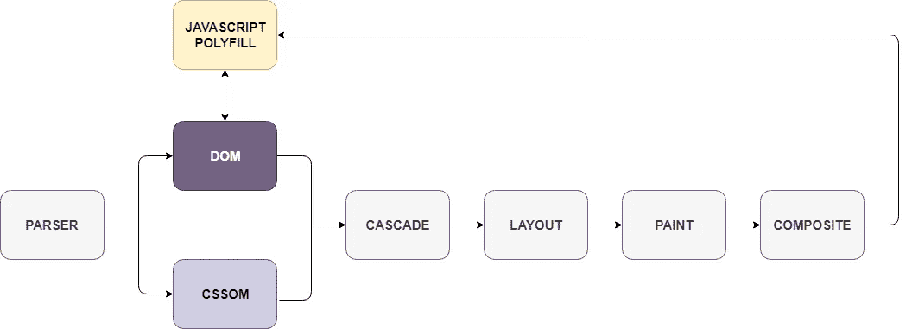
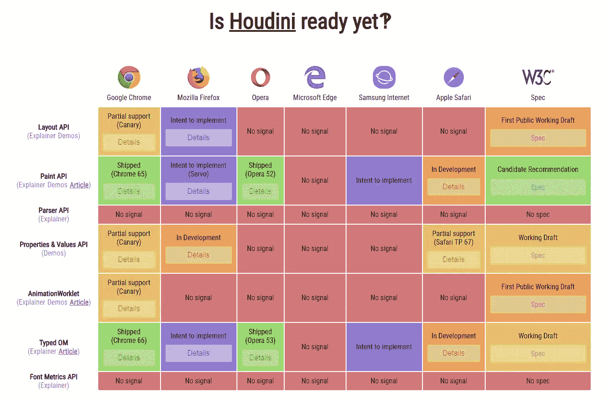

# CSS 胡迪尼和前端开发的未来

> 原文：<https://medium.com/hackernoon/css-houdini-and-the-future-of-frontend-development-b75ae3b0e1a5>

前端开发不同于其他编程环境。它更有限，更有准备。但是事情会改变的。即将发生的一场革命将决定 frontend 的未来，这让我非常兴奋。它将带来更快的用户界面、更丰富的视觉效果和全新的可能性。此外，前端的遥远未来甚至可能消除浏览器的兼容性问题！

# 问题是

当在网站上创建效果时，你经常会碰到 HTML 和 CSS 能力有限的问题。这就是为什么您使用现有的 JavaScript 库来弥补缺失的功能。但是你知道所有的后果吗？通常，这些库有隐藏的缺点，可能会损害您的应用程序。**滚动条上的动画、自定义布局和多种类型的填充——它们都有非常常见的问题**:

*   前端开发人员无法获得大量数据，例如显示的文本宽度或未知 CSS 属性的值。要收集这些信息，您需要使用缓慢而肮脏的变通方法。
*   一些逻辑运行在应用层，而不是在浏览器下工作。它影响了网站的整体性能，因为它错过了浏览器对本机代码的优化。
*   与原生功能相比，JS 脚本经常会触发额外的视图重新呈现。它迫使设备执行更多的工作，结果是更快地耗尽电池。

后者可能是最有趣的，因为它与某些类型的聚合填充的工作方式有关。这就是为什么我们要仔细看看。这些小图书馆试图在 web 浏览器准备好使用之前为其添加缺失的功能。

在上面的方案中，你可以看到一个典型的浏览器视图渲染过程，比如 Chrome 或 Firefox。它由许多阶段组成，在某些事情发生变化以及每次视图需要更新时，这些阶段会依次运行。在这个过程中，浏览器做了很多神奇的事情——它们解析代码，计算布局，绘制元素，最后，它们组合成最终的视图。效果很好。

现在想象你想要一个砖石布局在你的网站上，就像 Pinterest。可以让浏览器帮你吗？不幸的是，你不能，因为浏览器还不支持这些布局。您需要使用 JS 在应用程序中做所有的事情，完全在渲染过程之外。这将是它的样子:

这就是 polyfills(以及其他所有 JS 库)的工作方式。它在渲染过程结束后完成它的工作。然后，它更改 HTML，更新样式，因此，它迫使浏览器重新开始整个呈现过程。第二次运行必须使更改在屏幕上可见，这是一个大问题，因为每次屏幕刷新都需要时间。目前，您对此无能为力，因为您无法访问渲染过程和整个浏览器魔术，但如果您可以呢？就前端的未来而言，这里来了…

# 革命

前段时间，一群知名公司的开发人员开会，问自己:如果我们能在这里做出改变会怎么样？他们称自己为 CSS 胡迪尼任务组，以魔术师哈里·胡迪尼的名字命名，他因揭开魔术的神秘面纱而闻名。

> *CSS Houdini 背后的人想要类似的东西:揭开浏览器魔力的神秘面纱，让它更贴近我们——前端开发者。他们希望创建一个低级 JavaScript APIs 集合，以便更好地控制网站渲染。听起来是不是很酷？*

因此，请考虑创建高级动画、布局构图和图像渲染。眨眼间一切都结束了。没有性能开销。在网络浏览器的深处，真正的奇迹发生了。

我相信我已经引起了你的注意。这些新的 API 将让您能够访问渲染过程。您将能够读取目前无法访问的信息，并使用您的自定义代码扩展这些呈现阶段，为浏览器添加新功能或修复现有功能。为了做到这一点，你可以在浏览器上附加一些小程序。它们被称为…

# 工作小程序

这些不是您可能从推送通知中了解到的工作人员。工作小程序是注册在 JS 文件中的小型 ES6 类，单独附加到文档中。每个类需要实现一个新的 CSS Houdini 接口。但是，您不会在应用程序中直接使用这些类。浏览器将对此负责，并在需要时实例化这些类中的对象。

有趣的是，通过 worklets 方法，您将无法访问外部世界——这意味着没有窗口、没有文档对象、没有应用程序数据、没有像警报这样的高级功能。每个小工具都将在一个浏览器下的独立环境中运行，不能访问任何列出的信息。CSS Houdini 以这种方式设计它们，以确保工作件像本机功能一样运行。快速且不影响界面响应。

速度是非常重要的，因为另一个原因:在渲染过程中运行的工作流和一些东西，如动画，使他们经常执行。有时甚至每秒 60 次。正因为如此，作为前端开发人员，我们必须考虑让 worklets 内部的逻辑明显变得简单。执行你的工作包不应该花费太多时间，因为任何耗时的计算都会降低帧渲染的速度。众所周知:权力越大，责任越大。

不过现在理论已经足够了，我们来做一些编码吧！

# 油漆 API

这是我想谈论的第一个新的 CSS 胡迪尼界面。这不仅是最容易理解的，也是最有效的。画图 API 将允许你在渲染过程的画图阶段生成一些额外的图形，并在 CSS 定义中使用它们。我们可以在每个接受图像作为其值之一的 CSS 属性中使用这些渲染的图像，例如背景和边框设置。

于是第一个 worklet ES6 类来了。**在 Paint API 中，我们称他们为画师。他们必须有一个名为 paint 的方法，该方法有三个参数。请参见下面的示例:**

第一个参数 Context 是一个类似画布的对象，您可以在上面绘制图像。几何学告诉你在它上面有多少空间可以画。参数是一个带有额外数据的对象，您可以将它传递给 worklet。在这段代码的最后，你可以看到我们使用了一个特殊的函数来注册我们的类为画师。在同一个函数中，我们给我们的画师一个简短的名字，我们将在以后使用。你还记得我说过你必须在一个单独的文件中定义 worklet 代码吗？现在让我们学习如何将它们附加到文档中。正如你在下面看到的，这非常简单。

当你完成了这些，你就可以使用 CSS 中的新工作件来完成一些工作了。比如让菜单的背景更 WOW:

正如您所看到的，要在 CSS 中使用这个画图器，您必须选择一个画图函数，并给它一个名称，在这个名称下您已经注册了您的 worklet。

寻找一些现实生活中的例子？这就对了。查看 CodeSandbox 上的这个演示，它为文本区域*制作了一个方格背景。*然而，有一个问题:只允许完全可见的字段。浏览器需要根据 textarea 的大小调整每个模式字段的大小，以避免矩形被切成两半。这是普通 CSS 无法实现的效果，但使用画图 API 却很容易实现。

打开下面的例子，试着通过拖动文本区域的右下角来调整它的大小(在桌面上)。**请记住，这个例子只适用于最新版本的谷歌浏览器和火狐浏览器。**

textarea 的例子是独立工作的，但是工作件和应用程序之间的协作性如何呢？也有可能。你只需要使用 CSS 变量，并把它们作为参数传递给你的画师。

正如您可能注意到的，您必须在 inputProperties 方法中明确定义哪些 CSS 变量对您的 worklet 可用。出于安全和性能的考虑，这是必需的。另一件事——在上面的代码片段中，我们在一个外部样式表中设置了 CSS 变量。但是，您也可以通过设置任何元素的 style 属性来动态实现。

我们将在下一个例子中使用这个技巧:一个密码输入，如果你的密码足够强，它会平静下来。你自己查吧。

在一个单独的文件中，您测量用户定义的密码有多强，并将该值设置为一个 CSS 变量。按下每个键后，浏览器必须重新呈现整个输入，因此它调用您的 worklet 来获得新的背景图像。Out worklet 获取当前级别的密码强度，并相应地绘制背景——仅此而已！

原来这就是画图 API。然而，你可能想知道是否可以用它做一些动画。我们将在后面讨论这个话题。现在，让我们谈论一种不同类型的动画。

# 动画 API

所以，这里有一件事:目前浏览器给了我们一些用 CSS 制作原生动画的工具，比如 transition 属性。问题是所有这些动画都是基于时间的。随着时间的推移，动画会继续播放。我们称动画发展的源头为时间线。现在，我们经常使用基于其他时间线而不是基于时间的动画。例如，当用户滚动他们的网站时，Twitter 会将个人资料照片的位置和大小制作成动画。这是一个基于滚动的进度动画。其他类型的时间线也是可能的。我们可以根据文件上传的百分比来制作进度条的动画。

不幸的是，仅使用内置的 CSS 工具，我们无法制作出像那样漂亮、流畅、自然的动画。幸运的是，CSS Houdini 小组用动画 API 来拯救我们，它将在渲染过程的合成阶段工作。下面我将展示如何使用它。

我们将通过定义进度的来源:你的时间线来开始创建你的动画。在这个例子中，我们将使用**scroll timeline**——这是一个现成的时间轴，当用户滚动某个元素时，它就会前进。

在构造函数中，需要传递带有两个属性的对象。第一个是对您想要跟随的滚动位置的元素的引用。第二个参数是这个时间线的最大值，如果滚动条到达其末端，将设置该值。

那是进步的源泉。现在让我们来定义动画将如何工作。这个定义我们称之为效应。

为了定义一个效果，你需要得到一个动画元素的引用，你的动画的关键帧和动画应该有多长的信息。在上面的例子中，你通过将图像缩小到四分之一来制作动画。动画将需要 100 秒(是的，我们仍然以秒计算动画进度)。

你有时间轴，你也有效果。现在让我们制作最后一部分:一些将基于时间线变化设置效果进度的东西。这是动画师，将在浏览器下工作的小工具。

这里我们有一个非常简单的动画师。它从时间轴中提取时间，并将其乘以某个因子后设置为效果。然而，你可以让它变得更复杂一点，比如用[缓动功能](https://easings.net/pl)。现在你已经有了所有需要的部分，你终于可以制作你的动画了！将时间线、效果和动画师结合在一个本地的、浏览器友好的、流畅的动画中。另外，提供一个带有参数的必需对象。浏览器会将其传递给 animator 构造函数。

正如你所看到的，你可以使用动画制作工具，比如播放，暂停或者停止。我并没有展示我是如何将工作表附加到文档中的，但是您可以在下面的实际例子中自行检查。

这是一个完整的阅读进度条，利用了动画 API。在这种情况下，我们使用了 animator 参数，worklet 变得比以前更有趣了。检查里面的注释以获得解释。

> *记住，如果这个例子对你不起作用，请使用最新的 Chrome 版本，并转到****Chrome://flags/****来启用实验性 Web 平台功能。重新启动浏览器后，一切都会好的。*

所以，我们已经讨论了画图 API 和动画 API。然而，Worklets 并不是 CSS Houdini 试图带到桌面上的唯一创新。浏览器如何解释 CSS 有了一个全新的界面。它被称为属性和值 API。

# 属性和值 API

被称为 CSS 对象模型的经典 CSS 编程接口…糟透了。不信你自己看。让我们从将一些元素的不透明度减半开始。在这个例子中，我们将使用文档体。

现在让我们把那个值取回来。

我们得到了什么？字符串“0.5”，尽管我们之前已经设置了一个浮点数。这是因为旧的 CSSOM(元素中的样式属性)是一个黑盒，它会自动将每个设置值转换为字符串。你可以自己试试这个。如果你用的是桌面 Chrome，只需输入 **CMD/CTRL+ALT+I** (就像印度)并将这两行代码放入控制台。

当你试图用+=操作符增加 0.3 的不透明度时，它会变得更奇怪。

哦，好吧，这就是你的 JavaScript。幸运的是，CSS 胡迪尼集团正在试图阻止这种疯狂。他们正在创建属性和值 API。这是一个更大的东西，一个改变浏览器如何理解你的 CSS 规则以及你如何使用它们的接口。

部分属性和值 API 是 CSSOM 的继承者:全新的 **CSS 类型化对象模型(CSSTOM)** 。它解决了很多问题，就像我之前给你看的那个。CSSTOM 将在任何 HTML 元素的 attributeStyleMap 属性中可用，它将提供更直观的 setter 和 getter:

该命令将元素的上边距设置为 5 像素。对同一个 CSS 属性使用 getter 后会得到什么？令人惊讶的是既不是数字也不是字符串。一个 CSSUnitValue 类的对象，它有两个属性:数值和单位。

CSSTOM 中 setter 的优点是它试图解析每个传递给适当对象的值。对于复杂的值(比如翻译), CSSTOM 也提供了一些特殊的值对象。

如果你愿意，你可以传递一个值对象给 setter。CSSTOM 让您可以随时使用构造函数来构造不同类型的值，如秒、像素和度。

看这条线。你注意到什么了吗？我们将元素的宽度设置为 5 秒！这没有任何意义，不是吗？幸运的是，这是 CSSTOM，T 代表 Typed 是有原因的。每种类型的单元就像一个不同类型的变量，CSS 属性现在可以识别什么类型是好的或者坏的。因此，最后一个命令将会出错。

浏览器将根据类型正确性验证已知 CSS 属性的值。但是本文前面使用的自定义 CSS 变量 ***—效果颜色*** 是什么呢？CSS 属性和值 API 已经给了我们一些工具来管理它。您可以像这样定义每个自定义变量的类型:

你可能会问，你为什么需要这个，这是个好问题。它与动画有关。如果浏览器识别出给定属性或变量的类型，它可以动画显示它的变化。它知道如何迭代它。不透明度的值是一个普通的数字，所以浏览器只是增加或减少它。对于大小，browser 遍历数字，并将其与 px 或 em 等单位连接起来。颜色更棘手，因为浏览器必须单独迭代它的每个组件，例如 R、G 和 b。

现在，当你知道如何制作自定义变量动画时，你可以将它与画图 API 结合起来，创建非常酷的背景动画。查看下面的演示。

在这个例子中，在 CSS 文件中，你将变量***—rainbow-progress***设置为 0 表示正常按钮，100 表示悬停按钮。您还可以为此变量设置过渡时间，并将其定义为一个数字。浏览器现在知道如何在两种状态之间转换，这表现为在按钮上移动鼠标后颜色的爆炸。

简而言之就是 CSS 属性和值 API。我们只是触及了这个主题的表面，因为这个增强要广泛得多，例如 CSS TOM 将有许多工具来改进对 CSS 值的数学运算。

# 其他事情

我们讨论了 CSS Houdini 项目希望带给前端开发世界的一些新工具。然而，仍有更多的工作正在进行或处于早期开发阶段。现在让我们快速浏览一遍。

还记得我们讲过的砖石布局吗？我们说过现在不可能在浏览器中创建这种布局。

这就是 CSS Houdini 通过创建… **布局 API** 来扩展渲染过程的布局阶段的可能性的原因。有了它，我们将能够以一种更加浏览器友好的方式在网站上任意定位元素，而无需使用 CSS position 属性。浏览器会将元素列表和关于容器的信息传递给我们的 worklet。

我们的工作是计算他们的位置。您也可以决定不呈现某些元素。您甚至可以实现自己版本的 flexbox 或网格布局。要做到这一点——除了 worklet——您只需要 CSS 中的一行代码:

CSS Houdini 还想处理前端开发中最神奇的事情之一:文本渲染。这是一个你无论如何都无法控制的黑匣子。您可以设置一些与之相关的 CSS 属性，但是没有编程方式来“查看”文本在网站上的可见性。这就是**字体度量 API** 派上用场的地方。它不仅可以让我们访问一些有趣的字体指标(如基线位置)，还可以检查浏览器如何呈现文本，浏览器使用的字体以及它如何换行。不幸的是，这个 API 仍然处于开发的早期阶段，还没有任何东西可以展示。
T3**卷轴 API** 也是如此。你有时会梦想对卷轴的工作方式有更多的控制吗？控制移动设备上一次滑动后网站滚动的幅度？这个 API 什么时候准备好是有可能的。然后，您可能会忘记实现自定义滚动的库，因为您将能够在几行 CSS 中设置所有内容。

最后值得注意的是**解析器 API** ，它允许你扩展浏览器解析机制。自定义 CSS 属性和自定义单位——它们将允许我们创建更好的 CSS polyfills，不需要单独解析样式表。

名单还不全。CSS 胡迪尼项目是巨大的，需要大量的努力。很少有其他的界面草案允许更多的扩展浏览器功能。然而，大多数这些东西只是 frontend 未来的一部分。

# frontend 的美好未来？

在这篇文章中，我展示了很多很酷的特性。你现在能在你的应用中使用它们吗？**简而言之就是……没有**从[ishoudinireadyyet.com](http://ishoudinireadyyet.com/)查这个表。

开源爱好者慢慢将所有功能实现到谷歌 Chrome 中。Firefox 稍后也会实现它们。微软 Edge 专栏是红色的，但它现在基本上是一个死浏览器，所以没有人感到惊讶。

浏览器会广泛采用 CSS Houdini 吗？没人知道。但是如果他们这样做了，这将永远改变前端开发的形象。这将是自 HTML 5 和 CSS 3 以来最大的变化。它甚至可能改变我们在 HTML 模板上建立网站的方式。要不要花式布局？很好，有一个小工具可以解决这个问题！下载下来，在 CSS 里加一行就行了。必须向应用程序添加太多的工作小程序文件？没问题，几年后可能会有一些 Webpack 插件来帮助你。谁知道呢？我希望这不仅仅是 Chrome 和 Firefox 中又一个很酷的功能，人们很快就会忘记，而是对 frontend 的未来产生积极的推动作用。祈祷好运吧！

**文章由 Marcin Gajda 撰写，最初发表在软件之家博客** **的** [**上。访问博客，获得更多关于最佳开发实践和软件外包技巧的文章。**](http://www.tsh.io/blog)