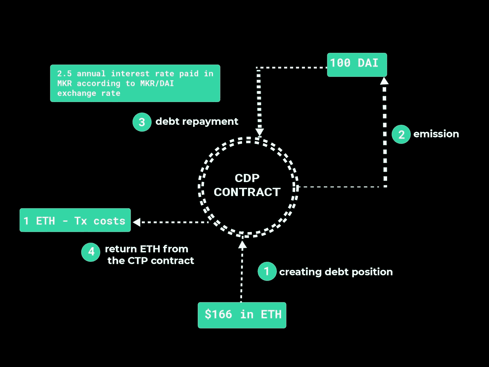

# 戴——一个分散的反对稳定的“银行卡特尔”的组织积累了 170 万 ETH 的储备

> 原文：<https://medium.com/hackernoon/dai-a-decentralized-opposition-to-the-banking-cartel-of-stablecoins-accumulates-1-7-763461bc2008>

并非没有足够的怀疑，2018 年确实可以被称为稳定之年。在对 Tether 的全面抵制和对稳定的加密货币作为结算手段的高需求中，越来越多的稳定硬币解决方案被推向市场。这些似乎是今天在密码交易所中享有最大信誉的稳定公司:Paxos Standard [PAX](https://www.paxos.com/standard/) ，Gemini [GUSD](https://gemini.com/dollar/) ，Circle [USDC](https://www.circle.com/en/usdc) ，Carbon [CUSD](https://fiat.carbon.money/) ，TrustToken 的 [TUSD](https://blog.trusttoken.com/trueusd-a-usd-backed-stablecoin-you-can-trust-9688796cfd0d) 。然而，可以肯定地说，上述产品没有一个是真正去中心化的，本质上更多的是一个令牌，有权要求存储在一个集中存储区(通常在一个银行账户上)的法定美元等价物。

这意味着，这些硬币的使用与传统法定货币的使用有着相同的困难，即，虽然它们的价值由发行人保证，但它们的使用通常伴随着复杂的[KYC/反洗钱程序](https://www.americancryptoassociation.com/2018/12/30/paxos-standard-hassling-ethereum-traders-trying-to-redeem-stablecoin-pax-for-dollars/)，存在银行账户因硬币被视为“非法获得”而被暂停的风险。因此，在 [Web 3.0 的金融服务中，大多数 stablecoins 的使用是完全不合理的。](https://www.technomads.wtf/blog/2018/12/7/enter-web3-or-why-the-capital-is-no-longer-the-scarce-resource)或“免费互联网”，因为它意味着大量的风险。可以肯定地说，在一个完美的世界里，Web3 的稳定支付方式应该由社区来实现，其价值与第三方的行为无关。

今天看来，唯一以分散方式安全发射的稳定硬币是马可道的戴。它也是以太坊生态系统中最受欢迎的 [#DeFi 应用](https://www.stateofthedapps.com/rankings/platform/ethereum/category/finance)之一。是什么让戴如此与众不同，产生了巨大的社区信任？在这里，我们将触及 MakerDAO 发射系统的核心机制，并告诉你作为一个以太坊用户如何从中受益。

**马克尔道概念——分散稳定的硬币是如何运作的？** 本质上，MakerDAo 产品的核心是一种稳定支付手段(即货币)的发射机制，部署为以太坊网络中的若干智能合约。原则上，发行计划类似于由黄金担保的货币发行，在这里用 ETH 代替黄金。特定数量的 ETH 被发送到生成稳定令牌(DAI)的智能合约，然后将其发送给用户。以这种方式创建的 Dai 成为 MakerDAO 的未偿债务(这本身成为一个分散的排放系统),由抵押品担保——与传统的法定货币本质上是中央银行的未偿债务完全相同。然而，与传统的中央银行不同的是，使用戴，任何用户都可以毫无障碍地创造新的分散货币。同时，由于 MakerDAO 系统完全自动化的设计，不可能创造没有 ETH 保护的货币，并且该系统对监控是完全透明的。

房间里的一只大象是戴如何实际上保证戴 1 美元汇率的稳定？过度消费的概念在这里发挥了作用。发行 DAI 时，担保抵押品应不低于%166，即 100 DAI 的债务应发行到每$166。个人用户的排放变成了 CDP，或抵押债务头寸，每个都可以在一个专门的网页上被监控。当 ETH 价格下跌时，只要持仓覆盖率指数降至 150%以下，头寸就开始平仓。而抵押资产，即 ETH，则以折价出售给戴，用于抵偿债务。最近 ETH 价格在短时间内从 200 美元下跌至 86 美元，导致由于覆盖率不足而大量平仓债务头寸，但戴汇率仍保持在约 1.00 美元，这证实了系统的高度稳定性。

DAI Emission cycle

更重要的是，社区对戴的信任度极高。根据最新的数据点，该系统已经积累了 170 万 ETH，即 2.55 亿美元的巨额抵押品(占目前所有 ETH 的 1.5%以上)。到目前为止，已经产生了超过 7000 万 DAI，相当于大约 7000 万美元的稳定硬币，总担保覆盖率达到 370%。许多 dApps 也集成了 DAI，为他们的用户提供以稳定货币结算的选项。

在 MakerDAO 系统中还使用了另一个令牌——Maker token——指定用于在管理百分比股权时赋予投票权(因为 DAI 发行类似于具有借贷利率的传统货币发行),并用于偿还借贷利率。用令牌支付 DAI 排放的百分比本身就是一个独特的经济先例。当中央银行的债务超过发行的货币数量时，这种机制可以避免对法定货币的典型担忧。戴排放系统完全忽略了这一点。

**你现在如何利用戴和马克道**

使用 MakerDAO 排放机制可以证明对利用 ETH 抵押品进行信贷或获得分散信贷杠杆很有意义。因此，拥有 ETH 100(15，000 美元)，一个人可以产生高达 9，000 美元的 DAI，随后可以用来购买一些额外的 ETH。

DAI 排放系统也可以成为一种可行的信用解决方案。有了 ETH 作为抵押，就有可能创造一定数量的 DAI，以后从未来的收益中偿还。由于利率为 2.5%，并且没有银行佣金，MakerDAO 看起来可能是银行抵押信贷额度的一个不错的替代选择。

**戴会成为稳定硬币“银行卡特尔”的可行替代者吗？**

尽管有技术创新，密码市场上一系列事件测试的耐用代码行，以及密码爱好者的尊重，任何分散化金融产品的大规模采用都不是一件容易的事情。首先，由于所有 DAI 都是根据 ETH 抵押品创建的，因此 DAI 的总量是有限的。如果所有 ETH 的 10%用作抵押品，汇率为 150 美元，则只能创造 9 . 39 亿美元的 DAI。当然，一旦 ETH 回到其 1000 美元价格的顶峰，这一数额将会激增，但在全球范围内仍然微不足道。

第二个问题是买卖的流动性和可获得性。然而，尽管最近戴和在交易，戴的交易主要是在交易所进行的。与此同时，很明显，DAI 的大规模采用，进入和退出菲亚特是非常必要的，因为大多数 DAI 用例(如支付和信用)最终都需要退出菲亚特。然而，用法定货币买卖 DAI 的选择并不多——目前只有两家交易所拥有这些交易对。其中一个是 Ethfinex，但它不能吹嘘最方便的存取款方式。另一个是 EXMO，他最近宣布了[对戴](https://exmo.com/en/news_view?id=2500)和的支持，并将菲亚特 pair 引入 USD。奇怪的是，目前市场上已不再有戴与流动性非零的菲亚特对抗的例子。

这部分是由于这样一个事实，即由于明显的原因，大多数较大的交易所对与机构参与者合作更感兴趣，而不是分散的(即完全独立的)电子现金流系统。因此，尽管 DAI 对普通用户有一些明显的优势，如第三方和各种中间人的透明性和独立性，但与银行卡特尔的竞争将异常激烈。尽管如此，戴显然已经创造了一个自己的利基市场，必将逐步扩大，硬币发行总量的限制和流动性流入是其在 Web 3.0 生态系统中采用的主要因素。快进到今天，我们已经见证了这一领域越来越令人兴奋的发展，与去年仅约 300 万美元相比，MakerDAO 生态系统创造了超过 7000 万美元的收入。知道了加密市场在历史上表现出对空白支付手段的兴趣，我们只能猜测从现在起一年后将产生并随后使用多少 DAI。