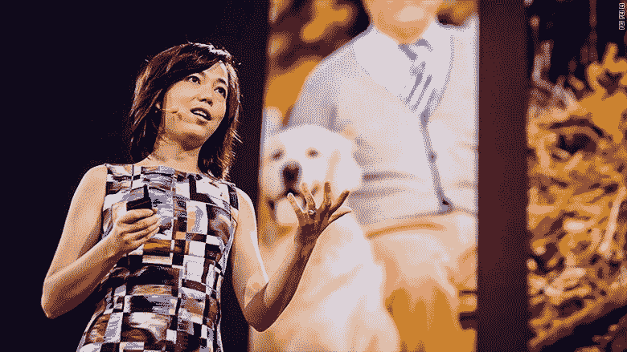
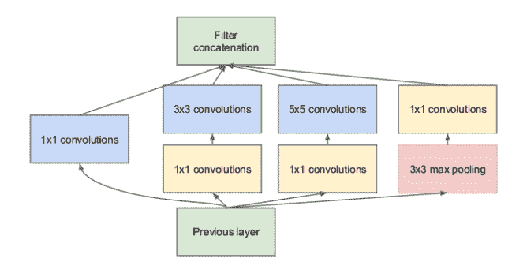
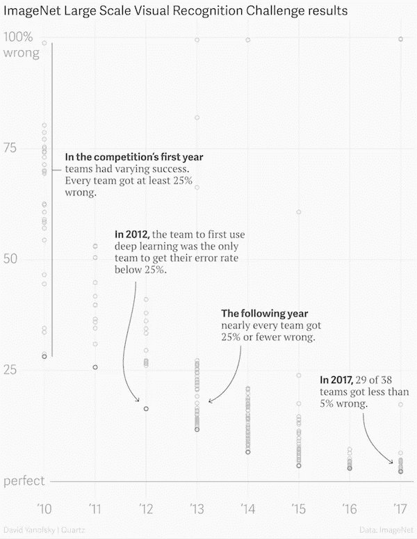

# 数据是新的石油

> 原文：<https://medium.com/hackernoon/data-is-the-new-oil-1227197762b2>

> “数据是新的石油。它很有价值，但如果不提炼，就不能真正使用。它必须转化为气体、塑料、化学物质等，以创造一个有价值的实体，推动盈利活动；因此，必须对数据进行分解和分析，使其具有价值。”
> 
> —克莱夫·亨比

深度学习是一个革命性的领域，但要让它按预期工作，它需要数据。与这些大数据集相关的领域被称为大数据，代表丰富的数字数据。对于深度学习算法来说，数据与网络本身的架构(即软件)一样重要。获取和清理数据是这项工作最有价值的方面之一。没有数据，神经网络就无法学习。

大多数时候，研究人员可以直接使用给他们的数据，但也有很多数据不干净的情况。这意味着它不能直接用于训练神经网络，因为它包含的数据不能代表算法想要分类的内容。也许，它包含坏数据，就像当你想创建一个神经网络来找出彩色图像中的猫时，数据集包含黑白图像。另一个问题是数据不合适的时候。例如，当您想要将人的图像分类为男性或女性时。可能有些图片没有标签，或者有些图片的信息被拼错的单词损坏，如“ale”而不是“male”尽管这些看起来很疯狂，但它们一直都在发生。处理这些问题和清理数据被称为数据争论。

此外，研究人员有时不得不解决如何表示数据的问题。在某些地方，数据可能以一种方式表示，而在其他地方，相同的数据可以用完全不同的方式描述。例如，您可以在一个数据库中用特定的数字(3)对糖尿病等疾病进行分类，而在另一个数据库中用特定的数字(5)进行分类。这也是各行业付出巨大努力来创建更容易共享数据的标准的原因之一。例如，快速医疗保健互操作性资源(FHIR)是由国际卫生组织(国际卫生七级组织)创建的，用于创建交换电子健康记录的标准。

标准化数据至关重要，但选择正确的输入也很重要，因为算法是基于数据创建的。选择这些数据并不容易。选择数据时可能出现的一个问题是，数据可能会以某种方式出现偏差，这就产生了一个称为选择偏差的问题。这意味着用于训练算法的数据不一定代表所有的可能性。业内的说法是，**“垃圾进，垃圾出。”**这意味着如果输入系统的数据不正确，那么模型就不准确。埃利泽·尤德考斯基(Eliezer Yudkowsky)在《人工智能作为全球风险中的一个消极和积极因素》中的寓言最好地说明了这一点:

> “从前，美国陆军想用神经网络自动探测伪装的敌方坦克。研究人员在 50 张伪装在树上的坦克照片和 50 张没有坦克的树木照片上训练了一个神经网络。使用监督学习的标准技术，研究人员训练神经网络的权重能够正确加载训练集——对 50 张伪装坦克的照片输出“是”，对 50 张森林的照片输出“否”。这并不保证，甚至不意味着，新的例子将被正确分类。神经网络可能已经“学习”了 100 种特殊情况，这些情况不会推广到任何新问题。明智的是，研究人员最初拍摄了 200 张照片，100 张坦克照片和 100 张树木照片。他们只使用了 50 个作为训练集。研究人员对剩余的 100 张照片运行神经网络，在没有进一步训练的情况下，神经网络对所有剩余照片进行了正确分类。成功确认！研究人员将完成的工作交给五角大楼，五角大楼很快将其退回，并抱怨说在他们自己的测试中，神经网络在区分照片方面并不比运气好。
> 
> 原来，在研究人员的数据集中，伪装坦克的照片是在阴天拍摄的，而平原森林的照片是在晴天拍摄的。神经网络已经学会区分阴天和晴天，而不是区分伪装的坦克和空旷的森林。"

# **ImageNet**

费-李非是斯坦福人工智能实验室的主任，也是谷歌云人工智能/人工智能的首席科学家，她很早就意识到数据是机器学习算法开发的重要组成部分，而她的大多数同事并不这么认为。

Professor Fei-Fei Li

李意识到，为了制造更好的算法和更高性能的神经网络，需要更多更好的数据，而没有这些数据就不会有更好的算法。在那个时候，最好的算法可以在训练和测试数据的情况下表现良好，这些数据非常有限，不能代表真实世界。她意识到，为了让算法运行良好，数据需要与现实相似。“我们决定要做一些完全史无前例的事情，”李说，她指的是最初与她合作的一个小团队。“我们要绘制出整个物体世界。”

为了解决这个问题，李构建了迄今为止最广泛的深度学习数据集之一 ImageNet。数据集被创建，描述这项工作的论文于 2009 年在佛罗里达州迈阿密举行的最重要的计算机视觉会议之一计算机视觉和模式识别(CVPR)上发表。该数据集对研究人员非常有用，正因为如此，它变得越来越有名，为深度学习最重要的年度竞赛之一提供了基准，该竞赛测试和训练算法以最低的错误率识别对象。十年来，ImageNet 成为了人工智能领域最重要的数据集，也帮助提高了对现实世界中的物体进行分类的算法的准确性。在仅仅七年的时间里，对图像中的物体进行分类的准确率从 72%提高到了近 98%，超过了普通人的能力。

但是 ImageNet 并没有像许多人想象的那样一夜成名。这需要李付出大量的汗水，从她在伊利诺伊大学香槟分校任教开始。她正在处理许多其他研究人员共有的许多问题。大多数算法对提供给它们的数据进行了过度训练，使它们无法超越这些数据进行推广。问题是，呈现给这些算法的大多数数据并不包含很多例子，因此，基于它们创建的模型不能很好地概括。可用的数据集没有足够的关于所有用例的信息，无法在现实世界中工作。然而，她发现，如果她生成一个像现实一样复杂的数据集，那么模型应该表现得更好。

如果你看到一千张不同狗的照片，在不同的拍摄角度和光线条件下，比你只看到五张狗的照片更容易识别一只狗。事实上，众所周知的经验法则是，如果某种类型的对象有大约 1000 张图像，算法可以从图像中提取正确的特征。

李开始寻找其他尝试来创造一个真实世界的表现，她偶然发现了一个由教授创建的项目，WordNet。WordNet 是一个数据集，具有英语语言的层次结构。它就像一本字典，但不是每个单词都有解释，而是与其他单词有联系。例如，单词“猴子”在单词“灵长类动物”的下面，也就是在单词“哺乳动物”的下面。这样，数据集包含了所有单词之间的关系。

在研究和了解了 WordNet 之后，李遇到了 Christiane Fellbaum 教授，他曾与 Miller 一起研究 WordNet。她给李出了一个主意:添加一张图片，并将其与每个单词相关联，从而基于图片而不是单词创建一个新的分层数据集。李进一步阐述了这个想法——她不是每个单词加一张图片，而是每个单词加很多张图片。

作为普林斯顿大学的助理教授，她建立了一个团队来处理 ImageNet 项目。李的第一个想法是雇佣学生寻找图片，并手动添加到 ImageNet 中。但她很快意识到，这对他们来说太昂贵了，而且要花太多时间来完成这个项目。据她估计，完成这项工作需要一个世纪，因此，她改变了策略。相反，她决定从互联网上获取图片。她可以编写算法来寻找图片，人类会选择正确的图片。经过几个月对这个想法的研究，她发现这个策略的问题是，选择的图像受到挑选图像的算法的限制。出乎意料的是，当李与她的一名研究生交谈时，她提到了一项服务，即世界上任何地方的人都可以非常便宜地完成小型在线任务。通过 Amazon Mechanical Turk，她找到了一种方法来扩大规模，让成千上万的人找到合适的图片，而不需要太多的钱。

亚马逊土耳其机器人是解决方案，但问题仍然存在。并非所有的工人都把英语作为他们的第一语言，所以特定的图片和与之相关的词汇存在问题。对于这些远程工作人员来说，有些单词更难识别。不仅如此，还有像“babuin”这样的词，工人们并不确切地知道哪些图像代表了图像的类型。因此，她的团队创建了一个简单的算法，来计算对于一个给定的单词，有多少人需要看每张图片。像“babuin”这样复杂的单词需要更多的人来检查，而像“cat”这样简单的单词只需要几个人来检查这些图像。

有了 Mechanical Turk，创建 ImageNet 用了不到三年的时间，比最初估计的只有本科生的时间少得多。产生的数据集有大约 300 万张图片，分成大约 5000 个“单词”然而，人们对她的论文或数据集没有印象，因为他们不相信越来越多的精确数据会带来更好的算法。但是这些研究者中的大多数人的观点即将改变。

## **ImageNet 挑战赛**

为了证明她的观点，李不得不展示她的数据集带来了更好的算法。为了实现这一目标，她有了基于数据集创建一个挑战的想法，以表明使用它的算法总体上会表现得更好。也就是说，她必须让其他人用她的数据集训练他们的算法，以证明他们确实可以比不使用她的数据集的模型表现得更好。

在 CVPR 发表论文的同一年，她联系了一位名叫 Alex Berg 的研究员。她建议他们合作发表论文，证明使用数据集的算法可以计算出图像中是否包含特定的物体或动物，以及它们的位置。在 2010 年和 2011 年，他们合作并使用 ImageNet 发表了五篇论文。第一篇论文成为算法如何在这些图像上执行的基准。为了使其成为其他算法的基准，李接触了最著名的图像识别数据集和基准标准之一 PASCAL VOC。他们同意合作，并将 ImageNet 作为他们竞争的基准。比赛使用了一个名为 PASCAL 的数据集，只有 20 类图像。相比之下，ImageNet 大约有 5000 个类。

正如李预测的那样，随着比赛的继续，算法的表现越来越好，就像他们使用 ImageNet 数据集进行训练时一样。研究人员了解到，当模型首次使用 ImageNet 进行训练，然后针对另一项任务进行微调时，算法开始在其他数据集上表现更好。

2012 年，出现了重大突破。深度学习之父 Geoffrey Hinton 与 Ilya Sutskever 和 Alex Krizhevsky 一起提交了一个名为 AlexNet 的深度卷积神经网络架构，直到今天仍在研究中使用，“它以高达 10.8%的百分点优势击败了该领域。”这标志着深度学习热潮的开始，如果没有 ImageNet，这就不会发生。

ImageNet 成为深度学习革命的首选数据集，更具体地说，是 Hinton 领导的卷积神经网络(CNN)。ImageNet 不仅引领了深度学习的革命，还为其他数据集开创了先例。自创建以来，推出了数十个新数据集，数据更加丰富，分类更加精确。现在，他们允许研究人员创造一个更好的模型。不仅如此，研究实验室还专注于发布和维护其他领域的新数据集，如文本翻译和医疗数据。

Inception Module included in GoogleNet

2015 年，谷歌发布了一个新的卷积神经网络，名为 Inception 或 GoogleNet。它包含的层数比性能最好的神经网络少，但性能更好。Google 没有在每一层添加一个过滤器，而是添加了一个 Inception 模块，其中包含一些并行运行的过滤器。它再次表明神经网络的结构是重要的。

Image error rate over time

ImageNet 被认为是已解决的，其错误率低于普通人，在判断图像是否包含对象以及对象的类型方面达到了超人的性能。近十年后，与 ImageNet 的竞争以模型在其上被训练和测试而告终。李试图从网上删除数据集，但像这样的大公司拒绝了，因为他们把它作为自己的基准。

但自从 ImageNet 竞赛结束以来，许多其他数据集都是基于每天在他们的平台上输入和共享的数百万张图像、语音剪辑和文本片段而创建的。人们有时理所当然地认为这些数据集是免费的，这些数据集需要大量的收集、汇编和审查。开放和免费使用是 ImageNet 最初的宗旨，它将经受住挑战，甚至可能经受住数据集的考验。“ImageNet 在人工智能领域改变的一件事是，人们突然意识到制作数据集的吃力不讨好的工作是人工智能研究的核心，”李说。“人们确实认识到了数据集在研究中的重要性，就像算法一样重要。”