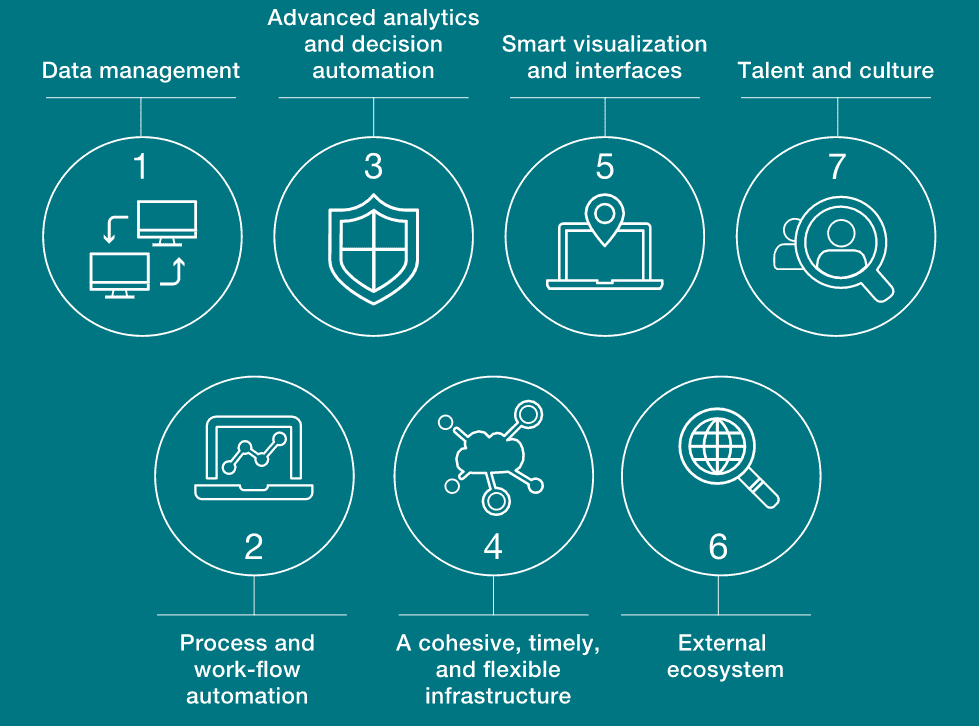

# 透过业务风险的棱镜看数据安全性

> 原文：<https://medium.com/hackernoon/data-security-through-the-prism-of-business-risks-bfe1ea8810f3>

*数据安全在商业可行性中的地位，以及如何在数字产品中实现安全——由我，* [*Nullgravity*](https://www.nullgr.com/) 业务发展副总裁 Igor Pyatnytskyy 讨论。

数字化转型催生了一种新的商业理念。个人主义立场转变为生态系统主导的商业模式——连接性、协作方法、整合和利益相关者之间互动的新层次的聚合环境。快速动态的数字环境要求企业通过在参与者之间建立动态关系来创造和获取价值，并通过平台进行协调。随着这些网络的扩展，容易受到攻击的网络安全面也在增长。

企业为了创新、竞争力、扩大规模和进入新市场而利用数据。一旦数据成为数字化的命脉，确保其安全性就成了企业的头等大事。这就是为什么首席信息官不再是幕后的居住者，而是 C-suite 的正式成员。网络犯罪市场的规模，以及用于数据泄露的媒介，给数字合作伙伴带来了压力，要求他们积极主动，从一开始就将安全性融入到他们的产品中。

Cybersec 是一个生态系统，而不是一家公司

作为生态系统主导的环境的主要特征，互联性和协作性使企业面临更多类型的风险。然而，同样的特征提供了潜在的解决方案。生态系统参与者之间日益增长的相互依赖性要求确保数据安全作为这些关系的基础。有鉴于此，网络安全不再是单个企业关心的问题。数据安全的整体方法正是当今业务弹性的含义。

这是一种安全驱动的思维模式，是公司成功的决定因素。问题的根源——为什么数据安全被低估、投资不足或根本无人关注——可以在对安全的误解中找到。它不是一个目的地或对攻击的反应，而是一个旅程，组织在其中探索其能力、盲点并跨级别增强安全性。

**数字化时代的风险管理**

跨行业的客户习惯了个性化、即时化的服务，他们的期望是千变万化的。新的数字渠道提供了数字资产的曝光。再加上监管约束和竞争加剧，这些趋势使得风险管理数字化成为必要。换句话说，当客户的旅程和运营被数字化时，风险管理不能停留在模拟状态。

在数字金融的背景下，风险管理工作意味着三层防御:与客户合作的一线员工、负责监督的首席合规官和风险官，以及最后但并非最不重要的——公司审计。新数字系统的设计依赖于跨领域的适当风险控制的集成。数字化风险意味着从丰富的数据集中提取和管理洞察力。风险数据架构的灵活性意味着在其他地方嵌入风险解决方案:在应用程序、公司平台以及战略规划中。

来源:[麦金斯基](https://www.mckinsey.com/business-functions/risk/our-insights/the-future-of-risk-management-in-the-digital-era)

从图中可以看出，数字风险管理是一个复杂的多面系统。数字风险的这七大支柱不一定要求每一个都很出色。该实体必须优先处理对每项具体战略至关重要和独特的问题。成功的风险数字化包括创建数字风险愿景，即风险的角色将如何随着时间的推移而演变。必须评估数字化机会——数字化工具将如何应用于某些活动。最终，这些机会必须与战略目标保持一致。分析方法应进行系统测试，因为确保其安全性是一个持续的过程。

**数据安全是商业的燃料**

数字产品的安全状况关系到整个行业的竞争力。用户提供敏感数据以获得个性化的优质服务作为回报。当安全性成为企业的核心价值观之一时，企业就是可信的，因此是可以信任的。由于人们不只是购买产品/服务，而是建立关系，信任是最有价值的商业资产——它是无形的，可以成就或毁灭公司。数据泄露对声誉的损害是巨大的，因为负面经历会像野火一样通过口碑和社交媒体传播。可信的安全态势推动客户保持率和忠诚度。

拥有强大安全框架的企业在市场扩张时会更加自信。扩大规模要求企业敏捷灵活，能够经受住激烈的竞争并实施新产品。将数据安全作为公司 DNA 的一部分，公司可以顺利地转移到新的发展领域。

积极主动意味着放弃“预防”而转向“检测和响应”。传统上，大量的预算被投入到预防性控制中，而事实证明这些控制是无效的。有一个适当的响应计划可以通过放松限制性姿态和专注于创新来提高公司的生产力。

**欺诈及其影响**

帐户接管或 ATO 属于数字渠道可能遭受的最常见损失。犯罪分子通过获取受害者的财务信息(个人身份信息或 PII)来实施身份盗窃，以获取利润。这种欺诈类型与合成身份类型相关，但不同于合成身份类型-当被盗用户的数据与捏造的详细信息混合在一起时。这种欺诈的主要目的是合成一个假身份来开立一个新账户。ATO 欺诈属于大量的方案和策略。

在密码数据库被盗期间，犯罪分子从 web 服务中窃取客户的凭据，以便再次使用它们来入侵其他网站的帐户。网络钓鱼有不同的形式——鱼叉式网络钓鱼、smishing、vishing(语音钓鱼)和 whaling 它指的是术语“社会工程”,指的是信任被利用。基本上，它可能看起来像是与一个成熟、可信的实体进行的合法通信。Banking Troijan 利用浏览器中间人(MitB)方案，改变交易和页面内容并呈现浏览器引擎。中间人(MiTM)攻击意味着犯罪分子被置于用户和金融实体之间，以接管通信。移动中的人(MitMo)向量暗示恶意软件用于窃取 OTP。

2018 年前六个月，45 亿条客户数据记录被接管，占所有用户数据的 86%。更可悲的是，大约 97%的客户无法区分真正的信件和网络钓鱼邮件( [Absa](https://businesstech.co.za/news/banking/295558/absa-warns-of-upsurge-in-digital-banking-fraud-cases/) )。2018 年 8 月，总部位于印度的宇宙银行损失了 1350 万美元——恶意软件感染了 ATM 服务器，并检索了用户的数据。2018 年底，加拿大的成本资本节省成为实施钓鱼攻击的网络犯罪分子的受害者。据报道，140 名客户平均损失了 3000 至 6000 美元。

但是，攻击对金融实体造成的真正损害是什么呢？就风险而言，财务损失实际上可能会让你出局——薪酬成本相当可观。除了财务方面的考虑，品牌声誉和信任在网络犯罪后极难恢复。银行客户被他们的财务不安全的恐惧所压倒。声誉风险至关重要，原因很简单，因为有形资产和无形资产之间的平衡已经转向后者。它们很难管理、处理和补偿。

**数字金融中的数据安全**

在确保个人数据安全方面，银行属于最受客户信任的实体，仅次于苹果、亚马逊和贝宝。保护金融服务提供商的声誉意味着在保持创新和提供尽可能高的数据安全性之间找到完美的平衡。当然，这种平衡不能不影响开发和测试阶段的每个阶段。在实践中，软件开发人员通常与业务有些分离——产品安全性和合规性在最后被检查。当架构问题肯定会出现，质疑业务可伸缩性时，就是这种情况。

参与传输或存储客户敏感数据的数字金融企业符合支付卡行业数据安全标准或 PCI DSS。针对交易安全的一系列程序和政策围绕六个关键领域:交易网络安全、持卡人数据存储保护、漏洞管理、访问限制和控制、持续监控和测试，以及遵守正式的 infosec 政策。

根据[开放 Web 应用安全项目](https://owasp.org/) (OWASP)，银行软件包含被称为攻击面的风险区域。它分为以下几个方面:命令和数据进出应用程序的路径数量；确保保护这些路径的代码；应用程序中使用的有价值的数据和保护这些数据的代码。OWASP 为移动产品开发了[清单](https://www.owasp.org/index.php/Mobile_Top_10_2016-Top_10)，提供全面的评估。传统的(手动)测试方法可能会成为企业的瓶颈。测试自动化允许在交付过程中积极主动地填补代码空白。

在金融领域开发数字产品时，数据安全在整个开发阶段的分布至关重要。应用程序架构围绕安全和测试策略旋转，而一个专注的合规团队不断关注流程并与 devops 协同工作。软件开发生命周期或 SDLC 是安全应用程序的支柱:该策略确保数据安全性嵌入产品中，并且是一个持续的过程-保持和增强。安全是业务的核心；当它无孔不入的时候，它创造了一个健康的生态系统。安全性赢得了客户的信任，也是一家公司脱颖而出的主要原因。