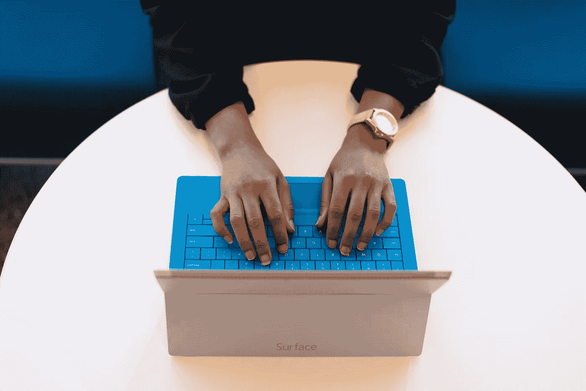

# 处理侵犯版权和剽窃

> 原文：<https://medium.com/hackernoon/dealing-with-copyright-infringement-and-plagiarism-594d4ddf3eab>

Photo by [Christina Morillo](https://www.pexels.com/@divinetechygirl) on Pexels

这是一个关于我的生活如何被颠倒的故事，我想花一分钟坐在这里，告诉你们我的一篇文章是如何被剽窃和传播的，以及我是如何设法让它被删除的。好奇吗？请继续阅读。

# 抄袭 vs 侵犯版权

抄袭。侵犯版权。两个非常相似但有关键区别的术语。

先来区分一下抄袭和侵犯版权的区别。剽窃是指拿别人的作品冒充自己的作品。然而，侵犯版权被描述为侵犯版权持有者的权利。这些权利包括:

*   生育的权利
*   发行权
*   展示或表演受保护作品的权利
*   制作衍生作品的权利

通过用他们自己的名字替换作者的名字，他们犯了剽窃。通过复制文章，通过社交媒体分发文章并在他们的博客上展示，他们侵犯了我作为版权所有者的权利，从而侵犯了版权。

# 发现

10 月份左右，我在 [dev.to](http://dev.to) 上发表了一篇关于 CSS 特异性的文章，然后提交给了 Freecodecamp 的出版物，这篇文章被接受并于 11 月中旬发表。当我在 Medium 上查看那篇文章的统计数据时，我点击了一个外部推荐，它以一种很好的列表格式组织起来。我点击 LinkedIn 链接，看看谁分享了这篇文章。在那里，我看到有人分享了这篇文章，当我仔细看时，我注意到分享的帖子

*   没有照片
*   与作者的名字不同

我点击链接，看看它会把我带到哪里，果然，它把我带到了那个人的网站，在那里，我的文章被逐字逐句地复制，没有任何提及或原始文章的反向链接。

这个人不仅未经我的允许就展示和发布我的帖子，侵犯了版权，而且他们还通过用自己的名字代替作者的名字来抢文章的功劳，从而犯了剽窃罪。

# 行动（或活动、袭击）计划

## 第一步:电子邮件/信息

我知道总有一天会发生这种事，但看到有人如此公然无视他人的努力，还是让我感到震惊。复制别人的作品是一回事，但与你网络中的其他人分享并冒充为你自己的作品是一回事？那是不能接受的。

我做的第一件事就是让我的家人和朋友知道这件事。几个大脑比一个好。朋友建议我在 LinkedIn 上举报他们侵犯版权。在此之前，我想我可以通过给他们发信息来解决这个问题。问题是，LinkedIn 不允许我这么做，这意味着如果他们接受了，我就必须联系他们，我怀疑他们会给他们发信息。我不会那么做的。相反，我在共享链接下写了一条评论，让他们知道他们侵犯了版权，并尽快删除帖子。

## 第二步:版权侵权通知表(LinkedIn)

24 小时后，没有回应。这让我别无选择，只能在 LinkedIn 上填写版权侵权通知表格。四天后，我收到了 LinkedIn 的回复，称因为“*所报道的内容不是发生在 LinkedIn 平台内。因此，我们无权处理这个问题”。*

尽管分享的内容是抄袭的，侵犯了我的版权，但是因为内容不在 LinkedIn 平台本身，他们也无能为力。

## 第三步:找到托管侵权人网站的主机提供商

很明显，这个人没有删除帖子的意图，所以下一步是找出他们的主机提供商，并给他们写一条消息，通知他们这种情况，并要求他们删除它。找到这些信息很容易——我用 https://hostingchecker.com/的[输入域名，瞧！有他们的主机提供商的名字。](https://hostingchecker.com/)

我立即去了主机提供商的网站，找到了他们的联系方式，并给他们发了电子邮件。他们马上发了一封自动邮件，说他们会给我回复。大约五个小时后，他们确实回复了我，让我填写一份关于我的投诉的表格。主机提供商是一家德国公司，所以表格是用德语写的，但是自动翻译帮助了我，所以我可以毫无问题地填写表格。

在提交表格后收到另一封自动邮件后，我等待着。一周过去了，接着又是一周。仍然没有来自主机提供商的消息。随着生活变得忙碌，又过了几个星期，但我记得几天前我没有听到任何回音。所以，我没有再给主机提供商发邮件，而是选择通过 Twitter 给他们发消息。几天后，我收到了公司市场部的回复，她说由于严格的数据隐私法，她无法查看投诉记录，所以建议我用电子邮件发送。

# 成功

我给主机提供商发了电子邮件，问他们是否能给我一个案件的更新。在几分钟内，这是难以置信的快，我收到了一个回复，说该博客帖子的网址已经被删除。我检查这是不是真的，果然，它不见了。此外，此人网站的“博客”部分，其中载有许多其他作家的文章，被删除。

# 结论

这篇文章的目的是什么？让人们意识到侵犯版权和剽窃的问题，尤其是当涉及到网络内容时。处理你的内容被剽窃和/或你的权利被侵犯的事情并不酷，而且可能会耗费时间并造成压力。花了一个多月才把抄袭的内容撤下来。通过记录这一过程，我希望这篇文章能成为任何正在处理或可能在未来处理侵犯版权和剽窃问题的人的参考点和资源。

不要抄袭或侵犯版权人/原作者的权利。人们为他们的工作付出了血、汗和泪，不要不属于你的东西却要求所有权，这是对他们的不尊重。一定要引用原作者。使用他人作品时，一定要获得许可。总是提供原始内容的反向链接。

我喜欢与他人分享我的想法、观点和经验，这不会阻止我继续这样做。但是，不用担心你的内容被复制也不错。

我很想听听你对网络内容侵犯版权和剽窃的经历。你是怎么处理的？