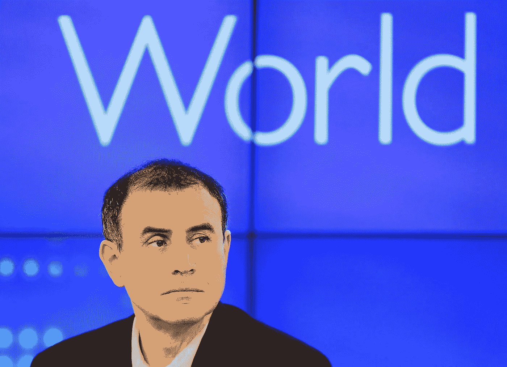

# 辩论密码批评家:努里埃尔·鲁比尼在美国参议院的证词

> 原文：<https://medium.com/hackernoon/debating-crypto-critics-nouriel-roubinis-testimony-before-the-us-senate-7cfccb74cf72>

Nouriel Roubini. Source: Wikimedia Commons

去年年底，努里埃尔·鲁比尼在美国参议院关于银行业的听证会上发言，并发表了一份只能被称为 FUD 摩押的证词——全面介绍了对比特币和加密的主要批评，并恰当地命名为[“加密是所有骗局和(现已破裂的)泡沫之母”](https://www.banking.senate.gov/imo/media/doc/Roubini%20Testimony%2010-11-18.pdf)。自从证词被公之于众后，一方面它被称赞为秘密领域的丧钟，另一方面它被认为是试图粉碎这一新现象的旧货币的恐龙。与往常一样，真相可能介于两者之间，因此，令人遗憾的是，没有就鲁比尼教授言论的是非曲直展开真正的辩论。以太坊创始人[维塔利克·布特林最初同意与鲁比尼](https://twitter.com/VitalikButerin/status/1050908938777051138)辩论，但没有可靠的计划即将出台，两人一直在推特上用[的强硬手段相互攻击。考虑到这一点，在这样的活动之前讨论他最突出的谈话要点是恰当的，至少可以有一个公平的辩论框架。证词的批评从公平到不合理不等，因此本文将只讨论他的十个最突出的主张。](https://twitter.com/VitalikButerin/status/1050103887170957312)

1.  比特币是一种糟糕的价值储存手段。它可以在一天内波动 20-30%。

这是一个不完整的句子。比特币是一种很差的价值储存手段，相比之下……到底是什么？美元？这可能是一个公平的评价，但相比之下，还有其他国家的货币看起来并不那么好。津巴布韦跃入脑海——2008 年，他们目睹了几乎 100%的日通货膨胀率。相比之下，比特币是通货紧缩的，因为最终硬币的损失速度将快于它们被开采的速度，因此至少存在这些波动将处于上升方向的可能性。

鲁比尼教授还夸大了比特币的波动性——随着 BTC 的波动性逐年下降，一天之内下跌 15%现在将是一个严重的异常值。在发达国家，15%的波动确实被认为是相当不稳定的。然而，如果 BTC 在这方面的表现优于单一国家货币，这已经是一个不可思议的成就——鲁比尼教授不承认这一事实。

**2。Crypto 充满了骗子、诈骗犯和小偷**

毫无疑问。人们只需要参观一个会议就能看到这一点。爱好者社区和在该领域工作的人经常不承认邪恶的行为者，更糟糕的是，他们会不遗余力地为他们辩护。目前尽职调查的水平严重不足——ICO 是由匿名的首席执行官完成的，他们随后携款潜逃 , [ICO 评级网站被付费提供好评](/alethena/this-is-how-easy-it-is-to-buy-ico-ratings-an-investigation-13d07e987394)，一些专注于加密的新闻网站经常无法报道退出骗局、内幕交易和明显的庞氏骗局。目前，从整体上捍卫加密货币的本能压倒了急需的犬儒主义——尤其是如果它们受到中央政府的公平监管。

**3。加密不可扩展、不分散、不安全**

Roubini 讨论了 Vitalik Buterin 的不可能的三位一体——[区块链可以是安全的，可以是分散的，可以是可扩展的，但目前它不可能同时具备这三种品质](/@viewnodes/balancing-the-impossible-trinity-f5b92f6abf15)。这是一个严重的问题，也是该领域大多数大型项目都在努力解决的问题。鲁比尼教授进一步指出，区块链不具备这些品质中的任何一项。然而，他提供的支持这一主张的证据并不完全令人信服。

首先，他认为比特币和以太坊目前还没有完全去中心化，因为它们的矿工在很大程度上位于同一个地理区域——中国北方、俄罗斯和冰岛，这些地方的电费和气温都较低。这不是中央集权，这些地方有着非常不同的政府和语言，但仍然有理由担心，特别是如果中国北方的主导地位继续下去。

为了安全起见，他假设 51%的潜在攻击发生在较小的硬币上。这种情况已经发生，最明显的是[到比特币黄金硬叉](http://fortune.com/2018/05/29/bitcoin-gold-hack/)。他推测，如果某些地区的矿池继续积累，BTC 将很容易受到矿池 51%的协调攻击，因为他们将获得比攻击成本更多数量级的法定价值。虽然这在理论上是可能的，但目前矿池的分布看起来相当健康，摧毁这样一个有利可图的企业的长期成本仍然会使其完全不合理。

最后，这两个问题实际上都是寻求可伸缩性的副产品。ASIC 矿商的军备竞赛在很大程度上是由于 BTC 价格随着时间的推移大幅上涨，这显然与购买和销售的人数也呈指数增长成正比。目前，比特币的网络是安全的，它是分散的，并且相对可扩展，尽管需要发展以确保未来更平稳的增长。

**4。加密货币被用于犯罪活动和绕过资本管制**

首先，比特币和 Monero 等加密货币肯定被用于犯罪活动，但在这些用途上取代美元还需要很长很长的时间。

至于第二点——规避资本管制——这正是鲁比尼困惑的地方，他未能理解或至少承认加密货币背后的意义。这些产品的存在是为了赋予个人财务权力，以及随之而来的所有责任。他不断提到，当硬币被盗或被盗用时，无法寻求补救——没有看到有人愿意冒这个风险来控制自己的资金。在西方民主国家，我们可能会觉得这是邪恶的，或者正如鲁比尼教授所言，是阴谋论者的领域。并不是所有的国家都对资本管制如此宽松，然而，像俄罗斯、印度和中国这样的国家对购买外币或携带本国货币出国有严格的控制。在这种情况下，加密货币是一种解放的工具。

**5。密码由富有的白人男性主导**

以防我们忘记我们正在阅读一位沿海社会科学家的话，鲁比尼提醒我们，白人是区块链革命的唯一受益者。这也许是最容易摒弃的一点——肯定没有秘密种族主义者或网络厌恶女性者的阴谋集团来决定谁能参与、谁不能参与区块链项目。任何人都可以投资，而且任何人都可以发展，即使他们选择匿名。诚然，硬币所有者以男性居多，至少如果推特上的自我报告被用作证据的话。至于为什么会这样，人们只能猜测。也许这是这种投资的风险因素，而女性通常更不喜欢这种投资，或者这可能是一个普遍的事实，即更多的计算机科学家和技术爱好者是男性。当然不存在任何障碍——当涉及到项目时，许多人都强烈要求让更多的女性加入他们的团队。鲁比尼教授建议我们强迫女性扮演这些角色吗？

至于他们的肤色，不可能看到钱包持有者的种族构成，因为该功能尚未添加到区块探险者中。我们知道，正如鲁比尼教授经常提到的那样，绝大多数采矿活动发生在中国北方，那里的人通常不被认为是白人，加密技术在日本和韩国(实际上是两个韩国)非常流行。鲁比尼教授的评论是煽动性的，也是不必要的。没有真正的证据支持任何人都受到隐性父权制的压迫。

**6。银行不会使用区块链，因为他们的公共分类账，公司也没有纳入区块链技术，尽管他们的研究**

当然可以！这是一个自由的世界——对于加密货币来说，国家或银行采用它们或它们的技术并不重要。这些产品是面向个人的，旨在让他们对自己的钱有更多的选择和控制权。如果银行采用的现有技术更有效，那么根据资本主义法则，它们应该继续使用这些平台。

在更有成效的层面上，公共/私有二元结构并不像这里所建议的那样具体。已经创建了[混合区块链的模型——例如](https://www.ey.com/en_gl/news/2018/10/ey-launches-the-world-s-first-secure-private-transactions-over-the-ethereu-public-blockchain)，一个私有的、内部的区块链向公共的区块链输出散列。这使得公司能够在内部保留交易和相关数据的完整记录，同时仍然利用像以太坊这样的现有平台。因此，如果区块链的透明性是主要问题，那就有一个解决方案，如果金融机构完全拒绝这项技术(目前似乎不是这样)，那也不是问题。

最后，鲁比尼教授认为，尽管企业在研究中投入大量资金，但它们基本上没有采纳区块链的观点。在这里，他几乎偏离了伪善的方向——它们没有被采用的原因之一正是因为不透明的监管环境，即区块链目前所处的“灰色区域”。这是一种循环推理——他向立法者谴责区块链是一个失败，因为他们缺乏企业应用，但立法者没有提供一个可供企业遵循的监管框架。将此视为对加密货币的批评既不公平也不合理。

**7。像 USD Tether 这样的稳定硬币是一个骗局，没有任何支持，用来支撑价格。**

系绳是加密货币的薛定谔的猫——直到审计发生，这些代币都是和不是由菲亚特支持的。Tether Inc .公布了银行的证明，大意是它们确实得到了美元的支持，监管机构过去也在其他地方接受了这些证明(就像他们对文克莱沃斯孪生兄弟的双子稳定硬币所做的那样)。尽管如此，发现这些稳定的硬币，特别是系绳没有支持将是灾难性的，当然系绳公司并不像期望的那样透明。

为了证实他的观点，即系绳被用来人为推高 BTC·鲁比尼的价格，他引用了约翰·格里芬和阿明·沙姆斯在[发表的一篇文章](https://papers.ssrn.com/sol3/papers.cfm?abstract_id=3195066)，这篇文章追踪了 BTC 在 2017 年和 2018 年的一些最大的系绳交易。这种交易显然会影响 Bitfinex 交易所的交易量，但操纵交易量在加密交易所(甚至在私人股票和证券交易所)也很常见。这篇文章显示了 BTC 的价格与新的系绳供应的发行有多么密切的相关性，但与往常一样，相关性并不意味着因果关系，两者都将随着市场的总体增长而上升。这篇文章没有跟踪 Tether 在 2018 年 1 月以后的供应量，但我们知道供应量在 2018 年秋季达到最高点，当时比特币的价格在 7000 美元左右。如果没有其他情况，这意味着价格没有与 USDT 的供应保持关联。

**8。加密货币没有内在价值，而法定货币肯定有，因为它们可以用来缴税。**

如果纳税能力是内在价值的决定性特征，那就不要害怕。亚利桑那州去年早些时候通过了一项法案，到 2020 年，比特币和其他货币将被接受用于纳税。按照鲁比尼教授的定义，到那时，比特币将首次拥有内在价值。

**9。加密泡沫类似于郁金香泡沫**

当郁金香的价格被炒得远远高于其基本价值时，郁金香泡沫就出现了。一枚比特币是否真的值它的交易价格，这是一个永远不会有结果的讨论。但是我们完全可以证明这是可能的。

想象一下这样一个场景，比特币获得了相对广泛的采用，许多公司需要使用比特币每天进行 1000 万美元或更多的大型国际交易。供应量固定在 2100 万，其中大部分在任何特定时间都没有流通，因此要进行交易，需要获得比特币。这种需求将需要购买大量比特币，这反过来会推高价格，而交易的美元价值保持不变。这不会发生在郁金香身上，也不会发生在其他任何花卉上。所以，是的，人们基于对未来价格的预期进行投机。但并非不可预见的是，比特币作为一种资产，未来可能会以这样的价格进行估值。

10。Crypto 还没有开发出一款杀手级应用

许多人转向比特币或其他资产作为转移手段，因为他们是掠夺性汇款市场的猎物——这些服务允许在国外工作的个人向家人汇款。这些服务的平均费用在 7.5%左右，这很难证明是合理的。根据使用的加密货币，国际转账可以以远低于 1 美元的固定费用进行。完全和永久取代汇款行业的技术已经存在，但这样做需要提高公众对区块链技术的信任和理解。

**那么，现在怎么办？**

立法者对加密货币的批准或不批准对这些项目的价值有着巨大的影响，但在阻止它们给个人带来的解放利益方面却无能为力。这些货币本质上属于政府以外的货币，立法环境会使其变得模糊，但绝不会阻止任何使用它们的途径。

这里有一个巨大的讽刺——努里埃尔·鲁比尼最出名的是他对 2008 年银行业危机的预测，这场危机使西方世界和其他许多国家的经济陷入衰退和困境。难道他看不出从金融机构和政府机构手中夺取权力有什么价值吗？经济灾难肯定会降临到硬币“霍德勒”身上——事实上，过去的一年是相当大的一年。然而，在这种情况下，这些人是他们自己垮台的建筑师，他们以远远超出合理价格的价格投机。他们没有寻求补救的中央权威，但在这方面，他们与鲁比尼教授预测的崩盘受害者没有太大区别。

这项技术的支持者也必须学会接受或至少处理一些针对这个行业的抱怨，不管这些抱怨是否有道理。对于硬币持有者来说，有一种倾向是把他们的项目当成一个受人喜爱的运动队，这与现实相去甚远。必须承认这一领域的不良行为者，也必须承认阻碍整体发展的合法实际障碍。另一种选择将把立法者引向鲁比尼教授的证词所体现的悲观前景，从长远来看，对该行业的伤害要大得多。

Viewnodes 编辑拜伦·墨菲的文章。有关 Viewnodes 提供的一些服务的信息，包括我们的 Tezos 代表，请单击[此处](https://www.viewfin.com/viewnode/tezos/#aboutus)。