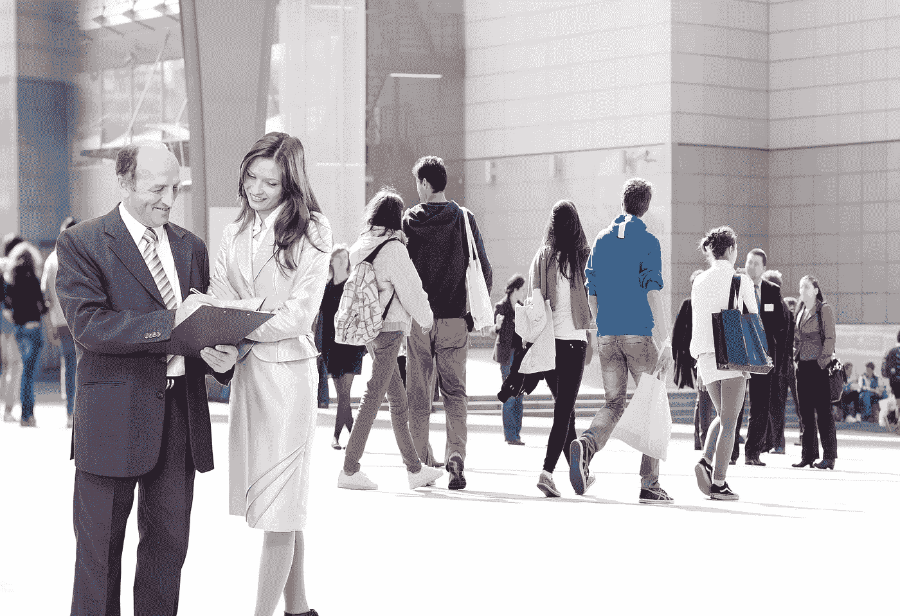

# 分散自治组织(Dao)可以为领导者提供更快的决策工具

> 原文：<https://medium.com/hackernoon/decentralized-autonomous-organizations-daos-will-enable-faster-decision-making-tools-for-leaders-49cfea72d086>

## 随着技术的进步，领导者是时候利用自动化和自主工具了吗？

我们 生活在一个科技发展速度比以往任何时候都快的世界。区块链、人工智能、DAOs 和软机器人技术是颠覆性技术被社会慢慢采用以使他们的生活更轻松的一些例子。人们可以就其夺走工作的伦理问题进行赞成或反对的争论。有一点可以肯定，现在阻止已经有点晚了，你只能顺势而为。

**历史已经表明，支持技术的实体已经取得了巨大的成果。**新加坡、韩国、以色列和爱沙尼亚是一些国家的例子，这些国家最初是创新型和技术友好型的，后来成为追赶型国家的世界技术生产国。

现在，这些国家处理软件解决方案、电子商务、网络安全和其他可以由其发明者处理的应用。今天和未来的几代人，我们正在见证一场前所未有的技术爆炸，这可以被认为是不可改变的和自主的。马耳他、直布罗陀和马绍尔群岛正在引入监管框架，为分布式总账和区块链技术的进入提供便利，但这只是我们应该关注的众多科技大趋势之一。

## ***这么多技术要处理，我的问题是*** :

> 我们有能力处理这些问题吗？算法决策者是需要考虑的吗？在很少有人理解的技术上，算法决策比人类直觉更能发挥作用吗？

在介绍一个我认为可以处理这种决策的组织的方法之前，我想让你看一个视频，看看美国国会是如何处理像谷歌这样的技术公司的。

我没有从国会拿走任何荣誉，他们在保护公民方面做了大量的工作。问题是，像这样的视频显示了这些人对过去十年已经存在和使用的技术的了解是多么的少。想象一下，当他们不得不应对比谷歌复杂得多的颠覆性技术时，比如机器学习和区块链？我们希望我们未来的领导人基于糟糕的事实、高度的自我和低下的理解力来做决定吗？技术能帮助他们做出更好的决定吗？教育在这方面起着关键作用，但让我们把它留给另一个讨论。

我想介绍一种组织方法，这种方法目前正在探索中，它可以支持如此快速的技术进步。分散自治组织(Dao)可以成为计算机 vs 计算机“战斗”的答案。

# 道斯

Dao 是算法驱动的智能合约，可以根据提供的信息执行决策，而无需分层管理。它们是分散的，从某种意义上说，在政治上，没有人控制它们，因此没有基础设施的中心故障点。(请[看看](https://www.google.com/search?q=vitalik+buterin+on+decentralziation&oq=vitalik+buterin+on+decentralziation&aqs=chrome..69i57.6309j0j4&sourceid=chrome&ie=UTF-8)维塔利克·布特林对权力下放的定义)。它们是自主的，因为计算机本身可以做出决策，将这一点与去中心化相结合，您可以最大限度地减少操纵、容错、腐败的机会，并增加一个信任、数据安全、透明和可审计的安全层。有了这么多可用的数据，DAOs 可以通过共识机制来决定哪些数据是准确的，从而做出合乎逻辑的决策。

## 传统组织结构

每个组织都有某种等级结构。有领导者、顾问、经理、合伙人和其他职位为企业、政府或组织做决策。领导者根据人力投入、对方法的理解、可用资源、研究、经验和组织优先利益来做出决策。这就是首席执行官、国会议员和法官高薪的原因。他们必须非常有见识，负责任，对自己的决定有把握，并且在某些逆境中有经验，才能前进。

这种方法的问题在于，作为人类，我们唯一的目的就是犯错误。腐败、偏好、偏见、当前的情绪状态、动机以及我们被期望理解一切的事实都是系统中的一些缺陷。**为了推动社会前进，我们必须找到对我们有利的最佳途径。**

# 优势

*   以社区为基础的决策者，而不是依赖一个人。
*   透明，因为每个决定都记录在公共账上。
*   一旦有了一套标准的规则，大多数决策都可以自动化。

# 不足之处

*   **[刀](/swlh/the-story-of-the-dao-its-history-and-consequences-71e6a8a551ee)“以太能量刀是这个模型最大的失败之一，尤其是在早期。代码中有一个漏洞，黑客可以利用这个漏洞复制资金。**
*   **对这项技术的理解和使用案例很少。**
*   **到目前为止，Dao 还没有合法的分类。**

# **Dao 的当前用例**

*   ****MakerDAO** -作为 DAI 稳定货币的分散信贷系统，用户可以借出/借入与美元挂钩的 Dai。道的成员可以通过持有 MKR 代币进行投票和管理，并根据代币的增长和成熟程度获得奖励。**
*   ****MolochDAO-** 允许成员投票决定用它的基金资助哪些项目(把它想象成一个分散的风险投资基金)。Moloch 支持以太坊生态系统，向在区块链建造 Dapps 的开发者提供资助。以太坊创始人维塔利克·布特林和约瑟夫·卢宾每人向莫洛赫道捐赠了 1000 个以太(约 25 万美元)。**
*   ****阿拉贡-** 作为一个“数字司法管辖区”，旨在使组织、企业家和投资者在没有法律关系的情况下做生意成为可能( [Messari](https://messari.io/asset/aragon-network) )。他们计划推出 Vitaliks 的愿景 [DAOICOs](https://ethresear.ch/t/explanation-of-daicos/465) ，成员自动自主地资助某些 ico 和项目。**

# **结论**

**作为一个社会，Dao 可以根据逻辑和事实做出对我们有利的即时和透明的决定。他们允许专家成员作为一个群体做出决定。与其让精通某一领域(法律)的人参与决策，为什么不让各种具有不同专长的人参与决策呢？**

**现在，有许多决策 Dao 还没有准备好。一步一个脚印会帮助我们达到目标。让我们超越评论阶段，允许基于社区的决策者！**

****最终想法:****

**我赞成技术接管我们的一些工作以提高效率，但我们需要教育社会如何利用技术，并确保没有人被落下。如果 2030 年 60%的工作岗位还不存在，我们有责任让人们为这样的未来做好准备。**

**作者梅纳杰姆·本奇莫尔。**