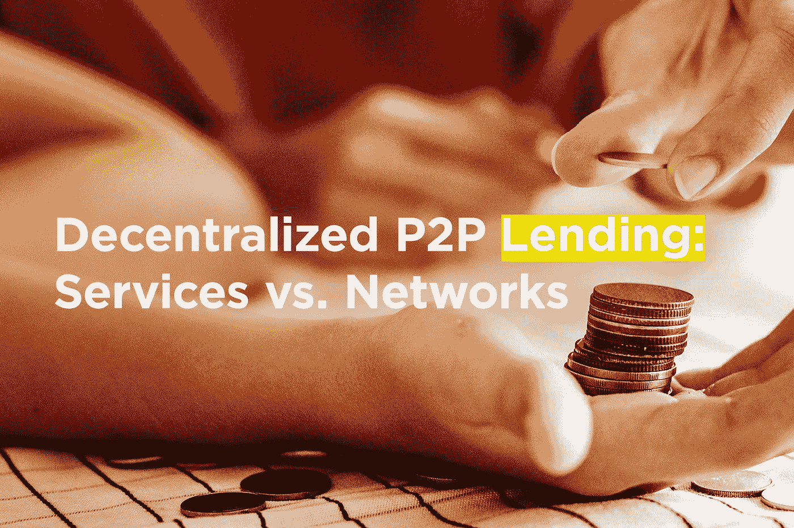

# 分散式 P2P 贷款:服务 vs .网络

> 原文：<https://medium.com/hackernoon/decentralized-p2p-lending-services-vs-networks-5484d03e2f2d>

## 在本文中，我们将关注迅速崛起的 P2P 借贷市场。我们将探索一些分散的区块链信贷服务(SALT，ETHlen 等)。)并与分散信用网络进行比较。我们将考虑这些方法在成熟和扩展 P2P 借贷概念以及利用日益增长的网络效应方面的优缺点。

*但我们将从……的简要概述开始*

## **什么是传统的 P2P 借贷？**

P2P 贷款(众筹)是一种替代性的金融体系，其本质是在不涉及传统金融中介的情况下，为个人贷款人和借款人提供一种向不相关的人或平等方贷款的方式。

这种个人贷款的方式有着悠久的历史，在世界某些地区甚至是一种文化传统。但在现代表现形式中，它通常以专门的在线平台的形式出现，将愿意贷款的人和愿意借款的人聚集在一起。由于此类网站只在网上运营，它们的固定成本更少、更低，因此提供的服务比传统金融机构更便宜。

因此，借款人可以获得比银行提供的存款和其他投资产品更高的利息，并且借款人可以获得更低利率的贷款。这甚至还考虑到了 P2P 贷款提供商本身的佣金，它收取的佣金是为借款人和贷款人牵线搭桥的服务费用，以及检查借款人信誉的服务费用。

预计到 2050 年，全球 [P2P 借贷行业年交易额将达到 1 万亿美元](https://www.nasdaq.com/article/the-rise-of-peertopeer-p2p-lending-cm685513)。

这也是创建去中心化 P2P 借贷平台的一个伟大时刻，因为越来越多的国家现在开始监管他们的 P2P 借贷行业。在美国、加拿大、澳大利亚和德国等国家(该行业已经受到监管)，这已经成为一种流行的替代融资模式。在这些国家，大约 25%的人口已经在使用分散式 P2P 贷款来借入资金。

中国(P2P 在很大程度上不受监管)和印度(直到最近，P2P 在很大程度上是自我监管的)也有一个潜在的巨大的 P2P 市场。随着越来越多的国家认识到 P2P 是一种主流的融资选择，这方面的创业公司只会看起来更好。

分散的信贷系统是一个非常有吸引力的想法，尤其是与传统的大型信贷机构相比较。但是，它也有自己先天的问题。

特别是，债权人在 P2P 贷款中的投资通常不受任何政府担保的保护。在某些服务中，放款人可能试图通过在不同借款人之间分散投资来降低总体风险，并降低坏账风险，因为他们有能力选择向其提供贷款的借款人。但是问题出现了:什么样的信息构成了做出这个选择的基础？一些 P2P 贷款服务使用外部了解你的客户(KYC)解决方案以及确定潜在借款人信用评级的解决方案。换句话说，人们必须任意依赖可信的第三方的决定。

其他问题包括本地 P2P 贷款服务在国际范围内的可扩展性有限。这与前面提到的贷款偿还担保问题以及监管问题(各国的规则和条例各不相同)有关。在加快发放贷款等方面也有工作要做。

此外，尽管 P2P 贷款平台被认为是去中心化的，但它们仍然保留了一定程度的中心化。特别地，所有记录和识别数据都由中央方存储和维护，这为人为错误或操纵留下了空间。这一点也可能阻碍平台的增长和覆盖，因为集中化使系统更容易受到地区级法规的影响。这些法规可能因国家而异，这使得事情变得更加困难。

而这只是传统 P2P 借贷服务面临的问题的一个小样本；顺便说一句，这是所有传统金融机构的特征。总的来说，它们不仅减缓了业务发展，还降低了扩展的可能性。

然而，区块链的 T1 T2 的 T3 技术有望解决大部分问题。

首先，P2P 行业固有的去中心化属性使其成为区块链的天然用例。此外，透明度、利率平等和改进的尽职调查分析使得区块链技术在 P2P 借贷行业的使用非常适合借贷双方。

## **分散信贷服务**

毫不奇怪，我们已经见证了第一批 P2P 贷款服务开始出现在区块链。让我们考虑其中的几个。我们将他们分成几个组，先从加密货币到法定货币的 P2P 贷款解决方案开始，然后再考虑纯加密货币 P2P 贷款解决方案。最后，我们将发现它们与分散式信贷网络有何不同。

# **加密货币对法定货币的 P2P 借贷解决方案**

## **盐**

SALT(安全自动借贷技术)是一个集中式加密货币信用平台。目前，SALT 是区块链贷款领域的领导者。

SALT 与众不同，它专注于由加密货币支持的机构现金贷款，而该领域的许多其他项目使用纯粹的点对点方法。然而，这两种选择都应该在市场上占有一席之地。此外，SALT 与更传统的平台竞争，这些平台提供由加密资产担保的贷款，但不使用特定的令牌。

基于此，SALT 借款人的主要优势是能够以其加密资产的安全性为担保借入法定现金，这在普通人的日常需求方面比纯粹的加密货币贷款解决方案更实用。但这也正是导致 P2P 借贷必须对其用户提出更严格的要求的原因。

首先，这项服务仅适用于美国、英国和新西兰的 33 个州的客户。因此，地球上其他地方的潜在用户被迫寻找其他(类似的)服务，正如我们上面提到的，这通常无助于扩展和互操作性。

其次，只有你是合格的投资者，你才能成为贷款人。在美国，这需要证明至少有 100 万美元的净资产。最后，SALT 将要求客户在签订服务合同之前接受 KYC / AML(了解客户/反洗钱)验证。

SALT 贷款流程与 ETHLend(见下文)的不同之处仅在于，在 SALT 系统中，加密货币支持法定货币贷款，这与 ETHLend 中纯粹基于加密货币的操作不同。在贷款条款得到同意和批准后，贷款人将向借款人的银行账户存入一笔存款(例如，美元)，而智能合同将锁定借款人的加密货币。借款人有义务定期以美元还款；如果出现违约，其加密资产将被转移到贷方。如今，这项贷款只接受以太网(ETH)和比特币(BTC)作为抵押品。

盐代币，也被称为*会员代币*，是 ERC-20 代币，用户花费它成为盐借贷平台的会员。此外，人们可以使用这些代币来偿还贷款利息，获得更好的利率，并在盐在线商店购买商品。

## **Nexo**

总的来说，Nexo 项目几乎走了 SALT 项目的老路，吸取了后者的惨痛教训。与食盐一样，Nexo 代币可以用于贴现利率和偿还贷款；它们也可以被用作抵押品，根据 Nexo 网站，它们甚至计划向持有者支付部分利润。

贷款审批过程是完全自动化的，这使得借款人可以立即收到借入的资金。Nexo 还宣布了在全球范围内发放贷款的计划，包括“至少”36 个美国州。该计划还提出了使用 ERC-20 代币作为抵押品和发行加密信用卡的可能性。

目前，存款可以用一系列加密货币进行，包括 BTC、ETH 和 NEXO。贷款偿还可以使用美元或欧元，也可以使用加密货币。

Nexo 保留根据资产的历史波动性和市场流动性自行决定改变贷款价值比率的权利。目前，贷款价值比率如下:

BTC: 50%

联邦理工学院:50%

XRP: 40%

Nexo: 30%

本质上，这意味着如果你存放 2 个比特币作为抵押，Nexo 将借给你总价值为 1 个比特币的法定货币(即你给他们的 50%)。

Nexo 贷款有一个非常简单的利率政策:16%或 8%的年利率。利率不是基于贷款的规模或期限，也不取决于借款人的信用评级。每年 16%的贷款是每个人支付的标准利率。但出于以下两种原因之一，可以降至 8%:一是借款人使用 Nexo token 作为贷款抵押的情况；第二，如果它使用 Nexo 代币偿还贷款。Nexo 利息不计复利，每天从借款人账户中收取。在贷款期限内没有应付利息，因此借款人在贷款未偿还时不需要偿还任何款项。

服务的好处:Nexo 借贷模式没有费用，利率固定。这提供了相对于食盐的竞争优势，并提供了一定的稳定性以应对市场波动。

缺点:虽然该公司声称提供 8%的贷款，但实际上，这只是一种宣传噱头。在大多数情况下，实际数字平均要大一倍。

## **里皮奥**

阿根廷初创公司 Ripio 已经为阿根廷、巴西和墨西哥的 20 多万用户提供了 P2P 小额贷款。在 2017 年 ICO 期间吸引了 3700 万美元后，Ripio 成为了罕见的品种之一:一家拥有实际工作金融产品的加密公司。ICO 筹集的资金被用于创建自己的 P2P 贷款服务，该服务使用智能合同有效地连接世界各地的个人借款人和贷款人。

目前的计划是在测试后全面部署小额贷款服务，在测试中，阿根廷有 800 多名客户获得了贷款。Ripio 现在声称，已经有数千家贷款机构通过他们的平台发放当地法定货币贷款，相当于 150 至 750 美元。这些贷款人主要来自亚洲大陆，他们帮助资助整个南美洲的人们。

与最相似的借贷和交换服务不同，加密货币的无银行用户可以访问新的 Ripio 借贷服务。众所周知，南美市场与金融业的关系非常复杂。例如，世界银行最近的报告显示，高达 54%的哥伦比亚成年人不使用银行服务，在巴西高达 30%。Ripio 的内部调查发现，19%的用户没有信用卡。他们利用便利店存钱并给钱包充值。然而，由于 Ripio 信用服务，这些人现在有机会保留他们债务支付的永久记录，这可以帮助他们在未来接受其他金融服务。

Ripio 计划将其服务扩展到乌拉圭、智利和哥伦比亚的市场，尽管这取决于克服各种当地监管限制。与此同时，政治和经济不稳定、不透明的监管环境和安全问题阻止了该服务进入委内瑞拉市场。

尽管借款人以法定货币获得小额贷款，但 Ripio 服务有自己的标志——RCN 支持。贷方使用 RCN 发送贷款。此时，所有相关方都会得到一份分成，包括信用评级代理、身份验证服务、*联署人*等。，在 Ripio 最终将其转换回菲亚特，然后将资金交付给特定的借款人之前。

*联署人*是一种保护贷款人免于坏账的安全功能:借款人的担保人。这改进了合同条款，并保留了对借款人当地法律制度的利用，在债务人违约的情况下确保了贷款。

总的来说，这种服务非常灵活地解决了特定地区的具体问题，这是其毋庸置疑的优势。这个解决方案在该地区以外的适用性如何，以及它的全球可扩展性如何，这个问题仍然没有定论。

## **方块图**

P2P 借贷竞赛的另一个参与者 BlockFi 是最近进入者，负担要小得多。与其他平台不同，BlockFi 没有进行 ICO:所有融资都是由机构投资者进行的。BlockFi 的一名代表表示:“在我们的平台上，从这些观众那里筹集资金需要严格的要求和勤奋。”。“这要求我们成为该领域最值得信赖和可靠的贷款人。”

由于没有最初的硬币发行，BlockFi 令牌也不存在。BlockFi 表示，这让他们避免了另一个加密资产的问题:“在贷款业务模式中，根本不需要实用令牌。拥有一个会造成利益冲突和混乱的用户体验。”

该公司正积极向新的管辖区扩张。它最近进入了加利福尼亚州和马里兰州，总共在美国 45 个州提供服务。

优势包括该公司提供市场上最低的价格。贷款速度很快，年利率约为 13%，可以提供约 35%的杠杆作用。

缺点:这家公司无耻地集权。不像盐，他们不匹配贷款人和借款人；BlockFi 是贷方。

# **加密货币对法定货币的 P2P 贷款解决方案的一般缺点**

总体而言，加密货币到法定货币的贷款解决方案更像传统的半集中式 P2P 贷款服务，几乎具有所有相关的问题和缺点。事实上，他们在客户之间的借贷交易中充当第三方和托管人。与普通 P2P 借贷服务的唯一区别是，它们不限制用户与 fiat 合作，而是方便使用加密货币，还可以使用自己的令牌进行各种服务和对客户的额外激励。另一方面，加密货币抵押品获得现金的能力是一个非常有吸引力的选择，目前在现实生活中比纯加密货币贷款更有需求。

## **纯加密货币 P2P 借贷解决方案**

**埃瑟伦**

ETHlend 也是一个去中心化的加密货币信用平台，但是，与 SALT 和 Nexio 不同，它完全通过以太坊智能合约来运营。因此，ETHlend 从不存储用户的资金或资产。此外，这意味着在通过 ETHlend 订立合同时，借贷双方只能使用 ETH 或基于 ETH 的资产(例如 ERC-20 令牌)，如 OmiseGo、Augur 等。

这或许是纯加密货币生态系统的最大劣势。我们中的大多数人仍然以法定货币进行交易，并且很可能希望获得以法定货币支付的贷款:美元、欧元或其他一些当地货币。但是，当然，我们应该记住，通过增加法定货币，我们增加了中央集权的程度，这既有积极的一面，也有消极的一面。

另一方面，一个完全分散的加密货币生态系统很可能不会遵守一个国家或一个州的大多数法律。然而，它将为全世界的人们创造一个更容易使用的系统。

ETHlend 的贷款流程非常简单。

在创建智能合同时，ETHLend 要求借款人发送 ERC-20 兼容令牌或以太坊名称服务(ens)域，作为在借款人违约时 ETH 贷款的抵押品。目前，只有借款人可以为 ETHLend 创建贷款申请。要提出贷款请求，借款人必须建立数据，如贷款期限、利率和抵押品所需的令牌数。如果贷方同意这些条件，将创建贷款协议，贷方将能够发送其 ETH。

此外，借款人根据合同偿还债务，加上贷款利息，将它们发送到智能合同。贷方从智能合约中收到其 ETH 和利息，质押令牌被解锁并发还给借方。在借款人无法偿还贷款的情况下，贷款人将收到借款人以代币形式公布的担保，贷款人可以酌情处置这些担保。

ETHLend LEND token 是一种 ERC-20 兼容令牌，作为预售优惠和 ICO 的一部分出售。借出令牌在 dApp 中执行几个重要的功能。特别是，与通过以太坊支付相比，LEND tokens 的用户将获得 25%的平台费用折扣。虽然 LEND tokens 可以在硬币交易所买卖，但 LEND 的主要用途是在支付部署 ETHLend dApp 的费用时提供折扣。

季度空投将分发到积极的贷款人和借款人。ETHLend 计划将 20%的分散费用用于申请从市场上购买贷款，并在 ETHLend 上的所有贷款人和借款人之间分配这笔贷款。空投将用于提高用户接受度，以及增加贷款量。此外，ETHLend 上的特定服务只能通过 Lend 购买。这些服务的例子是特色贷款列表，以及电子邮件营销活动。最后，ETHLend 计划额外使用 Lend 来奖励贷款人和借款人，他们邀请新成员加入分散式贷款平台(推荐奖金)。

ETHLend 还计划在未来向其用户提供无担保贷款，即借款人不提供任何抵押品的贷款。这种贷款对贷方来说风险更大。为了帮助贷款人应对评估无担保贷款潜在风险的困难，ETHLend 计划为其所有用户创建一个分散的信用评级。简而言之，随着时间的推移，ETHlend 借款人将能够建立自己的声誉，因为他们成功地偿还了贷款。

每个承租人将有一个分散的信用评级从几个数据源创建。这些信用评级的主要数据来源将是信用令牌(CRE)，它将由 ETHLend 自己发行。信用代币是一种特殊的 ERC 20 代币，专门用于在 ETHLend 上代表借款人的信誉。这些代币不能交换，甚至不能转移到另一个地址。与用户帐户关联的信用令牌越多，该帐户就越可靠。用户每成功偿还 1 笔借出的 ETH，将获得 0.1 CRE。此外，ETHLend 计划从无法偿还贷款的账户中“烧掉”信用代币。一个有大量信用额度的用户将能够获得贷款，而另一个信用额度低的用户则无法获得贷款。CRE 金额较高的用户将获得更高的利率，并且与 CRE 金额较低的用户相比，还需要为类似贷款提供更低水平的抵押品。

基于信誉的贷款将允许 ETHlend 向用户介绍无担保贷款的概念，并为潜在的贷款人提供更多信息。此外，ETHLend 计划为用户提供向其他区块链广播其分散信用评级的机会。然后，借款人将能够在其他生态系统的应用程序中使用他们应得的信用评级。

但无论如何，ETHlend 服务仍将封闭在以太坊生态系统中。

**Elix**

Elix 是另一个基于以太坊的借贷、众筹和支付平台。开发者主要关注移动平台和可用性，以便从一开始就吸引尽可能多的用户。

我们在这里不考虑这个解决方案的支付和众筹功能，而只关注它的贷款方面。

该系统的独特之处在于，Elix 提供了一个基于借贷双方相互激励的点对点贷款计划。在传统的信贷系统中，借款人通过一系列分期付款向贷款人付款。除了偿还贷款金额本身，这些分期付款还包括贷款条款中规定的利率。除了与收债人打交道的风险之外，这种制度没有为借款人提供任何额外的激励来按时偿还债务。

在 Elix 中，贷款人和借款人都受到系统的激励，以满足贷款条款。在申请贷款时，参与者可以选择一个挖掘期，以便在贷款完全偿还后获得额外奖励。如果启用此选项，贷方必须在系统中的某段时间内将 ELIX 令牌放在钱包中(类似于[赌注凭证](/geoprotocol/evolution-of-consensus-mechanisms-from-classical-methods-to-local-consensus-4e29959ecf9a))。当保留期结束时，Elix 系统会以新代币“代币 P”的形式发放奖励(该代币将来很可能会有不同的名称)。

如果借款人按时还贷，奖励在获得 65%的贷款人和获得 35%的借款人之间平分。如果借款人逾期付款，贷款人将获得 100%的费用。

Token P 将有一个固定的最大供应量，该团队希望在短短几十年内实现这一供应量。

ETHLend(见上图)大概是 Elix 在 P2P 借贷行业最大的竞争对手。ETHLend 支持更广泛的加密货币，用户可以借用，但没有像 Elix 提供的奖励计划。

**制造者刀**

在过去的几个月里，创客道生态系统稳步增长，而 ETH 的价格则有所下降。今天发行的债务总额超过 7600 万美元，有 200 多万埃特(按发稿时的汇率计算，价值超过 2 亿美元)作为抵押。这意味着每发行 1 美元的戴，就有 3 美元的瑞士法郎作为抵押品。这样做是为了补偿 ETH 的波动性。

创客道是以太坊生态系统中最有价值的 dApps 之一，由于其去中心化的管理架构而获得了成功。得益于一个相当复杂的智能合约系统，用户可以借用与美元绑定的 Dai 代币，并以 ETH 作为抵押品。

CDP(抵押债务头寸)是一种智能合约，允许以 ETH 作为抵押创建新的 Dai 令牌。如果 ETH 价格跌破抵押品的价格水平，则头寸被清算，用户保留借入的 Dai 令牌。CDP 越来越受欢迎；尽管经历了熊市，但创客道平台上的 CDP 总数在过去四个月里增长了 300%。

CDP 对普通借款人和秘密投机者都有利有几个原因。

首先，作为一种常规贷款:就像人们用自己的房子或黄金借钱一样，人们可以用以太坊作为抵押，借入与美元挂钩的戴。但不同的是，这个过程是自动化的，而且由于 ETH 的易变性，风险也更大。

其次，这些是杠杆头寸:你可以借入戴，用它来买入更多的 ETH。比如说你拿 15 ETH，开 CDP 得到戴值 10 ETH。现在，如果你用借来的 DAI 买入 ETH，那么你的敞口就变成了 25 ETH，而不是 15。但这显然与价格大幅下跌时的平仓风险有关。

第三，作为套利令牌:假设你持有 ETH。现在，你不用平仓，只要借戴，用它去买别的代币就行了。如果代币的表现优于 ETH，您可以出售部分资产并赎回您的 ETH，同时保留您购买的多余代币和您的原始 ETH。

创客道生态系统由创客(MKR) token 管理。它的市值高达 3 . 13 亿美元，是最有价值的 ERC 20 代币之一。

总的来说，刀客有几个应用，主要是他们的稳定币。但是贷款功能也很重要。尽管如此，它仍然只是一个纯粹的加密贷款服务；此外，这项服务事实上“被困”在一个单一的区块链生态系统(以太坊)中。

# **基于区块链的解决方案的缺点**

正如我们所看到的，分散式 P2P 贷款解决方案市场正逐渐被基于区块链技术的项目所填充。然而，所有这些解决方案都有许多不可能(或者至少难以克服)的限制。

一个主要的限制是，这些解决方案中的大多数都“封闭”在一个单一的加密货币/区块链生态系统中(特别是以太坊)。但是，即使这些贷款服务中的一些与几种不同的加密资产一起工作，它们的种类也往往局限于几个最受欢迎的。此外，大多数服务试图将他们的用户与他们的本地令牌联系起来——这有助于这些系统的排他性，而不是它们的开放性。因此，在这些情况下，我们可以忽略任何网络效应、严重的可伸缩性或建立或多或少的全球网络的可能性。

换句话说，基于区块链的分散式 P2P 贷款解决方案继承了基本的第一层区块链项目(比特币、以太坊等)的所有相同问题。这些问题还包括缺乏[事务原子性](https://dailyhodl.com/2018/12/15/new-approaches-to-solving-atomicity-problems-in-distributed-databases-and-off-chain-networks/)(在涉及跨链事务的情况下，或者存在法定到加密的事务)。

## **分散信用网络**

与分散式信贷服务不同，[分散式信贷网络](https://www2012.universite-lyon.fr/proceedings/proceedings/p559.pdf)不仅可以克服上述基于区块链的服务的缺点，还可以显著扩大向现有和潜在用户(包括企业)提供的机会。

分散信贷服务和分散信贷网络之间的主要区别在于，后者除了确保更大的可扩展性和互操作性之外，还提供了信任的传递性。这些服务必须依靠第三方(尤其是评估借款人的信用)。相比之下，可传递信任网络中的每个网络成员都与其他用户建立自己的信任关系。通过行动，他/她评估和权衡所有的风险。同时，其他参与者可以使用它的信用额度(例如，在进行多跳支付等时。).一个不诚实的参与者与其他网络成员的信任线会更少，或者实际上根本没有。因此[信用网络的自我调节](https://www.usenix.org/legacy/events/netecon10/tech/full_papers/Dandekar.pdf)将在不需要第三方额外参与的情况下发生。

所有这一切都是因为它们采用了特殊的技术解决方案。

## **诚信网络**

Trustlines Network 是一个基于以太坊的 P2P 平台，用于创建 IOU 网络。基于 Ryan Fugger 在 2004 年提出的 Ripple 的原始概念，Trustlines 网络将允许用户创造货币并在他们之间进行安全支付。高层次的想法是，个人为他们信任的人提供信用，并且只提供他们认为公平的金额。这种提供的信用是对任何信任债权人的人都有效的钱。因此，在某种意义上，Trustlines 网络就像当前基于信用的货币系统，但不仅仅是银行，任何人都可以成为债权人。

因为系统的可伸缩性依赖于良好连接的用户，所以用户被激励建立尽可能多的连接。这是通过在每笔交易中包含少量容量费来实现的，该容量费支付给作为连接两个终端节点的中间人的用户/节点。除了容量费之外，还有中继费(下面有关于中继的更多信息)、不平衡费(为使用的信用额度增加不平衡的费用)和以太坊交易费。可选地，用户还可以为他们的任何债务人添加利率。

使用相关的货币网络令牌工厂智能合约，在 Trustlines 网络生态系统中可以有任意数量的货币网络。因此，不存在单一的“信用额度令牌”，而是任意数量的共存货币，它们仅共享信用额度网络平台，被称为信用额度货币。从赫尔辛基的角度来看，这种动态借据网络本质上意味着，这座城市应该充当某种中央银行。

这个想法很有前途，但是 TN 仍然只局限于以太坊平台，这严重限制了这个解决方案的通用性和可伸缩性。

## [**地理协议**](https://geoprotocol.io/#overview)

GEO 协议是用于价值转移的分散式 P2P 协议。基本的想法非常类似于 Trustlines 网络的想法(或者更确切地说， [Ryan Fugger 最初的 Ripple 想法](http://ripple.ryanfugger.com))。但是，与 TN 不同，GEO 有一个更全球化的方法来解决这个问题——此外，它不依赖于以太坊或任何其他第 1 层区块链。

GEO 是第 3 层协议解决方案，其主要目标之一是解决各种加密货币和区块链生态系统的互操作性问题，以及将它们与传统金融系统互连。换句话说，GEO 协议的开发者给自己设定的任务是提供创造所谓的*价值互联网*的可能性:一个将所有可能的价值载体及其转移系统联合成一个单一的全球价值交换网络的通用系统。

正如您所看到的，这个任务比本文中考虑的要广泛得多。然而，GEO 协议也能够基于其技术创建许多用例，其中之一是分散式 P2P 信用网络:在该网络中，每个用户都可以定义、创建和维护他们自己的信用链接。

GEO 协议技术的其他优势包括:

*   [提供所有支付(包括跨链支付)的原子性](/geoprotocol/how-to-be-sure-that-your-transfer-is-through-d9828a605b79)。
*   自动查找没有直接信用链接的节点之间的支付路径，并确定这些路径的最大支付(最大流量)能力。
*   允许自动清算相互债务(查找并结束几个网络参与者之间的债务循环—最多 6 跳)。
*   离线和区块链不可知协议。
*   [直接参与特定支付的节点之间的本地共识](/geoprotocol/evolution-of-consensus-mechanisms-from-classical-methods-to-local-consensus-b38ca0d3d9f2)；基于观察者的解决可能冲突的独特系统。
*   增强的隐私性(所有关于连接和支付的信息都存储在本地节点上)，加上协议中使用了[后量子加密](https://www.livebitcoinnews.com/blockchain-cryptography-and-the-quantum-threat/)。

## **达摩协议**

达摩协议也是一个协议解决方案，但着眼于广义上的债务令牌化。该项目计划通过标准化发行、认证和管理令牌化债务的流程来实现这一目标。

早些时候，达摩开发团队试图为特定类型的债务实现单独的解决方案，但后来意识到需要创建一个全球通用的解决方案，这就是他们开始做的。

可能的用例是基于 Dharma 协议构建以下专门的解决方案，例如:

*   象征性市政债券:市政当局通常通过发行市政债券为公共基础设施项目融资。使用开放债务标准，市政当局，无论大小，都可以通过类似于 ICO 的过程直接向其公民出售令牌化债券。
*   分散保证金贷款:健康的金融体系既需要投机者，也需要怀疑者，因此买卖保证金是任何流动性金融市场的基本组成部分。使用开放债务标准，可以使用智能合约和价格反馈神谕建立点对点保证金贷款计划。
*   象征性的 SAFT:项目经常筹集惊人数量的资金，以资助他们最终象征性的出售被称为 saft 的车辆。通过开放的债务标准，SAFT 协议可以作为通用债务令牌进行令牌化，其中预期还款以即将部署的协议令牌为单位进行定义。

所以，达摩是一个有趣的项目，它用适当的方法来解决特定的问题。但他们渴望解决的正是这个特殊的问题，而不是处理更广泛的目标。然而，这个项目可以大大有助于这些更广泛的任务。

## **结论**

只有当分散式 P2P 贷款解决方案不仅仅成为服务，而是成为网络(或者更广泛的全球网络的一个组成部分)时，它们的真正力量才会得到认可。那么，实际上这些系统最初的想法就会完全实现，它们对每个人的效用都会随着网络中借贷者的数量成比例增加([网络效应](https://en.wikipedia.org/wiki/Network_effect))。

任何(很大程度上或完全)集中的服务，或其与任何现有生态系统的绑定(或创建自己的、封闭的和/或与其他生态系统无关的生态系统)，都只是权宜之计。这将是试图限制和优先考虑什么应该是开放的，无国界的，所有人都可以访问的。

目前，到目前为止，大多数现有的解决方案或多或少地代表了我们刚刚提到的这些相同的不彻底的措施。然而， [GEO Protocol](https://geoprotocol.io/) 等技术的出现，为释放分散信贷网络的全部潜力提供了机会。

## 遵循 GEO 协议:

【[传媒](https://medium.com/geoprotocol/) | [推特](https://twitter.com/geo_protocol)|[GitHub](https://github.com/geo-protocol)|[Gitter](https://gitter.im/GEO_Protocol/)|[电报](https://t.me/geoprotocol)|[LinkedIn](https://www.linkedin.com/company/geoprotocol/)|[YouTube](https://www.youtube.com/channel/UC3jEvQvZAmCUXa7dCoX9_Lg/)