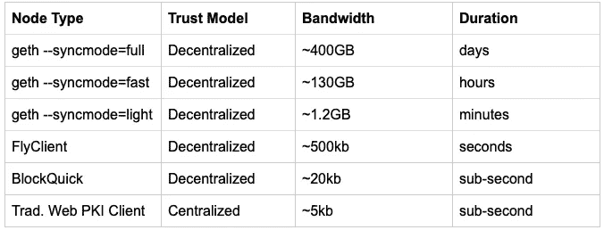

# 分散公钥基础设施(DPKI):它是什么？为什么重要？

> 原文：<https://medium.com/hackernoon/decentralized-public-key-infrastructure-dpki-what-is-it-and-why-does-it-matter-babee9d88579>

Photo by [Burst](https://unsplash.com/photos/kUqqaRjJuw0?utm_source=unsplash&utm_medium=referral&utm_content=creditCopyText) on [Unsplash](https://unsplash.com/search/photos/laptop?utm_source=unsplash&utm_medium=referral&utm_content=creditCopyText)

您可能听说过术语分散公钥基础设施(DPKI)。但你可能不知道它是什么，也不知道它是如何工作的，更不知道它为什么如此重要。

在本帖中，我们将研究传统集中式 PKI 的当前方法，探索分散式公钥基础设施(d PKI)的基础，然后展示在行业过渡到下一代 PKI 时，位于区块链的 DPKI 如何产生影响。

## 什么是集中式 PKI？

在当今世界，最常用的[公钥基础设施(PKI)](https://en.wikipedia.org/wiki/Public_key_infrastructure)方法是 Web PKI。这是一个基于[认证中心(CA)](https://en.wikipedia.org/wiki/Certificate_authority) 的系统，采用了一个集中的信任基础设施。通过安全传递公钥和相应的私钥来保护因特网上的通信。

第三方(如 ca)负责促进公钥的认证和分发。CA 的作用是作为可信的第三方，为用户网络分发和管理数字证书。大多数 web 服务都是通过创建由 CAs 签名的密钥来保护的。

## 集中式 PKI 的问题

集中式 PKI(例如基于 CA 的系统)通常有其问题和局限性，因为它依赖于中央信任方。在集中式 PKI 系统中，你不能选择自己的在线身份；相反，你的身份是由可信的第三方 ca 来定义的，有时是私人公司，有时是政府。

这是一个大问题，因为它为攻击者实施 MITM(中间人)攻击敞开了大门。目前，全球约有 3，675 个可信 ca 已成为网络犯罪分子的诱人目标。这几千个人中的每一个都有能力为你创造不同的身份。

MITM 攻击有不同的形式— ARP 欺骗、IP 欺骗、DNS 欺骗、HTTPS 欺骗和浏览器中间人(MITB)等等。大量事件已经表明，如果过于信任 CAs，就会增加 MITM 攻击的风险。

实际上，攻击者可以欺骗 CA，让它认为他们是其他人，或者他们甚至可以危及 CA 的安全，让它签发一个流氓证书。例如，2011 年发生的 [DigiNotar](https://www.theguardian.com/technology/2011/sep/05/diginotar-certificate-hack-cyberwar) 事件，由于一次攻击，荷兰认证机构公司发布了欺诈性证书。

另一起事件发生在 2017 年，黑客控制了[巴西银行](https://www.wired.com/2017/04/hackers-hijacked-banks-entire-online-operation/)的 DNS 服务器，并诱骗 CA 向其发放有效证书。

负责 Web PKI 本身的互联网工程任务组(IETF)已经创建了一个描述当前 PKI 问题的[备忘录](https://tools.ietf.org/html/draft-iab-web-pki-problems-01#section-3.2.1)；独立地，围绕重启信任网的一组研究人员(包括 Vitalik Buterin)在他们的[出版物](https://danubetech.com/download/dpki.pdf)中评估了它的弱点，所有人都同意当前 Web PKI 的实现存在不应被忽视的问题。

过时的 PKI 设计带来了很高的安全风险，因为单点故障可以用来打开任何加密的在线通信。集中式 PKI 系统正在努力跟上不断发展的数字景观；现代世界迫切需要一种设计更好的、分散的 PKI 方法。

## 分散式 PKI (DPKI)

分散式公钥基础设施(DPKI)是设计更好的 PKI 系统的另一种方法。Phil Zimmermann 开发的加密程序 Pretty Good Privacy (PGP) 是一个去中心化的信任系统，它是在区块链不存在的时候创建的。

在各方之间建立信任关系存在问题。但是今天已经不需要第三方了。区块链是一种构建更强大、更安全的 PKI 系统的新方法。

但是区块链将如何改进 PKI 呢？在分散的 PKI 中，区块链充当分散的键值存储。它能够保护读取的数据以防止 MITM 攻击，并最小化第三方的力量。通过将区块链技术的力量引入系统，DPKI 解决了传统 PKI 系统的问题。

管理框架的分散性质可以通过证书撤销、消除单点故障以及对滥用 CA 做出快速反应来解决 CA 系统的问题。区块链能够使过程透明、不可改变，并防止攻击者闯入，从而有效避免 MITM 攻击。

2015 年，Allen 等人在一篇名为“[分散公钥基础设施](https://danubetech.com/download/dpki.pdf)的出版物中探索到，与传统方法不同，DPKI 确保没有任何单一第三方可以损害整个系统的完整性和安全性。在区块链驱动的 DPKI 中，新的第三方成为挖掘者或验证者。

信任是基于共识协议建立和维护的。第三方，即挖掘者或验证者，将必须遵循协议的规则，这将在经济上奖励和惩罚这些第三方，以有效地防止区块链中的不当行为并限制他们的角色。

“信任是通过使用技术分散的，这些技术使地理上和政治上完全不同的实体能够就共享数据库的状态达成共识，”作者在 2015 年的论文中写道，“区块链允许将公钥等任意数据分配给这些标识符，并允许这些值以安全的方式在全球范围内可读，不会受到 PKI 中可能存在的 MITM 攻击的影响。”

此外，研究人员认为，密钥管理的逻辑可以在区块链的智能合约上实现，而 Sivakumar P 和 Kunwar Singh 博士在 2017 年发表的“[基于隐私的分散式公钥基础设施(PKI)实现使用区块链中的智能合约](https://isrdc.iitb.ac.in/blockchain/workshops/2017-iitb/papers/paper-11%20-%20Decentralized%20PKI%20in%20blockchain%20and%20Smart%20contract.pdf)”已经成功实现。

然而，区块链还不完美，因为它需要一个设备来同步共识数据的完整副本。今天的 [Geth (Go-Ethereum)](https://geth.ethereum.org/) 客户端提供多种类型的同步模式:完全同步、快速同步、轻度同步。[二极管](https://diode.io/)，一个台湾和美国的区块链倡议，最近开发了一个名为 BlockQuick 的轻客户端协议，旨在建立低带宽的分散信任。

下表比较了 Geth、FlyClient、BlockQuick 和传统 Web PKI 客户端的不同类型的同步模式、信任模型、带宽和持续时间。

如表所示，Geth 客户端的标准同步占用高达 400GB 的磁盘空间，与标准 TLS 证书握手所需的大约 5kb 的传统 Web PKI 客户端相比，这是一个巨大的用户体验降级。此外，400GB 对物联网设备提出了过高的要求，这些设备通常受到资源限制，计算能力有限。

PKI 的转变是不可避免的，而且看起来正在加速。这是一个很好的时机，开始增加努力创造 PKI 的意识，并帮助更多的人导航快速移动的数字景观。