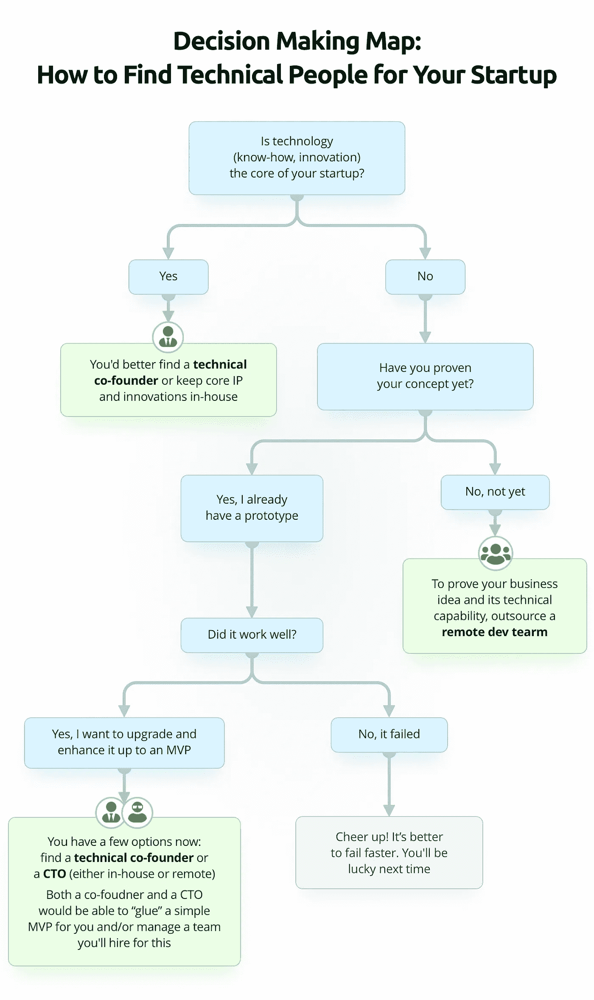

# 决策图:如何为你的初创公司雇佣合适的技术人员

> 原文：<https://medium.com/hackernoon/decision-making-map-how-to-hire-the-right-technical-people-for-your-startup-94c412aae526>

如果你的初创公司需要技术人员，有多种招聘方式可供选择:寻找技术型联合创始人或首席技术官、专门的内部开发团队或偏远的 R&D 机构。让我们来看看你的创业阶段如何影响最终的招聘决定。

一个成功的科技创业公司不仅仅是一个伟大的想法解决了一个真正的商业挑战。它也是关于在软件方面实现解决方案的逻辑。对于创业者来说，技术，或者更确切地说是想法的技术实现，是生死攸关的问题。没有它，这个想法往往注定要失败。这就是为什么没有技术背景的初创公司创始人——创意人员——通常会找人来承担技术职能。创业公司需要团队中有技术人员的另一个原因是融资。从投资者的角度来看，单枪匹马的非技术型创始人更有可能失败。

让我们弄清楚一个想法有哪些选择，一个家伙必须让技术人员参与进来。

# 创业公司的招聘选择

第一次创业的创始人很少知道如何开始他们的数字产品开发(至少，从 Logicify 的第一手经验来看)。这是你的案子吗？如果是这样，那么你肯定需要一个有经验的技术合作伙伴来帮助你开始。这个人(或者一个团队)将帮助你表述这个想法的核心，将业务逻辑翻译成特定范围的功能，并为最小可行产品(MVP)删减核心特性。

如果你不知道如何开始你的产品，在 [Logicify](http://logicify.com) 阶段，我们通常会率先进行所谓的“发现阶段”——用技术术语解释你的商业想法，并确定未来数字产品的范围。[如果你想开始，请联系](https://www.logicify.com/en/contact-us/)我们。

创业公司没有通用的招聘方法，所以要确保你的招聘方法是经过深思熟虑的，并且特别适合你的创业需要。

Decision making map for a non-technical startup founder

注意外面的各种选择。你可以雇佣一个**技术联合创始人**，一个内部**首席技术官**或者**软件架构师**，一个专门的内部矿远程**软件开发团队**，或者一个 **R & D 机构**。

还有一些招聘来源。你可以依靠推荐或在线平台寻找员工，当地的合作空间或创业人群，社交媒体渠道，如 LinkedIn 或脸书社区，专门列出软件商店的目录(Clutch，AngelList 等)，或自由职业者平台。

# 创业公司招聘的特点

在我们继续讨论可能的招聘方案之前，让我们花一分钟来认识一下创业公司招聘过程的特殊性。

1.  在选择招聘方式时，注意你的初创公司所处的阶段和需求:

*   要快速“粘合”一个 MVP，一个创意人几乎不需要一个全职的联合创始人或首席技术官
*   对于应用程序版本 1.0(假设您已经有了一个基本的规范)，通常将实现外包给一个具有不同技能的团队就足够了(UI/UX 设计师、后端和前端开发人员、质量保证专家)
*   为了扩展并逐步增加 2.0 及以上版本的功能，startupper 很可能需要一个专门的团队在内部或远程工作。

2.无论这对创意人员来说是好消息还是坏消息，他们将被迫学习至少一些技术知识和产品生命周期，以控制开发过程——什么是“敏捷开发”,未来应用的技术堆栈和软件架构是什么，已经/将要使用哪些第三方集成。

3.如果你的初创公司是围绕技术创新或技术诀窍建立的，你最好将核心知识产权保留在公司内部(在联合创始人或首席技术官内部)。不要与雇佣的承包商甚至内部团队分享你的创新，以防止可能的知识产权侵犯和[你的想法被窃取](https://www.logicify.com/en/blog/prevent-developers-from-stealing-startup-idea/)。

# 找一个技术型的联合创始人

对于一个人来说，经营任何企业，包括创业，都是一项艰巨的任务。有一个联合创始人真的很有帮助，尤其是如果你们互补彼此的技能并分担责任的话:你是一个商业和营销人员，而你的联合创始人是一个技术人员。

## 去哪里找技术联合创始人

*   专门的在线平台，如 oFoundersLab 或 AngelList，其主要目的是联系企业家
*   面向初创企业的社交媒体社区，例如联合创始人的[子网站](https://www.reddit.com/r/cofounder/)，脸书和 LinkedIn 群组
*   创业人群的线下活动

## 雇佣联合创始人的好处

*   如果你幸运地找到了一个真正优秀的联合创始人，你总会有一个人可以依靠
*   如今，单枪匹马的创始人不会向四面八方飞奔。每位联合创始人都专注于自己的强项和领域专长
*   一个技术型的联合创始人会成为一个在商业和技术之间架起桥梁的人，这通常是成功的关键
*   有了联合创始人，idea-guy 有更大的机会成功(两个人比一个人好)并筹集资金，因为投资者关心他们投资的公司的安全性和可预测性。

## 雇佣联合创始人的缺点

*   不是每个创业公司都需要一个技术型的联合创始人。这当然取决于它的价值主张和竞争优势，即一个“创意人”能否独自统治它
*   找一个技术专家说起来容易做起来难。工程师的工资确实很高，所以他们通常没有动力辞去轻松的公司职位去加入一家初创公司
*   共同创办意味着分享股权和总利润
*   与一个你不喜欢的人建立业务关系总是有风险的。成功企业的一个关键组成部分是人际关系，这通常需要时间和努力来培养。

解决方法:如果技术是你创业的核心，并且/或者你已经准备好分享股权，那么找一个技术型的联合创始人通常是一个聪明的主意。但是，在找第二个之前，你最好先证明你的经营理念。

# 聘请首席技术官

技术总监，或首席技术官(CTO)，是初创企业中一个重要且责任重大的职位。担任这一职位的人应该具有出色的技术技能，多年的行业经验，并对业务与软件在哪里以及如何保持一致有着深刻的理解，反之亦然。

## 去哪里找 CTO

*   你的职业网络
*   求职网站或招聘机构(尽管这些对初创公司来说通常太贵了)
*   网络和商务社交平台，如 LinkedIn
*   拥有“首席技术官即服务”选项的软件 R&D 公司。这些可以在 Clutch.co、Goodfirms.com 等在线平台上找到
*   创业创始人的导师网络

## 雇佣首席技术官的好处

*   就像一个技术联合创始人一样，CTO 在创业公司的业务和技术功能之间架起了一座桥梁，并为创始人提供切实可行的建议
*   如果你在创业初期雇佣一名 CTO，他/她很可能有足够的开发技能来单独“粘合”一个简单的 MVP。所以你会在一个最小的可行团队上削减成本
*   首席技术官还将管理技术团队——无论是内部的还是远程的——一旦被聘用
*   首席技术官获得固定的现金报酬，而不是股权。

## 雇佣首席技术官的缺点

*   CTO 职位的候选人应该具有坚实的工程背景、广阔的技术和业务前景、专家开发和操作技能。这种人少得可怜，总是需求量很大
*   首席技术官通常要价很高，对于没有收入的初创公司来说是负担不起的
*   “首席技术官”一词可能意味着完全不同的职责范围，因此很难在贵公司找到合适的人选
*   即使你雇佣了最有经验的 CTO，他们也不可能永远涵盖所有的技术功能。总有一天，你会需要扩展技术团队。

**解决方案:**任何没有技术联合创始人的科技创业公司都绝对需要一名首席技术官，无论是内部的还是远程的。像任何技术大师一样，有经验的首席技术官很难找到。或者，创业者可以找到一个按需 CTO，例如，通过一个导师计划，每周/每两周审查所选的技术策略和工具，MVP 范围等。

根据我们的经验，由内部/远程 CTO 管理远程分包商的“混合”团队非常适合长期项目。如果您正在寻找首席技术官即服务，[我们很乐意帮助](https://www.logicify.com/en/contact-us/)。

# 寻找软件开发的分包商

雇佣分包商进行 web 开发是一种常见的做法。外包是初创公司早期阶段的一个很好的选择(最低可行产品的最低可行团队)。一旦创业公司成熟并扩大规模，雇佣一个内部团队是有意义的。

## 去哪里找分包商

*   通过同事和创业团队的推荐
*   专门的在线 B2B 目录，如 Clutch.co，GoodFirms 等
*   在线自由职业平台，如 Upwork、自由职业者等

## 雇佣技术分包商的好处

*   如果事情不尽如人意，创始人可以随时更换分包商。他们建议通过一个小型试验项目开始与新供应商合作。如果结果很顺利，那就换一个更复杂的
*   大多数软件 R&D 商店都有一个与客户合作的法律框架，这意味着创业者的知识产权受到 NDA 和明确的权利转让的保护
*   外包可以削减成本，这是精益创业公司的一大优势。由于软件开发市场的激烈竞争，与美国等当地市场相比，以优惠价格获得优质服务的机会很大
*   如果你已经计划好了，外包是一个简单快速的 MVP 的好选择
*   在开发的初始阶段，你只能雇佣具有特定范围/任务所需资历水平和技能的专业人员——如果一天只需要他/她几个小时，就不要为高级开发人员支付过高的工资，而不是中级或全职设计师
*   如果你每两周或每次冲刺与团队离线会面，远程交流的缺点很容易消除。

## 雇佣技术分包商的缺点

*   没有人能防范雇佣错误供应商的风险，而且代价可能会很高
*   有时，外包软件开发是以创始人对创业公司正在做的事情失去理解、控制或所有权为代价的。特别是，如果一个非技术型的创始人过于依赖远程供应商
*   要将软件开发委托给远程供应商，建议创始人将项目范围扩大。否则，需求将是如此之高，以至于你的团队基本上将会伪代码化一个没有人会使用的软件
*   一般来说，与内部团队相比，对流程的整体控制以及与远程供应商的沟通更加复杂和老练。

**解决方案:**对于精益创业公司来说，将最小可行团队外包给 MVP 通常是最佳决策。更明智的做法是保留同一个供应商，以便进一步合作，以防你对这次合作的成果感到满意。为了与你的分包商建立信任，从一个简单的试验任务开始，然后继续进行更复杂的任务，因为有信任和相互理解。

# 选择权在你

没有一个适合所有人的员工选择，因为每个初创公司都会在发展过程中找到自己喜欢的方法，或者多种方法的组合。也不能保证你做的决定最终是正确的；至少，确保这是一个明智的选择——就你的创业阶段、可用时间和金钱而言。记住，创业生活的不同阶段需要不同的领导者，这决定了创始人的招聘选择。

无论最终的招聘决定如何，作为一名非技术型创始人，你的主要责任是确保业务顺利进行。你可以专注于业务方面，而像 [Logicify](https://www.logicify.com/en/contact-us/) 这样的专业人士会为你的创业公司打理技术。

*原载于 2019 年 6 月 10 日*[*https://www.logicify.com*](https://www.logicify.com/en/blog/how-to-find-technical-people-for-your-startup/)*/en/blog。在我们的博客中找到更多类似的故事。*