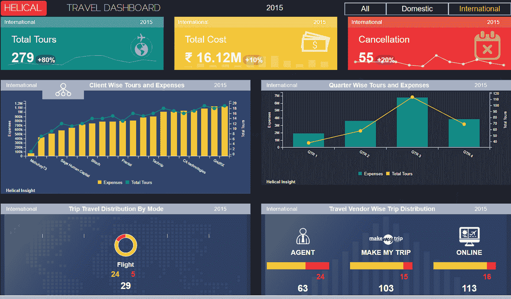

# 深入研究开源 BI 工具螺旋洞察力

> 原文：<https://medium.com/hackernoon/deep-dive-into-open-source-bi-tool-helical-insight-c98e0ce6fc3b>

当几年前, [Helical Insight](http://www.helicalinsight.com/) 第一次宣布他们将发布一款开源商业智能(BI)工具时，它真的引起了我的兴趣，我联系了创始人 Nikhilesh Tiwari，以了解他在做什么。我花了一点时间在产品上，真的很喜欢它的发展方向，并决定在未来做更多的深入研究，随着他们发布[3.0 版](http://www.helicalinsight.com/register/)，现在就是时候了。

[Helical Insight](http://www.helicalinsight.com/) (HI)是一个 Java 应用程序，所以安装非常简单，下载 JAR 文件，双击并运行安装程序，采用默认设置。值得注意的是，您可以在内部或托管云环境中使用该应用程序，我没有检查您是否可以在 AWS 上使用它，但我想您可以。

现在我们已经安装好了，我们有了一个登录页面，作为角色管理的一部分，它广泛支持单点登录(SSO)。由于 HI 是一个基于浏览器的应用程序，开发人员提前计划，以确保它可以贴上白色标签并嵌入到您自己的系统中。这种嵌入还扩展到了设计器和报表创建界面，而不仅仅是报表交付。

我真正喜欢的是开箱即用的各种数据源和可连接的平面文件选项，但是，我没有看到连接到 API 的方法。为了连接到某些数据源，如 [ElasticSearch](https://www.elastic.co/) ，必须通过一些限制，并使用像 [Dremio](https://www.dremio.com/) 这样的东西，这是一些额外的工作，如果默认可用就好了。也就是说，HI 确实提供了与 JDBC4 驱动程序的紧密集成，使您可以直接连接到几乎任何数据库。

一旦定义了数据源连接，您就需要创建描述数据的所有连接条件和关系的元数据，元数据还允许您嵌入 SQL 查询，这是一个强大的特性。元数据定义允许用户角色配置文件和组织的粒度级安全定义，下至表级/列级和实际数据/行级。安全层还允许您编写 [Groovy 安全代码](http://groovy-lang.org/security.html)来创建非常复杂的安全条件。我发现元数据定义的一个不足是无法创建任何多维数据集或层次结构，也无法定义数据类型，这将是一个理想的特性，可以使各种地方的报告更加容易。

报告是从创建的元数据生成的，专用报告界面支持多种不同的图表，可以满足大多数需求，如表格、数据透视表、地图、分组图表、卡片、轴图表、饼图、圆环图、旭日图，甚至树状图。某些图表只有在画布上有一定数量的维度和度量时才有效，如果不满足这些条件，这些图表将显示为空白。禁用空白碎片的能力是一个很好的特性。

虽然图表提供了大量的定制脚本，并且“custom”列允许您将自己的 SQL/match 计算放在那里，但是用于放置特定类型计算的 UI 界面对您的典型业务用户会有所帮助。也就是说，HI 有一个非常酷的特性，允许你在应用程序中添加任何类型的基于 Javascript 的图表。图表有占位符来添加 CSS、HTML 和 Javascript(预取、后取、预执行脚本)，这为您正在构建的内容增加了许多动态性和灵活性。类似地，HI 还允许在应用程序中添加更多的数据库函数、聚合函数、图表定制，而不依赖任何供应商。还有其他可用的函数，如过滤器和过滤器表达式语言，以构建高级和复杂的过滤选项。

在设计模式中，仪表板画布允许您拖放以前创建的报告，并创建一个仪表板，您可以在其中添加图像和文本组件。您可以右键单击任何组件，包括仪表板、报告、图像、文本、输入参数或组，您会看到许多定制选项，包括背景颜色、边框、阴影、页眉、图像作为背景等。对齐选项允许像素完美的位置和组件控制。坚持他们的灵活性的整体哲学，HI 允许你通过在特定组件上的右键点击选项来添加 HTML，CSS，Javascript 到每一个组件。

仪表板画布利用了分组的概念，这允许您逻辑地链接项目，然后将它们用作覆盖图，在该覆盖图中，您可以定义什么在前面，什么被推到后面。您的典型 BI 产品通常只允许在网格模式下创建仪表板，这可能是有限制的，而 HI 方法提供了高度的灵活性来创建有吸引力的仪表板。

输入参数字段的当前选择是滑块、日期范围选择器、下拉列表和可搜索下拉列表。我希望看到更多的添加，如单选按钮以及选择停靠或隐藏输入控件，因为它们消耗了大量的显示空间。我要说的是，实现面板间通信非常简单。

HI 中的 API 支持令人印象深刻，提供了 400 多个 API。任何公司都在寻找为白标进行广泛定制的能力，这些 API 是一个巨大的激励，因为该公司声称前端功能的每一部分都有一个相关的 API，但我只能测试几个，但它们都工作得很好。

查看 HI 的数据访问层，我发现它们使用标准的 SQL 查询直接访问数据库，这意味着任何生成大型结果集的查询都需要一段时间。如果您正在为 BI 工作做任何数据准备，这种情况可以得到缓解，大型公司通常都是这样。如果 HI 更直接地使用内存中的存储和处理，它将会看到一些显著的速度改进，但是您也可能会遇到问题，因为您正在耗尽可用的 RAM。我不知道他们如何在短期内解决这个问题，但这对他们来说将是一个游戏规则的改变。

HI 网站上有一句标语是“即时 BI”，但我在网站或产品路线图上找不到任何地方定义了它，所以这有点神秘。网站上也没有提到定价，但我问了一下，价格非常便宜，基本上，你是在购买帮助/支持和/或托管解决方案，因为你可以免费使用 Apache 许可的“社区版” [Helical Insight CE](https://github.com/helicalinsight/helicalinsight) 并做任何你想做的符合许可的事情。

我不得不说，这是一个相当漂亮的努力，它涵盖了许多人的许多基础，比我在 BI 领域看到的一些产品更好。我注意到了一些我认为可以对产品做的事情，或者可能做得更好，但这是一个真正可靠的工具，值得在您使用商业产品之前看看它是否满足您的需求。