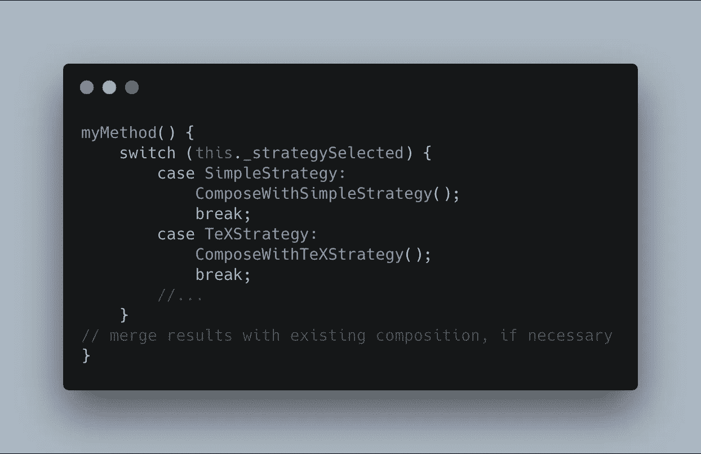
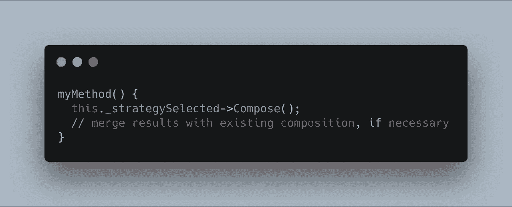
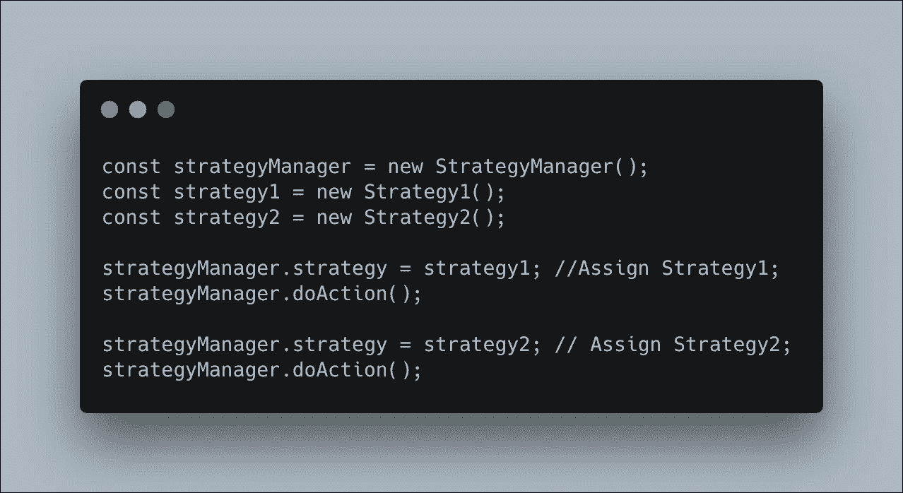
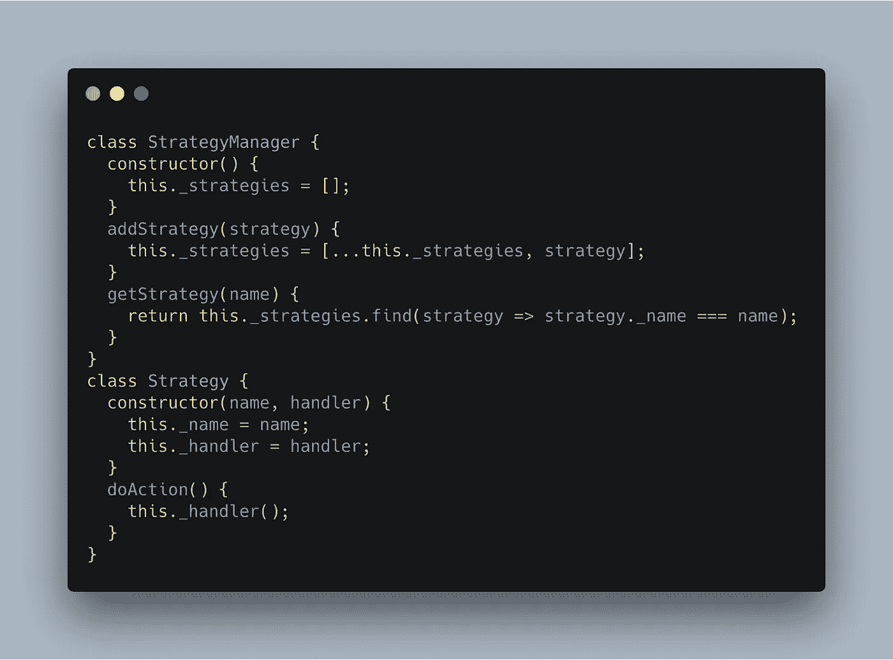

# 设计模式:JavaScript 中的策略模式

> 原文：<https://medium.com/hackernoon/design-patterns-strategy-pattern-in-javascript-59ce8e5310f9>

> 原载于[www . carloscaballero . io](https://carloscaballero.io/stategy-pattern-in-javascript-typescript/)2019 . 2 . 22。

有 23 种经典的设计模式，在原著`Design Patterns: Elements of Reusable Object-Oriented Software`中有描述。模式为软件开发中重复出现的特定问题提供了解决方案。

在这篇文章中，我将描述**战略模式**如何运作，如何以及何时应用。这种模式在其他上下文中被称为**策略**。

# 战略模式:基本理念

> 策略模式是一种行为设计模式，支持在运行时选择算法——Wikipedia
> 
> *定义一族算法，封装每一个，使它们可以互换。
> 策略让算法独立于使用它的客户而变化——设计模式:可重用面向对象软件的元素*

这种模式的主要特点是客户端有一组算法，在运行时会选择一个特定的算法来使用。这种算法在它们之间是可以互换的。

下面的代码展示了一个经典的问题，你需要在你的应用程序中选择一个具体的算法。在这段代码中，您可以使用任何编程语言的`switch`控制结构。

然而，使用以下结构的**策略模式**可以更加灵活:

这个模式的 UML 图表如下:

每种策略都用一个具体的对象来表示。因此，客户端/上下文包含一个实现 in 接口`Strategy`的`Strategy`对象(`concreteStrategyA`、`concreteStrategyB`、…)。策略之间互换的关键在于在改变策略的上下文中实现一个方法，例如`setStrategy`。

# 策略模式:何时使用

1.  解决策略模式的问题是当你需要使用几个具有不同变量的算法时。这时，你需要创建一个具体的类来实现你的算法(可以包含在一个或几个函数中)。
2.  另一个需要这种模式的有趣时刻是，在一些算法之间存在相关的条件语句。
3.  最后，当你的大多数类都有相关行为时，你必须使用这种模式。

# 战略模式:优势

这种战略模式有几个优点，可以总结为以下几点:

*   在运行时，在不同的算法(策略)之间切换很容易，因为你使用了接口的多态性。
*   **清理代码**因为你避免了条件感染代码(不复杂)。
*   **更干净的代码**因为您将关注点分成了类(每个策略一个类)。

# 策略模式:使用 JavaScript 的基本实现

现在，我将向您展示如何使用 Javascript 实现这种模式，您必须记住 JavaScript 缺乏接口。所以，你需要编写一个名为`StrategyManager`的类作为接口:

这个类包含一个名为`_strategy`的私有属性，它表示此时将使用的策略。方法`doAction`是将在每个具体战略中实施的方法。JavaScript 中的策略模式不同于 UML，因为这种语言缺乏面向对象的特性。

每个具体策略的实施如下:

注意，具体方法`doAction`是在每个具体策略中实现的。

最后，context/client 必须包含`StrategyManager`(或者策略接口是面向对象语言)才能使用具体的策略:

# 策略模式:使用 JavaScript 的一组策略

在下面的实现中，我们的`StrategyManager`可以更复杂，包含一系列算法。在这种情况下，您可以更改属性`_strategy`，而不是名为`_strategies`的数组。

最后，您可以使用方法`addStrategy`在我们的策略列表中添加新策略。`Strategy`类有两个属性:1)策略的名称；2)算法(名为`handler`)。方法`doAction`用于调用具体的算法。

最后，我们使用具体策略的客户端/上下文代码如下:

第一部分是创建具体的策略(可以使用 **Singleton** 模式和 **Factory** 模式构建)并添加到我们的 **strategyManager** (可以是我们的接口)。客户端的下一部分是选择要使用的策略，可以使用我们应用程序中的 **GUI** 或 **CLI** 选择该策略。

最后，您可以注意到，如果选择了不支持的策略，系统会返回一个错误。当您想要为您的系统提供高级算法时，可以使用这种方法。

# 结论

**策略模式**是一种在需要选择具体算法时可以避免代码复杂的模式。在这篇文章中，你可以获得一个使用 JavaScript 语言的简单实现，它没有接口。如果你使用一种有接口的编程语言，你可以遵循这个模式的 UML。

最重要的不是实现我给你展示的模式，而是你需要知道模式解决了什么问题，以及为什么你必须使用它，因为实现会因编程语言的不同而不同。

*原载于 2019 年 2 月 22 日*[*www . carloscaballero . io*](https://carloscaballero.io/stategy-pattern-in-javascript-typescript/)*。*