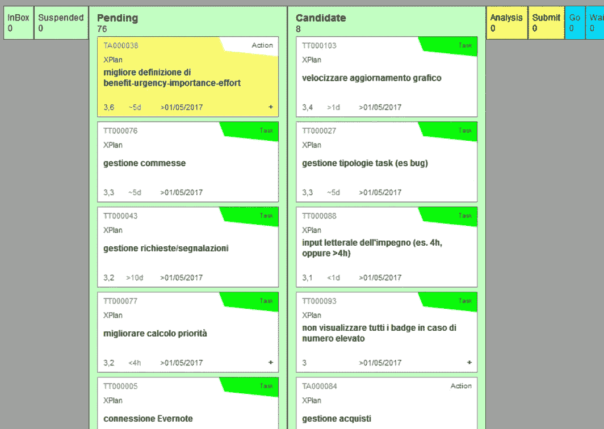
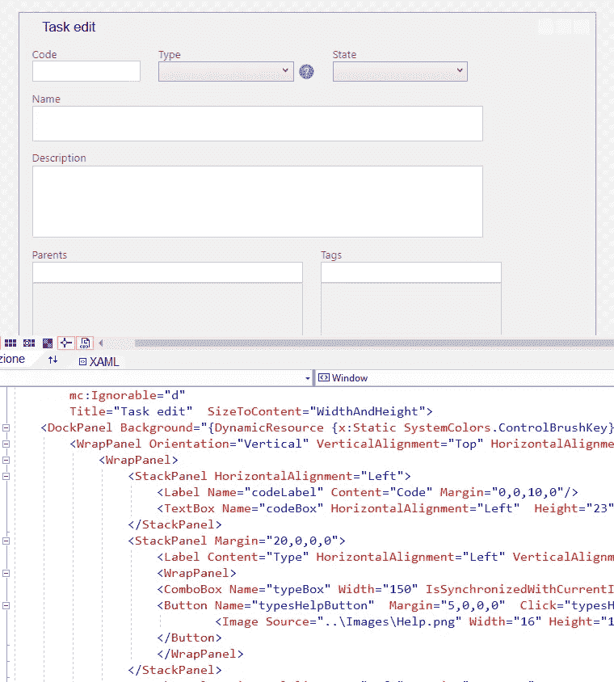
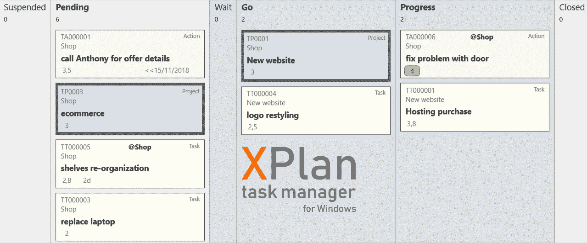

# 从设计到发布我的 Windows 应用程序

> 原文：<https://medium.com/hackernoon/designing-publishing-windows-application-8cd05f0be47b>

## 独立 Windows 应用程序的幕后。

Photo by [Donald Tong](https://www.pexels.com/@donaldtong94?utm_content=attributionCopyText&utm_medium=referral&utm_source=pexels) from [Pexels](https://www.pexels.com/photo/camera-event-live-settings-66134/?utm_content=attributionCopyText&utm_medium=referral&utm_source=pexels)

我上一次发布 Windows 应用程序已经是很久以前的事了。所以，当几个月前我决定开发并发布我的产品时，我不得不重新学习和决定一切。

这是我从构思到出版的旅程。不是一步一步的教程，而是一个关于决策和陷阱的日志。

# 这个想法

[想法很简单](https://www.xplan-taskmanager.com/en/what-is-xplan/)。一个[任务管理器](https://www.xplan-taskmanager.com/en/what-is-a-task-manager/)，有看板视图和一切，用于 Windows。首先关注个人需求，团队着眼于未来。

为什么是另一个任务管理器，为什么是 Windows？

嗯，我是一个生产力极客，你可以打赌，我从来没有对生产力工具感到满意。我已经尝试了太多，以至于在某个时候我对找到那一个失去了信心。

我不会因为我在找什么而打扰你。我只想说，我想要一个层次化的逻辑，紧凑但信息丰富的卡片和视图，易于与文件系统集成，等等。将这些需求替换成你心目中的应用。

此外，虽然云是一个很好的地方，但我想念 Windows。而 Windows 可以是一个替代品。你拥有数据库，你(通常)不需要付费，你不依赖互联网连接或第三方服务器，没有网络延迟，等等。

Windows 提供的任务管理器并不拥挤。好吧，这是有原因的，但我想要我的 Windows 应用程序。

所以，就像成千上万的独立项目开始一样，我的项目是从我自己的需求开始的。

还有我是个微软怪胎。这确实有助于发现 Windows 应用程序中的机会。

# 婴儿学步

一开始，一个产品不在我的脑海里，至少不在前台。我只是想要一个定制的工具和实验。

所以，几年前我开始玩一个基于 Windows Forms 的原型，与 Evernote 相连。Evernote 是数据库，Windows Forms 处理逻辑和 UX。我可以有一个增强的界面，还可以在旅途中使用 Evernote。

不太好。非常慢，Evernote APIs 对于这个目的来说太有限了。

所以，我很快就转到了另一个项目，仍然是 Windows Forms，但是没有 Evernote。或者，更好的是，集成 Evernote，但是基于 SQL Server Compact 数据库。

效果好多了，我真的开始用它了。

XPlan prototype with Windows Forms

但在某个时候，我遇到了两个主要的极限。

Windows 窗体也很慢，而且功能有限。虽然我在过去的许多项目中成功地使用了它们，但是界面的伸缩性并不好，我现在需要对动态布局有良好的反应。我使用 Windows 窗体只是因为我很了解它们，我对 [Windows 演示基础](https://en.wikipedia.org/wiki/Windows_Presentation_Foundation) (WPF)没有太多的经验。

此外，独立开发者的我已经开始考虑一个产品，并需要更多。来不及阻止他了。

因此，我不得不从头开始，而不是定制工具，我必须设计一个产品。

# 开始

几个月前，我从零开始，不得不根据一个产品的角度决定何去何从。

需求部分对我来说很清楚，我也对什么是 [MVP](https://en.wikipedia.org/wiki/Minimum_viable_product) (最小可行产品)有足够的想法。

所以，我直接做了下一个决定:技术。

[Windows 窗体](https://docs.microsoft.com/en-us/dotnet/framework/winforms/)不是一个选项。我喜欢它们，但是除了它们的局限性，它们在很久以前就已经被置于生命维持状态了。

除了局限于 Windows 10 和一些有限的多平台之外，UWP (通用 Windows 平台)看起来并不成熟，甚至可能已经死了。是未来吗？看起来是这样，但这需要很长时间，Windows 7 用户仍然是一大群。与此同时，我仍然会做噩梦，梦见 Metro 界面在我的桌面上进进出出，我的旧 Windows 手机落满灰尘。

UWP 有微软商店和触摸支持的优势。但是……微软商店好像没那么受欢迎。而且，由于我的应用程序主要是为桌面设计的，我看到很少有人在笔记本电脑的触摸屏上点击。

不，我不会沿着 UWP 路走，直到全景图发生重大变化，我敢打赌，这种变化不会很快发生。

[WPF](https://en.wikipedia.org/wiki/Windows_Presentation_Foundation) 是炼狱。而是一个相当大且持久的炼狱，这在微软身上经常发生。

WPF 是一项优秀的现代技术。虽然微软已经离开了，但 WPF 已经成熟，在未来的很多很多年里，人们会一直想要传统的桌面应用。

那么 WPF。

WPF 和。NET 4.6.1 和[实体框架](https://docs.microsoft.com/en-us/ef/#pivot=entityfmwk) 6 (EF6)，在 C#中。原型是用 Visual Basic 语言编写的，这种语言我从一开始就一直在用，但现在肯定是时候转换到 C#了。

为什么不是[。网芯](https://docs.microsoft.com/en-us/dotnet/core/)？因为太早了。WPF 不受当前形势的支持。网芯 2。

# 准备，预备，开始！

2018 年 9 月我开始从头开始重写 [XPlan](https://www.xplan-taskmanager.com/) 。

我花了几周时间来适应 WPF 的方式和 XAML，但一旦我适应了，就感觉像天堂一样。的全部力量。NET 的声明式用户界面设计。

适应英孚变得更容易了，即使我仍然不是它的粉丝。设计了自己的 ORM(对象关系映射)。NET 工具在过去，使用 EF 让我觉得自己没有掌控太多的细节，尤其是出问题的时候。无论如何，一旦你习惯了一些特质，和 LINQ，它就像一个魔咒。

除了 Visual Studio 和。NET 中，您可以猜到有很多东西摆在桌面上，即使应用程序的范围相对较小。用户界面、逻辑、许可、升级、文档、网站、销售等。

我希望这款应用能在今年年底上市销售，但目标很快就变成了 2019 年 2 月底，这意味着至少要在 1 月份之前准备好这款应用。

# 惊喜

微软对惊喜有独特的处理方式。他们让你习惯于使用带有哨子和铃铛的最先进的开发工具，当你放松警惕时，他们会给你惊喜。也许这是一种让你保持警惕的训练策略。

当我开始对我的应用程序感到满意并开始考虑敲定时，惊喜突然出现了。

在过去的几十年里，桌面应用程序的默认数据库通常是 Access。SQL Server Compact(。sdf)是一个选项，我从未使用过。

有了我的应用程序的原型，看到 Visual Studio 对 mdf 文件的完全支持(SQL Server)，我立即切换到 mdf。我想扩大选择范围。对桌面应用程序使用相同的文件格式，以及将来对客户机-服务器设置使用相同的文件格式，确实是一个优势。

总之。我认为数据库是一件小事，我可以在以后改进选择。SQL Compact 什么的，本地数据库从来都不是问题。

*我怎么错了。*

我的坏的 mdf 文件不能由可执行文件管理。不管怎样，他们需要一台发动机。SQL Server(包括快速版本)是引擎。在开发期间，一个 [LocalDb](https://docs.microsoft.com/it-it/sql/database-engine/configure-windows/sql-server-2016-express-localdb?view=sql-server-2017) 实例(SQL Server Express 的普通版本)就在那里。

原来，微软几年前就忘记了需要基于文件的数据库。

实体框架不支持访问。是的，微软不支持它自己的流行数据库和它自己推荐的 ORM。有变通办法，但它们是……嗯，变通办法。

SQL Compact 非常适合桌面应用。私人安装，不需要管理员权限，密码保护。但是…它已经死了。截至 2013 年 2 月，它已被弃用。

因此，我们只剩下 SQL Server Express 了，它不是基于文件的，并且附带了一个单独的引擎。但是 SQL Server Express 2017 不支持 Windows 7 和 x86！此外，SQL Server 需要一个具有管理权限的单独设置，这并不是您所希望的客户体验。在我看来，这不是一个独特的设置，也不是一次销售。

嗯，对于与 Windows 7 的兼容性问题，您可以认为安装以前版本的 SQL Server 可以解决，但是……它不能使用您设计的数据库文件，因为 Visual Studio 2017 会自动将 mdf 文件升级到最新版本，并且没有向后兼容工具。因此，您必须在 Visual Studio 之外使用旧的 SQL Server 实例来进行数据库设计，并且要小心不要让 Visual Studio 升级它。

对于开发者来说，让他们和他们的客户了解最新版本的【T2 一切】是什么陷阱？

对于单独的设置问题，一旦 Access 和 SQL Compact 不存在，LocalDb(唯一剩下的选项)似乎还有希望。

但是 LocalDb 仍然需要管理员权限。所以，忘记没有管理权限的客户吧。它仍然不是基于文件的，所以没有嵌入式安全性。

此外，它附带一个 msi，但是…你不能从另一个 msi 运行一个 msi，所以你也不能在你的应用程序中使用一个发布项目。

当然，在微软领域之外还有其他选择，但没有一个能说服我。例如，流行的 [SQLite](https://www.sqlite.org/index.html) 不允许您删除列或添加约束(也许在我不在的时候，模式升级成了一种老式的做法？).

无论如何，很奇怪的是，在 Visual Studio 中，您已经拥有了桌面开发所需的一切，而大多数桌面应用程序的最基本需求——基于文件的数据库——却不存在。

我花了几天时间研究这个两难问题，对此微软没有直接而完整的解决方案。

我决定继续使用 SQL Server Express——local db 版本——并接受放弃没有管理员权限的客户，放弃加密，至少在第一阶段是这样。叹气。

此外，还必须采取一些难看的变通办法:检测以前可能安装的 SQL Server，根据操作系统和硬件平台检测要安装的引擎，提示用户进行额外的安装，分发额外的安装。我在我的应用程序设置中包含了两个 LocalDb 版本(超过 100Mb ),然后在应用程序第一次运行时运行 Db 引擎设置，但是这不是一个理想的场景。我会在将来用自动下载选项来优化它，至少限制安装程序的大小。

有关问题和解决方案的更多信息，请点击此处:

 [## 用于 Windows 桌面开发的数据库:欢迎来到丛林

### 微软忘记了一个细节——或者故意告诉我们一些事情。

hackernoon.com](https://hackernoon.com/databases-for-windows-desktop-development-welcome-to-the-jungle-c67b4c98c817) 

这种惊喜是很难接受的，尤其是对于一个面向客户的应用程序来说，而且我可支配的时间很少。但我不得不承受打击，挺身而出。

微软，真的是一个严重的失误。

# 许可证管理

许可证管理有很多解决方案。但是它们通常成本很高，并且需要与您的电子商务和用户管理进行某种集成。

我不想花费太多，也不想为此依赖第三方技术。

此外，我不希望我的客户依赖网站来重新安装他们的程序，发送安装代码来获得密钥。我想给他们的钥匙，有效的任何重新安装。当然，这是有风险的。但我可以在升级中把盗版者列入黑名单(甚至用重大升级改变逻辑)，一个不受欢迎的应用不太可能被破解。为诚实的客户提供拥有许可证的合理风险。

当然，我必须实现这个解决方案。我有一些经验，但整个事情花了不止两个星期。您必须设计密钥格式(当然，必须进行加扰/加密)、密钥生成、保护系统(管理过期或其他限制)等等。密钥将通过电子邮件提供。目前没有网站自动化。

# 升级

待办事项列表的另一个重要项目是自动升级。

概念可以很简单。定期检查你的网站(提示:HttpWebRequest。GetResponse()。GetResponseStream())进行升级(可能只是一个带有最新版本数据的 txt 文件)，提示用户，下载，安装。

但我选择了漫漫长路。

我在网站上有一个包含历史元数据的 xml 文件。该应用程序下载该文件，并扫描它检查升级，区分推荐或只是可选的升级。这样，应用程序还能够提示用户从已安装版本到可能升级的所有累积更改。用户可以接受、跳过升级、稍后得到提示，或者决定稍后手动运行升级检查。

当有升级时，用户可以决定下载。下载完成后，重启时，应用程序会提示安装。如果确认，应用程序运行一个单独的启动器(简单的 exe 将运行安装程序)，并关闭。

# 可信度问题

在一次有限的测试中，另一个问题出现了。杀毒软件。

它可以阻止下载。我仍然没有统计数据，但这肯定是一个重大问题。

他们会告诉你，你只需要用一个证书来签署你的应用程序，但这并不那么简单，而且远远不是免费的。最起码，您必须用证书对 exe 和 setup 进行签名，并添加时间戳(以避免证书过期的影响)。

所以，我推迟了解决这个问题——除非它变得阻塞——但我想我必须尽快解决这个问题。

一个类似但次要的问题是防火墙警告用户应用程序正在联系网站(进行升级)。

# 销售

最后，还有销售的事情。

我决定一次性许可，以限制复杂性。一次性付款，包括所有未来的小升级。

对于电子商务来说，很多可能的平台已经存在，当然需要一些成本，但我想从我自己的平台开始，以便拥有完全的控制权。

由于网站的第一个版本是 WordPress 设置，我选择了流行和成熟的 WooCommerce。

对于支付，有各种可能性，但我选择从 WooCommerce 处理的 PayPal 开始。我过去已经成功地使用过 PayPal。我可以稍后添加其他支付渠道。

对于监管和会计问题，你肯定需要一些建议，但强制性方面(隐私肯定是最需要关注的方面)通常可以归结为几件事，特别是如果你手中的东西是一个微型企业或根本没有企业。一个很烦的部分，但也许一开始就不需要过于复杂。

# 准备好了。

2019 年 3 月初， [XPlan](https://www.xplan-taskmanager.com/) 发售。

不是所有我认为最起码的东西都在那里，但有一个好的和坚实的部分在那里。基础就在那里。

然而，我以前几乎没有做过推广，除了一个登陆页面和一份很少有人订阅的时事通讯，所以没人知道这个应用。一切都要做，我猜链接建设是第一步(是的，这篇文章是其中的一部分)。

无论如何，销售是另一回事。你可以打赌，对于一个独立的应用程序来说，这是最难的部分。