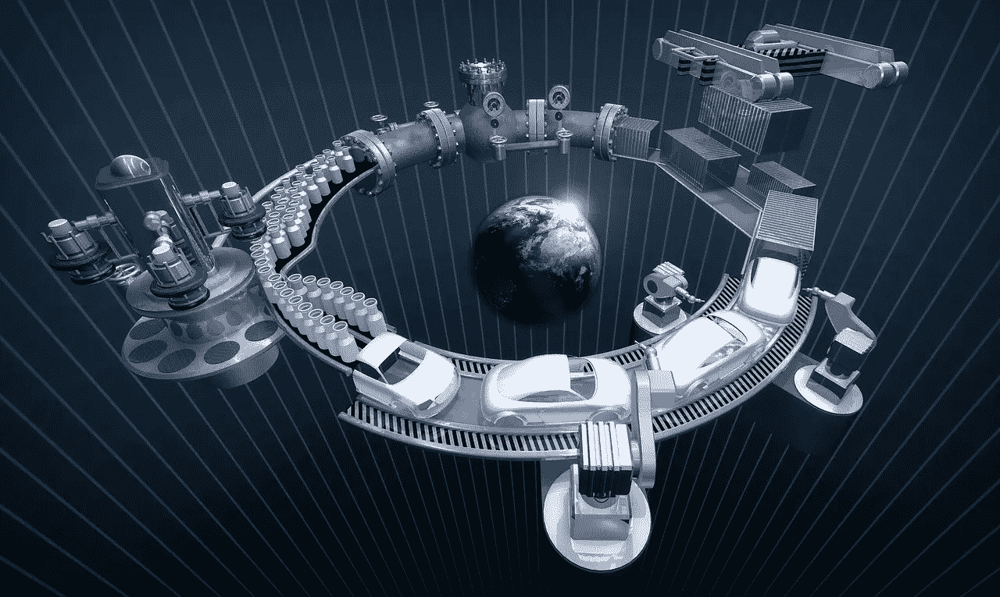
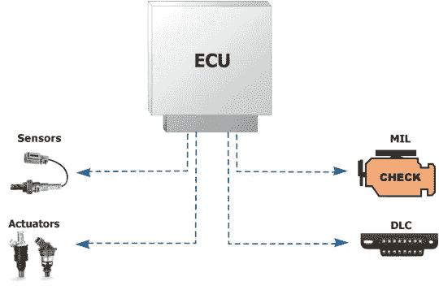
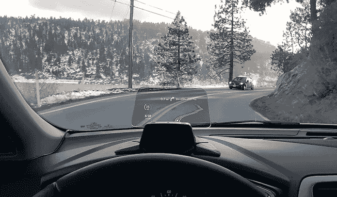
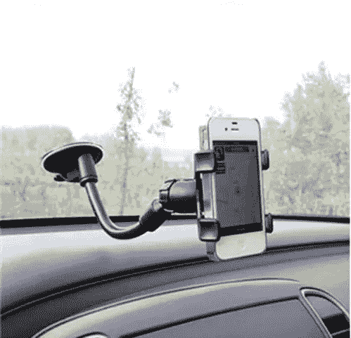

# 检测中断:剖析科技淘金热

> 原文：<https://medium.com/hackernoon/detecting-disruption-anatomy-of-a-tech-gold-rush-c531b1667a92>

Image by [PIRO4D](https://pixabay.com/users/PIRO4D-2707530/) from [Pixabay](https://pixabay.com/photos/production-circuit-global-earth-2612056/)

# 首先，是苹果在亏损…

1998 年，苹果陷入动荡。Wintel duo 赢得了个人电脑的战争。iPhone 是 9 年后的事了。iPod——3 年。

史蒂夫·乔布斯，这位刚刚重新掌权的领导者，决心将台式机产品线缩减至单一的杰出创新。

1998 年 5 月，iMac G3——有史以来第一台 iMac 发布。这是巨大的商业成功，并且自 1990 年以来第一次独自为苹果带来利润。

这要归功于 Jony Ive 的突破性设计，与个人电脑的革命同步:**USB 的引入。**

是的，USB 端口最早出现在第一台 iMac 上，也被称为第一台传统免费台式机。这样，Mac 用户就可以使用大量为 Windows 用户设计的外设:USB 集线器、扫描仪、存储设备和鼠标。

USB 设备市场淘金热开始。

# 伟大的 USB 淘金热是如何真正开始的？

USB 是最普遍的传统杀手工业标准。它是由 7 个 90 年代的科技巨人共同创造的:微软、英特尔、NEC、北电、康柏、DEC 和 IBM。

他们都齐声演奏，因为:

*   他们希望摆脱自己的传统存储驱动器，主要是软盘驱动器、ISA 端口、PS/2、游戏端口等。
*   通用端口标准给了个人电脑制造商与芯片制造商讨价还价的巨大力量。
*   消费者不必担心电脑制造商和存储设备制造商之间的锁定。

英特尔制造了有史以来第一个托管 USB 端口的 PC 电路，[慷慨地将它送给了计算行业](https://www.businessinsider.com/ajay-bhatt-usb-creator-interview-2015-11)。

他们的善举得到了回报。

*   英特尔即将在今年的某个时候发布 USB 4.0 规范，该规范将携带 Thunderbolt 的能力连接到 4K 显示器，数据传输速率为 40 Gbit/s，几乎是 1998 年 USB 1.0 的 27000 倍。
*   来自 Datatraveler 的最新 USB 闪存驱动器存储 2 TB，而 IBM 在 1998 年发布了 8 MB 的入门产品。
*   2019 年，全球 USB 闪存存储设备市场规模为 610 亿美元。这不包括其他 USB 设备，如网络摄像头、电缆、适配器等。

# 科技淘金热究竟是如何发生的？

以 USB 为例:

*   更大的玩家尽可能地保守秘密——这就是传统硬件在 90 年代之前存活了几十年的原因，开源也没能赶上。
*   在某种程度上，他们无法再向市场提出价值主张。增长停滞，收入逐渐下降。
*   遗留制造商团体创建了开放标准。在 USB 的例子中，一个名为 [USB 实现者论坛](https://usb.org/about) (USB-IF)的非商业团体创建了标准。它不断升级设备设计和软件协议。
*   例如，[本文档](https://www.usb.org/sites/default/files/CabConn_3_0_Compliance_Document_20101020.pdf)描述了 USB 3.0 硬件——任何硬件制造商都可以使用它来制作连接/存储/媒体 USB 设备，操作系统制造商/驱动程序员可以编写兼容 USB 3.0 的软件。
*   学生、创业者新手、专业人士都可以访问开放标准——过去是通过图书馆/期刊，现在是通过互联网。他们根据市场需求创造产品。有时，他们结合不止一个标准来实现他们的目标。
*   这些配件制造商创造了新的市场。传统播放器以可承受的价格出售。颠覆发生了。

如果你想发现你最喜欢的行业中的颠覆，只需跟踪它的开放标准。

*   标准将从传统创造者手中获得哪些数据，并向外界开放？
*   从那个数据来看，真正解决人们日常问题的是什么？
*   当你发现第二点中的一大块时，你就发现了潜在的**淘金热。**

你今天能找到一个吗？

# 伟大的 OBD 标准

Courtesy: [Idiot Lights — wikipedia](https://en.wikipedia.org/wiki/Idiot_light#/media/File:Idiot_lights.jpg)

Courtesy: [Reddit](https://www.reddit.com/r/nostalgia/comments/6laniv/this_program_has_performed_and_illegal_operation/)

1988 年的斯巴鲁车主可能会认出第一张图片。Windows 用户会很容易认同第二个。

两者都有不同的意图，但有相似的效果:它们的诊断超越了损害点。这就是为什么，那些仪表板灯被称为[白痴灯](https://en.wikipedia.org/wiki/Idiot_light)。它们是标准的，也是司机了解车辆健康状况的唯一途径。

20 世纪 80 年代初，通用汽车试图用 MILs(故障指示灯)取代它们，让它们变得有意义——这是我们今天仍能看到的东西。MILs 是过于简化的预防性诊断，它挽救了数千辆汽车和更多的生命。

但它们是由[电子控制单元](https://en.wikipedia.org/wiki/Engine_control_unit)发射的发动机传感器数据中更大有效载荷的一部分——这个野兽主要检测氧气流量和发动机速度参数，并命令致动器设备。

ECU — Courtesy: [ELM327](http://www.elm327.com/FAQ/19.html)

简而言之，除了 MIL，ECU 还有很多东西要说。汽车行业的监管者希望听到的信息包括:气压、温度、发动机转速、油耗问题——应有尽有。

但主要是排放——工业革命以来人类对环境犯罪的人格化衡量。

进入 DLC —诊断链路连接器—将 ECU 自动健康数据暴露给扫描工具的端口。

通用汽车是汽车行业事实上的领导者。随着微处理器的革命，市场上充斥着越来越先进的 ECU，所有这些都炫耀其专有的 DLC。然后，福特、丰田、克莱斯勒、日产、大众也开发了自己的 DLC 接口——明显不同于通用的 DLC。

你已经猜到了事情的发展方向。DLC 是汽车的传统软驱。所有的制造商都渴望有一些共同的东西，所以他们将不再需要为自己的车辆生产扫描工具。

*   1988 年，SAE(汽车工程师协会)正式建议制定一个通用标准，命名为**车载诊断** (OBD)。他们开始着手制定标准。
*   1991 年，加州空气资源委员会(CARB)强制实施汽车诊断。它执行的标准被称为 OBD-I
*   1994 年，CARB 对其进行了修订，出版了 OBD-II。
*   1996 年，OBD-II 美国联邦法律强制要求所有在美国境内生产和销售的汽车都必须遵守。
*   在欧盟，EOBD(欧洲自己的 DLC 标准)开始生效:2001 年适用于汽油车辆，2003 年适用于柴油车辆。

从那时起，任何扫描工具都可以连接到所有车辆上可用的微型连接器——就像计算机 USB 端口接受任何电缆或闪存驱动器一样，只要它是 USB 的。

Courtesy: OBD Port on [wikipedia](https://commons.wikimedia.org/wiki/File:OBD_002.jpg)

# 但是，OBD 仍然不是一个颠覆性的市场:

OBD 开放标准允许扫描工具制造商制造通用扫描仪。这给汽车维修市场带来了巨大的变化——但不是以改变生活的方式。

是的，有[数据记录器](https://en.wikipedia.org/wiki/Data_logger)。它们可以存储更多关于车辆运动和状况的信息。因此，事实证明，它们对保险公司确定损害赔偿责任至关重要。因此，他们降低了拥有数据记录器的车主的保险费。但这让车队管理公司而不是司机个人受益更多。

OBD 标准错过了，而 USB 从中受益的关键因素是:**先存** **消费者** **需求**。

当 USB 出现时，个人电脑已经家喻户晓。创造 OBD 更多是为了满足监管者，而不是司机。

OBD 扫描仪做的工作与 USB 相似——传输数据。但是在 90 年代，谁会经常需要移动车辆数据呢？

# 转机:移动性的崛起

在 OBD 被采用后的大约十年里，互联网和智能手机席卷了整个世界。智能手机带来了 GPS。然后是蓝牙——任何机器/传感器数据的 10 米数据包跳跃，它会通过互联网到达任何付费的人。

> 与车辆数据相结合的移动性必然比所有以前的数据传输技术加在一起造成更大的破坏。

一个晴朗的周日早晨，我正有着这些确切的想法，于是去 Indiegogo 搜索[移动领域的趋势](https://www.indiegogo.com/explore/all?project_type=campaign&project_timing=all&tags=gps&sort=trending)——希望找到一些真正被低估的东西。第一个条目让我大吃一惊。

看起来像是豪华汽车的 AR 驱动挡风玻璃的是一个售后 HUD 显示器，名为 Hudway Drive，由一家名为 Hudway 的公司制造。这是他们的四个 HUD 产品之一:一个用于头盔，另一个用于挡风玻璃。

HUDWAY Drive 通过 OBD 蓝牙扫描仪连接到汽车的 OBD 端口，并获取速度，燃油和其他诊断数据。它还可以连接智能手机 GPS 进行导航。最后，它将所有这些作为类似 AR 的小部件的一部分投射到玻璃上，这种玻璃是沉浸式的，甚至是不可见的。

在一些亚马逊产品搜索中，我意识到 HUD 显示器本身并不是一个新事物。但与 HUDWAY Drive 不同，大多数不是基于挡风玻璃的，沉浸式的或不受干扰的。

然而更令人吃惊的是，没有汽车制造商在中低价位市场提供这款车。特斯拉 [Model 3 用户想要它](https://forums.tesla.com/forum/forums/heads-display-2)，但特斯拉不肯让步。前电视公司 Pioneer 制造了带有所有侧面直播摄像头的平视显示器，并将取代遮阳板——[，售价 599](https://www.wired.com/2013/09/pioneer-navgate/) 。但是现在它们似乎不在了。

接下来是瑞士移动独角兽 WayRay，估值[5 亿](https://techcrunch.com/2018/09/18/wayray-raises-80m-at-a-500m-valuation-led-by-porsche-for-its-holographic-ar-display-tech/https://techcrunch.com/2018/09/18/wayray-raises-80m-at-a-500m-valuation-led-by-porsche-for-its-holographic-ar-display-tech/)，获得了保时捷、现代&阿里巴巴的投资。他们正在向汽车公司出售嵌入式全息 HUD。它的解决方案还读取 OBD 数据，输入应用程序，用它来分析驾驶行为。鉴于他们的投资者，Wayray 肯定会作为 OEM 出售。伟大的创新，但没有脱离传统的领导者，因此没有全面的市场混乱。

相比之下，[小 25 倍的](https://www.startengine.com/hudway)像 HUDWAY 这样的售后市场参与者对市场需求有更好的敏捷性——他们以前的产品 HUDWAY Glass 售价仅为 49.90 美元，同时仍然提供相当沉浸式的导航。

此外，OBD 售后市场产品为同类产品提供动力，例如:

*   [具有蓝牙/ GPS 功能的 OBD 扫描仪](https://www.amazon.com/Vyncs-Tracking-Monitoring-Optional-Roadside/dp/B01HSODG10/)——在没有移动 GPS 的情况下可以派上用场的东西
*   [读取 OBD 数据的应用](https://www.fixdapp.com/)，这些数据可以镜像&使用玻璃投影
*   [微控制器](https://en.wikipedia.org/wiki/ELM327) —位于 DLC 端口和 OBD 扫描工具之间的软件+硬件层，便于访问&可编程性

# 随着移动化的兴起，OBD 将何去何从？

还记得 GPS 出现之前高价出售的汽车导航系统吗？他们没接电话。人们使用雅虎地图和 Mapquest 的方向打印件(纸张对环境有害，但耗电的导航系统也有害)。如今，[3.73 美元就能搞定](https://www.gearbest.com/car-decorations/pp_276740.html?wid=1433363)。

Car phone holder, available on Gearbeast for $3.73.

对于更复杂的导航显示+车辆数据，售后硬件+移动应用组合将继续蓬勃发展。

以可承受的价格偷偷接触技术，而不是以高价从 OEM 厂商那里购买奢侈的技术，这也符合大众的更大利益。在包含内置先进技术的自动驾驶汽车成为标准并且人人负担得起之前，售后市场将是一个福音。

至于 OBD，全球定位系统、IOT 传感器、蓝牙和人工智能等技术的结合有着巨大的潜力。

*   保险公司将向设备制造商支付数十亿美元，这些设备制造商可以获取实时速度+引擎+位置数据以及分析数据，以创建司机行为的人工智能模型。
*   车队公司(不仅仅是优步，Lyft，还有卡车和船舶管理，公共交通)也将支付可观的费用来获得实时导航+高质量的司机数据。
*   汽车制造商和零件制造商会付费观看他们的作品在*现场*运行，而 OBD 是他们唯一的入口。

OBD 是一场等待爆发的破坏性淘金热。随着移动性的到来，这一行业标准的时代已经到来。