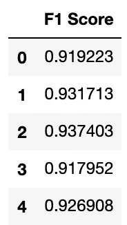

# 检测欺诈交易

> 原文：<https://medium.com/hackernoon/detecting-fraudulent-transactions-88031bac2382>

## 使用 Python 进行深入研究


Source: me.me

## **背景**

在撒哈拉以南非洲(SSA)的许多地区，银行渗透率普遍较低。部分原因是由于历史原因，对银行机构的信任度低，收入低且经常不稳定，缺乏身份证件，在某些情况下，偏远农村地区普遍缺乏实体银行基础设施，大量人口通常居住在撒南非洲的一些地区。

鉴于这些问题，出现了许多金融科技，试图为这些问题提供灵丹妙药，最终目标是利用智能手机普及率和可负担性的提高来构建数字经济。这通常被视为一种净积极因素，特别是当它导致无现金交易增加时，因为它减少了携带现金的安全顾虑，提高了交易的便利性，这通常会导致经济活动的整体增加。在大量业务以非正式方式发生的国家，这也增加了透明度，因为它创建了交易审计线索，最大限度地减少了逃税。

在津巴布韦，这为政府向非正规企业征税创造了一个选择，即通过占主导地位的移动货币系统 Ecocash 对每一笔交易征税——因为一个国家除了收税以外，可以在任何事情上都失败。


Source: 9gag

## **设定场景**

我们可以继续谈论好处，但让我们从大局后退一步，想象我们正在一个非洲国家经营一家支付公司……让我们称这个国家为瓦坎达。我们为双方付款提供便利。当我们试图让支付尽可能无缝和方便时，我们开始遇到无现金支付的一个负面影响:网络欺诈。

为了标记这些交易，我们决定建立一个模型来预测给定的交易是否是欺诈性的。鉴于这种情况，我决定查看 Kaggle 上的[信用卡欺诈检测数据集，目的是使用机器学习来确定给定的交易是否欺诈。](https://www.kaggle.com/mlg-ulb/creditcardfraud)

## **处理数据集**

我决定从正常交易和欺诈交易的可视化开始。这背后的想法是为了更好地理解数据的实际情况。

```
#loading the dataset
location = '/Users/emmanuels/Downloads/creditcard.csv'
dat = pd.read_csv(location)#visualising transactions
ax = dat.groupby('Class').size().transform(lambda x: (x/sum(x)*100)).plot.bar()
for a in ax.patches:
    ax.text(a.get_x()+.06,a.get_height()+.5,\
           str('{}%'.format(round(a.get_height(),3))),fontsize=24,
              color='black')
old = [0,1]
new = ['Normal','Fraudulent']
ax.set_xticks(old)
ax.set_xticklabels(new,rotation=0,fontsize=28)
```

加载数据后，我将数据集按类分组(0 代表正常交易，1 代表欺诈交易)，返回每个类的总计数。虽然 [apply](https://pandas.pydata.org/pandas-docs/stable/reference/api/pandas.DataFrame.apply.html) 操作允许我将任何 lambda 函数应用于我的分组数据集，但是在这种情况下，使用[转换](https://pandas.pydata.org/pandas-docs/stable/reference/api/pandas.DataFrame.transform.html)返回的结果与我输入的结果大小相同。然后，在我的 lambda 函数中，这被转换为事务总数的百分比，然后绘制成条形图，并用相关的百分比进行注释。


Percentage of normal and fraudulent transactions

不出所料，我们发现很大一部分交易是非欺诈性的。这带来了一个小问题；如果我想衡量我使用的机器学习模型的性能，我不能纯粹依赖准确性分数。例如，如果我预测每一笔交易都不是欺诈性的，我的准确率将达到 99.827%。这听起来很棒，但是，我将无法对由于欺诈而导致收入损失的单个欺诈交易进行分类。无论我使用什么指标来衡量我的算法的性能，我可能都需要更加重视模型正确分类欺诈交易的能力。

## **按时间可视化交易量**

下一步，我想根据交易发生的时间来了解交易量。由于从时间的角度来看数据集是匿名的，所以我只有第一次记录交易后交易发生的秒数。

```
plt.plot( 'Time', 'Amount', data=dat, marker='o', color='blue',
                  linewidth=2, linestyle='dashed')
plt.xlabel('Seconds since first transaction')
plt.ylabel('Size of transaction')
plt.rcParams["figure.figsize"] = (30,20)
plt.rcParams["font.size"] = "20"
```


Volume of transactions over time

绘制一段时间内的交易量似乎显示出一种模式。音量在 25000 秒左右增加，20000 秒后达到峰值，然后稳步下降。这个周期似乎持续了大约 50 000 秒或接近 14 小时。同样的模式在 125 000 大关再次出现。这可能是每日周期，交易在一天开始时开始增加，在周期中间的某个时候达到峰值，并在下班前下降。据推测，这种模式可以揭示欺诈交易何时更有可能发生。

```
dat['Hours'] = dat['Time']/3600
```

为了在我的分析中包含这一点，我创建了一个列来指示交易发生的时间。重复一遍，假设这可能是正确指示交易是正常还是欺诈的有用特征。

## **显示一段时间内欺诈交易的比例**

根据我在上一段中所做的假设，我决定直观显示一段时间内欺诈交易的百分比，以了解欺诈交易是否倾向于在特定的时间范围内聚集。

```
#visualising amount spent per hour by class
dat_grouped = dat.groupby(['Hours','Class'])['Amount'].sum()
ax_three = dat_grouped.groupby(level=0).apply(lambda x:round(100*x/x.sum(),3)).unstack().plot.bar(stacked=True)
for i in ax_three.patches:
    width,height=i.get_width(),i.get_height()
    x,y = i.get_xy()
    horiz_offset=1
    vert_offset=1
    labels = ['Normal','Fraudulent']
    ax_three.legend(bbox_to_anchor=(horiz_offset,vert_offset),labels=labels)
    if height > 0:
        ax_three.annotate('{:.2f} %'.format(height),
                         (i.get_x()+.15*width,
                         i.get_y()+.5*height),
        rotation=90)
```

为了创建这种可视化效果，我将我的数据集按小时和类别分组，返回每小时发生的正常或欺诈交易的总和。然后，我应用了一个 lambda 函数，将两个类的金额转换为百分比，创建了一个堆积条形图，并用相关的百分比对其进行了注释，定位百分比以确保该图可读。


Data Viz


Percentage of fraudulent transaction over time

由于数据只涉及 48 小时内的交易，任何可观察到的模式都可能被解释为偶然。但是，我认为将在特定交易进行的一个小时内发生的欺诈交易的百分比作为一个特征添加进来会很有趣。我的假设是，进行交易的时间可能包含可以帮助我分类(以及其他特征)交易是否欺诈的信息。我认为欺诈交易在一天中的某些时段会更加普遍是可以想象的。

```
a= dat.groupby(['Hours','Class'])['Amount'].sum()
b =pd.DataFrame(a.groupby(level=0).apply(lambda x:round(100*x/x.sum(),3)).unstack())
b=b.reset_index()
b.columns = ['Hours','Normal','Fraudulent']
dat = pd.merge(dat,b[['Hours','Fraudulent']],on='Hours', how='inner')
```

为了创建这个列，我首先按小时计算欺诈性交易和正常交易的百分比，并对结果进行拆分，以将类作为列返回。

然后，我合并数据帧，仅从我刚刚创建的数据帧中提取欺诈列。像在 SQL 中一样，我合并了两个共同特征/键上的两个数据帧——小时。在这之后，我的数据框架有了一个新的列，显示了在特定交易进行的小时内发生的欺诈交易的百分比。

## **机器学习开始**

为了开始分类过程，我决定从逻辑回归开始。在[我之前的一篇文章](https://hackernoon.com/predicting-the-likelihood-of-a-customer-to-make-repeat-purchases-using-logistic-regression-b430c9719994)中，我对这个回归算法做了一个简短的解释。概括地说，logit 函数执行转换，返回事件发生的概率。


Statistics = Machine Learning

```
dat.columns[df.isnull().any()]
dat['Fraudulent'] = dat['Fraudulent'].fillna(0)
from sklearn.linear_model import LogisticRegression
from sklearn.model_selection import train_test_split
#from sklearn.feature_selection import RFE
from sklearn.metrics import confusion_matrix
from sklearn.metrics import classification_report
log_reg = LogisticRegression(penalty='l1')
y = dat['Class']
X = dat.drop(['Class'],axis=1)
X_train,X_test,y_train,y_test = train_test_split(X,y,test_size=0.3,random_state=100)
log_reg.fit(X_train,y_train)
#predicting with models
predicts = log_reg.predict(X_test)
#f1 score is harmonic mean of recall and precision score
confusion_matrix(y_test,predicts)####RESULTS####
array([[85276,    25],
       [   46,    96]])
```

我继续检查 NAN 值，并将所有相关的 NAN 替换为 0。在这个清理过程之后，我导入了我的分析所需的包，将我的数据分成训练和测试数据，并使逻辑回归模型适合我的训练数据。对于这个模型，我专门用了 [l1 正则化(lasso 回归-最小绝对收缩和选择算子)](https://ai.stanford.edu/~ang/papers/aaai06-l1logisticregression.pdf)。l2 最小化平方和，l1 最小化目标值和估计值之间的绝对差。这个正则化过程是为了防止系数过度拟合，潜在地增加了我的模型概括新数据的能力。

如前所述，准确性分数不是衡量我的模型表现如何的好指标，相反，我首先选择查看混淆矩阵，以了解我的模型对正常交易和欺诈交易的正确分类程度——特别注意我的模型对欺诈交易的正确分类能力。

根据混淆矩阵，我的模型以 99.974%的准确率正确地对正常交易进行分类，并以 67.60%的准确率对欺诈交易进行分类。

```
print(classification_report(y_test,predicts))####RESULTS####
              precision    recall  f1-score   support

           0       1.00      1.00      1.00     85301
           1       0.79      0.68      0.73       142

   micro avg       1.00      1.00      1.00     85443
   macro avg       0.90      0.84      0.86     85443
weighted avg       1.00      1.00      1.00     85443
```

为了便于比较模型，我打印出了预测的分类报告。重要的是，为了进行一致的比较，报告返回 f1 分数。这是[精确度](https://scikit-learn.org/stable/modules/generated/sklearn.metrics.precision_score.html)(所有正面预测中真实正面的比例)和[召回分数](https://scikit-learn.org/stable/modules/generated/sklearn.metrics.recall_score.html)(所有实际正面项目中真实正面的比例)的调和平均值，f1_score 是一种加权分数，它向我显示了该模型对正常交易和欺诈交易的正确分类程度。为了确定模型性能，我特别希望增加类别 1(欺诈交易)的 f1_score，这将通过宏观平均 f1_score 反映出来。

## **递归特征消除**

并非所有的功能都同等重要。有些功能不会增加我的模型的性能，甚至可能对性能产生不利影响。当然，这高度依赖于我所使用的模型。诸如决策树和随机森林的某些模型选择最相关的特征，而不需要特征选择。

特征选择背后的思想是选择优化特定分数的特征。这可以通过前向选择(从一个特性开始并添加更多特性，直到我们找到得分最高的组合)和后向选择(前向选择的逆过程)来完成。对于这个分析，我选择使用递归特征消除。这是向后选择的一种形式，它丢弃了我的模型中最不重要的特征。重要性取决于我使用的评分(我如何衡量重要性。

```
from sklearn.feature_selection import RFECV
selector = RFECV(log_reg,step=3,cv=5,scoring='f1_macro')
selector = selector.fit(X,y)
```

我特别选择了使用递归特征消除和交叉验证，这意味着最佳数量的特征将通过 [5 重交叉验证来选择(我在我以前的一篇博客](https://hackernoon.com/predicting-the-likelihood-of-a-customer-to-make-repeat-purchases-using-logistic-regression-b430c9719994)中对交叉验证的概念做了高层次的解释)。对于评分，我选择使用 f1_macro 评分。这是正常交易和欺诈交易 f1_score 的平均值。将步骤设置为 3，我指定在每次迭代中应该删除 3 个特性。

```
#showing the name of the features that have been selected
cols = list(X.columns)
temp =pd.Series(selector.support_,index=cols)
selected_features = temp[temp==True].index
selected_features#### RESULTS ####
Index(['V1', 'V3', 'V4', 'V5', 'V6', 'V7', 'V8', 'V9', 'V10', 'V11', 'V12',
       'V13', 'V14', 'V15', 'V16', 'V17', 'V19', 'V20', 'V21', 'V22', 'V23',
       'V24', 'V25', 'V27', 'V28', 'Fraudulent'],
      dtype='object')
```

为了获得运行递归特征消除后返回的特征的图片，我创建了一个 pandas 系列，将选择的特征映射到相关的列标题。该过程删除了 V2、V15、V18、小时、数量和时间列。

```
X_rfecv = dat[selected_features].values
X_train,X_test,y_train,y_test = train_test_split(X_rfecv,y,test_size=0.3,random_state=100)
log_reg.fit(X_train,y_train)
#predicting with models
predicts = log_reg.predict(X_test)
#f1 score is harmonic mean of recall and precision score
confusion_matrix(y_test,predicts)#### RESULTS ####
array([[85279,    22],
       [   48,    94]])
```

使用从 rfe 流程中筛选出的特征拟合逻辑回归模型后，我们发现模型预测正常交易的能力略有提高，而预测欺诈交易的能力则相反。但是，宏 f1_score 保持不变，因为它将所有列都作为特性考虑在内。

## **寻找更好的模式**

我决定使用决策树和带有随机搜索交叉验证的随机森林来获得我的分类任务的最佳参数的近似值，并设法使用我的随机森林将我的宏观平均 f1_score 提高到 0.88。在我之前的博客之一[中，我写了一篇关于这两个模型的简要的高层次解释。](https://hackernoon.com/predicting-the-price-of-houses-in-brooklyn-using-python-1abd7997083b)

```
random_forest = RandomForestClassifier()
param_grid = {"criterion":['gini','entropy'],
             'n_estimators':range(20,200,20),
             'max_depth':range(20,200,20),
             }
tuned_rfc = RandomizedSearchCV(random_forest,param_grid,cv=5,scoring='f1')
tuned_rfc.fit(X_train,y_train)
tuned_preds = tuned_rfc.predict(X_test)
confusion_matrix(y_test,tuned_preds)#### RESULTS ####
array([[85288,    13],
       [   35,   107]])
```

使用[随机搜索](https://scikit-learn.org/stable/modules/generated/sklearn.model_selection.RandomizedSearchCV.html)包，我预设了我想要测试的参数，以获得我的模型的最佳参数。这背后的想法是从可能的参数列表中找到参数的最佳组合。顾名思义，与测试指定参数的每一种可能的排列相反，创建的组合是随机的，这使其成为比其他方法更快的超参数调整方法，如[网格搜索](https://scikit-learn.org/stable/modules/generated/sklearn.model_selection.GridSearchCV.html)——这将需要更长的时间来运行，使其运行起来像看油漆变干一样有趣，或等同于…看 DC 电影。


‘DC movies are great’ — no-one

为了更深入地理解随机搜索的工作原理及其背后的数学原理，我添加了一个链接，链接到来自[机器学习杂志](http://www.jmlr.org/papers/volume13/bergstra12a/bergstra12a.pdf)的原始研究论文。使用这种方法和 f1 作为评分参数，我拟合了最佳参数和我的训练数据，运行了我的预测并返回了混淆矩阵。结果表明，我们可以看到正常交易和欺诈交易预测的准确性都有所提高。

```
print(classification_report(y_test,tuned_preds))#### RESULTS ####
     precision    recall  f1-score   support

           0       1.00      1.00      1.00     85301
           1       0.89      0.75      0.82       142

   micro avg       1.00      1.00      1.00     85443
   macro avg       0.95      0.88      0.91     85443
weighted avg       1.00      1.00      1.00     85443
```

更令人兴奋的是宏观 f1 平均值的增加。我终于可以查出更多的欺诈交易了。

## **XGBoost！**

作为最后一步，我决定尝试备受称赞的 XGBoost 分类器，通过交叉验证的随机搜索进行微调。XGBoost 这个术语实际上是极端梯度增强的缩写。从不同的 Kaggle 比赛来看，这似乎是一个非常强大的机器学习，性能非常好。有人说，它甚至可以帮助你预测你把那些在洗衣日后“神秘”失踪的袜子放在哪里了。


Sock Army Unite!

根据官方的“白皮书”，XGBoost 在梯度推进框架下运行一种[梯度树推进算法(在我以前的博客](https://hackernoon.com/predicting-the-price-of-houses-in-brooklyn-using-python-1abd7997083b)中有高层次的解释)。简而言之，这包括将预测我们期望结果的能力不强的弱学习者或树变成更强的学习者/树。这意味着将创建新的树来校正先前树的预测中产生的残留误差(校正先前的误差)。这个过程会持续我们指定的时间，这取决于我为我的模型使用的参数。您还可以控制模型适应定型数据集的速度，方法是将权重附加到将添加到模型中的每棵树所做的校正。

从我的理解来看，XGBoost 可以通过先看决策树如何工作来得到最好的解释。使用决策树，我们将数据分成子集或叶子，为每个叶子分配一个分数，并继续构建更多的叶子分支(更多地拆分我们的数据),选择分数(信息增益)最高的叶子，直到达到预定义的级别/深度。对于一组树(例如随机森林)，我们用更多的树并行运行相同的过程。这与树提升的过程非常相似，不同之处在于我们如何训练模型。更多细节可以在 [XGBoost 文档](https://xgboost.readthedocs.io/en/latest/tutorials/model.html)中找到。通过阅读不同的观点和研究，XGBoost 似乎比梯度提升甚至随机森林更快，并且通常提供更好的结果。

```
from xgboost import XGBClassifier
y = dat['Class']
X = dat.drop(['Class'],axis=1)
X_train,X_test,y_train,y_test = train_test_split(X,y,test_size=0.3,random_state=100)
xgb = XGBClassifier()
#fine tuning XGB parameters
params = {'min_child_weight':[5,15],
          'subsample':[0.6,0.8,1.0],
          'gamma':[1,5,10,15],
          'learning_rate': [0.01,0.05,0.1],
          'colsample_bytree':[0.6,0.8,1.0],
          'max_depth':[2,3,5,10],
          'n-estimaors': range(50,1000,50)
    }
#randomized search
random_search = RandomizedSearchCV(xgb,params,cv=5,n_iter=5,scoring='f1',random_state=100)
random_search.fit(X_train,y_train)
confusion_matrix(y_test,opt_predicts)#### RESULTS ####array([[85290,    11],
       [   31,   111]])
```

在阅读了基准 gamma 和学习率之后，我再次决定使用随机搜索来找到最佳参数，并根据我的训练数据拟合模型，使我的模型略有改进。我的模型现在对正常交易的正确分类准确率为 99.987%，对欺诈交易的准确率为 78.16%。

```
print(classification_report(y_test,opt_predicts))#### RESULTS #### precision    recall  f1-score   support

           0       1.00      1.00      1.00     85301
           1       0.91      0.78      0.84       142

   micro avg       1.00      1.00      1.00     85443
   macro avg       0.95      0.89      0.92     85443
weighted avg       1.00      1.00      1.00     85443
```

更令人兴奋的是平均 f1 宏观平均分的小幅提升。这个练习中最有趣的一课是，性能的最大提升不是来自于使用不同的模型，而是来自于特性工程。当处理您对上下文有更深理解的数据时，这可能更加可行。例如，如果您是一个支付平台，您可能会对给定用户的平均规模、交易量和交易时间有更深入的了解，并且可能会创建聚合特征，以便更好地从原始数据中不明确的模式中学习。


Small improvement, but improvement none the less

## **交叉验证**

作为最后一步，我需要交叉验证我的 XGBoost 结果。在我之前的一篇博客中，我对 [k 倍验证](https://hackernoon.com/predicting-the-likelihood-of-a-customer-to-make-repeat-purchases-using-logistic-regression-b430c9719994)进行了高度的描述。对于这个项目，我特别选择使用 10 倍[分层交叉验证](https://scikit-learn.org/stable/modules/generated/sklearn.model_selection.StratifiedKFold.html)。这背后的想法是确保每个折叠都是整个数据集的良好表示，而不仅仅包含来自类 0(正常事务)的数据。这在这种情况下尤其重要，因为 99%多一点的事务都是一个类。

```
strat = StratifiedKFold(n_splits=5, shuffle=True)
strat.get_n_splits(X)
model_score = []
for train_index, test_index in strat.split(X,y):
    X_train,X_test,y_train,y_test = X.iloc[train_index], X.iloc[test_index],y.iloc[train_index],y.iloc[test_index]
    random_search.fit(X_train, y_train)
    xgb_predicts=random_search.predict(X_test)
    model_score.append(f1_score(y_test,xgb_predicts,average='macro',labels=np.unique(xgb_predicts)))
scores_table = pd.DataFrame({"F1 Score" :model_score})
scores_table
```

通过交叉验证，我特别希望验证宏 f1 分数——根据我最初的测试，大约是 0.92。



Results

然后，我将这 5 个测试附加到一个数据帧中。结果验证了我最初的结果。

欺诈检测是我非常感兴趣的一个话题，我将在我的 Github 和 Kaggle 帐户上对这个模型做更多的工作。

我的分析就此结束。

在我的[推特](https://twitter.com/emmoemm)上，你可以随意发表任何评论、问题、批评、戏谑、阅读建议或免费赠品(不管是什么，我喜欢免费的东西)。