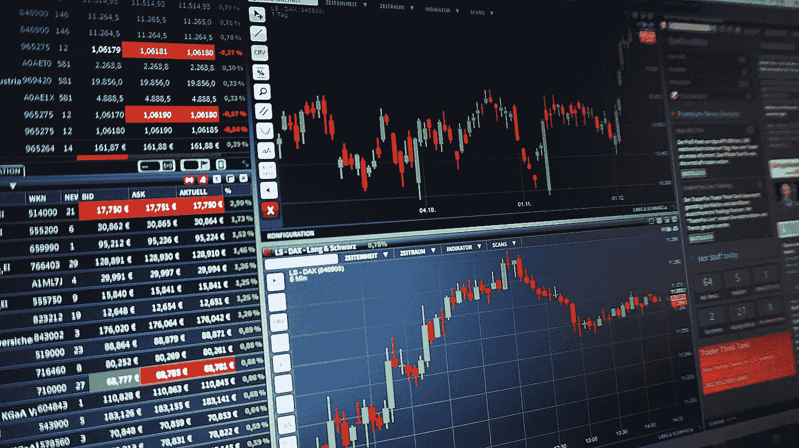

# 德克斯+ CEX =混合。密码交易的未来

> 原文：<https://medium.com/hackernoon/dex-cex-hybrid-the-future-of-crypto-trading-149a7bacbd4>

集中式和分散式加密货币交易所之间一直存在竞争。目前，大多数顶级交易所如币安、Bitfinex、BitStamp、火币、北海巨妖等都是集中的。它们更容易使用，给客户带来的压力更小，其中一些还提供了与法定货币的兼容性。虽然有很多值得欢呼的，但也有关于安全性和信任的严重担忧，导致一些交易者转向对用户不太友好的分散替代方案。

作为一名秘密投资者，你可能很难知道该把信心放在哪里。是否应该寻找你认为最不可能被黑的交易所？或者说[交易量](https://hackernoon.com/tagged/trading)最高的交易所怎么样？让我们看看与当前产品相关的一些特性，并思考该行业下一步的发展方向。

**集中交换功能**

加密货币及其背后的区块链旨在成为开源计划，其中社区拥有权力，而不是一个中央所有者(如政府或银行)。因此，可以公平地说，集中交易所代表着这种意识形态的转变，消费者将他们的信心寄托在一个以盈利为目的的当局身上。除了担心它们是否符合社区愿景之外，集中式交易所还引发了对资金安全的担忧。网络攻击在加密领域很普遍，上面提到的交换是主要目标。

另一方面，这些交流很受欢迎，因为它们代表着方便。没有必要担心记住你的私人钥匙或者你把你的 USB 线和离线钱包放在哪里。还有一个更强的 UX 焦点和更大的交易量需要考虑。

**分散交换功能**

分散式交易所更符合密码世界赖以建立的“我们不需要中间人”的精神。他们不依赖第三方服务来保存消费者资金，提供自动化的点对点交易。分散式交换机被认为更安全，因为它们运行在分散的节点上，这意味着一个中央系统不会被黑客攻击。其他好处包括匿名(不需要上传无数文件来验证你是谁)和没有交易费。

好得难以置信，对吧？是的，很遗憾。安全、匿名的点对点服务确实有其缺点——笨重的离线钱包配置、低流动性、糟糕的用户体验和低交易量等等。

**密码交易所的未来**

那么我们转向哪里？在一个渴望创新的世界，混合交易所可能是答案。加密货币交易商需要一个能够保护他们的资产和个人数据，同时提供用户友好体验的平台。一家创新技术初创公司 DINNGO 已经设定了一个目标，要通过提供这种服务来彻底改变这个行业。

[DINNGO](https://dinngo.co/) 想出了一个创新的方法来解决当今市场上存在的问题。

●他们的信用卡形状的冷钱包允许你离线存储数字货币，并通过无缝蓝牙集成将它们连接到 DINNGO exchange。

●定制的交易界面提供了与集中设计相关的所有好处。

●跨链交易。DINNGO 将支持不同协议之间的令牌交易。

我们知道这是一个有利可图的行业，你只需要看看币安的成功就知道了，但如果我们要看到长期的大规模采用，这是一个必须适应的行业。混合交易所看起来可能是这个行业需要的解决方案。