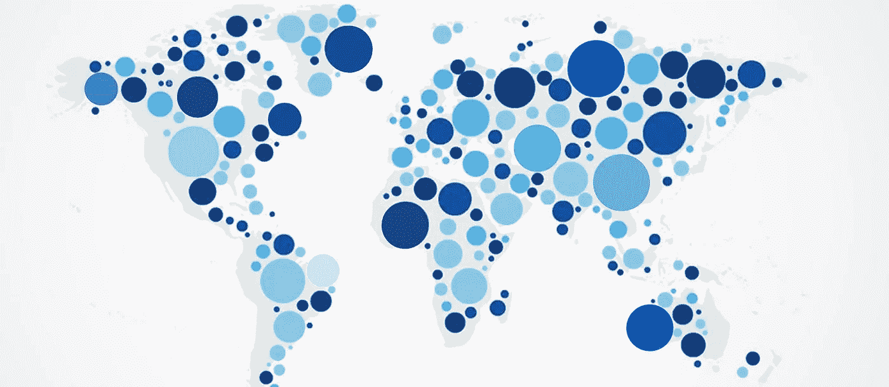

# 从全球到本地的技术转移

> 原文：<https://medium.com/hackernoon/digital-content-the-technological-shift-from-global-to-local-5c67cd329f0b>

## 用户似乎更欣赏新闻和社交媒体的本土基因。环球死了吗？

随着谷歌和脸书等科技巨头现在专注于本地——新闻和更多——已经脱胎于本地 DNA 的平台，如[thomascochran.com](https://medium.com/u/338fda763c89#))主管说道。“当我们的政治领导人不断说‘假新闻’时，人们开始相信它，”他补充道。

“这并没有减少对权威可信的信息中心的需求，”他继续说道。“也许这是一个类似于 100 多年前的时代的开端，那时每个大小城市都有一系列代表当地广泛观点的报纸。当时之所以行得通，是因为这是一种建立在广告和分类广告收入基础上的可行商业模式。金钱跟随消费者的欲望，如果这种趋势是真实的，有人会想出如何利用它。”

根据最近皮尤研究中心 [对大约 35，000 名美国人的调查](https://www.journalism.org/2019/03/26/for-local-news-americans-embrace-digital-but-still-want-strong-community-connection/)，数字时代正在对当地新闻产生影响。

Via [Dan Morrison](https://medium.com/u/c22608add5b3?source=post_page-----5c67cd329f0b--------------------------------) on Twitter.

如今，几乎有同样多的美国成年人表示，他们更喜欢从网上获取当地新闻，而不是通过电视机。41%的美国人表示他们更喜欢通过电视获得当地新闻，37%的人更喜欢在线新闻，这远远超过了那些更喜欢纸质报纸或广播的人(分别为 13%和 8%)。

皮尤强调，当地新闻消费者重视社区联系。

“在成为社区真正一部分的能力方面，公众对他们所在地区的新闻提供者也有很高的期望，”该研究继续说道，同时提到绝大多数成年人表示，对记者来说，了解他们所在社区的历史(85%)和亲自参与他们所在地区的活动(81%)至少有些重要，至少有十分之四的人认为这两者都非常重要。

据 Recode 报道，一年前，脸书[专门为本地新闻开发了一个新的应用](https://www.recode.net/2018/1/10/16871480/facebook-local-news-section-journalism)，现在在中称为*。Rani Molla 和 Kurt Wagner 解释说:“我们的想法是，充斥着来自各种各样的人、出版商和品牌的各种照片、视频、广告和活动的脸书想要创建一个特殊的板块，让当地的新闻和活动脱颖而出。”*

然而，引用 Axios 联合创始人迈克·艾伦的话，“找到对你、你的工作和你的社区重要的新闻变得越来越难。”

脸书也是如此，因为该公司很难找到当地新闻。这就是为什么脸书最近宣布了一个新的试点项目，即*脸书新闻(FPJ)项目社区网络*，“以支持旨在通过当地新闻建立社区的项目。”

脸书的吉米·奥基夫(Jimmy O'Keefe)和乔希·马布里(Josh Mabry)写道:“无论出版商是试图围绕会员资格建立新业务，还是在服务不足的社区进行报道，还是开发一种工具来帮助当地的故事讲述者找到并吸引新闻受众，我们都希望为他们提供服务社区的平台。”。

 [## 支持新闻沙漠研究-facebookjournalismproject.com

### 在过去的 25 年里，新闻沙漠——很少或根本没有本地报道的社区——已经出现，并且…

facebookjournalismproject.com](https://facebookjournalismproject.com/article/supporting-research-on-news-deserts/) 

同样，根据 [Sara Fischer](https://medium.com/u/ccd7faea54f5?source=post_page-----5c67cd329f0b--------------------------------) 在 [Axios](https://medium.com/u/5e0bd5d0161a?source=post_page-----5c67cd329f0b--------------------------------) 的独家报道，谷歌通过[谷歌新闻实验室](https://medium.com/u/f226348241d4?source=post_page-----5c67cd329f0b--------------------------------)和谷歌新闻倡议，将资助美国各地的几十个新的地方新闻网站，并最终覆盖全球。

该项目名为 *GNI Local Experiments Project，*的目标是测试本地商业模式的新方法，以帮助整个行业了解什么可行，什么不可行。Axios 报道称，“这家科技巨头表示，它对这些网站没有编辑控制权，这些网站将由它选择的具有当地新闻专业知识的合作伙伴来建设。”

第一项努力是与美国 30 个市场的领先本地新闻和信息提供商 [McClatchy](https://medium.com/u/189eecb22d1d?source=post_page-----5c67cd329f0b--------------------------------) 合作，以及他们新推出的 *Compass Experiment* 。

 [## 麦克拉奇和谷歌合作建立了一个本地新闻实验实验室

### 编者按:谷歌新闻倡议正在庆祝其一周年，看看合作和工作…

www.blog.google](https://www.blog.google/outreach-initiatives/google-news-initiative/mcclatchy-and-google-partner-experimental-lab-local-news/) 

McClatchy 总裁兼首席执行官克雷格·福尔曼说:“指南针实验不是为了对本地新闻进行渐进式改进。“这是关于提出新的方法，并利用麦克拉奇和谷歌的专业知识来创造新的模式。”

他继续说道:“谷歌不会参与任何编辑工作或决策。”

然而，对于本地新闻来说，这并不容易。彼得·卡夫卡(Peter Kafka)写道,“当地媒体——那些应该告诉你孩子的学校、分区委员会或州议会正在发生什么的媒体——真的遇到了麻烦:他们在许多年前失去了最有价值的收入来源，从那以后，他们一直在萎缩，萎缩，或者干脆关门大吉。"

在这种环境下，当然有平台做得更好。

“在这种背景下，看看 [Patch](https://patch.com/) ，这是一家全数字本地新闻公司，你可能几年前就不再关注它了，当时 AOL 曾经拥有这家公司，”卡夫卡说。"不管是好是坏，这可能代表了本地新闻的未来."

 [## 你垂死的地方报纸的替代品是由一个人写的，一个机器人，还有你

### 也许你已经读到媒体的未来岌岌可危。但这可能夸大了事实。几个大的，全国性的…

www.recode.net](https://www.recode.net/2019/2/11/18206360/patch-local-news-profitable-revenue-advertising-hale) 

他继续说道:“以下是关于 Patch 的乐观消息: [Charles Hale](https://medium.com/u/955dacf2421d?source=post_page-----5c67cd329f0b--------------------------------) ，这位在过去五年中拥有该公司的投资者说，他的 1200 个超本地化网站网络正在盈利，每年的广告收入超过 2000 万美元，没有付费墙。该公司由前《纽约时报》记者沃伦·圣约翰(Warren St. John)领导，目前雇佣了约 110 名记者，他们的平均基本工资在 45，000 美元至 60，000 美元之间，共有 150 名员工。在美国在线旗下的巅峰时期，Patch 拥有近 1000 名员工。

在欧洲，当地社区一直是 local 的关注焦点，Local 是一家总部位于斯德哥尔摩的新闻出版商，由董事总经理 Paul Rapacioli 和执行主编 James Savage 共同创立，其座右铭是“正宗欧洲新闻，本地采购”

“我们当地的小众读者是我们读者群不可或缺的一部分，反过来，我们觉得我们为他们周围的当地世界提供了一个重要的联系，”Local 的社交媒体经理马特·霍普解释道。"我们的脸书小组通过如此多的本地化讨论证明了这一点."

“我们为读者提供的价值是，我们为他们提供英语的当地新闻，即不是当地的母语，如瑞典语、法语或德语，所以我们提供的新闻不仅弥合了语言差距，也弥合了文化差距，因此是他们与当地社区关系的重要组成部分，”Matt 解释道。

当谈到社交媒体平台时，一些人总是投资于当地的社区结构以及线上和线下的混合，用户只有在现实生活中创造机会和利益时，才能享受数字存在。显然，Nextdoor 就是这种情况，它是 2010 年由[尼拉夫·托利亚](https://medium.com/u/8e64d6464f14?source=post_page-----5c67cd329f0b--------------------------------)、[莎拉·利瑞](https://medium.com/u/89f5b6c89d43?source=post_page-----5c67cd329f0b--------------------------------)和[普拉卡什·贾纳基拉曼](https://medium.com/u/382ba8ec938?source=post_page-----5c67cd329f0b--------------------------------)推出的社区社交网络。如今，该平台的恶名在 2017 年墨西哥湾沿岸的飓风季节呈指数增长，在美国超过 20 万个社区以及国际上的许多社区都可以使用，包括英国、德国、法国、意大利、西班牙、荷兰、澳大利亚，拥有数千万用户。

“在 Nextdoor，我们知道当社区变得更强大时，邻居会相互交谈，好事就会发生，”新任命的首席邻居 Sarah Friar 说，他是该公司的首席执行官。“我们对当地的热爱超越了社区界限，包括当地企业和公共合作伙伴。所有这些都编织成社区的结构。”

智能门铃制造商 Ring 最近被亚马逊收购，正在为其用户建立一个类似的平台，名为 Neighbors。该应用程序是一种新的邻里监督工具，“将您的社区聚集在一起，帮助创建更安全的社区”，具有来自邻居、执法部门和 Ring 团队的实时犯罪和安全警报。

显然，像 Yelp 和 Foursquare 这样的平台，凭借其地理定位服务和签到工具，已经在所有活动中嵌入了真正的本地 DNA，尽管仍保留了它们的全球足迹。

Via [Alex Heath](https://medium.com/u/15c02b788a91?source=post_page-----5c67cd329f0b--------------------------------) on Twitter.

还有最近刚推出的一款新 app，Twenty。这是一个新的社交媒体工具,它无缝地允许用户看到他们的哪些朋友在附近，他们稍后在做什么，发现附近的活动，并协调在现实生活中见面的计划。大多数社交网络产品都允许用户分享过去或现在发生的精彩经历。

“知道你的朋友在哪里，他们在做什么，有巨大的价值。该平台的战略合作伙伴之一 Endeavor 的总裁马克·夏皮罗说:“Twenty 已经悄悄地建立了最好的位置共享产品，我们相信他们有机会成为下一个突破性的技术公司。

“技术只是一种工具。它可以通过把我们聚在一起来改善我们的生活，也可以通过把我们彼此隔离来减少我们的生活，” [Thrive Global](https://medium.com/u/7d4ed6557db?source=post_page-----5c67cd329f0b--------------------------------) 的[阿里安娜·赫芬顿](https://medium.com/u/f76807050198?source=post_page-----5c67cd329f0b--------------------------------)说，他将加入 Twenty 的董事会。“看看数据，听听全国各地使用 Twenty 的人的意见，很明显，Twenty 证明了技术可以真正成为我们生活中的一股力量。”