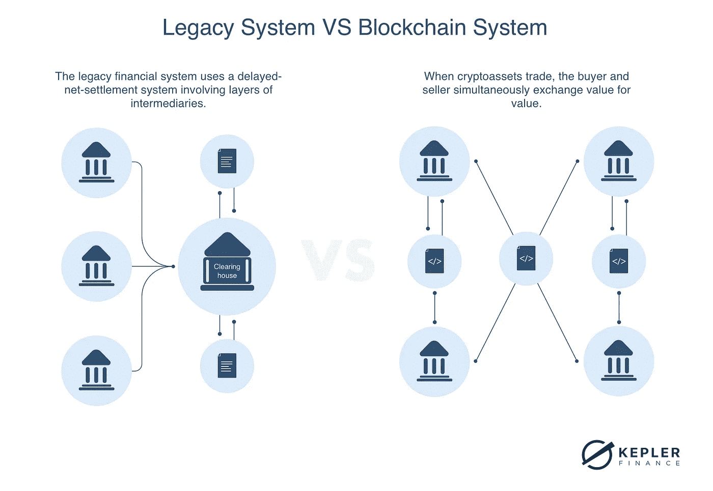
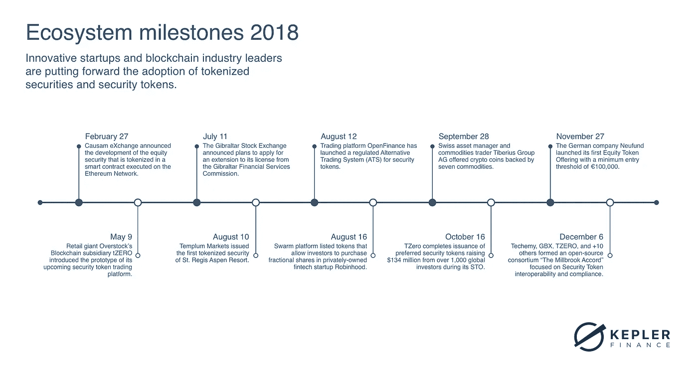
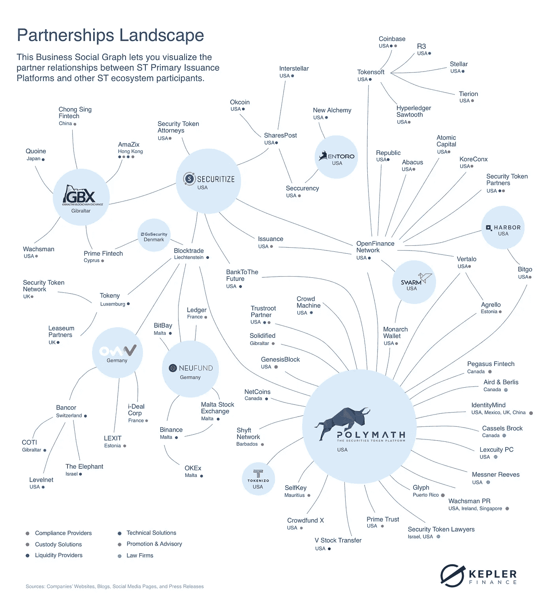
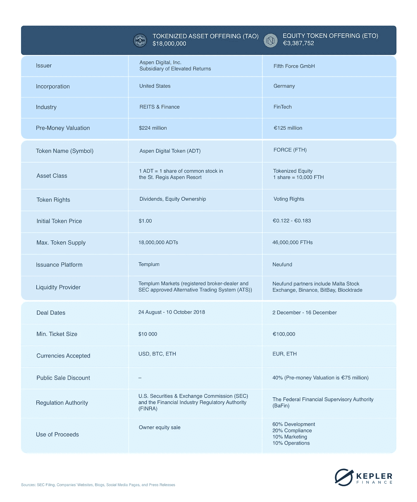
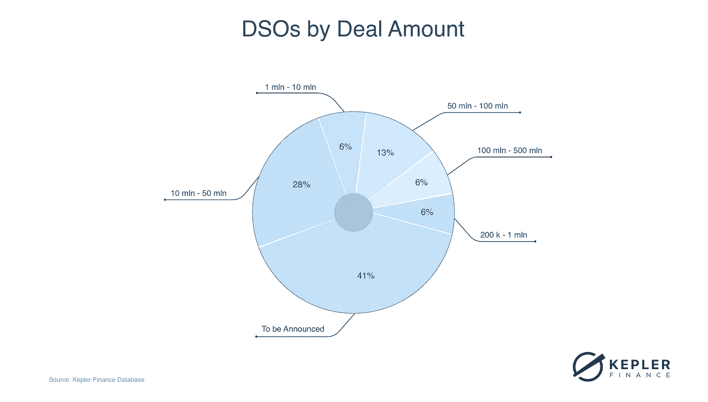
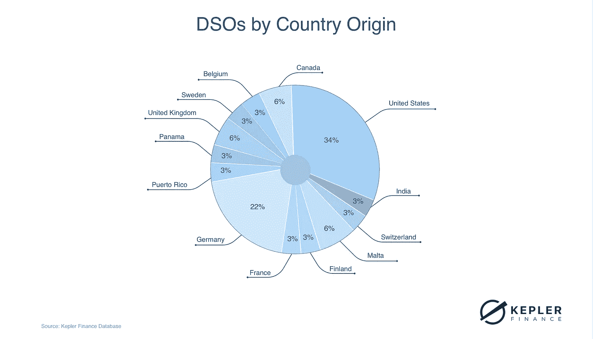
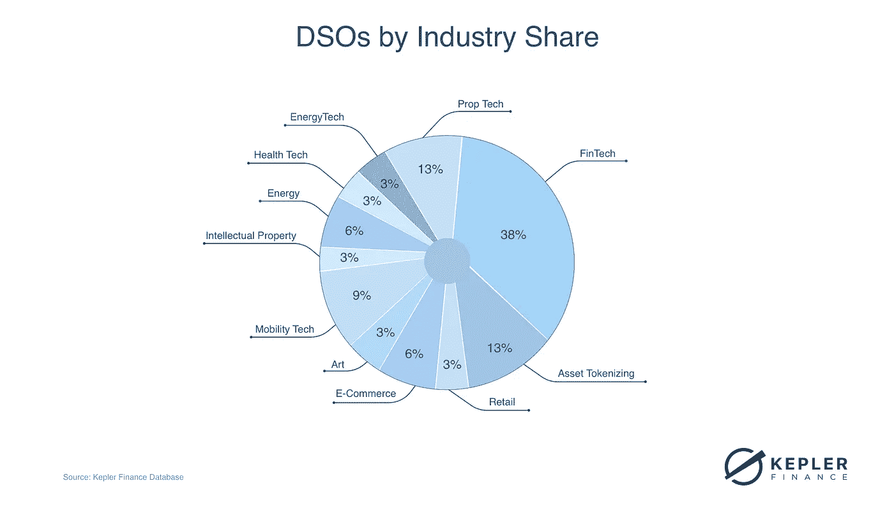
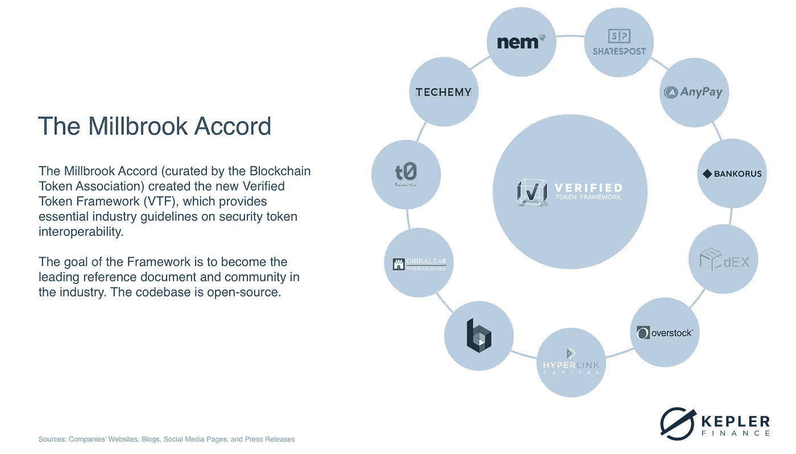
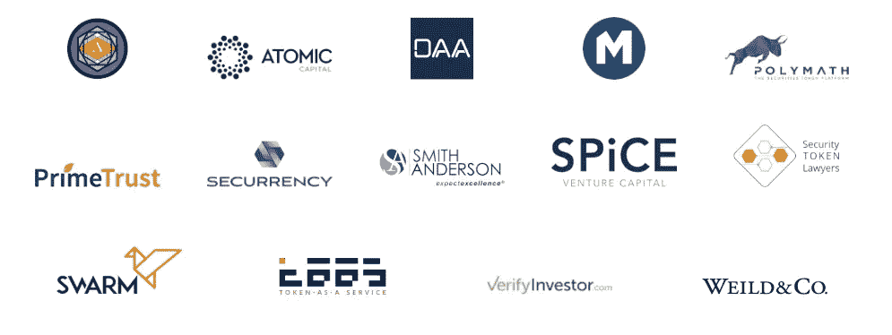

# TeqAtlas 的数字证券市场研究 2019(prev。开普勒金融)

> 原文：<https://medium.com/hackernoon/digital-securities-market-research-2019-by-kepler-finance-aab927734f80>

# 介绍

随着区块链行业继续以极快的速度发展，跟上时代变得前所未有的重要。然而，对大多数投资者来说，知道在这方面该相信什么来源是困难所在。

数字证券市场将会大受欢迎，尽管目前几乎没有可操作的信息。出于这个原因，我们编辑了这项研究，包括事实、数据和见解，让你发掘它们的价值。最后，我们希望弄清楚为什么它们构成了一个可信的技术框架，以及它们与以前的行业标准有什么不同。

# 证券数字化

直到现在，传统金融还没有经历大规模的颠覆性变革，行业参与者需要找到创新的方法来扩大规模。

资产数字化(又名令牌化)正在创造**一种全新的用户体验**。例如，数字化资产和使用智能合约使股票所有者能够在投诉交易所按需出售私人证券股票，而不会遭受他们的资金被锁定在基金中多年的痛苦。

基本上，新技术提高了创建交易的便利性，即**【流动性】**。它没有对金融安全本身做任何事情，但它改变了所有权的管理方式以及投资后活动的自动化方式。

但是，大家也应该意识到，目前，[数字化](https://kepler.finance/blog/digital-securities-market-glossary.html#digitization)过程可能带来未知的风险。这就是为什么我们对数字证券市场中的一些领先公司进行了一系列采访，以补充我们的事实调查分析。我们采访了发行平台和流动性提供商、托管服务提供商、法律顾问、发行人和投资者，为您提供更多背景信息。你会发现他们的洞察力贯穿始终。

# 市场生态系统

像成功的公司一样，成功的生态系统会经历不同的阶段。数字证券市场在整个 2018 年都面临着这些主要问题:这些资产最终会成为更有声誉的生态系统中的新规范吗？它能吸引大量资金吗？为什么 s to 通常是更好的融资方式？根据开普勒金融公司的研究，去年通过一系列里程碑事件最终回答了这些问题。

数字证券生态系统是几个元素的组合，它们共同提供了从数字证券的创建到交易的整个活动范围。这些要素包括:代币发行、法律验证、法规遵从性、资产托管、代币交易流动性。所有这一切，包括发行，都将自动化。

协议正是让系统工作的原因。该协议保证代币根据用于筹资的任何豁免保持监管合规性。它管理谁可以相互交易，谁可以持有令牌。该协议还可以比传统生态系统更有效地拒绝尝试的交易，如果它将违反合规性的话。

市场上的领导者之一——[secure ncy](https://kepler.finance/companies/1529)——正在开发一种可互操作的多账本协议，以保持链上和链下的合规性。它与遗留系统和 DLT 相互作用。在大多数情况下，公司专注于开发发行平台、代币协议或二级市场交易手段。另一方面，有些公司有一个完整的端到端平台，各方可以在全球范围内进行互动。

随着数字证券在金融市场的发展，一个清晰的基础设施开始形成。投资者正在采取行动，向支持数字证券发行、交易和托管的项目投入大量资金。 [Harbor](https://kepler.finance/companies/1119) ，它提供了一个平台和合规协议，以规范私募证券在区块链的发行和交易方式，从主要的硅谷风险投资公司筹集了 2800 万美元的资金。[证券化](https://kepler.finance/companies/750)筹集了 1275 万美元，通过区块链技术将遗留证券数字化。根据开普勒金融数据库，已有超过 6.4 亿美元投资于开发旨在将资产和证券数字化主流化的技术的公司。全球合作伙伴网络正处于早期发展阶段。

> *我们将看到更多的经纪自营商、更多的交易所、更多的投资顾问、更多的律师和更多的众筹门户网站拥抱证券的令牌化。2019 年，市场将变得更加专业，规模更大，更具活力。*
> 
> *斯科特·珀塞尔
> 首席执行官兼首席信托官*[*Prime Trust*](https://kepler.finance/companies/1554)

以下是市场先锋对新兴生态系统中各种角色的看法

> 需要注意的是，Polymath 不是一个投资平台。在这个平台上，公司可以轻松创建具有内置传输限制的安全令牌，并使用我们构建的经审计的智能合同来实施他们自己的安全令牌产品。该公司的投资者不投资 Polymath 平台上的 sto。相反，他们会参与，但公司已经决定进行销售，这可能是通过公司直接，经纪交易商，或投资平台。
> 
> *格雷姆·摩尔
> 布道者* [*博学者*](https://kepler.finance/companies/1121)
> 
> 我们不是经纪交易商，也不是授权人。我们是一个技术平台，我们只是为公司提供工具，让他们能够进行端到端的合规令牌发行，并在发行后以合规的方式管理这些令牌。在我们看来，平台本身，技术本身，远比传统的发行方式更有效率。因为，当然，你必须让你的用户参与进来，进行你的 KYC，你的反洗钱。所有这些都将自动化，发行本身也将自动化。
> 
> [*帕特里克·坎波斯*](https://kepler.finance/blog/interview-patrick-campos.html) *首席战略官* [*安全顾问*](https://kepler.finance/companies/1529)

# 数字证券产品:统计数据和见解

对数字证券发行流程的初步发现应该从这样一个认识开始，即令牌化格式的证券发行不是 ICO 的新发展版本。这是一种传统的金融工具，以一种新的更高效的数字格式交付。一家计划发行代币的公司不应该认为它会立即上市，全球数百万投资者会争相购买他们的代币，像他们对 ico 那样进行交易。

你可能会认为，既然问题是趋势，就有很多完整的数字证券产品，但事实并非如此。令牌的注册和发放并不那么简单，它需要主要利益相关者几个月的工作。开普勒金融公司分析了两个已完成的产品，以展示一个成功的数字证券产品的主要组成部分。

毫无疑问，我们将会看到更多成功达成的交易。根据开普勒金融数据库，32 种数字证券被宣布在发行平台上市，如 [Polymath](https://kepler.finance/companies/1121) 、 [Neufund](https://kepler.finance/companies/1115) 等。从下面的信息图表中，我们看到大多数宣布即将进行交易的发行人位于美国，因为那里的基础设施现在已经相当发达。德国有机会成为欧洲的区块链中心，因为 Neufund 等主要市场参与者提出了许多游说倡议，旨在实现股权融资的民主化。

数字证券发行是一种全新的筹资形式，公司面临着各种挑战，因此我们询问发行人**他们为什么决定以这种方式筹资:**

> *使用 STO 的一个主要因素是执行和整合所有部分的成本。IPO 需要大量的资源(时间和金钱)，有大量的文书工作，不适合像公司这样的初创企业。由于可编程令牌的性质，我们可以实现不同的功能，使令牌更加健壮。智能合约可以帮助我们处理自动支付股息等重复性的事情。我们可以烤 KYC 支票，所以代币只能送给认识的人。此外，智能合同允许我们消除中间人，进一步削减管理成本。安全令牌将全天候交易，几乎可以即时结算。区块链的安全性和透明度以及随时审计系统的能力。这将增加信任和可信度，我们相信这些功能会使公司更加合规。[……]区块链肯定证明了它对于收集和管理资本是有用的。*
> 
> *Andris Merkulovs
> 首席执行官* [*货币化者*](https://kepler.finance/companies/334)
> 
> *做 STO 比 IPO 更划算。你可以接触到更广泛的网络，STO 是一个全球性的产品。投资者跟踪投资的数字分类账。通过 STO 出售部分所有权更容易。*
> 
> *Jason Kirschenbaum
> 高回报公司常务董事&阿斯彭数字公司* [*阿斯彭数字公司*](https://kepler.finance/companies/1530)

据 [Swarm](https://kepler.finance/investors/1239) 的克里斯·埃伯勒称，在开始捕获和令牌化区块链资产的过程之前，**潜在的令牌发行者必须考虑以下重要问题**:

> ***资产类型:*** *被令牌化的资产类型会影响令牌的结构。* ***管辖地:*** *代币发行人的注册地、目标投资者的所在地、基础资产的实际所在地以及与交易处理地相关的任何限制。* ***法人单位:*** *为法人单位(LLC、SPV、合伙等)确定理想的公司结构和法定住所。)，它充当令牌持有者和基础资产之间的接口。
> [……]* ***资金:*** *代币的购买(以及资本的分配)是否会仅限于加密货币，或者它是否也接受法定货币，以及如何筹集这些资金。* ***营销:*** *向相关市场的适当目标受众推广任何筹款活动都至关重要。一场精心策划的战略性活动对于成功的筹款至关重要。* ***保管:*** *对于规模较大的机构投资者来说，出于安全性和合规性的要求，确保安全地存储分配的资金是很重要的。* ***二级交易:*** *与代币发行一样，证券代币的二级交易在大多数司法管辖区都受到严格监管。与了解并能够确保法规遵从性的交易所建立安全的交易功能非常重要。* ***分配后考虑事项:*** *投资者沟通和社区管理、股息支付、报告和更新 NAV、审计、税务、治理*
> 
> *克里斯埃伯勒
> 首席运营官* [*蜂群*](https://kepler.finance/investors/1239)

我们询问了首批推出 sto 的公司是如何推广他们的产品的:

> *我们通过内容营销渠道创造轰动效应。由于数字证券是一个相当新的术语，我们花了很多精力来解释它是什么。我们使用自己的渠道，如博客和社交媒体，以及媒体采访和在相关行业活动中的演讲。我们不仅瞄准加密货币社区，也瞄准游戏行业，为我们的社区赢得基础。因为游戏玩家已经熟悉虚拟货币，所以学习曲线更低，更容易抓住他们的注意力。*
> 
> *Andris Merkulovs
> 首席执行官* [*货币化者*](https://kepler.finance/companies/334)
> 
> *我们通过支付 Indiegogo 作为我们的营销代理以及其他媒体渠道的费用，围绕我们的产品创造了轰动效应。*
> 
> *Jason Kirschenbaum
> 高回报公司常务董事&* [*阿斯彭数字公司*](https://kepler.finance/companies/1530)

Tokeny 的 Luc Falempin 也分享了他对计划在平台上发行代币的公司的建议:

> 发行人应该有一个结构良好、考虑周到的发行计划来吸引投资者。首先，他们加入技术和商业证券提供商的正确生态系统非常重要。第二，为了让发行者联系并吸引他们的受众，我们建议采用以客户为中心的营销方法。通过了解不同类型的投资者角色的价值、他们的特征、他们运作的渠道，发行人可以确保他们的营销活动将高度相关和有效。
> 
> *吕克·法兰平
> 首席执行官* [*花拳绣腿*](https://kepler.finance/service/114)

# 进入市场的障碍

整个行业看起来鼓舞人心，充满希望，但是愿意进入这个市场的公司面临着各种各样的挑战。以下是主要市场参与者指出的问题。

> *首先，有一个关于安全令牌的知识学习曲线需要你去克服。这不仅适用于团队本身，也适用于投资人。有些投资者在未知的环境中会感到不舒服，所以你需要注意并准备好教育他们。第二个主要缺点是不确定性。这适用于多种媒介。如果从法律的角度来看，所有的框架和法规都还在准备中。虽然这是一个新的资产类别，但它仍然按照旧的法律运作，这可能会产生一些冲突。我们看到这将是一个漫长的过程，让所有实体得出一个共同的结论，但这将是值得的。不确定性也存在于基础设施方面。尽管我们读到了安全令牌交易所的建立和法律的最终确定，但整个生态系统还远未准备好充分发挥作用。我们正处于早期阶段，每个人都还在为整个工作打下基础。所以很多事情都会出错。*
> 
> *安德里斯·梅尔库洛夫斯
> 首席执行官* [*货币化者*](https://kepler.finance/companies/334)
> 
> 我们今天看到的创建和发行安全令牌的主要障碍是筹资和法律工作。有了 Polymath，你可以在 10 分钟内轻松创建一个安全令牌，所以技术已经解决了，但仍然需要花费大量时间的是公司的筹款和法律工作。
> 
> *格雷姆·摩尔
> 布道者* [*博学者*](https://kepler.finance/companies/1121)
> 
> *美国以外的许多司法管辖区缺乏支持安全令牌发行的法律和监管框架，尽管各国最近采取的行动旨在改变这种状况。在美国，根据定义，证券代币发行属于证券，因此 sto 必须遵循与传统证券发行相同的规则，并接受证券交易委员会(SEC)的监管。抛开法律和监管不谈，进入的障碍是:
> ●随着更多服务提供商的法律、令牌化和其他技术成本下降，新兴筹资方法的交易成本预计将下降。
> ●提高投资者对 sto 的认识、了解和接受程度，尤其是在许多情况下，投资者需要是合格投资者。*
> 
> *约尔法
> 联合创始人*[*VerifyInvestor.com*](https://kepler.finance/companies/1349)
> 
> 主要的障碍不再是技术上的，因为许多公司让通过 STO 融资的公司变得更容易，而是教育。发行者和投资者必须习惯于发行代币而不是股票。这需要时间，但这是事情的发展方向。
> 
> *Scott Purcell
> 首席执行官兼首席信托官* [*Prime Trust*](https://kepler.finance/companies/1554)
> 
> 这些障碍很大，从某些国家对令牌化产品的全面禁止，到其他国家不确定的监管分类。尽管 2017 年围绕 ico 存在不确定性，但美国实际上已成为最受令牌化证券欢迎的市场之一。美国证券交易委员会在 2017 年全年暗示，大多数令牌化产品都是证券，这促使明智的参与者在 ICO 热潮的早期探索注册豁免。这导致了 BCAP 和科学令牌的销售，为未来的合规产品提供了蓝图。总体而言，中国仍缺乏允许大型基金管理公司向该资产类别投入大量资本的制度基础设施。Open Finance Network 的交易系统最近向公众开放，纳斯达克承诺建立一个安全令牌交易所，富达努力创造机构质量的托管服务，这些都应该开始纠正这些缺点。
> 
> *Henry K. Elder
> 数字资产顾问* [*的联合创始人*](https://kepler.finance/service/113)
> 
> *对于发行人来说，我不认为有什么以前不存在的进入市场的壁垒。事实上，障碍可能会更低；我们希望它们更低，因为使用技术的能力将有助于降低成本，并真正简化资本形成的过程。发行人这样做要容易得多；他们的金融顾问、经纪自营商或其他授权人员使用该技术筹集资金变得容易得多，因此现在不像过去，如果你想筹集 1000 万到 3000 万美元，你真的需要通过投资银行工作，费用会很高。现在，这项技术的易用性和高效性确实应该会降低费用，使这些小型产品更容易进入市场。*
> 
> *帕特里克·坎波斯
> 首席战略官* [*安全官*](https://kepler.finance/companies/1529)
> 
> 对于代币发行者来说，最大的障碍实际上是拥有值得进行代币化的资产。然后是合理的法律/财务顾问的前期成本。然后是真正的营销投入。对于该领域的服务提供商、代币发行平台等而言，实际进入壁垒很低。在这一点上，规模的壁垒相当高。创建令牌很容易。在一个可以安全持有、合规交易、具有真实流动性的生态系统中创建这种债券，是该行业目前尚不具备的基础设施。我们认为，只有开放的基础设施(相对于集中式盈利公司的围墙花园解决方案)才能满足这种需求。
> 
> *克里斯·埃伯勒
> 首席运营官* [*蜂群*](https://kepler.finance/investors/1239)
> 
> ***教育。*** *令牌化证券诞生于加密市场，因此我们的挑战是教育人们，合规的令牌化证券不仅是合规的，更重要的是，它们是监管强制的，这意味着它们不仅满足现有监管的要求，还能自动阻止代码中的任何错误交易。
> 进入令牌化证券市场的第一道关键关卡是* ***部署受监管的交易所和交易平台*** *。全世界有几十个这样的倡议，但完成监管过程需要大约一年的时间，安全令牌行业仍然没有一年的历史。我看到这个障碍在 2019 年的 Q1/Q2 被打破。
> 下一个障碍将是改善* ***法规****——我们可以利用现有的法规，但它们不是为数字贸易设计的，因此监管机构可以轻松改善该行业的前景。
> 第三个障碍是* ***平台*** *的可扩展性，据我所知，许多科技公司正在解决这个问题，当市场达到规模时就会出现。*
> 
> *阿米本-大卫
> 联合创始人&管理合伙人* [*香料风险投资*](https://kepler.finance/companies/1303)

# 法律视角

将证券数字化并使用智能合约可以自动执行适用的金融市场规则和法规。这些规则可以针对本地或全球市场进行编码，这是一个非常强大的概念。区块链有史以来第一次允许这种情况发生。但是下一阶段将会带来挑战。这需要时间，但这是事情的发展方向。列出整个 2018 年在法律里程碑方面取得的成就，我们希望有助于展示下一步的方向。

在一个不断发展的市场中，了解哪些国家的立法框架对 STO 最友好也很重要。我们邀请了 Security Token Lawyers 的联合创始人齐夫·凯南律师来澄清这个问题:

> *sto 与 ico 有很大不同，因为如果操作正确，在发行安全令牌时几乎没有监管风险。你可能会说 sto 是电子包装中的私募。结果是，你可以在任何允许出售私人证券的司法管辖区发行证券代币，包括美国和欧盟。有了 STOs，就没有必要跑到世界的边缘去寻找一个友好的司法管辖区。也就是说，除了遵守证券法之外，还有许多其他考虑因素。例如，一些银行不会与加密相关的基金合作，这意味着如果你的 STO 接受加密，那么你应该找到一个加密友好的银行。另一个考虑是税收。STO 代币的交易和流动性引发了一些问题，这些问题至今尚未完全解决。*
> 
> *高级齐夫·凯南
> 联合创始人* [*安全令牌律师*](https://kepler.finance/service/111)

我们询问了专家们**哪些国家可能在 2019 年遭遇最多的暴风雪**。以下是他们对此事的想法:

> *STO 结构可能很复杂，由于公司和潜在 STO 投资者面临潜在的税务和会计问题，公司应仔细评估要合并的司法管辖区。此外，如果安全令牌不仅仅是金融安全令牌(例如 REIT 中的有限合伙人权益)，而是计划使用区块链技术作为其运营不可分割的一部分的公司的融资，那么选择支持区块链技术的管辖区是至关重要的。该国是否向区块链公司提供激励措施，制定积极的立法并吸引必要的服务提供商来支持区块链生态系统？目前的领导者似乎是马耳他。*
> 
> *Margaret Rosenfeld
> 在*[*Smith Anderson*](https://kepler.finance/service/112)引领区块链技术实践
> 
> 我们可能会看到一些 STO 走出美国。那里的基础设施现在已经相当发达了。此外，新加坡、开曼群岛、斯威士兰、英国和德国。
> 
> *高级齐夫·凯南
> 联合创始人* [*安全令牌律师*](https://kepler.finance/service/111)
> 
> *我们看到这些事情到处都在发生，人们带着伟大的想法来到这里。不过，我碰巧认为，大部分活动将在美国进行。[……]我说的是传统证券，我们说的是成熟的传统金融市场。所以我相信，你会看到更多这样的产品从美国和其他成熟市场涌现出来。因此，我们将看到更多真正的安全代币从传统的金融中心发行出来，比如最初的美国和英国、香港和新加坡等地。这项技术的真正意义是让过去只发生在这些传统金融中心的事情在世界各地发生，在较小的市场发生，较小的金融专业人士能够为当地社区服务。但不会从那里开始。我认为它仍将通过传统市场发展，然后从那里开始扩张。*
> 
> *帕特里克·坎波斯
> 首席战略官* [首席战略官*首席战略官*首席战略官](https://kepler.finance/companies/1529)

# 米尔布鲁克协议

为了安全令牌运动的发展，公司需要在一个公正的标准上达成一致。考虑到这一点，由 [Techemy](https://kepler.finance/investors/1258) 牵头的高调公司在新西兰举行的区块链南方 2018 领袖峰会上成立了一个工作组 Millbrook Accord。他们的合作创造了一个共同的框架，以促进安全令牌的市场互操作性，称为验证令牌框架(VTF)。

越多的玩家聚在一起越好。与 VTF 的协同工作可以为加密和区块链驱动的金融的下一步发展铺平道路。

# 专家对发行人和投资者的建议

> *了解其管辖范围内的监管合规要求以及代币发行方在这方面的义务。说服管理层分配大量营销预算，并为令牌开展专业活动。管理售后投资者关系和沟通。建立投资者对他们团队和项目的信任，特别是如果他们没有专业知识和成功的公开历史。流动性——这个生态系统刚刚建立，因此目前交易所和其他流动性来源有限。*
> 
> *克里斯·埃伯勒
> 首席运营官* [*蜂群*](https://kepler.finance/investors/1239)
> 
> 对于发行人和他们的金融专业人士来说，他们真的需要明白，他们必须在两件事上做得更好:第一，向那些传统投资者解释，令牌化并不是一件可怕的事情，这对他们来说实际上更好；第二，更重要的是，他们需要明白，他们需要接触更广泛的投资者群体[……]，这些投资者在历史上没有直接参与资本市场。确保他们正确地构建了交易[……]，并与他们的律师密切合作以合法地构建交易，并且不仅了解他们发行所在的司法管辖区的合规要求，还了解他们销售证券所在的司法管辖区的合规要求。(给投资者)*我的建议是理解和信任这项技术。作为一名投资者，你所获得的收益与你在传统意义上投资一家公司所获得的收益没有什么不同，只是这种形式:第一，提高了效率；第二，因为它位于区块链，永远记录交易；第三，这种形式使随后的代币交易更加容易，因此流动性的前景比区块链时代之前的私募股权或私人债务工具要好得多。*
> 
> *帕特里克·坎波斯
> 首席战略官* [*安全*](https://kepler.finance/companies/1529)

# 专家对 2019 年的预测

> 证券的令牌化和令牌化证券将继续以稳定的速度增长。满足以下条件时会加速:各大品牌证券交易所开始挂牌代币(如纳斯达克、纽交所、LSE、德交所、香港、新加坡等。)华尔街的大公司以承销商的身份加入了这场竞争，分销商和他们的散户投资者可以从他们的证券账户中获得投资。托管问题得到解决与此同时，我们将在接受监管(如 SEC 和 FINRA)的投资银行(如 Weild & Co .)和 ATS(如 Templum、INX)中看到许多较小的创业进入者。这些实体最终可能会被规避风险的大型公司收购，这些公司是老牌公司和后来的进入者。我们正在离开这些市场的无政府主义和自由主义阶段，并看到这种技术的本质——进化，而不是革命，承诺显著节约成本和创新证券(代币)结构的能力。
> 
> *大卫·威尔德四世
> 董事长&首席执行官* [*威尔德&公司*](https://kepler.finance/investors/1514) *前副董事长&纳斯达克股票市场执行副总裁*
> 
> *明年的安全令牌市场前景看好。我们可以看到，关键的生态系统部分正在建立，特别是机构服务，如托管、贷款和银行服务，这导致机构参与者的兴趣增加。美国证券交易委员会和世界各地的其他监管机构正在组建委员会，以解决和定义这一切应该如何看起来和工作。在我们获得法律确认后，投资者会感到更安全，并开始考虑使用这种数字资产。总的来说，随着所有平台和交易所的推出，我们将在明年看到更多的牵引力。*
> 
> *Andris Merkulovs
> 首席执行官* [*货币化者*](https://kepler.finance/companies/334)
> 
> 我预计未来一年数字安全市场将会发生巨大的变化。围绕着萌芽中的创新的能量是显而易见的，因为它涉及区块链和金融，但也有来自发行者和投资者的恐慌，因为仍有如此多的不确定性。然而，“密码冬天”给了公司时间来专注于构建和开发更好的代码、系统、团队和产品。我预测，当大型金融公司继续效仿富达(Fidelity)等公司，宣布参与并致力于数字资产时，变革的步伐将显著加快。
> 
> *凯利·麦格拉思
> 运营总监* [*原子资本*](https://kepler.finance/companies/1531)
> 
> 2019 年的关键发展是在世界各地部署受监管的交易所和交易平台。一旦这个重要的基础设施到位，市场就可以开始快速增长。我还看到第一代安全令牌成熟，市场选择事实上的领导者，因此部署可交易的安全令牌变得容易得多。在 2019 年底，我们将开始看到第二代协议进一步改善安全令牌。我们看到机构投资者的学习曲线逐月改善——最高层的人现在开始意识到证券数字化的巨大潜力——这是开放全新市场的潜力，迄今为止，这个市场完全缺乏流动性。2019 年，我认为所有类型的公司都将实现股票和债务证券(及其组合)的数字化。更具体地说，房地产令牌化将是一个主要领域。
> 
> *Ami Ben-David
> 在* [*SPiCE 风险投资*](https://kepler.finance/companies/1303) 的联合创始人和管理合伙人
> 
> 我们预计，2019 年将有更多公司和投资者大举进入这个领域。将会有更多的安全令牌交易场所，以及服务提供商，如专门提供安全令牌的法律公司，安全持有投资者安全令牌的托管人，以及帮助 s to 筹集资金的顾问。根据我们看到的需求，将会有许多公司通过 sto 筹集大量资金。安全令牌代表了对传统金融技术堆栈的巨大改进，价值数万亿美元的安全令牌出现只是时间问题。
> 
> *格雷姆·摩尔
> 布道者* [*博学者*](https://kepler.finance/companies/1121)
> 
> *发展。我看到了健康的基础设施和发行发展。在基础设施方面，令牌化、发行、交换和托管方面的持续机构投资和人才参与将推动技术进步。在发行方面，发行者的浓厚兴趣和券商参与度的提高将共同催生有趣的交易。*
> 
> *约尔法【VerifyInvestor.com】联合创始人* [*约尔法*](https://kepler.finance/companies/1349)
> 
> *你不会看到像 2017 年 ICOs 那样的疯狂秒杀。你将会看到市场以一种更有意义的方式增长。[……]业余选手有点被挤出比赛场地，但不是专业人士——我指的不仅仅是传统银行，因为我认为会有很多新的选手，但就他们对市场的看法而言，他们是新的，非常成熟。[……]在大多数司法管辖区，当你发行证券时，当你发行私募股权或债务工具时，它在一段时间内是不可交易的。在许多管辖区，有一个保留期。所以如果我买了那种证券，我至少半年或一年内不能交易。[……]随着这些东西的交易，它们不会以这些加密货币的交易频率进行交易。[……]这将是一个非常、非常不活跃的市场，但它仍将是丰富和深入的，它仍将创造这类资产所必需的流动性。*
> 
> *帕特里克·坎波斯
> 首席战略官* [*安全官*](https://kepler.finance/companies/1529)

# 词汇表

**金融证券** —是可交易的金融资产，其价值来自对基础资产的合同要求，基础资产可以是实物或无形的。例如，商品和房地产是实物资产，但商品期货、交易所交易基金(ETF)和房地产投资信托基金(REITs)构成了金融资产，其价值取决于基础实物资产。金融资产通常比商品或房地产等其他有形资产更具流动性，可以在金融市场上交易。一般来说，证券是一种投资，是公司和其他商业企业筹集新资本的一种手段。

**衍生品** —是一种金融工具，其价值来源于基础证券的价值。衍生品本身是两方或多方之间的合约，其价格由基础资产的波动决定。最常见的衍生工具包括期权、期货合同、远期合同、掉期、抵押债券(CMO)、权利和认股权证。

**证券数字化(也称为证券代币化)** —是以代表金融证券(基础)权利的区块链代币形式创建衍生工具的过程。数字化的目标是增加资本形成的流动性和效率，提高透明度和降低管理成本。

**数字证券(也称为证券代币)** —是区块链代币形式的衍生工具，代表金融证券(基础)的权利。使用分布式分类帐中记录的令牌进行的交易无法撤消或删除。对信息的访问可基于分类帐设置(公共、私有或混合)进行定制。

**合规生态系统** —一整套程序、行动、活动、流程和各方，确保金融服务企业遵守法律法规和内部控制。将证券数字化并使用智能合约可以自动执行适用的金融市场规则和法规。

**数字证券发行商** —一家直接向投资者提供数字证券为其运营融资的法律实体。发行人在法律上受发行规则、陈述和报告要求以及适用法规要求的与财务、重大发展和任何其他运营活动相关的其他契约的约束。

**数字证券发行(“DSO”或证券代币发行，“STO”)**—在完全合规的生态系统中，使用数字证券作为筹资工具的筹资类型。

**数字证券发行平台** —一种技术平台，基于该平台的安全令牌标准，为发行人提供执行 DSO 的工具。

**流动性** —资产或证券可以在市场上快速买卖而不影响证券价格的程度。有做市商在二级市场上提高证券的流动性。

**做市商** —是银行、经纪公司或随时准备买卖证券的人。如果没有做市商，买家和卖家之间的匹配将需要长得多的时间，这将降低流动性，并可能增加交易成本，因为进入或退出头寸变得更加困难。

# 关于开普勒金融

[开普勒金融](https://kepler.finance/)致力于为投资者提供专注于 DLT 和数字资产领域的综合数据。我们自己对区块链公司的研究向我们展示了区块链的投资数据在公司和行业层面是多么的分散。我们相信，解决这个问题将增加信任，释放行业价值。

# 特别感谢

# 放弃

研究中显示的数据应该**而不是**被视为投资建议。在没有咨询自己的财务顾问、进行自己的研究和尽职调查之前，任何人都不应该做出任何投资决定。这是一个不完整的列表。与相关司法管辖区的法律和税务专家讨论这些问题非常重要。

最初发表于[开普勒金融](https://kepler.finance/digital-securities-market-research/)。