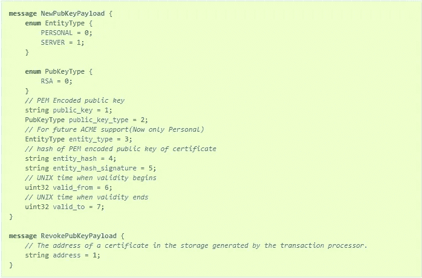
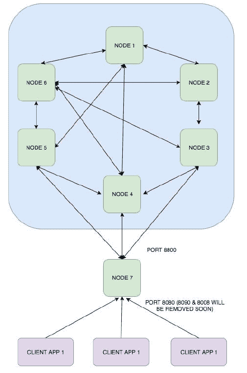

# 分布式 PKI:开发和使用案例

> 原文：<https://medium.com/hackernoon/distributed-pki-development-and-use-cases-a828287a2e67>

分布式 PKI 并不是一个新的想法。有很多文章和尝试在实践中实现这个概念。PKI (d)基于这样一种假设，即在 ca 颁发和管理证书的过程中存在严重的漏洞，因此需要分散证书颁发机构，并使该过程更加透明和难以被攻破。

集中式 PKI 的缺陷偶尔会浮出水面，造成重大的财务和声誉损失。2018 年年中的一个最新例子描述了研究人员[发现了](https://thehackernews.com/2018/07/digital-certificate-malware.html)一个全新的恶意软件项目，该项目使用从几家台湾科技公司窃取的数字证书，即 D-Link，来签署他们的恶意软件，并使它们看起来像合法的应用程序。令人困惑的是，D-Link 只是在研究人员通知他们之后才撤销证书。这意味着这种类型的恶意软件很难检测，因为反病毒程序无法检查证书的有效性，即使公司撤销其证书的签名。可悲的是，这不是一个黑客窃取有效证书为他们的恶意软件签名的单一案例。

**什么是 PKI？**

PKI 通过一组公钥和私钥对数据交换进行加密和解密，这些公钥和私钥是随机生成的长串数字。这些长的数字串通过生成对的算法在数学上相关联。

PKI 现在被广泛使用，使得保护私钥变得至关重要。只需考虑这些使用案例:

1.  **服务器识别**:每次任何人使用 HTTPS 安全网络服务器连接时，他们都在 SSL 握手中使用 PKI 服务器身份证书。
2.  Web 应用程序的认证和授权:这种认证通常使用用户名和密码来完成，但是 PKI 提供了一个有吸引力的替代方案。SSL 具有在建立安全和加密的连接之前要求客户端证书的可选能力。因此，web 服务器在允许与其建立 HTTPS 连接之前，需要一个有效的客户端证书。但是很少使用它，因为现有的解决方案不适合，这使它成为管理的噩梦。
3.  **电子文档和表格签名**:PKI 支持的签名包括计算文档内容的哈希值，并附加包含哈希值的加密签名。

除了上面提到的用例，PKI 还可以应用于**VPN**、 **S/MIME 邮件签名和加密**、**邮件列表服务器**、**无线网络安全**、**安全即时通讯**的认证，其他很多应用就更不用说了。

在传统的 PKI 模型中，CA 颁发和签署所有证书，并充当顶级信任代理，促进第三方信任模型。用户相互信任，因为 CA 保证信息的真实性和完整性。

但正如最近的事件所凸显的那样，CAs 受到了威胁。

# **密码学，我们认为可以帮助的黑盒**

REMME 团队提出了开源的 PKI (d)协议概念来保护通信，我们确信主要的用例将是身份验证。一个没有密码的世界是我们的警笛之歌。最近，我们加入了致力于同一方向的全球联盟和社区。与 FIDO、W3C 和 DIF 一起，我们正在跟踪描述无密码原则和解决方案的新规范。

然而，经过一年的研发，我们已经明白，作为一家技术网络安全公司，我们面临的主要挑战将是影响更广泛的安全通信。目前，最流行的数据保护技术是公钥基础设施(PKI)。它基于 X.509 客户端证书的发行和管理，在许多情况下，x . 509 客户端证书被广泛用于认证交易对手。我们对此进行了研究，并将相同的功能融入到我们的想法中。毕竟，没有必要重新发明轮子。

Public Key transaction family payload in the PKI (d) protocol. Learn more [here](https://docs.remme.io/remme-core/docs/family-pub-key.html).

例如，在 web 资源的情况下，服务器在证书和相关私钥的帮助下对其客户端进行身份验证。这种情况在银行业、政府等领域非常典型。这种技术适用于任何需要高度安全性的场景，在这些场景中，密码是一种不可接受的用户身份验证方式(因为密码很容易通过社交工程或恶意软件等被窃取)。

这些证书也广泛用于机器对机器的交互。这是一种非常直观的机器认证方式。例如，传感器可以向远程服务器发送数据；为了对传感器进行身份验证，服务器会向传感器请求客户端证书。

另一个用例是安全令牌。这与第一点非常相似，只是私钥存储在特定的硬件上。

# 分布式 PKI 协议初探

该小组重新考虑了 PKI 的基础，增加了区块链部分以消除单点故障和组织信任 CA 的需要。它是一个开源解决方案，正在为 PKI 开发一个定制的区块链。它是关于在区块链上存储证书的公钥，存储它们的有效时间和撤销状态。目前，我们正在构建用户数据分布式验证系统。

在这幅图中，我们看到一些节点互连成一个小型网络和一些客户端应用程序。在这里，我们很容易明白为什么分散的系统比集中的系统更好。如果一个节点出现故障，我们切换到另一个节点，这没关系。每个节点都有相同的数据、相同的逻辑和相同的 API。这些节点还复制所有数据、所有交易历史和所有证书的状态。这种冗余使我们的系统非常健壮。

这就是我们利用我们的解决方案解决集中化挑战的方式。

**为 PKI (d)的发展做出贡献**

数字未来正在快速到来。这就是为什么我们还需要开发一种通用方法，为行业提供发展和创新所需的安全空间。

加入[我们在 GitHub](https://github.com/Remmeauth/remme-core/tree/dev) 上的开源项目来保护社区。