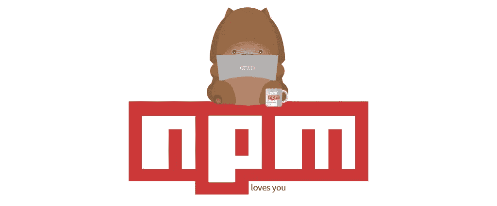

# 我真的需要 package-lock.json 文件吗？

> 原文：<https://medium.com/hackernoon/do-i-really-need-package-lock-json-file-321ce29e7d2c>

您是否曾经发现自己即将提交代码，并且不知道如何处理 package-lock.json 文件？大家说说吧。



(📷 by [npmjs](/@npmjs))

# **TL；**博士

*   如果您正在与多个开发人员合作一个共享项目，并且您想要确保所有开发人员和环境的安装保持一致，那么您需要使用`package-lock.json`。
*   对于 npm 修改`package.json`或`node_modules`树的任何操作，都会自动生成`package-lock.json`(NPM ^5.x.x).的默认设置
*   如果`package.json`已经用新模块或更新版本更新，它将否决`package-lock.json` (^v5.1.0).
*   新的`npm ci`命令(用于 CI/CD)仅从**包锁文件**安装。如果`package.json`和`package-lock.json`不同步，那么它将报告一个错误(npm ^5.7.1).
*   **包锁文件应该提交到源存储库中。**

# 介绍

## 简而言之，国家预防机制

npm 是最常见的 JavaScript 包管理器。它由一个命令行客户端(也称为 npm)和一个公共和付费私有软件包的在线数据库(称为 npm registry)组成。

## **package.json**

所有的 npm 包都在名为 **package.json** 的文件中定义。package.json 的内容必须写在 JSON 中，定义文件中至少要有两个字段:**名称**和**版本**。依赖关系也在这个文件中定义。

## **npm 安装**

命令`npm instal` 将 package.json 文件中定义的所有包及其依赖项安装到`node_modules`文件夹中，如果该文件夹不存在，则创建它。

您可以通过运行`npm install <package-name>.`来安装特定的软件包

`--save`标志安装并添加一个条目到 package.json 文件*依赖项*(NPM 5 的默认设置)。

# 包版本控制

*npm 作品有* [***语义版本***](https://docs.npmjs.com/about-semantic-versioning)*(SEM ver)图式:`(MAJOR.MINOR.PATCH)`。*

*使用 npm 安装软件包时，会在 package.json 中添加一个条目，其中包含软件包名称和应该使用的服务器。如果不指定确切的版本，npm 将安装最新版本(在 NPM 注册表上标记为`latest`的版本)。*

*在这个 semver 定义中，npm 支持以下**通配符**:*

*默认情况下，所有版本都带有前缀`**^**` **(插入符号)**。这意味着允许修改到`MINOR`部分。因此，举例来说，与版本`^1.3.1`具有依赖性意味着`1.3.5`和`1.4.0`都将被认为是有效的，并且如果可用的话，将使用它们中的“最新”版本。*

*类似的逻辑也适用于`**~**` **(波浪号)**。一旦用在版本号前面，表示:只允许`PATCH` 段修改。因此，在上面的例子中，如果我们有`~3.2.3`，那么在提到的两个候选项中，唯一有效的候选项就是`3.2.4`。*

*命令`npm outdated`和`npm update`能够根据定义的范围分别跟踪和更新依赖性。*

# *属国*

## *依赖关系树*

*npm 安装了一个*依赖关系树*，其中安装的每个包都有自己的依赖关系集，即使它与其他包有共享的依赖关系。*

*这意味着 npm 可以安装同一软件包的不同版本。例如，如果我们有两个包 A 和 B，它们具有共享的依赖关系“dep_A”，则每个包可以使用不同版本的“dep_A”。最终的目录结构将是:*

```
*node_modules/
├── package_A/
│   └── node_modules/
│       ├── dep_A/
│       └── dep_B/
└── package_b/
    └── node_modules/
        ├── dep_A/
        └── dep_C/*
```

*实际上，每个依赖项都有自己的`node_modules`目录等等。*

*   *npm ^3.X.X 执行了一些优化，试图在可能的时候共享依赖关系。*

## *依赖地狱*

*我们看到 npm 处理版本和依赖关系，什么会出错？*

*当处理一个共享项目时，在部署过程中，您希望确保安装项目依赖项的任何人(开发人员、CI 服务器等。)，每次都会得到相同的结果。显然，您已经决定指定要安装的依赖项的确切版本，但是那些依赖项的依赖项又如何呢？—您无法控制完整的从属树。*

*让我们看一个常见的案例:*

*你直接靠`express`确切版本`4.17.1` - > `express`靠`body-parser`范围`~1.17.4`->靠`accepts`范围`~1.3.4` - >等等…*

*您只能控制 express 版本，但是即使您根本没有碰过您的`package.json`，您也可能会在`npm install.`的两个独立执行中得到不同的依赖树*

# *包装锁定*

*使用锁文件确保每次从任何地方安装时，每个安装结果对于整个依赖关系树都是相同的和可重复的。这是通过指定版本、位置和完整性散列来完成的。*

*锁定文件旨在在创建锁定文件时锁定整个依赖关系树的所有版本。*

## *包锁. json*

*对于 npm 修改`package.json`或`node_modules`树的任何操作，都会自动生成 npm 锁文件`package-lock.json`(NPM ^5.x.x).的默认设置*

*这意味着运行`npm install`将生成`package-lock.json`文件，如果它没有当前`node_modules`的版本。*

***文件格式***

*该文件包含包名到依赖对象的映射。依赖对象具有以下属性:*

*[**版本**](https://docs.npmjs.com/files/package-lock.json#version-1) 这是一个唯一标识这个包的说明符，应该可以用来获取它的新副本。*

*[**dev**](https://docs.npmjs.com/files/package-lock.json#dev)**如果为真，则此依赖关系仅为开发依赖关系。***

***[**要求**](https://docs.npmjs.com/files/package-lock.json#requires) 列出了*要求*的模块列表，以便您的应用程序正常运行和工作，而不管它将安装在哪里。**该版本应通过正常匹配规则匹配我们的`**dependencies**`或比我们高一级的依赖关系**。***

***锁文件中的`requires`字段将使用范围。(自 npm ^6.x.x 起默认)***

***[**依赖关系**](https://docs.npmjs.com/files/package-lock.json#dependencies-1) 这种依赖关系的依赖关系，完全如同在顶层。***

***完整文件格式:[https://docs.npmjs.com/files/package-lock.json](https://docs.npmjs.com/files/package-lock.json)***

***那么到底是什么让人如此困惑，为什么开发者一直删除这个文件？在`package-lock`之前，装置的唯一真实来源是`package.json`。当 package-lock 首次发布时，`package.json`中的一个变化并没有影响到 package-lock，这对于习惯与`package.json`一起工作的开发者来说并不直观。***

***自从 npm ^5.1.x 以来，行为已经改变:`package.json`将否决`package-lock.json`，如果`package.json`已经用新模块或更新版本更新，例如:***

*   ***如果一个模块不存在于 package-lock 中，但是存在于 package.json 中，那么这个模块将被安装。***
*   ***Package A，版本 1.0.0 同时存在于 package.json 和包锁中。如果在 package.json 中手动将包 A 编辑为 1.1.0 版，将安装 1.1.0 版。***

# ***npm ci***

***好的，所以`package.json`和`package-lock.json`可以住在一起，但是等等，还有最后一件事我们需要谈谈..***

***npm 5.7.0 中引入的`npm ci`命令忽略`package.json`，仅安装`package-lock.json` **中指定的依赖项**。***

******

***`*npm ci*`是在**测试环境、持续集成或部署过程中安装依赖项的一种更快、更可靠的方式**。增加的速度和可靠性，减少了浪费的时间，促进了最佳实践。***

*   ***`npm ci`仅从锁定文件安装，因此您必须提交锁定文件。***
*   ***快多了(2 倍-10 倍！)比`*npm install.*`***
*   ***如果`*package.json*`和锁定文件不同步，它将报告一个错误。***
*   ***它的工作原理是扔掉你的 node_modules 并从头开始重新创建它。***
*   ***不会改变`package.json`或`package-lock.json.`***

# ***版本更新***

***默认情况下，npm 会在通过`npm install`安装依赖项时为 SEMVER 范围添加插入符号(`^`)前缀(以启用跟踪和更新)。***

***此默认行为可以更改:***

***`npm config set save-prefix='~'`将默认值设置为波浪号。***

***`npm config set save-exact true`将取消自动前缀。***

## ***有用的命令***

***`[npm outdated](https://docs.npmjs.com/cli/outdated.html):`检查过期版本(显示任何已安装的软件包)。***

***`[npm update](https://docs.npmjs.com/cli/update)`:将列出的所有包更新到最新版本，**遵守永远**。***

***`[npm-check-updates](https://www.npmjs.com/package/npm-check-updates):`检查过期版本(仅显示来自`package.json`的主包)。***

***`[npm-check-updates](https://www.npmjs.com/package/npm-check-updates) -u`:将你的 package.json 依赖项升级到*最新*版本，**忽略指定版本**。***

***扫描你的项目的漏洞。***

# ***最优方法***

*   ***当开始一个新项目时，使用`npm init`创建一个`package.json`文件。***
*   ***一旦你列出了你想在项目中使用的所有包，使用`npm install --save`安装并保存它们。***
*   ***记住:默认情况下，npm 将使用前缀`^`保存您的依赖项，为了保存准确的版本，您可以运行`npm config set save-exact true.`***
*   ***运行`npm install`将生成\update `package-lock.json`文件，可以锁定整个依赖树的所有版本。***
*   ***使用`npm install`添加新的依赖项，更新依赖项，并在从源存储库提取更改后。***
*   ***持续集成时使用`npm ci`。***

# ***结论***

***在处理共享项目时，强烈建议将包锁文件提交给源代码控制:这将允许团队中的任何其他人、您的部署、您的持续集成以及在您的包源代码中运行 npm install 的任何其他人获得与您正在开发的完全相同的依赖树。***

# ***阅读更多***

***[package.json](https://docs.npmjs.com/files/package.json)***

***[包锁. json](https://docs.npmjs.com/files/package-lock.json)***

***[语义版本](https://docs.npmjs.com/about-semantic-versioning)***

***[NPM-安装](https://docs.npmjs.com/cli/install)***

***[npm-ci](https://docs.npmjs.com/cli/ci.html)***

***[NPM-收缩包装](https://docs.npmjs.com/cli/shrinkwrap)***

***感谢阅读。随意分享！***