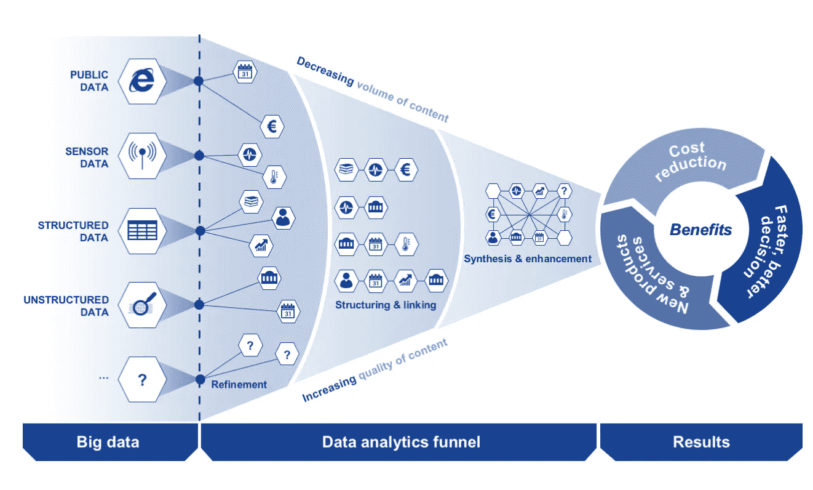

# 您知道您的数据会发生什么变化吗？

> 原文：<https://medium.com/hackernoon/do-you-know-what-happens-to-your-data-17cae340af80>

Photo by [imgix](https://unsplash.com/photos/klWUhr-wPJ8?utm_source=unsplash&utm_medium=referral&utm_content=creditCopyText) on [Unsplash](https://unsplash.com/search/photos/big-data?utm_source=unsplash&utm_medium=referral&utm_content=creditCopyText)

大约一年前， [Forbes](https://www.forbes.com/sites/bernardmarr/2018/05/21/how-much-data-do-we-create-every-day-the-mind-blowing-stats-everyone-should-read/#279cf86260ba) 报道称，我们每天产生大约 2.5 万亿字节的数据。那是一个二，一个五，和十六个零！到 2020 年，地球上的每个人每秒将产生大约 [1.7 MB 的数据](https://www.socialmediatoday.com/news/how-much-data-is-generated-every-minute-infographic-1/525692/)。

让我们看一下。

**7 MB * 86400** (一天的秒数)= **每天 146880**MB 的数据！

现在，让我们把所有数据加起来，看看明年的某个时候，我们将在全球拥有多少数据。

**143 .4375** **Gb** 的数据(以 MB 为单位的结果除以 1024 得到以 Gb 为单位的值)

*

7584821144 人(2020 年的预计人口)

=

**摄取了 1087947782842.5 GB**的新数据**。**

**每。**

**天。**

哥们儿！

仔细想想，文章的标题应该是:

## **1，087，947，782，842.5 GB 存储在哪里？**

我为 Dashbird 工作，我们每天处理大量的数据，但我们甚至无法接近这个数字的一小部分，我们需要不断升级我们的基础设施，以便随着我们的增长处理更多的数据。可以想象，自从我意识到将会有多少数据到处流动，这个数字就一直留在我的脑海里。

好了，现在你在想，这些数据都去了哪里，谁必须筛选这些数据，这些数据中有多少是生殖器的图像。

哦，那你不是这么想的？也许只是我…

但另外两个问题仍然存在，这些数据是如何产生的，谁来处理这些数据？

# 谁创建了所有这些数据？

到目前为止，物联网是产生所有数据的最大元凶。到 2020 年，我们将有大约 300 亿台设备联网。300 亿个烤面包机、冰箱、Siri 和 Android 驱动的马桶输出了数百万条数据。

这听起来可能很难相信，300 亿台设备是一个很大的数字，但看看你的周围，坐在你的咖啡店里喝着你最喜欢的 8 美元一杯的咖啡，你在你周围看到多少 iPhones，MacBooks，智能手机，Teslas 和 Hue 灯？在任何给定的时间点发生的所有搜索查询，或者数以千计的优步骑行，或者每一次社交媒体互动又如何呢？或者那个愚蠢的 Roomba，因为一些奇怪的原因，你的狗害怕这个该死的东西，尽管它有 80 磅重。这一切都说明了。

虽然个人物联网设备(如我们所熟悉的设备)在过去几年中确实开始呈指数级增长，但物联网多年来在制造业、农业、医疗保健(以及许多其他行业)中发挥了越来越大的作用，而且速度还在加快。

想想看，你总是听到有人把工作丢给机器，或者工厂自动化他们的过程，让人们离开。这些机器产生了我今天所说的大量数据。

# 它们都去哪里了？

简单来说，所有的数据都被放到了云端。

但如果我试图解释，我可能不得不把焦点放在最大的大数据罪魁祸首上，它们是谷歌、脸书、苹果、微软、亚马逊、IBM、思科等。这份清单可能会持续很长时间，我就讲到这里。

他们处理大数据存储的方式绝对令人着迷。大多数人使用 AWS Glacier 或 Azure Data Lake Storage 等服务，其核心是一种直连存储或 DAS，由庞大的服务器网络组成。它们也被称为[超大规模](https://en.wikipedia.org/wiki/Hyperscale_computing)计算环境。

他们混合使用 PCIe 闪存和硬盘来实现冗余，并尽可能减少延迟。如果一台机器发生故障，他们通常会更换整个设备，并在单独的机器上备份数据，确保不会丢失任何数据。他们在 Apache Hadoop、NoSQL、Presto、Cassandra 等平台上运行，并在此基础上开发分析系统。

# 数据处理

当所有这些数据进入时，通常会进行实时分析，这是该过程的另一个迷人之处，因为存储数据已经够难了，拥有分析数据的计算能力则是另一个层面。

然而，最艰巨的任务是对完整的大数据集进行快速(低延迟)或实时的即席分析。这实际上意味着您需要在几秒钟内扫描万亿字节(甚至更多)的数据。这只有在以高并行度处理数据时才有可能。

有许多处理实时数据的架构，没有一个完美的解决方案，但有一些脱颖而出。

[无服务器](https://serverless.com/)架构在这个领域带来了一场革命，这是有充分理由的。除了酷的因素外，[无服务器对大数据还有很多好处](https://dashbird.io/blog/serverless-computing-reshape-big-data-data-science/)，因为你不必管理基础设施，这不完全是服务提供商的成本责任，而且你可以获得按需扩展解决方案，快速响应大量涌入的数据。

[Big Data for beginers](https://www.upgrad.com/blog/big-data-tutorial-for-beginners/)

# 那么他们会保留我的数据多久？

虽然他们会在一段时间后采取措施匿名化你的数据，但你的数据永远不会被完全删除。欧盟已经采取了一些措施，以确保你作为欧盟的一员在这件事上有一些发言权，但要判断这个 GDPR 是否有任何优点还为时过早，因为仍然存在一些漏洞，公司可以利用这些漏洞来规避他们的裁决。

Ars 技术公司的内特·安德森[报道](http://arstechnica.com/tech-policy/news/2010/03/google-keeps-your-data-to-learn-from-good-guys-fight-off-bad-guys.ars):

> *搜索数据被挖掘是为了“向好人学习”，用谷歌的话说，通过观察用户如何纠正自己的拼写错误，他们如何用母语写作，以及他们在搜索后访问了什么网站。这些信息对谷歌著名的算法驱动方法至关重要，这种方法可以解决拼写检查、机器语言翻译和改进其主要搜索引擎等问题。没有这些算法，谷歌翻译就无法支持加泰罗尼亚语和威尔士语等冷门语言。*
> 
> *数据也被挖掘出来，以观察“坏人”如何运行链接农场和其他网络刺激因素，以便谷歌可以采取对策。*

谷歌最终将数据匿名化:

> IP 地址的最后一个八位字节在九个月后被擦除，这意味着有 256 种可能的 IP 地址。18 个月后，谷歌将存储在这些日志中的独特 cookie 数据匿名化。
> 
> 这并不是特别雄心勃勃；欧洲的数据保护监管者呼吁在六个月后 [*IP 匿名化*](http://arstechnica.com/old/content/2008/04/eu-issues-tough-data-protection-finding.ars) *和* [*像 Bing 这样的竞争搜索引擎就是这么做的*](http://arstechnica.com/microsoft/news/2010/01/bing-beats-google-but-not-yahoo-in-keeping-search-records.ars)*(Bing 删除整个 IP 地址，而不仅仅是最后一个八位字节)。雅虎* [*在 90 天后清除其数据*](http://arstechnica.com/old/content/2008/12/yahoo-outdoes-google-will-scrub-search-logs-after-90-days.ars) *。*

# 新的石油？

数据已经成为一种商品，就像石油、黄金和木材一样，随着我们使用和生产越来越多的数据，它的价值开始增加，但由于它仍然年轻，你不会很快看到它在股票市场上交易。尽管那些全部业务都依赖于买卖用户数据的公司已经公开上市，但有人可能会说，我们在某种程度上已经在这么做了。

有些人可能试图诋毁大数据公司，但我不是其中之一。事实上，我也是热切期待未来几年我们将面临什么，以及“数据”将如何改善我们日常生活的人之一。