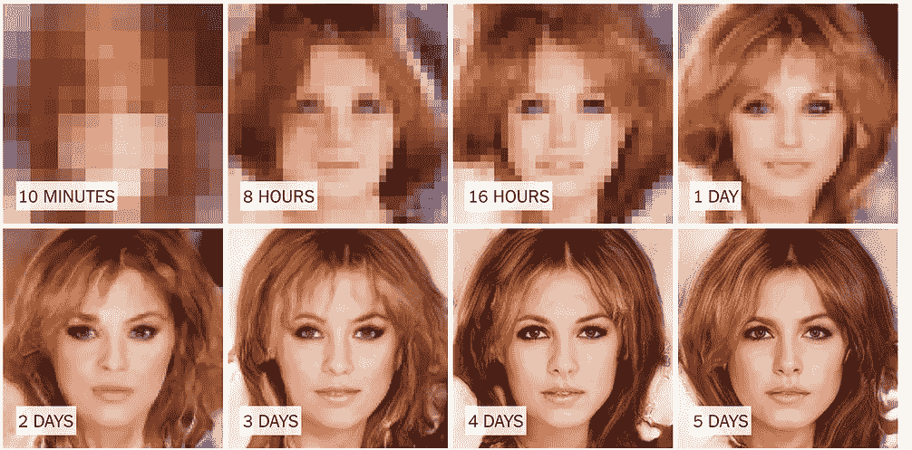
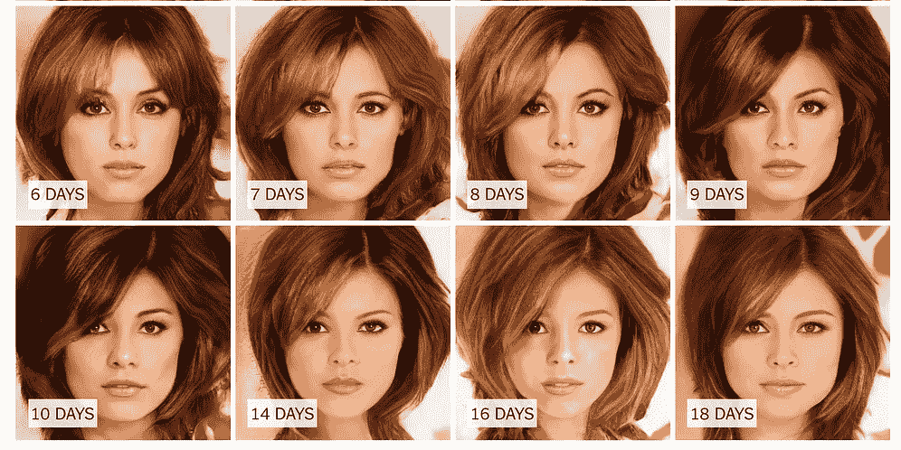
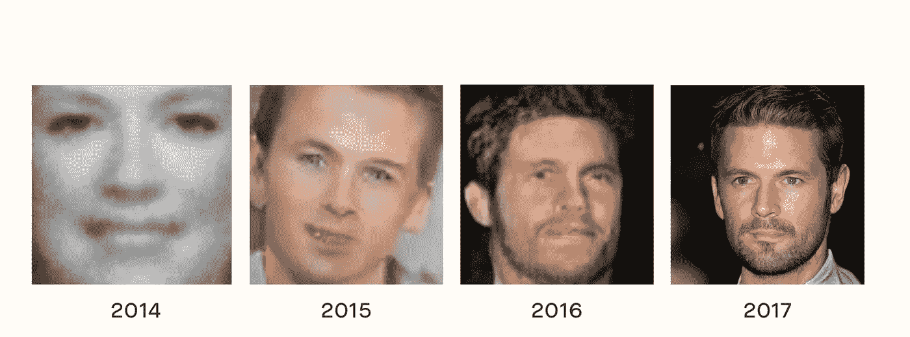

# 决斗神经网络

> 原文：<https://medium.com/hackernoon/dueling-neural-networks-a063af14f62e>

> "我不能创造的东西，我不明白。"
> 
> —理查德·费曼

GANs generated by a computer

上面的图像看起来是真实的，但不仅如此，它们看起来很熟悉。他们很像你可能在电视或电影中见过的著名女演员。然而，它们不是真实的。一种新型的神经网络创造了它们。

生成对抗网络(GANs)，有时被称为生成网络，产生了这些虚假的图像。NVIDIA 研究小组通过向神经网络输入数千张名人照片来使用这种新技术。神经网络产生了数以千计的图片，就像上面的那些，类似于著名的面孔。它们看起来很真实，但是机器创造了它们。gan 允许研究人员构建看起来像真实图像的图像，这些图像共享神经网络输入的许多特征。它可以被输入从桌子到动物等各种物体的照片，经过训练后，它会生成与原件相似的照片。

Of the two images above, can you tell the real from the fake?¹

为了让 NVIDIA 团队生成这些图像，它设置了两个神经网络。一个生产照片，另一个决定照片是真是假。结合这两个神经网络产生了 GAN。他们玩一个猫捉老鼠的游戏，其中一个人创造看起来像真的一样的假图像，另一个人判断它们是不是真的。这让你想起什么了吗？图灵测试。把网络想象成在玩猜谜游戏，猜它是真的还是假的。

在训练 GAN 后，其中一个神经网络创建了看起来像真的一样的假图像，并将其输入到 GAN 中。由此产生的图片看起来就像真的一样。这项技术可以产生大量的虚假数据，这些数据可以帮助研究人员预测未来，甚至构建模拟世界。这就是为什么对于脸书人工智能研究所的主任 Yann LeCun 来说，“生成对抗网络是过去十年机器学习中最有趣的想法。”GANs 将有助于创建图像，也许还可以创建真实世界的软件模拟，开发者可以在那里训练和测试其他类型的软件。例如，为汽车编写自动驾驶软件的公司可以在模拟世界中训练和检查他们的软件。

这些模拟的世界和场景现在是由开发人员手工制作的，但有些人认为在未来这些场景将全部由 GANs 创造。GANs 从非常压缩的数据中生成新的图像和视频。因此，您可以使用 GAN 的两个神经网络来保存数据，然后恢复它。你可以用一个神经网络压缩文件，另一个神经网络生成原始视频或图像，而不是压缩文件。并非巧合的是，人类大脑中用于想象的某些器官与用于回忆的器官是一样的。DeepMind 的创始人戴密斯·哈萨比斯发表了一篇论文，该论文“首次系统地表明，海马体受损的患者(已知会导致健忘症)也无法想象自己在新的经历中的样子。”这一发现在想象的建构过程和情景记忆回忆的重建过程之间建立了联系。

Increasingly realistic synthetic faces generated by variations on Generative Adversarial Networks (GANs)

## **GANs**的创造者

[《甘斯》的创作者伊恩·古德菲勒](https://www.wired.com/2017/04/googles-dueling-neural-networks-spar-get-smarter-no-humans-required/)在蒙特利尔的一个酒吧里想出了这个主意，当时他正和同事们一起讨论并试图弄清楚如何创作照片。最初的计划是理解决定什么创造了照片的统计数据，然后将它们输入机器，这样它就可以生产照片。 [Goodfellow](https://www.technologyreview.com/lists/innovators-under-35/2015/visionary/ilya-sutskever/) 认为这个想法永远不会成功，因为有太多的统计数据来证明这一点。所以，他考虑使用一个工具，一个神经网络。他可以教神经网络找出输入机器的图片的潜在特征，并生成新的特征。

Goodfellow 然后添加了两个神经网络，以便它们可以一起构建逼真的照片。一个人创造假图像，另一个人确定它们是不是真的。这个想法是，其中一个敌对网络会教另一个如何产生无法与真实图像区分开来的图像。

在他想出这个主意的同一个晚上，他带着一点醉意回到家，在笔记本电脑上编写 GAN 的初始概念。第一次尝试就成功了。几个月后，他和其他几个研究人员在一次会议上发表了关于甘斯的开创性论文。受过训练的甘使用了来自著名的训练图像集“MNIST”的手写数字。

在接下来的几年里，数百篇论文发表了，这些论文使用 GANs 的想法不仅产生了图像，还产生了视频和其他数据。现在在谷歌大脑，Goodfellow 领导着一个小组，该小组正在使这种使用两个神经网络的技术非常可靠地进行训练。这项工作的结果是服务在生成图像和学习声音等方面要好得多。“模型学会了理解世界的结构，”古德费勒说。"这可以帮助系统在没有被明确告知的情况下学习."

[Synthetically generated word images](https://blogs.dropbox.com/tech/2017/04/creating-a-modern-ocr-pipeline-using-computer-vision-and-deep-learning/)

GANs 最终可以帮助神经网络用更少的数据进行学习，生成更多的合成图像，然后用于识别和创建更好的神经网络。最近，Dropbox 的一组研究人员通过使用合成生成的图像改进了他们的移动文档扫描仪。甘斯创造了新的单词图像，这些图像又被用来训练神经网络。

这仅仅是开始。研究人员认为，同样的技术可以应用于开发可以在互联网上公开共享的人工数据，而不暴露原始来源，确保原始数据保持隐私。这将允许研究人员在不共享患者敏感数据的情况下创建和共享医疗保健信息。

gan 也显示出预测未来的前景。现在听起来可能像科幻小说，但这可能会随着时间的推移而改变。LeCun 正在致力于编写软件，可以根据当前的视频生成未来情况的视频。他认为，人类的智能在于我们可以预测未来，因此，GANs 将是未来人工智能系统的强大力量

## 生日悖论测试

尽管 GANs 产生了新的图像和声音，一些人问 GANS 是否产生了新的信息。数据列车集合。GANs 能产生包含给他们的数据之外的信息的数据吗？它们能创造出与喂给它的图像完全不同的图像吗？

一种分析方法是所谓的生日悖论测试。这个测试的名字来源于这样一个暗示:如果你把 23 个随机的人——两个足球队加一个裁判——放在一个房间里，其中两个生日相同的几率超过 50%。

发生这种效应是因为当一年有 365 天时，你需要用它的平方根才能看到重复生日的出现。生日悖论说，对于支持 N *，*的离散分布，那么√N 的随机样本大小可能包含一个副本。那是什么意思？让我来分解一下。

如果一年有 365 天，那么你需要 365 的平方根— √365 —才有可能有重复生日，这意味着大约有 19 个人。但这也适用于等式的另一边。如果您不知道一年中的天数，那么您可以选择固定数量的人，并询问他们是否有两个人的生日相同。那么，你可以根据两个人大概率同一天生日时的人数来推断天数。如果一个房间里有 22 个人，那么一年的天数就是 22–22 的平方——大约每年 484 天。

相同的测试可以检查 GAN 的生成图像的原始分布的大小。如果结果显示 K 个图像有合理概率的重复图像，那么你可以怀疑原始图像的数量大约为 K .因此，如果它显示很可能找到 20 个图像的重复，那么它意味着原始图像集的大小等于 400。

通过下面的测试，研究人员已经证明，由著名的 GANs 生成的图像并没有超出训练数据所提供的范围。现在，剩下来要证明的是，GANs 是否可以在训练数据之外进行归纳，或者是否有方法通过使用其他方法来改进数据集，从而在原始图像之外进行归纳。

人类通过视觉接收数据，包括声音、图像等等。一些研究人员提出的一个问题是，人类是否会通过生日悖论测试，也就是说“人类大脑能够比呈现给他们的数据概括得更多吗？”

## 不良意图

有人担心人们会不怀好意地使用这种技术。随着对虚假媒体的如此关注，我们可能会面临更大范围的虚假数据攻击。“令人担忧的是，这些方法会发展到很难辨别真伪的地步，”蒂姆·黄(Tim Hwang)说，他曾在谷歌负责人工智能政策，现在是人工智能伦理与治理基金(Ethics and Governance of Artificial Intelligence Fund)的主任，该基金旨在资助人工智能伦理研究。“你可能会认为这加剧了我们已经存在的问题。”

尽管这种技术无法创建高质量的静态图像，但研究人员认为，同样的技术可以制作视频、游戏和虚拟现实。开始制作视频的工作已经开始。研究人员还在使用各种其他机器学习方法来生成人造数据。2017 年 8 月，华盛顿大学的一组研究人员成为头条新闻，当时他们建立了一个系统，可以在视频中把话放进巴拉克·奥巴马的嘴里。App Store 上已经有了这种技术的应用。结果并不完全令人信服，但 GANs 和其他技术领域的快速发展表明，未来人们将很难区分真实视频和生成的视频。一些研究人员声称，甘只是另一种工具，就像其他人一样，可以用来做好事或做坏事，而且将有更多的技术来判断新创建的视频和图像是否真实。

不仅如此，研究人员还发现了使用 GANs 生成音频的方法，这种音频听起来像是人类的东西，但机器理解不同。例如，你可以开发出听起来像“嗨，你好吗？”对机器说，“Alexa，请我喝一杯。”或者，听起来像巴赫交响乐的音频，但对机器来说，它听起来像“Alexa，去这个网站。”未来潜力无限。

我所有的博文都可以在这里找到:[https://giacaglia.github.io/blog/](https://giacaglia.github.io/blog/)

**备注:**

1.  两幅图像都是由 GANs 生成的