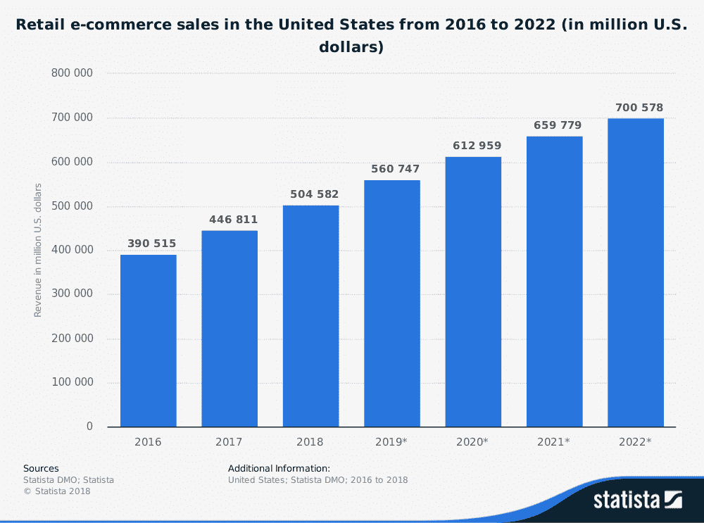

# 电子商务似乎是区块链还没有成功颠覆的一个行业

> 原文：<https://medium.com/hackernoon/e-commerce-seems-to-be-the-one-industry-blockchain-hasnt-managed-to-disrupt-yet-2c664634fa7d>

## 区块链尚未接管电子商务行业，是什么阻碍了它的发展？

随着全球经济继续拥抱在线和不断连接的框架，有一个行业逐年增长，不容忽视，*电子商务*。消费者总是在寻找新的、创新的方式来完成他们的购买，并且在购买过程中比以往做了更多的调查。这意味着更多的时间花在网上，更多的商品被用户从舒适的家中购买，而不是从实体店购买。

虽然大部分零售购物仍是在商店中亲自完成的(亚马逊完全意识到这一现实，并正在努力适应这一现实)，但电子商务销售额正逐年稳步增长，并在零售购买习惯中找到更深的市场渗透。

*美国电子商务销售额占零售总额的比例，“* [*十年回顾:2007-2017 年电子商务销售额与零售总额之比*](https://www.digitalcommerce360.com/article/e-commerce-sales-retail-sales-ten-year-review/) *、* [*数字商务 360*](https://www.digitalcommerce360.com/)

尽管电子商务每年都在增长，但区块链技术还没有颠覆这个行业，我想研究一下原因。

# 为什么电子商务正在兴起？

*2016-2022 年美国零售电子商务销售额，*[*Statista*](https://www.statista.com/statistics/272391/us-retail-e-commerce-sales-forecast/)

正如许多行业的情况一样，公司正在寻求迎合消费者对其体验的需求和愿望。网上购物的好处有很多，主要是不需要与推销员打交道，可以坐在沙发上或电脑前，轻松地研究和比较不同的产品，不需要去实体店旅行等。电子商务让顾客节省时间和金钱，并购买比任何实体零售场所能提供给他们的更多的商品。

在等式的另一边，企业正在接受电子商务模式，因为它也可以为他们提供无数的好处。也许对企业和电子商务来说，最大的一个因素是规模的能力。与传统的零售场所不同，电子商务企业可以随时向世界上几乎任何地方的任何客户销售产品。

电子商务企业可以专注于成本有效的方式来发展品牌、销售和客户群，而不是聚集开办实体店所需的资本和巨额间接成本。比起在不同的城市开设新的店铺，拥有强大的在线业务要容易得多。此外，在线购买的客户通常会带来大量的数据，这些数据可以被卖家使用，当客户通过数字销售渠道时，转换数据更容易访问和解释。使用先进的 CRM、客户服务和数据分析方法，结合经济高效的方式来扩展业务，电子商务每年都在增长就不足为奇了。

# 区块链的颠覆性

被《工业周刊》评为“2018 年度颠覆者”，区块链科技正在接管多个行业。IBM 是拥抱新技术最活跃的公司之一，它正在寻找新的方法来实现各种商业应用。从[供应链管理和物流](https://newsroom.ibm.com/2018-08-09-Maersk-and-IBM-Introduce-TradeLens-Blockchain-Shipping-Solution)到处理[金融交易](https://hackernoon.com/blockchain-technology-the-future-of-transactions-6fb557a98fe2)，以及这之间的几乎所有事情，区块链无疑是一股不可忽视的破坏性力量。

然而，相对而言，电子商务行业仍未受到区块链在数字领域不断颠覆的影响。为什么？而且未来有可能改变吗？让我们来看看。

# 区块链为什么没有接管电商行业？

随着区块链技术改变了如此多的行业，很奇怪它没有对电子商务领域产生如此大的影响。然而，当我们检查所有促成一个成功的电子商务模式的因素时，实际上有一些相当好的理由，其中第一个是进入壁垒。

由于区块链技术及其相关产业仍处于萌芽阶段，企业很难找到具备适当技能的人才。对区块链开发人员和那些熟悉技术、能够帮助整合的人有很高的需求，这意味着帮助的[成本也在上升](https://www.glassdoor.com/research/rise-in-bitcoin-jobs/)。虽然一些公司有能力向技术熟练的员工支付丰厚的薪水，但许多公司就是做不到。此外，目前还没有大规模的分散式电子商务平台。

就目前的情况来看，公司通常严重依赖电子商务公司能够为他们提供的服务。从[对支付集成](https://bloxlive.tv/stories/s73news/17988-20190329-nob/88916-amazons-twitch-streaming-service-removes-crypto-payments)、PCI 合规性、网站创建、CRM 集成以及这两者之间的一切的关注，电子商务品牌除了核心业务或产品之外，还有很多要考虑的。由于创建电子商务商店的所有因素，集中式解决方案正是一些在线零售商正在寻找的。[电子商务平台为品牌提供了关键的功能](https://www.bigcommerce.com/blog/ecommerce-platforms/)和实现，否则他们将没有或需要从头开始构建，这是一个昂贵的替代方案。

就目前而言，电子商务领域的许多人依赖于提供易用性和低准入门槛的集中式服务。除非这些好处能够以分散的方式提供，否则许多小型企业和零售商不太可能实现这一转变。

# 展望:电子商务中的区块链

尽管这还没有发生，但没有理由认为电子商务世界对区块链技术的颠覆性免疫。就目前而言，许多商家可能会继续寻求集中式一体化提供商来满足他们的在线销售需求，但这并不意味着情况会一直如此。

考虑到该行业在区块链技术的实际业务实施方面是多么年轻，区块链的项目提供可行、易于使用的解决方案只是时间问题。事实上，电子商务零售商最终做出转变的动机是显而易见的。由于没有第三方或中间商，电子商务专业人士可以找到更有效的方式来吸引消费者并提高他们的利润，这是电子商务行业不可或缺的。当然，这只是开始，未来可能包括卖家向消费者发放自己的代币，以建立忠诚度，激励评论，分享产品等。虽然电子商务仍然是一个基本上没有被区块链技术触及的行业，但是[很可能在不久的将来被颠覆。小心。](https://hackernoon.com/blockchain-will-kill-traditional-e-commerce-heres-why-4cc07a2f4c06)