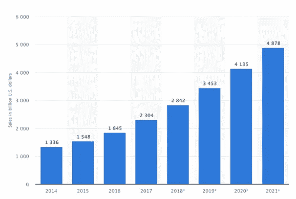
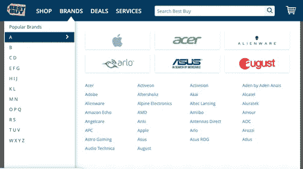

# 改进电子商务测试的有效方法

> 原文：<https://medium.com/hackernoon/effective-ways-of-improving-ecommerce-testing-8e35976cd4fc>

人们在购物时更喜欢电子商务解决方案。Periscope 对 2500 名参与者进行的调查发现，越来越多的消费者在网上购买日常用品。然而，现代数字购物者很容易被糟糕的用户体验吓跑(UX)。这也是为什么在发布前对你的网站和/或移动应用进行电子商务测试至关重要的部分原因。这篇文章着眼于改善电子商务测试的有效方法，这样你就可以真正地为你的客户服务。

# 我们测试电子商务还有其他原因吗？

是的，缺乏测试意味着你愿意牺牲其他很快成为商业噩梦的东西，比如数据安全。真正有知识的电子商务开发公司不仅构建您的应用程序，还测试可利用的漏洞。这是最重要的。

简而言之，你所获得的商业成功在很大程度上依赖于确保你的平台是安全的和没有错误的。考虑到 2018 年全球电子商务销售额超过 2.5 万亿美元，预计在线零售将大幅增长。

电子商务零售销售— [Statista](https://www.statista.com)

公司需要可靠的平台来处理所有这些增长，但电子商务解决方案可能会失败，如果失败，往往代价高昂。例如，亚马逊无法处理或服务其客户的每一秒钟都可能意味着数百万的损失。

幸运的是，通过[网络测试](https://www.a1qa.com/services/web_application_quality_assurance/)，几乎每一个灾难性的电子商务软件故障都可以避免或大大减少。这里的主要目标是 a)检查功能，b)衡量它对用户的友好程度，c)纠正任何错误和安全漏洞。

整个过程中的两个主要步骤需要小心进行。

# 知道你打算测试什么

正确的电子商务解决方案测试需要商业领域的知识和有效的计划。这就是为什么要做的第一件事是把你要测试的东西放在一起。通常，该列表将包括以下组件。

# 用户界面功能和工作流程

必须测试重要的客户接触点的功能是否正常。这包括测试你的网站中访问者会与之互动的所有核心区域。这些包括但不限于主要登录页面、目录及其类别和购物车。请注意，电子商务平台通常是定制的，以满足业务需求，因此网站布局和关键页面可能会有所不同。

在所有情况下，你的主页通常包括主页、登录/账户、产品、商品描述、订单、购买确认和搜索等。

测试将确保您的 UI 的关键功能按预期工作(例如，产品类别只按相关产品排序)。像排版、字体大小、颜色、愿望清单和排序/过滤这样的东西应该被彻底测试。

产品分类允许顾客快速挑选他们感兴趣的产品。这个功能需要非常直观，对于访问者来说是显而易见的。以下百思买的截图是优秀产品分类的一个很好的例子。

此外，没有什么比访问一个电子商务产品页面更糟糕的了，这个页面有一个图片缩放选项或其他一些不起作用的功能。因此，检查你的所有功能，包括但不限于相关项目，产品描述和比较页面，添加到购物车等。这一切都需要在伟大的形状。

你可以通过模拟游客和结账的旅程来消除大量的猜测。本质上，把你自己放在典型的潜在客户的位置上。作为补充措施，使用道德追踪系统，比如 Hotjar，看看人们在你的网站上做了什么。

# 浏览器兼容性

有必要在所有的浏览器上测试你的电子商务网站平台。火狐、ie、Safari、Chrome 等。所有这些都将被您的潜在客户用来访问您的网站。然而，它们在如何显示你的网站上略有不同。

最好通过所有级别的浏览器检查，省掉通常由不兼容问题引起的麻烦。

# 移动的

通过手机浏览互联网是主流。

人们现在通过智能手机访问互联网。因此，在开发电子商务软件时，建议采用移动优先的方法。在所有适用的屏幕尺寸(如平板电脑、iPhones 等)上测试设计的响应性是非常重要的。).

如果你为移动用户提供不同版本的桌面/笔记本网站或应用程序，那么你也需要测试。为此，您也需要将移动站点测试添加到计划中。

# 支付处理

想象一下，你试图支付一些东西，但由于某种未知的原因，你的签证无法通过。你知道你有钱，但被迫使用你的万事达卡。

你联系商家，他们说一定是你的卡。你的信用卡公司不同意，然而，企业不承认他们的平台可能存在问题。最终的结果是沮丧。

是的，不酷。

类似的情况可能会困扰一家公司多年，直到他们发现问题时已经太晚了。也就是说……通常是在他们让足够多的消费者失望之后。

在您的支付网关上运行多个测试，以确保您的网站按照预期接受和处理通过所有选项的支付。

# 可靠性估计

我们已经看到[对收集的 PII(个人身份信息)和财务数据掉以轻心的公司](https://blog.barkly.com/biggest-data-breaches-2018-so-far)会发生什么。不要成为那些公司中的一员。

道德黑客或 SQL 注入等严格的测试方法可用于发现和解决所有安全问题。此外，您还需要在服务器端安装强大的防火墙和病毒防护系统。

# 搜索引擎友好

SEO(搜索引擎优化)是经常被电子商务网站开发者忽视的东西，他们甚至不应该理解它。然而，搜索引擎是互联网上有机(或免费)网站流量的头号来源，社交媒体位居第二。

这意味着你的电子商务应用程序需要对 SEO 技术友好。这意味着能够促进高级策略的使用，从而提高你的网页在搜索引擎结果页面上的表现。

# 开发测试场景

电子商务软件测试与测试桌面、移动或物联网应用非常不同，例如，访问者使用浏览器访问此类基于网络的应用，浏览器必须与网络服务器通信以接收数据(实际上是下载网页)。

许多消费者经常光顾电子商务平台，而不是实体店，因为事实证明，24/7 营业时间的数字零售更容易实现。因此，电子商务网站很容易因繁重的工作负载而出现故障，尤其是在节假日前后。因此，提前发现潜在的严重问题非常重要。

因此，创建测试场景时应该考虑到峰值负载。此外，web 应用程序很可能成为网络攻击的目标，这意味着您的测试团队应该检查所有潜在的黑客攻击场景，以保护您的网站安全。因此，总的来说，您的测试案例应该包括安全性、性能、跨浏览器兼容性、移动响应性和可伸缩性。

# 测试失败会导致损失

电子商务测试将帮助您在公开发布平台之前发现错误或潜在危险。相信它，当与您的应用程序交互时，客户会喜欢您采取必要的步骤来确保他们的满意度、安全性和隐私。彻底的测试大大减少了故障和安全漏洞的机会，最终为您的企业带来长寿和盈利。