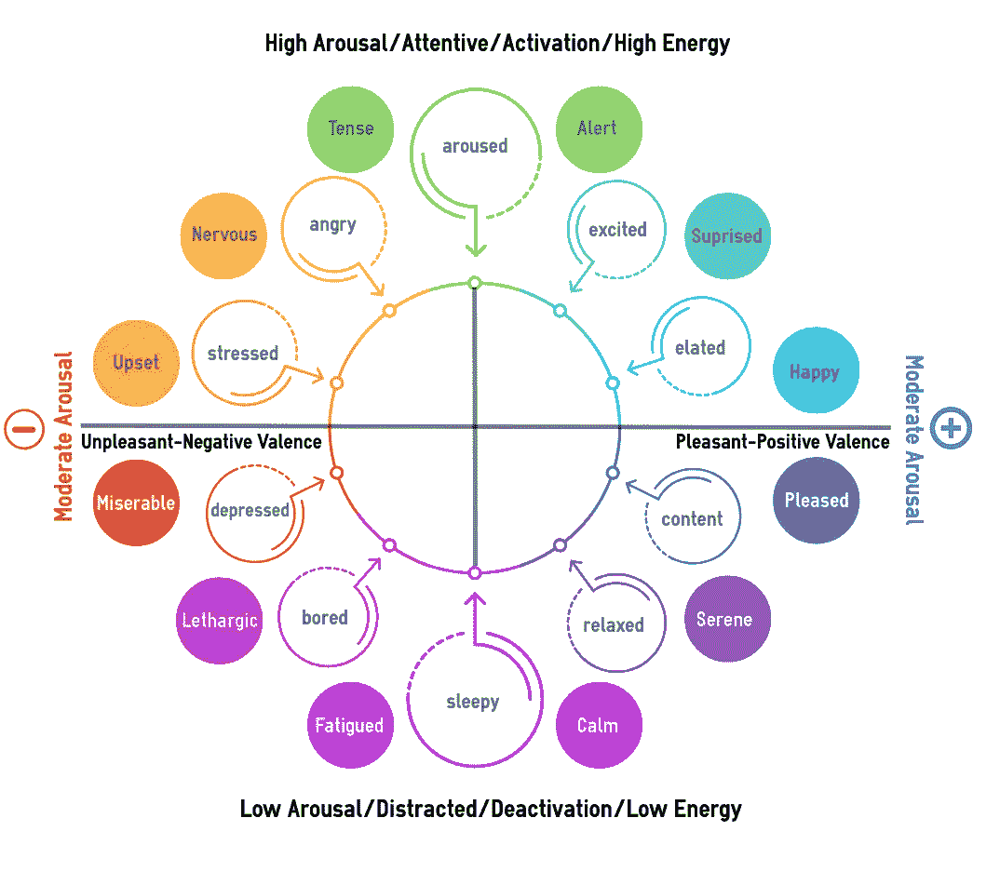
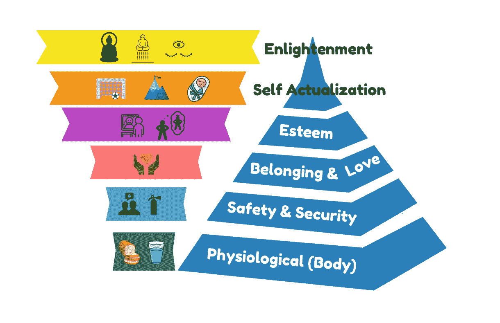
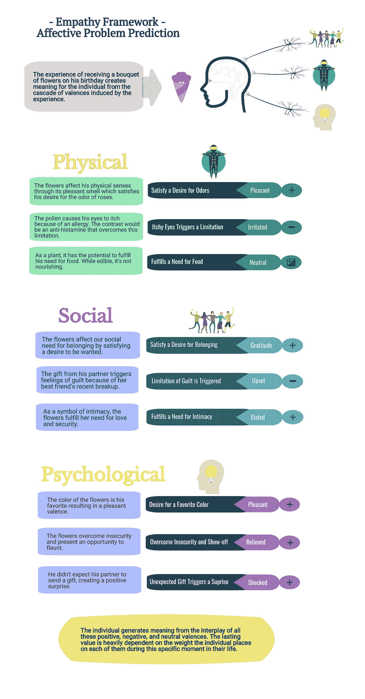

# 产品经理同理心解决问题指南

> 原文：<https://medium.com/hackernoon/empathetic-problem-solving-for-product-teams-c21ae97d68f5>

## 一个建立产品文化的框架，同时具有用户同理心和同情心

## 为什么用户同理心很重要？

用户同理心是创业公司和企业家经常使用的一个时髦词。你会在工作描述和[产品博客](https://www.interaction-design.org/literature/article/design-thinking-getting-started-with-empathy)中看到。在历史上，广告、[营销](https://www.forbes.com/sites/jiawertz/2019/05/01/why-marketing-your-product-is-more-important-than-the-product-itself/#59ed7ee321a1)和用户体验都强调这一点。它被产品管理学校、[创业孵化器](http://smitpatel.com/what-i-learned-from-my-internship-at-a-y-comb/)、[用户研究](https://www.toptal.com/designers/user-research/ux-research-methods)、[设计思维](https://www.interaction-design.org/literature/article/design-thinking-getting-started-with-empathy)，以及创业书籍所拥抱。

作为一种技能，用户共情和情商是密切相关的。将它们用于团队协作和解决问题，对于扩展任何产品或业务都是无价的。如果你的目标是创造用户喜爱的产品，那么实现这一目标的最可持续的途径将需要你的客户的不可思议的智慧。对你的用户有一个全面的了解有助于最初获得用户以及继续留住他们的策略。

但是为了获得它们，你需要洞察力来区分和识别它们。大多数产品经理和设计师通过用户研究、访谈、数据分析和用户测试来收集这些见解。虽然这些任务的完成并不能保证结果，但是希望这些活动能够创造一种以用户同理心为优先的产品文化。

许多产品团队和创业公司的问题是，这些活动并不总是导致对用户的彻底多样化或务实的理解。一个常见的障碍，尤其是对早期初创企业而言，是获取数据和用户反馈的途径最少。最重要的是，用于全面用户测试的资源经常受到时间和预算的限制。有一些解决方案可以提供帮助，但是全面了解您的市场所面临的问题是找到潜在用户来克服这一障碍的一种方法。

当有一个强调积极影响和社会公益的创建使命时，用户同理心尤其必要。创始人和产品负责人如何传播这些富有同情心的价值观，从而被他们的团队和组织所接受？研究表明，千禧一代正在积极寻求有意义的工作，具有社会影响力愿景的公司可以创造一种倡导目标的公司文化。

除了员工满意度之外，有意义的工作还能激发工作场所的[参与度](https://hbr.org/2015/11/meaningful-work-should-be-every-ceos-top-priority)并提高员工的忠诚度。虽然移情文化的重要性和下游效应是丰富的，但初始化和维护需要深思熟虑的努力。人们有很强的识别[假同理心](https://contently.com/2019/05/20/empathetic-marketing-fake-empathy/)的能力，致力于真正同理心的文化需要解读他们面临的问题的活动，以及赋予你的团队解决问题的能力的愿景。

这个框架作为一种移情的练习，通过习惯性的心理化，为人们提供培养和发展技能的工具。当我们拥有帮助消化和利用行为研究的心智模型和认知习惯时，我们就能够让自己做出明智的决定。通常，提取人类经验会加剧脱节，并可能导致一种非人性化的方法，抑制富有同情心的决定。我的目标是颠覆这一结果，转而推进共情的务实抽象。

## 让我们从共情的工作定义开始。

[同理心](https://plato.stanford.edu/entries/empathy/#EmpUniMetHumSci)是一种生物能力，具有深厚的[进化渊源](https://greatergood.berkeley.edu/article/item/the_evolution_of_empathy)，它是站在另一个人的角度，然后模拟他们经历的[情感](https://en.wikipedia.org/wiki/Affect_(psychology))价值的行为。这是一种与生俱来的能力，通常是对熟悉场景的潜意识实现。当我们放弃干预自己的情绪判断时，我们能够对个人的处境表现出更加共生的理解。当我们可以通过熟悉或常见的场景与他人分享情绪时，通常会更容易产生共鸣。根据我们的经验，随着我们与挑战我们身份的多样化人群互动，这些熟悉的场景将越来越少发生。

这种认知能力的进化导致了历史上所有促进合作、信任和互惠的慈善行为和利他行为。这些都是伟大团队努力追求的品质。众所周知，高情商的人也拥有同样的品质，这并不奇怪。

因为同理心作为一种能力主要是一种天生的技能，它经常不能被提炼或强化，导致决策的巨大盲点。当经历或场景是我们不熟悉的，或者当我们远离任何可靠的接触时，那么采纳他人的观点就变得不直观，导致*可弥补的*无知状态。

作为一项技能或专业能力，它本质上是一个思维过程，根植于开放的思想和消除认知偏见。通过创建一个模拟个人情绪的心理模型，同理心提供了任何体验背后的意义和内在价值。在技术和 SaaS 的背景下，我们希望调查这些价值，并将其视为见解，使我们能够利用它们来解决用户的问题，并最终对他们的生活产生积极影响。

同情经常与移情互换使用，而实际上，它是移情的一个方面。心理学和神经科学的研究人员将共情分为两种类型，情感(情感)共情和认知(理性)共情。情感共鸣可以被描述为一种本能反应，这种反应在我们身上引发了相似的感觉，对他们处境的痛苦，或对他们处境的同情。没有出口的过度情感共鸣会对一个人的健康有害。容易过度内化他人情绪的人通常会经历[式的痛苦](https://www.sciencedirect.com/science/article/pii/S0960982214007702)。

情感共鸣的积极效果是[同情](https://www.psychologytoday.com/us/blog/the-clarity/201703/compassion-is-better-empathy)，它刺激我们的决策，因此我们的行动可以有意识地解决问题。另一方面，理性同理心本质上提供了背景，它指的是理解另一个人的信仰、价值观和知识。这种额外的背景通常是通过用户研究、访谈、调查和生物识别设备收集的。

我们的目标是成为富有同情心的产品经理、有意识的创造者和有同情心的专业人士。我们正在寻求同理心，以便对我们的行动产生影响，做出利他的决定。在我们职业生涯的某个阶段，当我们对用户感同身受却缺乏一个富有同情心的工作场所时，我们中的许多人会对一家公司的文化感到苦恼。这些情况会产生恐惧和绝望感，通常会导致职业改变或激情项目。

## 用户同理心为你的产品提供了什么？

通过提供理解对用户的影响的渠道，同理心还提供了预测执行您的愿景和路线图的长期价值的远见。从短期来看，用户同理心为你的最低可行产品(MVP)提供了实用和功能价值。

即使有了既定的公司使命或产品愿景，当产品团队对其努力的影响有了充分的理解时，他们也可以变得更加有效和富有创造性地协作。在开发和发布容易引入认知偏差的产品时，从概念上把握对用户的影响甚至更为重要。真正的协作团队专注于他们为用户提供的价值。这不仅延伸到设计和开发团队，而且为了成功履行他们的职责，销售和产品营销需要了解他们的产品提供的价值*。*

## 为什么共情很重要？

自从大规模采用具有强大计算能力的移动设备以来，问题解决者发布破坏现有行业并最终破坏其用户和社区生活的产品变得更加容易。在大多数传统的产品管理框架中，用户通过他们的反馈和使用模式来帮助寻找适合产品市场的过程。

虽然这是一个非常有效的方法，但它仍然没有提供一个完整的画面，并且缺乏对人类经验价值的度量。这对于许多创始人和产品经理来说是非常明显的，他们积极地寻求对他们的产品负责，并继续实现他们的个人和专业使命，创造有益和有影响力的产品。

企业家和消费者有理由担心他们产品的社会影响。但是，如果没有某种预见能力，就不可能减轻意想不到的影响。

## 为什么很难预见产品的长期价值？

我们本质上在构思和设计阶段都会犯这些错误，因为没有一个客观的框架可以利用。同理心缺失的决策结果会导致对你核心使命的意外偏离。

我制造医疗保健产品的经历、认知科学的研究和个人使命促使我审视和完善自己的情商。这种能力提高了我从与用户的同理心关系中收集见解的能力。

我希望这本书能为领导者提供一个框架，让他们继续朝着完成使命的方向前进，并帮助产品经理向他们的团队传授一种同理心的解决问题的文化。作为[的看门人](https://www.upwork.com/hiring/startup/product-managers-gatekeepers-information/)，产品经理有责任通过传达产品的价值和他们对社会的影响，对他们的团队保持透明。

> 移情问题解决框架

## 移情在可持续产品开发中的作用

几乎每个产品驱动型组织的目标都包括最初的启动和持续的创新，以保留和扩大他们的用户群。

这种类型的产品成功可以总结为两个众所周知的原则，这也是每一个多产产品文化的核心。

1.  用户同理心，也称为对客户痛点的同理心。
2.  爱上问题而不是解决方案。

如果产品管理是一门正式的科学，并且有公理，大多数产品领导都会同意这两条原则。乍一看，大多数产品经理的职责是推出一个 MVP，找到一个适合产品市场的产品，扩大用户或客户群，并不断发布升级以留住用户。

每个产品部门的工作要求都有这些职责的组合。事实上，它们是如此的交织在一起，以至于项目经理的角色可以用一个简洁的问题陈述来概括。

> 有产品创意企业家发现，实现他们的愿景在通往可持续发展的道路上遇到了障碍。

根据产品的行业、公司使命和市场条件，可持续性可以有多种定义。

**可持续意味着:**

1.  保持市场领导者的地位
2.  保持增长率
3.  旋转以纠正故障
4.  导航技术采用周期
5.  管理对社会的影响

这份可持续发展清单上的所有项目都需要对用户的需求、愿望和限制有一个复杂的了解。

## 我们如何理解用户的痛点

客户同理心不仅意味着从用户的角度模拟体验，还意味着同情地捕捉有形的信息。PM 使用的一种方法是以人物角色类型的形式获取这些信息。不可否认，个人的独特性是我们最终不得不创建各种用户群的原因。这些一般化的分组并不总是提供关于用户问题状况的唯一信息。

有些人似乎天生就有预见用户所面临的问题的能力。虽然对某些人来说，同理心更像是一种本能，但当它被分解成一套客观的方法时，对用户的同理心仍然是一种可以增强和提炼的技能。

首先是形式化用户痛点的类型。用户遇到的问题种类繁多，但最终都可以通过优秀的产品和功能得到解决。事实上，正是产品提供的价值最终解决了客户的痛点。用户遇到的问题和技术产品提供的价值之间的差距由三个概念弥合。这些概念是一般的问题类型，为个人提供了基础意义。他们调解用户问题和产品价值之间的关系。

## 基于意义的问题类型概念

1.  克服限制
2.  满足需要
3.  满足欲望

这些一般的题型大家应该都很熟悉。它们的普遍性在于它们与日常经验和互动的相关性。它们是我们与生俱来的，因为它们所包含的影响范围最终产生了我们所有身体、精神和社会经历背后的价值。在认知科学中，个人体验被称为[感受性](https://en.wikipedia.org/wiki/Qualia)，它表示“体验是什么样的”。就像注射流感疫苗时可怕的预期和剧痛，或者闻一朵花的无害经历。最终，一个人的个人和主观体验会有所不同，特别是如果他们害怕针头或对花粉过敏。

> 如果我们有可以通过 3 个概念理解的经验，我如何利用这些信息来构建一个最小可行产品(MVP)，一个新的特性，或者改进一个现有的产品？

通过分解这三种问题类型，我们可以创建产品工件，讲述一个关于用户的良好连接的故事。这些关于你的用户的有价值的数据可以补充一切，从用户故事，优先级，线框，prd，可用性测试，调查，产品文案，推销和营销策略。

# 剖析问题的用户同理心

什么问题能让我理解用户从使用我的产品中获得的价值？最终，我们希望了解人们在与我们的产品互动时的感受。当我们用一个透镜来分析我们的经历并对它们的起源进行分类时，我们实际上能够衡量价值并创造一种感同身受的印象。这个镜头由三个部分组成，它们表示我们所经历的任何事情所影响的实际问题区域。物理和数字体验具有意义和价值，因为它们都是通过三种问题类型的组合来解释的。

1.  **克服限制的问题**——你有社交、身体和心理上的限制，为了达到平衡或放松的状态，你必须克服这些限制。超越你的局限会带来兴奋和得意的情绪。克服你的局限的经历通常会产生中性或积极的影响。那些进一步淡化或引起对局限性的注意的方法通常会导致负面的效价效应。
2.  **未满足需求的问题**——你有未满足的需求，因为你的身体、社交和心理领域有需要满足的先天需求。如果一个需求很难满足，它只会成为一个限制。人们经常通过满足他们相关的需求来克服他们的局限性。也就是说，我们需要水来维持正常的功能，但是在沙漠气候中获得水是一种限制，因为在这种环境中水是稀缺的。
3.  **实现欲望的问题**——你用你想要的东西来解释你周围的世界和经历，以获得你的社会、身体和心理上的持续幸福和安康。当体验实现或促进了你的欲望，那么内在价值通常是积极的。欲望通常会包含满足需求或克服限制的宏大方式

这些问题的抽象正是使我们能够彼此感同身受的原因。我们的动机基于这三个视角。无论这种经历源自自然、我们自己的思想还是技术，它都会对个人产生一种[影响，最终在一个或多个问题领域留下积极或消极的印记。在认知科学中，情感的这种印记存在于情感的错综复杂之中。](https://en.wikipedia.org/wiki/Valence_(psychology))

A visual representation of how experiences are translated to affect. The x-axis represents the basic value of experiences in the form of a valence. The y-axis represents the level of activation the experience induces.

情感的复杂模型是我们作为产品领导者可以利用的众多情感理论之一。这些理论的重要性不应该被低估。研究表明，我们的情感粒度和词汇与我们构建新情感体验的能力相关。

[罗伯特·普卢奇克的](https://en.wikipedia.org/wiki/Robert_Plutchik)，[情感之轮](https://positivepsychologyprogram.com/emotion-wheel/)是另一个具有启发性的理论，它以 8 种基本情感为前提。最近的研究扩展了这一点，显示了 27 个不同的维度。另一个信息丰富的情绪框架是弗雷德里克松的理论，该理论假设积极情绪拓宽了我们的行为选择，被称为思想-行动曲目，而消极情绪通常会对我们的行为选择产生缩小效应。

这些以及许多其他的行为和情绪理论是理解你的用户的无价资源。利用这三个问题原则最容易的方法是通过进化的观点来考虑它们。我们经历的大多数事情对所有三种问题类型都有影响，这并不奇怪。

创新的解决方案可以通过解决任何一类问题为用户创造巨大的价值。无论你的问题是你需要找一间公寓，还是无法追踪你部门的开支，这三种问题类型的组合将是解释其价值的透镜。解决这些问题的迭代和创新最终导致了像 Zillow 这样的产品找到住房和会计 QuickBooks。

# 限制、需求和欲望(LND)——深度潜水

**克服局限**指的是我们身体、思想和社会关系的脆弱性。我们在克服这些限制时面临的问题是我们长期生存和可持续性的基本要求。在技术方面，克服限制是长期可持续发展所必需的。虽然许多产品为直接影响睡眠周期、住房和食品安全的问题提供了解决方案，但当存在阻止用户实现其目标的约束时，克服限制也是显而易见的。

The most widespread taught framework for motivation is Maslow’s Hierarchy of Needs. Much research has shown that the existence of an actual ranking or hierarchy is unfounded.

***克服局限的技术范例*** — Medium 的 follow 按钮克服了我每天消化内容的时间限制。我可以用他们的精选提要来克服这个耗时的任务，而不是必须为新帖子添加书签和搜索作者。阅读文章的无缝参与周期为我提供了更多的时间来消费内容。

**满足需求**是指生产性和可持续性生活所必需的一般要求。它们本质上是马斯洛层次结构的前 4 层，由安全或保障、归属、尊重和自我实现组成。就人类生存而言，所有这些需求都是必须满足的问题，只有满足这些需求，个人才能满足并维持与社会的融合生活。

在科技领域，有许多产品，如社交网络和约会应用程序，可以解决与满足归属感需求相关的问题。甚至像跟踪客户付款这样的基本业务功能也是一种需要。如果不知道哪些客户已经支付了他们的发票，公司将很难维持运营。满足这一需求的解决方案将对企业的可持续性产生积极影响。

***满足需求的技术示例*** — Medium 的鼓掌功能满足了我量化内容参与度的需求。因为作者需要了解他们的内容是如何被接受的，所以读者能够提供反馈是非常必要的。这创造了一个强化的循环，作家可以了解哪些主题具有高水平的欣赏。因为作者也可能有建立读者群的目标，这个特性的价值有助于达到这个需求。

**满足欲望**指的是源于克服局限或满足需求的理想主义愿景的体验。这可以是想象中奢侈的事情，比如像鸟一样飞翔，或者是相对平凡而无害的拥有绿色头发的愿望。显而易见的是，想要拥有不是我们社会、心理和生理生活的需求和限制的结果的欲望是极其困难的。我们的欲望和激情是想象力的基石，也是社会创新的主要驱动力。

好奇心驱使的动机给我们带来了从医学到飞机的一切。在产品开发中，客户的愿望有助于项目经理理解用户或企业的长期目标。最终，最具可持续性的技术产品和品牌都诞生于有远见的创新者，他们的目标是解决最困难的问题，即客户的需求。

***满足欲望的科技范例*** —媒体的出版产品满足了我接触受众的欲望。内容平台及其读者群满足了作者以数字方式发布内容并接触受众的愿望。由于在许多其他博客平台上写作是可能的，Medium 的出版功能也通过提供整合的读者群克服了获得访问者的限制。

值得注意的是，这些问题类型没有明确的界限，并且因为它们独特的进化起源而相互影响。就像其他任何体验一样，用户对你的产品的体验也是独一无二的，这取决于他们个人的观点。

认识到这些特征有助于定义人物角色、细分市场和团队的过程。但是要做到这一点，我们需要完成我们如何消化这三种问题类型的故事。通过结合发展心理学和我们在婴儿和成人时使用的学习模式，我能够提出一个中介框架，为问题类型增加背景。

# LND 问题类型的调解人

通过利用童年发展理论的框架，我们可以更好地理解我们生活中受任何经历影响的领域。这三种问题类型的意义基础属性可以通过三种常见且普遍的媒介进一步分层，这三种媒介激发了我们的动机。

## 我们动机的三个中介

1.  一个涉及我们身体的**物理**组成部分，它是健康的，以及它如何与环境相互作用。与我们的身体健康、身体能力以及与世界的所有感官互动有关。
2.  一种**心理**或认知成分，反映了我们的情感、思想、信仰和精神状态。与我们的精神、宗教、性和整体心理健康有关。
3.  协调我们与世界和他人的心理联系的社会组成部分。与我们的关系和属性有关，如亲密、信任和依赖。

在我们发育成熟的过程中，这三个学习中介之间有巨大的重叠。儿科医生和儿童心理学家检查他们的病人的学习中介，以确保他们有能力完全概念化任何经验。在启动和产品管理环境中，这些问题类型和中介为我们提供了移情解释用户体验的能力。中介还指出了受特定功能或整个产品影响的功能学习领域。

从三种 LND 问题类型和 PSP(物理、社会和心理)中介中产生的意义、价值和动机是如此有影响力，以至于它经常对用户产生潜意识的意义。增加额外复杂性的一个因素是，没有经验发生在真空中，它们都被通常被称为[第八感觉](https://www.understood.org/en/learning-attention-issues/child-learning-disabilities/sensory-processing-issues/interoception-and-sensory-processing-issues-what-you-need-to-know)的东西所混淆。心理学家将这种现象称之为内视知觉，它会产生像因饥饿或在炎热的夏天外出而烦躁的感觉。下面的漫画是一个很好的例子，说明了内视感受的混杂性质。

**B**ecause it’s difficult to separate the emotions triggered by our internal organs, Interoception can confound the true value of our experiences.

内观可以被理解为从我们的身体到大脑的多种途径产生的持续体验。它们帮助我们意识到我们身体的需求和限制。这是我们的身体通过 LND-PSP 问题类型不断发送信号的方式。这些内视感受是人的初始状态的一部分。

另一部分是个人以前经历的记忆、意义和价值。用户初始状态的两个方面将继续影响未来的后续体验。建立同理心和情商的困难之一是理解所有这些混淆因素。

下面的信息图是移情框架应用于一个熟悉场景的例子。它表明任何人都可以暴露一次经历引发的问题。在下面的场景中，是这个人的生日。这个人刚刚开始和他的新搭档约会，并渴望在那天早上早点开工作会议。当他到达工作地点时，办公桌上有一个送礼物的篮子，里面放着鲜花。他通过问题类型及其调解人的视角来处理这种体验。

The experience of receiving a bouquet of flowers on Valentine's Day creates meaning for the individual from the cascade of valences induced by the experience. The value arises from how heavily each of them is weighted in that specific moment in a person’s life. This confluence of valence is the empathetic attributes, we can share with the individual.

情感状态是通过这些问题类型和中介产生的。这种理解情感状态是如何产生的方法允许我们与用户建立一种移情关系。理解经验的原则根植于问题，是我们所有行动和决定背后的真正动机。问题从它们产生的积极、消极和中性价的范围中归纳出情感状态的二分法。

广告和设计团队擅长使用精心选择的颜色、字体、措辞、间距和各种其他元素来创建媒体和用户界面，以诱导特定的价值、意义和引发情感。品牌和营销有着相似的原则，并被证明对产品的成功非常重要。

通常，产品的质量或[价](https://www.affective-science.org/pubs/2006/Barrett2006valence.pdf)是正面的，但对用户的负面影响也很常见。社交媒体的一个缺点源于这样一个事实，即我们是高度奖励导向的，在产品没有提供奖励的情况下，用户可能会体验到负面影响。即使它确实提供了回报，那么负面影响也可能通过上瘾行为或错误信息而存在。

作为产品领导者，我们有责任驾驭这些后果，为用户和客户找到平衡。最终，用户同理心允许创始人和产品经理通过捕捉用户体验的所有问题维度来阻止他们产品的负面影响。因为这些信息有助于我们进行预测，所以我们可以主动确保对用户的生活产生积极影响。可持续的影响对于使命驱动的初创公司尤为重要，这些公司有着颠覆性的愿景，需要他们预测意想不到的后果。

从可穿戴设备和医疗保健应用到社交媒体平台，几乎每一种产品都需要采取预防措施，以减轻对用户生活的不利影响。现在，由于人工智能驱动的学习产品的激增，算法在包含许多[隐含](https://www.smithsonianmag.com/innovation/artificial-intelligence-is-now-used-predict-crime-is-it-biased-180968337/)和[算法偏差](https://en.wikipedia.org/wiki/Algorithmic_bias)的大量数据上进行训练。技术发展的这些现实给产品领导者创造了一种紧迫感，以减轻负面影响并防止这些偏见渗透到产品、用户生活和社会中。

## 应用用户移情框架

这种同理心的问题解决框架可以作为在产品团队或组织中促进可持续实践的指南。作为一种分析方法，它结合了定性和定量研究。同理心框架可以帮助解释和利用大量的研究，这些研究显示了像[社会资本](https://www.ncbi.nlm.nih.gov/pmc/articles/PMC4283587/)这样的技术好处以及像[网络欺凌和孤立](https://www.ncbi.nlm.nih.gov/pmc/articles/PMC4789623/)这样的负面影响。

通过整合快速发展的技术产品所产生的问题，这种同理心框架提供了一个结构化的过程，用于消化和整合像[虚拟距离](https://phys.org/news/2015-03-technology-rewriting-rulebook-human-interaction.html)和[数字责任](https://www.digitalresponsibility.org/health-and-technology)这样的发现。管理产品效果的关键是用尽我们的研究和信息渠道。

完善我们的移情技能赋予我们个性化另一个人的主观体验的能力。尽管同理心是一种与生俱来的品质，但它可以被训练、提炼，并融入我们对问题的热爱的思维模式中。

通过处理从分析、用户测试、研究到与这三种问题类型的客户互动的所有事情，您的团队和公司将始终朝着可持续发展的方向努力。通过关注用户问题来设计你的产品可以建立一种换位思考的公司文化，最终转化为客户的信任。

我希望这个框架可以帮助其他人通过引导他们理解他们的影响，帮助他们变得有同理心，并提高他们的整体情商来实现他们的个人和职业目标。这些技能的融合导致了一种富有同情心和谨慎决策的文化。

在未来的故事中，我将继续推进这个框架，重点关注实用的产品管理。通过跟踪短期和长期用户旅程，产品经理可以创造一条通向可持续产品生命周期的道路。在那之前，引导你的同理心，要有影响力！