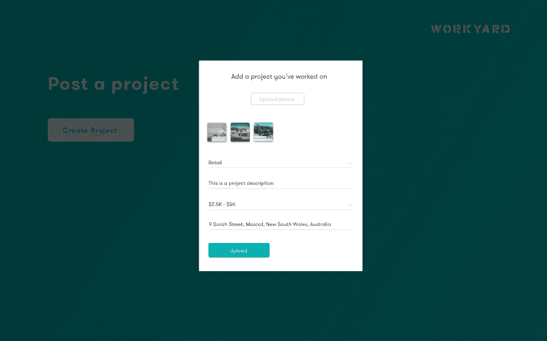

# 工程带回家测试做对了

> 原文：<https://medium.com/hackernoon/engineering-take-home-tests-done-right-210398a5d768>

Illustration by [Qieer Wang](http://www.qieerwang.com/)

工程带回家测试是一件有争议的事情。虽然一些雇主信誓旦旦地说他们，但正如许多工程师认为他们不尊重人，懒惰，并且断然拒绝有他们参加的面试。

真相是:**带回家的面试很棒，**但对于初创公司来说，它们真的很容易犯下灾难性的错误。

与其他测试方法相比，一个好的带回家的测试方法有几个优点:

*   它提供了比白板访谈或计时挑战更准确的工作样本。
*   它消除了不切实际的高压测试——如计时挑战——带来的压力。
*   它创建了简单的基准，因为每个工程师都应该接受相同的测试。

不幸的是，招聘经理经常给出需要几天才能完成的带回家的项目，这些项目与工程师将在公司从事的工作没有关系，并且比算法面试更能给潜在的工程师带来压力。

要创建一个工程师将实际完成的“带回家”项目，同时还能很好地衡量他们的能力，请严格遵循以下三个原则:

# 1.尊重工程师的时间

你带回家的时间越长，工程师完成它的可能性就越小。

大多数对你的职位感兴趣的工程师也会去其他公司面试，其中很多都需要带回家的项目。带回家的项目越积越多，假设工程师仍在全职工作，他们根本没有时间免费完成一个四小时的项目。此外，优秀的工程师知道他们的时间值多少钱——要求四个小时的免费代码会导致有经验的工程师拒绝你的测试。

如果你真的需要分配一个超过四个小时的项目，**你应该支付候选人的代码**。如果你没有资源这样做，分配一个较短的带回家。

为了确保你的带回家的东西不会占用你几天的工程时间，把项目的范围缩小到几个特性，并且，除非你是专门为利基技术的专业知识而招聘，尽最大努力确保项目不需要熟悉一个模糊的框架，这将花费工程师几个小时的研究时间。

最后，围绕这项工作需要多长时间设定明确的预期。如果只需要两个小时，在你的说明中明确说明。

音频流媒体服务 [TuneIn](https://angel.co/tunein) 是一个创业公司明确设定其带回家挑战时间的例子，你可以在 GitHub 知识库中查看。该说明包括:

> 嘿前端开发者。欢迎光临。如果你选择接受它，你的任务是抽出 2 个小时，使用下面定义的 mini TuneIn station API 创建一个单页应用程序(SPA)。
> 
> 嘿，这很重要！我们希望你能在这个项目上花大约两个小时。如果你能更快地完成——太好了！如果没有，限制自己，最多不要超过 2 小时。

[TuneIn 的](https://angel.co/tunein)团队也竭尽全力限制安装时间。提供了样板代码(尽管候选人可以随意丢弃它)，它们共享一个简单的 API，候选人可以从这个 API 调用数据。

因此，候选人可以快速启动并运行，并专注于解决带回家的实际挑战。他们对时间也有明确的预期。如果项目需要两个多小时才能完成，是时候停下来了。

**公司是如何误解这一点的:**

*   大规模地分配项目，即使是高级工程师也需要几天才能完成
*   分配需要深入了解某个小众领域的项目，大多数工程师需要花费数小时进行研究
*   在候选人开始工作之前，分配需要大量准备时间的项目

# 2.让你的测试接近一个工作产品

从招聘的角度来看，带回家项目的主要优势是，你可以看到如果候选人从事你的生产代码会是什么样子。他们的项目越接近你所做的实际工作，你就能更好地了解他们将如何为你的团队做出贡献。

为了做好这一点，构建一个项目来模拟你的产品的关键特性，而不是复制它的全部复杂性。 [Workyard](https://angel.co/workyard) ，一家连接建筑公司和工人的公司，在它的[前端带回家](https://github.com/work-yard/web-take-home-project)中做这件事。团队这样解释他们的任务:

> 如果您选择接受，这个任务就是在 React 中构建一个“提交项目”模型。我们会将您的新项目发布到 Workyard 的 staging API。项目成功发布后，我们将在一个非常简单的卡片列表中显示您的所有新项目。

它们包括为候选人模拟模型的草图文件，因此工程师不必独自尝试设计前端:

除了这些图像，Workyard 还提供了他们团队编码约定的深入文档。(下面只是快照。实际的清单要长得多。):

> -瘦组件，胖帮手。将尽可能多的复杂性放入助手文件中。
> 
> -让 mapStateToProps 充满助手调用，让 render()尽可能瘦。

他们的前端项目要求工程师创建一段功能代码，模仿 Workyard 的实际功能——发布项目——同样重要的是，它要求候选人遵循 Workyard 的惯例。候选人被给予详细的技术规格，就像他们在实际产品上一样。他们还会得到一个电话号码和其他联系信息，以便向工程团队提问。

通过这种方式设置项目，Workyard 可以了解一名工程师实际上如何融入他们的工程组织，相反，候选人可以真正了解在 Workyard 担任工程师的感觉。

**公司是如何弄错的:**

*   实际上是玩具的项目，与工作产品完全无关。
*   过度设计的项目是为了测试某些特定的东西——例如，候选人如何承诺。

# 3.不给范围蔓延留有余地

当一个工程师在你的团队中时，他们正试图推出一个成功的产品。当一个工程师在做你的带回家的测试时，他们试图给你留下深刻印象。无论你的带回家的项目有多现实，这种差异都会改变工程师处理它们的方式。

最大的风险之一是范围蔓延。如果你给一个工程师一个没有限制的项目，比如“构建一个使用我们的 API 并拥有 X 个关键特性的前端”，理论上范围是无限的。在一个真实的项目中，同一个工程师将(希望)专注于为你的商业目标服务的运输特性，在这个项目中，工程师将担心给你留下深刻印象。添加额外的功能，使用不必要的新框架，用 TypeScript 重写样板文件——这可能会很快失控。

即使一个工程师没有增加项目的工作时间来试图超越，他们也会面临猜测你是否暗中希望他们这样做的压力。你是不是故意含糊其辞，看看他们是否超额交货？

通过清楚地陈述对项目的期望来防止这种情况。[流行的基于云的视频后期制作平台 Frame.io](https://angel.co/frame-io) 就是一个很好的例子，它的前端可以带回家，你可以在[的 GitHub 仓库](https://github.com/Frameio/frontend-exercise-public)中看到。

这个项目本身相当简单。他们提供了一个工作的自动完成搜索组件(想想谷歌搜索)，并要求工程师实现两个新功能。他们在样板文件中提供了基本应用程序的工作演示，您可以在不到一分钟的时间内完成安装:

除了演示之外，他们还提供了对工程师在项目中的工作的具体期望:

> -组件应可重复使用。在同一个页面上应该可以有组件的多个实例。
> 
> -使用数据数组的“States”示例应该继续工作。
> 
> -组件应该接受任何 HTTP 端点，而不仅仅是上面的[https://api.github.com/users](https://api.github.com/users)例子。
> 
> -您的组件应该可以在 Chrome 中正常工作，不要担心跨浏览器兼容性。
> 
> -您可以使用 jQuery 之类的小型 DOM 助手或 Lodash 的实用程序，但不能使用 React、Angular 或 Vue.js 之类的大型库/框架
> 
> -你*可以*修改现有代码的所有部分，但你不需要这样做来提供一个很好的解决方案。
> 
> -在 SOLUTION.md 中记录您的组件。

最后，他们指示工程师在第四个小时停止工作，并解释如果这是一个真正的工作产品，他们会做的任何额外工作。通过这种方式， [Frame.io](http://frame.io/) 团队为工程师们留出了超越的空间，而无需花费时间去编写额外的代码。

**公司如何理解这个错误:**

*   具有模糊可交付性的项目，为大规模范围蔓延敞开了大门
*   根据不明确的标准判断的项目——如果广泛的评论对你来说是优先事项，那就说出来
*   难以想象的大项目。如果你期望你的全职工程师需要一整天来运送它，那就太大了

# 给工程候选人一次真正的代码审查

创业公司在带回家的项目中犯的另一个错误与项目本身的组成没有任何关系。而是问题出在审核环节。对于候选人来说，最令人沮丧的经历之一是花几个小时在反映他们最大努力的工作上，却被叫到现场面试，经理显然从未看过他们的代码。

如果你把工程师带回家，带他们去现场，尊重他们投入项目的时间。与他们讨论他们的代码，询问他们的决策过程，并了解他们对软件的看法。

你的带回家的东西不应该是技术屏幕的替身。它不应该只是另一个让工程师跳过去的铁环。你带回家的东西应该能在面试过程中节省你的时间，帮助你更好地评估你的候选人，并减轻工程师的一些压力——但只有当你像你的候选人一样投入时，它才能做到这一切。

*最初发表于*[*angel.co*](https://angel.co/blog/engineers-hate-your-take-home-project-heres-how-to-fix-it)*。*