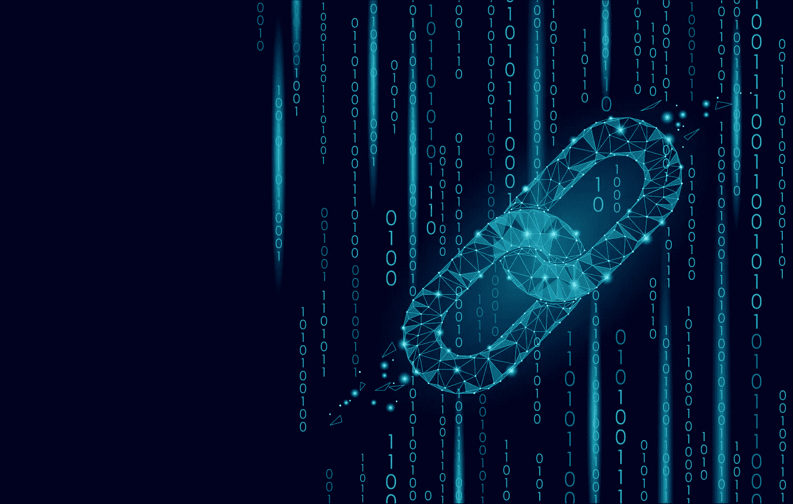

# 利用区块链确保食品质量

> 原文：<https://medium.com/hackernoon/ensuring-food-quality-with-blockchain-ab87bed0d22f>

[source](https://innovationatwork.ieee.org/wp-content/uploads/2018/05/bigstock-218766826.jpg)

我们每周都会在家附近的商店购买食品杂货。我们通常更喜欢从受欢迎的超市购物，而不是小商店。这是因为我们更信任大品牌，而不是市场上的新进入者。

这种偏见在逻辑上是有缺陷的，因为没有一家商店生产它所销售的东西。他们只是从经销商那里购买，加上价格标签，然后出售。我们不能确定我们购买的股票是纯的。不幸的是，有时没有检查食物是否过期。

例如，几天前，我在公寓附近的一家著名商店购买了“冷冻鸡翅”。咬一口后(用微波炉加热后)，肉变得很粘。我不得不扔掉整盘菜。我应该认为自己真的很幸运，食物没有损害我的健康。

食用含有合成物质和防腐剂的食物是不健康的。这样的食物会损害你的免疫系统，让你变得脆弱。长期消费这些商品会对下一代的孩子产生影响。

在这篇文章中，我打算解决这个问题。

# 解决办法

## 生产过程说明

1.  从原材料到最终产品，我们的食物经过了许多人的手。
2.  让我把这些机构称为 A1、A2、A3……等等。每个机构都有自己独特的数字签名，代表是 S1、S2、S3 等等。
3.  当食品转手时，会有两个二维码印在包含食品/中间产品的包装上。第一个二维码 **Q1** ，将包含刚刚完成产品任务的代理人的签名。以及第二个 QR 码， **Q2** ，由一个函数生成，该函数将输入作为当前代理和供应链中所有先前代理的签名的累积和。例如，当代理 A6 完成其工作时，第二个二维码将具有签名为*SIG*(A1+A2+A3+A4+A5+A6)*。*其中 *sig* ()为签名函数。所有这些信息都会保存在一个区块链上。区块链是防篡改的，将有助于加强食品供应链的规则。
4.  A1 在一批货物上完成他的工作后。Q1 = *西格* (A1)，Q2 = *西格* (A1)。
5.  现在，当 A2 从 A1 收到这批货时，他将在扫描仪的帮助下验证 Q1 和 Q2。该扫描仪将从区块链检索数据，并检查货物的完整性。如果数据与区块链不匹配，则已发货批次将被丢弃。在确认其真实性后，A2 将对这批货物进行必要的修改。现在 Q1 和 Q2 的值分别是 Q1= *sig* (A1)和 Q2 = *sig* (A1+A2)。
6.  这个过程还在继续。当它到达最终代理“al”时，只有一个 QR 码 Q 将被附加到最终的食品产品上。Q 定义为:Q**=*SIG*(A1+A2+A3…+AL+批号+有效期)**，其中批号和有效期是针对特定批次的食品。
7.  这是现在运往商店 M1，M2，M3…等等。
8.  作为顾客，我们将扫描食品的二维码“Q”。如果“当前”系统时间超过到期日期，将与自动区块链上存储的数据不匹配。机器上会有一个输出，说明食品已经过期。然后，我们可以选择同一产品的另一部分。就凭这一点，食物的质量就**绝不会**打折扣。

## 免受不良行为者的影响

代理商很有可能变得自私，在货物中添加杂质。我打算通过在每批完成后给代理奖励点数来避免这种情况。如果代理变得自私，并且该批次因为他而被拒绝(当链中的下一个代理拒绝该批次时，我们将知道这一点)，则区块链减少一些点。这个过程可以在**自主智能合同**的帮助下实现自动化。这些奖励积分可用作与其他食品供应链中的其他机构签订进一步合同的衡量标准。

我们还将确保商场公平竞争。每当消费者检测到过期的食品时，商店的积分就会减少一些(因为商店应该已经将该批次从过道中移除)。公众可以访问这些商店的点。这将使我们甚至信任新进入者，从而使市场民主化。

因此，代理商和商店都将为网络的利益而努力。

## 履行

1.  借助云，该生态系统可以作为“区块链即服务”提供。
2.  **代理商**和**店铺**可以通过支付费用参与到这个生态系统中。维护云架构需要这笔费用。
3.  将显示代理商和商店的**奖励积分**的网站。这将有助于“商店信任代理商”和“顾客信任商店”。
4.  为了简单起见，还可以开发一个跨平台的移动应用程序，以便可以随时查看商店的跟踪记录。

这将有助于我们建立一个开放的市场，在这个市场上，消费的食品质量永远不会受到损害。

下面这段引语激励我写这篇文章:

> "区块链将民主和互联网的开放性与市场的优点结合起来."~ [海军 Ravikant](https://twitter.com/naval/status/877470419720183810)

感谢您阅读我的文章。

**注:**
本文来自莱特州立大学智能实验室在裴勇博士指导下完成的研究工作。

莱特州立大学:[https://www.wright.edu/](https://www.wright.edu/)计算机科学与工程系:[https://www . Wright . edu/degrees-and-programs/profile/Computer-Science](https://www.wright.edu/degrees-and-programs/profile/computer-science)
裴勇俊博士:[https://people.wright.edu/yong.pei](https://people.wright.edu/yong.pei)

*如有任何问题，欢迎随时给我发* [*邮件*](mailto:pamanalionline@gmail.com) *。也可以通过*[*Linkedin*](https://www.linkedin.com/in/amanali1/)*联系我。也可以关注我的* [*推特*](https://twitter.com/aliandco) *。*

*为了入门区块链阅读我的* [*文章*](https://hackernoon.com/blockchain-learning-path-2019-e54d6763dd6c) *发表于*[*hacker noon*](https://hackernoon.com/)*。*

