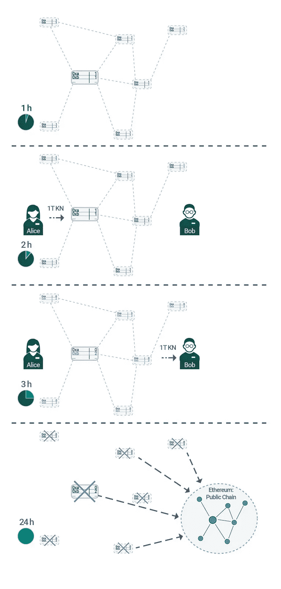
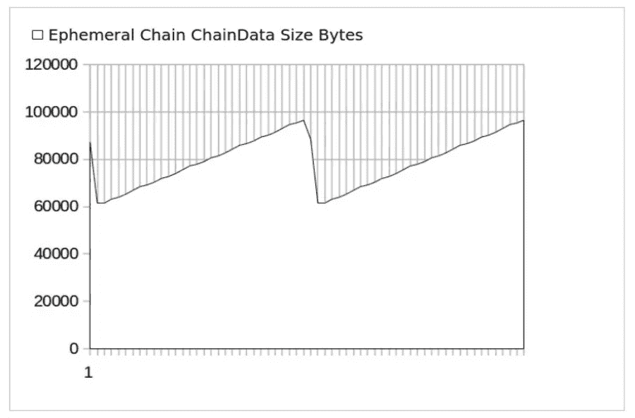

# 短暂的区块链:蜉蝣解决区块链的数据存储限制

> 原文：<https://medium.com/hackernoon/ephemeral-%C2%B5blockchains-the-mayflies-tackling-data-storage-limitations-on-the-blockchain-f38bfdad51b>

Ephemeral small mayflies have the shortest life spans of all animals — close to just one day. Similarly, Ephemeral Blockchains can be crafted to exist for just 24 hours. Image courtesy of [Fly Fisherman](http://www.flyfisherman.com/how-to/understanding-mayflies/).

**简介:开放软件运动**

我们在全球看到了成千上万的创新项目，它们都是开源软件运动的直接结果。随着更多不透明的行业被开发者在像*区块链这样的账本共享技术的帮助下变得透明，封闭源代码的趋势已经明显消失。*自从比特币取得成果并因其创新性而影响银行业以来，我们已经看到了让金融领域变得更加透明的多种尝试，这是朝着正确方向迈出的一步。举个例子，最近高盛支持的圈子公司，用一个简单的公共以太坊标准令牌契约制作了自己的透明稳定硬币[**【USDC】**](/centre-blog/designing-an-upgradeable-ethereum-contract-3d850f637794)此处可见**。**

****膨胀以太坊区块链****

****

**越来越多的公司正在推介涉及将不同的供应链数据或所有权记录放在区块链上的项目(就像我们在这里的 [Verv](http://www.vlux.io) 一样，绿色能源的所有权可以通过 VLUX 令牌在社区之间进行交易)，其中大多数公司计划将这些数据放在公共以太坊区块链上。**

**虽然向分布式账本技术的转变是一件好事，但放在以太坊区块链上的庞大数据量可能会让它变得臃肿和不可用。通过将一切放在以太坊区块链上来实现透明和无腐败的举措值得称赞，但这可能是不可持续的，除非我们能找到更聪明的方法来做到这一点。**

**如果我们将行业作为一个整体来看，数据膨胀问题已经给全节点运营商带来了问题。以过度使用的公共区块链为例，它们没有实施 L2 或分片缩放解决方案，也没有快速的私有区块链/分类帐。在撰写本文时，以太坊似乎即将达到 1TB，英特尔在 DLS 面临着[扩展问题](https://www.coindesk.com/no-miners-intel-seeks-to-automate-dlt-block-verification/)，tangles 据称也面临着同样的问题——以预计的[指数级增长](https://iota.stackexchange.com/questions/181/what-are-the-iota-disk-space-needs)为例。**

****潜在解决方案****

**我们可以考虑的一个选择是建造更小的区块链，姑且称之为*微型区块链*，用于存储能源相关数据。但是，由于我们现有的所有支持物联网的设备的存储容量有限，保持持续增长的区块链数据几乎是不可能的，因此需要一种不同的方法。**

**因此，另一个不同的选择是看看使用**短命的区块链、**区块链，我们喜欢把它们比作小蜉蝣，因为它们的寿命很短。**

**这需要周期性地从零开始启动区块链，保存该链的寿命结束时的修剪/满状态，然后完全丢弃它。保存的寿命结束状态然后被用作新链的起源块的基础，然后它运行并重复相同的过程以保持连续性。**

**最终的寿命结束状态对于想要加入网络的新节点变得有用，因为它们可以使用该状态来构建 [P2P 通信协议](https://github.com/ethereum/wiki/wiki/Ethereum-Wire-Protocol#ethereum-sub-protocol)中所需的起源块，这允许它们完全同步。为简单起见，只有第一个寿命终止状态应该被完整保存，而第二个应该被修剪/加工以包含来自先前状态的已经被改变、移除或添加的部分。反过来，我们可以在像**以太坊公共区块链**这样的公共区块链上保存我们最近丢弃的短暂区块链的生命结束状态。通过这种方式，新的物联网设备可以依赖公共以太坊区块链来获取重建当前区块链的创世纪区块所需的数据，然后依赖所有其他物联网设备来完全同步。**

**因此，短暂的区块链为链的磁盘存储容量限制提供了解决方案。虽然我们承认系统上可能仍然需要额外的存储空间来存储获取构建 genesis 块所需元素所需的公共链数据，但这可以通过避免保存公共链数据、以*轻型客户端*模式运行并行公共节点或使用可信 API 来解决。**

****

****Hour 1:** The Ephemeral blockchain starts with the same default balance of 1 Token in the first hour; **Hour 2:** Alice initiates a send transaction to send 1 token to Bob; **Hour 3:** Every machine finishes updating the ledger accordingly therefore Bob now has 2 Tokens; **Hour 24:** After that, the machines send a transaction on the Public Ethereum Blockchain with the latest pruned state. The Ephemeral blockchain then gets discarded but everyone’s balance is then used as the genesis block for the following day.**

****定义短暂的区块链****

**短暂的区块链可以定义为不会永远存在(或者不会像比特币那样存在几十年/几个世纪)的区块链。相反，一旦区块链的目的达到(例如记录交易)，或者一旦其状态被永久存储在别处，它们就被销毁。**

**所存储的寿命结束状态应该仅仅是关于短暂链的相关结束事实的数据，因此将所有内容压缩了一个相当大的数量级。**

****潜在增长曲线****

**下图显示了短暂区块链的 ChainData 大小的增长情况:**

****

**相对于公共以太坊链数据大小:**

****

****Source:** [Etherscan](https://etherscan.io/chart2/chaindatasizefast)**

****进行短暂的创世状态事务****

**在寿命即将结束时执行的在公共以太坊链上保存短暂区块链状态的事务可以由短暂链中的所有节点通过多签名加密来完成，或者由少数指定的代表性双节点之一来完成(即，它们并行运行公共链和短暂链)。**

**另一种选择是将密钥分割并分发给所有参与者，或者链上多重签名智能合约功能也可以工作。还可以增加挽救生命终结状态的激励系统。这里的可能性是无限的。**

****

**最后，整个短暂的区块链系统可以得到增强。实现这一点的方法是使用跨链散列，其中链的末端块将包括属于两个或多个相邻区块链的其他块的散列/完整状态/差异状态，从而创建复杂的交织加密系统，带来额外的安全性或审计能力。**

****短暂连锁 VS 国家频道****

**有人可能会问，为什么短暂链的概念与正常的链事务结合在一起，与状态通道不同。这两个概念不是一样的吗？**

**答案是否定的，它们不一样。主要区别在于，迄今为止，国家频道是为少数用户设计的。最值得注意的是，在[回合制游戏](https://blog.decenter.com/2018/08/07/introducing-etherships-using-state-channels-scale-ethereum-games/)中，国家频道主要用于两个用户，同时国家频道也为大量的链外交易而构建。然而，在短暂链的情况下，状态在公共链上，我们最终会有大量的用户。需要插入到公共链中的状态将通过剪枝/压缩/差分提取来减小大小，然后定期而不是不定期地保存在公共链上。**

**此外，短命链可以用不同的层来建造——一些层上面有一个更大的短命链，寿命更长，然后在所有层上面再放一个永久的区块链。**

****如果短暂的区块链是人类****

****

**如果我们想为短暂的区块链提供人类对比，那么它将是一个没有能力创造新记忆的人。与电影《纪念品》(2000)中的主角——伦纳德——相似的人。**

**在电影中，伦纳德患有一种疾病(顺行性健忘症)，他缺乏创造新记忆的能力，因此他每小时都会失去一次思路。在那段时间里，他可以记住一秒钟到另一秒钟的事情，但仅此而已，作为解决办法，他用纹身墨水在身上写下小句子。**

**虽然奇怪，但伦纳德的纹身记忆系统对他有效。他把重要的小句子写在身上，以便以后查看。他不相信任何人和任何事，除了他的墨水，没有人能欺骗他关于他是谁或者关于过去，因为他知道他的笔迹。**

**在某种程度上，短暂的锁链就像伦纳德的大脑，而其他区块链(如以太坊区块链)就像伦纳德的皮肤。他的思想是短暂的，但写在他身上的纹身是永久的——两个区块链是不可分割的，他们像一个人一样工作。**

**虽然这种将短暂的区块链与永久的区块链结合使用的方式带来了一些未经探索的攻击媒介，但总的来说，这种解决方案有可能像所有其他常规区块链一样安全。这是我们将在另一篇技术深度文章中探讨的内容。**

****由 Verv 的首席区块链开发者 Andy Baloiu (Twitter: @andysigner)撰写****