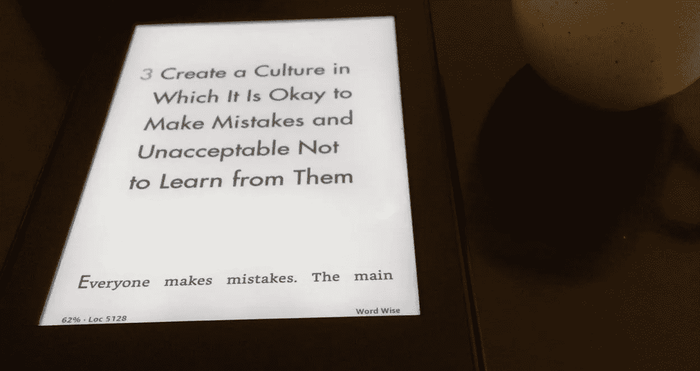
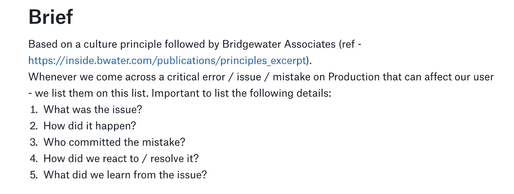
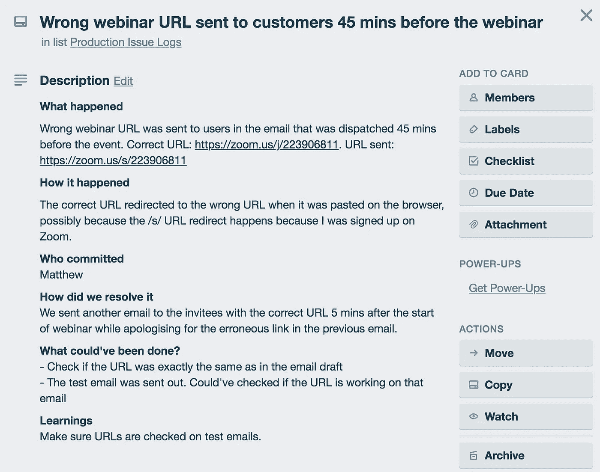

# 作为启动培养实验的错误日志

> 原文：<https://medium.com/hackernoon/error-logs-as-a-startup-culture-experiment-16d5559ff0d6>

# 我们从实施雷伊·达里奥的错误日志方法来鼓励团队中的失败和错误中学到了什么，并从中吸取了教训。

# **前言**

马克·扎克伯格，[脸书](https://hackernoon.com/tagged/facebook)的首席执行官，曾经说过:*“快速行动，打破常规。除非你在破坏东西，否则你的速度不够快。”*

这是脸书遵循的哲学，他们的执行速度很大程度上可以归功于这个咒语。初创公司会喜欢速度(与市场上的现有公司相比，这是他们的关键优势之一),并且通常会积极支持这种思维过程。然而，没有人强调的是脸书内部建立的系统，以确保开发商在不影响业务的情况下，可以自由地构建和破坏东西。我从与脸书工程师的交谈中了解到这一点，当脸书作为一家公司扩大规模时，考虑到他们永远不想剥夺犯错的好处，这似乎是正确的一步。

当非常早期的创业公司盲目遵循这一哲学时，他们试图方便地忽略一个小错误，有时足以让他们的业务(或相当大的一部分)瘫痪。我们倾向于忘记我们是脆弱的。

在[**typico**](https://typito.com?utm_source=medium&utm_medium=social&utm_campaign=work_at_typito&utm_content=error-log-experiment)公司，无论我们何时向公众推出产品，无论是产品更新/电子邮件活动还是其他什么，我们都尽力保持谨慎。试图过于谨慎肯定是一种开销，但我们不确定是否有其他方法可以做到这一点。当我们不犯错误时，生活是美好的，对吗？但事实证明，错误和失误是必然会发生的，你需要学会应对它们。

## **App 宕机事件及其连锁效应**

2017 年的一个晴朗的早晨。我早上 6:30 左右起床，查看我的电子邮件，寻找任何重要的信息。我看到 3 封来自客户的电子邮件，询问我们的应用程序是否宕机。我立即打开浏览器，试着打开 Typito，发现 SSL 证书过期了。我的联合创始人 Srijith 知道这件事，但他认为我们还有一天就到期了，那天晚上他要去他的家乡。我们意识到应用程序宕机超过 2 个小时，我决定在 Srijith 上发泄一下，并做了当时你能做的最愚蠢的事情:在 Slack 上访问#general channel 并对他大喊(用大写字母输入)，好像这样就能解决问题。再过一个小时，他就要到达他在喀拉拉邦的家乡了，我们不得不等他解决问题(大约 3.5 小时的停机时间)。这件事之后，我们的团队在执行时变得格外小心，这拖慢了我们的进度。

回过头来看，我意识到这是我做的一件痛苦的事情，我为我们的小团队树立了一个先例，即*的错误将受到处罚*。所有这些都没有意识到我们仍然是一个小团队，我们只能做这么多来确保我们不犯错误。我后来就我在那种情况下的行为向斯里吉斯和我的团队道歉。但挑战依然存在:*你如何建立一种鼓励失败和错误，同时能够从中吸取教训的文化。*

## **雷伊·达里奥的错误日志**

直到 2017 年底，我才接触到全球最大对冲基金公司 Bridgewater Associates 的首席执行官[雷伊·达里奥](https://twitter.com/RayDalio)写的书 [Principles](https://www.goodreads.com/book/show/34536488-principles) 。那时我已经读过《原则》的概要版本，并且非常钦佩他努力建立一个基于精英管理的团队。但我能体会到的这本书最精彩的部分之一是“工作原则”这一部分，在这一部分，他解释了他是如何试图建立一种文化，在这种文化中，犯错误是可以的，不从中吸取教训是不可接受的。

Ray explains in the book how to build a culture in which it is okay to make mistakes and unacceptable not to learn from them.

他接着详细说明了他的公司是如何由于他的一个雇员的粗心大意的错误而损失了几十万美元。他明白让这个人离开将会建立一种反对失败的文化，并提出了一个*公共日志，每个人都应该列出他们犯下的错误，详细解释这些错误如何影响客户/公司，并思考如何在未来避免这些错误*。每个人都应该阅读错误日志，这有助于他们避免重复出现错误或失败，同时也建立了一种文化，鼓励团队快速行动并打破常规(如果需要)。(马克现在应该高兴了吧！)

让我们看看我们是如何采用雷伊·达里奥的错误日志作为 Typito 的文化实验的，以及结果如何。

# **假设**

遵循 Ray's Principles 的错误日志流程应该有助于我们(Typito)建立一种文化，容忍错误或失败，鼓励团队快速行动，同时不犯同样的错误。

# **流程**

*   维护两个独立的文档:一个用于与技术/工程相关的日志，另一个用于非技术/营销/增长。我们认为保持这种隔离更容易查找。这些文档可以被命名为您喜欢的任何名称，也可以放在您喜欢的任何工具上。在我们的例子中，我们将这些文档称为“生产问题日志”，并在 Dropbox Paper 上维护工程文档，在 Trello 上维护非工程文档作为列表。

Brief of what we log for every issue

*   每当一个关键问题发生时，团队首先致力于解决它。之后，最有可能对问题负责的人会花时间总结发生的事情，并在生产问题日志上添加注释。下面是一个非工程问题日志的示例，它与我在 2018 年 4 月犯下的一个错误有关，当时我们正在试验视频营销网络研讨会，以帮助我们的客户:

The log should be self-explanatory so that anyone in the team can read and understand what happened.

# **观察结果**

*   我们开始生产问题日志实验已经一年了。到目前为止，有 27 个工程日志和 6 个非工程日志。在过去的一年中，总共有 33 个问题，我们认为这些问题可能会对我们客户的用户体验产生重大影响！所以是的，错误是必然会发生的。
*   一旦我们开始这个过程，我们已经看到重复出现的问题的数量变得接近于零。在 33 个问题中，只有 1 个问题再次出现。虽然我没有与我们在这个实验之前做的比较(我们当时没有记录它们)，但我认为我们在不重复同样的错误方面已经变得更好，因为我们现在有了一本圣经，它也像一个清单。
*   最重要的是，这帮助我们建立了更多的相互信任，这使得每个人都对自己在 Typito 的工作更加负责。这将是一个定性的主观观察。但是下面是我们的产品工程师[巴塞木](https://twitter.com/pixar_basim)对过程的感受:
    *“开发人员总是会犯错误。你越有经验就意味着你会犯不同类型的错误。PIL(生产问题日志)框架让我摆脱了犯错误的偏执。作为一个小团队，它允许我以相当快的速度推出代码。记录问题给我一种承认问题、从中学习并继续前进的感觉。在一段时间内，它让我回顾我做错了什么，了解这些错误是否有规律可循，以及今后可以避免什么。”*

# **结论**

我们计划继续推进生产问题日志流程，并强烈推荐给其他创业公司。这有助于在团队早期建立更好的责任、信任和纪律。

## 关于作者

马修是[**typico**](https://typito.com?utm_source=medium&utm_medium=social&utm_campaign=work_at_typito&utm_content=error-log-experiment)的首席执行官和创始人，这是一款由营销人员和营销机构用来制作专业视频的在线视频制作工具。像 Canva，但是对于视频。Typito 现在是一个 4 人团队，正在寻求扩大核心团队。您可以在此处 查看空缺职位[**，我们在此处**](https://angel.co/typito/jobs) 记录了更多关于我们文化的信息。

*本文原载于*[***typico 博客***](https://blog.typito.com/error-logs-startup-culture-experiment-typito/?utm_source=medium&utm_medium=social&utm_campaign=work_at_typito&utm_content=error-log-experiment) *。*

— — — — — — — — — — — — — — — — — — — — — — — — — — — — — — —