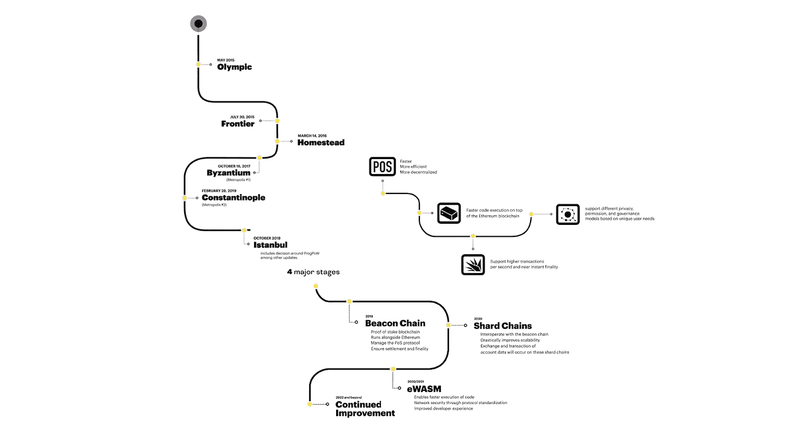
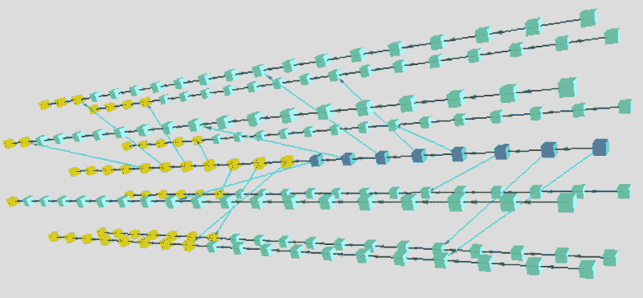

# ETH 2.0 宁静——期待什么&它会影响自我吗？

> 原文：<https://medium.com/hackernoon/eth-2-0-serenity-what-to-expect-this-will-affect-aelf-dfbf93f53199>

以太坊是迄今为止第二大加密货币或区块链，仅次于比特币。即便如此，它仍然被可伸缩性问题困扰了多年，每秒只能管理 15 个事务。如果一切按计划进行，这个问题和其他问题将在未来 3 年内结束。以太坊将会经历，可以说是有史以来最大的一次改版。Serenity 将影响区块链的所有层，改造网络以处理可扩展性、安全性和互操作性。

本文将分解这一重大升级的组件，并解释建议的路线图。接下来，将会有一个简短的解释，说明这对 aelf 意味着什么。以太坊正在区块链领域掀起波澜，但正如你将看到的，他们实际上是在追随 aelf 的脚步，在创新发展方面并不处于前沿。

**以太坊 2.0 由什么组成？**

这一升级的概念是由 Vitalik Buterin 在 2018 年提出的，但在 2019 年 5 月由 ConsenSys 正式公布了路线图。它包括在 3 年内进行的许多较小的升级，从而形成一个全新的架构。

*以太坊 2.0 整体架构。原图由***。**

*该架构将分为 4 个主要部分:*

****PoW 主链:*** 这就是我们所知道的现存以太坊区块链。它将照原样继续使用。*

****信标链:*** 该链目前正在开发中，将成为以太坊 2.0 中的第一个新组件。这是协调层，将采用 Casper 共识(PoS)。目前，共识协议使用“矿工”。在 Casper 中，这些将被验证器所取代。任何验证者都必须通过将固定数量的 ETH 存入验证者主合同(VMC)来承诺一些“游戏中的皮肤”。这个契约将存储在主链上，并由信标链定期检查，以添加任何新的验证器。验证器将随机分组执行，并被分配给特定的分片。此外，每个组将定期重新洗牌，以确保最大限度地降低共谋风险，如 51%的攻击。*

****碎片链:*** 这是继信标链之后下一个要发布的组件。这是处理可伸缩性问题的特定组件。每个碎片将执行智能合同并存储它们的数据。基本上，每个碎片将执行类似于侧链结构。最初，在基础设施和安全性得到测试和确认之前，这些碎片不会执行事务。所有以太坊地址、账户余额和智能合约数据都将在这些碎片中进行分配。当一个事务被发送到网络时，它将被放入保存签署该事务的地址的碎片中。然后它将被执行，分配给该碎片的验证器将把它包含在下一个块中。因此，并非所有的验证者都需要确认交易，从而大大提高了确认速度。*

****VM(s):*** 这一层是以太坊 2.0 升级要包含的最后一个主要组件。这将提供智能合同和交易的执行。*

***宁静路线图***

*在推出 Serenity 之前，以太坊必须首先完成一系列硬分叉中的最后一个。自 2015 年以来，我们已经看到了许多升级——Frontier(2015 年)、Homestead (2016 年)、Byzantium (2017 年)和 Constantinople (2019 年)。最后一个分支伊斯坦布尔计划于 2019 年 10 月举行*

**

****伊斯坦布尔****

*这种硬分叉计划于 2019 年 10 月推出，目前由 [30 辆拟议中的 EIPS](https://github.com/ethereum/EIPs/blob/master/EIPS/eip-1679.md) 组成，包括有争议且众所周知的 EIP 1057【Prog pow】。这个 EIP 一直是以太坊社区的热门话题，并受到了很多争论。它本质上是为了消除 ASICs 相对于其他采矿硬件的优势。ASICs 是专用集成电路，通常被设计成只使用一种散列算法。*

*这有两个主要问题，第一，从长期来看，它们是低效的，因为它们不能用于任何其他算法，并且如果散列被改变，很容易变得过时，例如为以太坊所计划的。第二个问题是它们相当昂贵，有时很难获得，导致网络比预期的更加集中。*

> *ProgPoW 仍然允许使用 ASICs，但会消除它们在性能上的优势，导致它们比通用 GPU 更不划算。*

***4 相结构***

*一旦网络准备好启动 Serenity，将实施 4 个阶段中的第一个:*

***0 期:** ***烽火连锁| 2019****

*这一阶段将看到推出信标链，这是区块链将监督和组织验证网络的股份证明。这将与现有的 PoW 区块链并行运行，确保不会中断链的连续性。*

**

**信标链(蓝色)与 8 个碎片链(海蓝宝石)和交叉链(浅蓝色线条)的可视化。所有链上的最终块都是黄色的。时间从左到右递增。* [*模拟器*](https://beta.observablehq.com/@cdetrio/shasper-viz-0-4) *作者凯西·德特里奥。**

*信标链最初有 3 个主要职责:*

***管理利害关系证明机制***

*利害关系的证明是共识机制，其中网络利害关系(相对于花费能量来采矿)以继续完成区块的存在。*

***处理交叉链接***

*交叉链接是 Beachon 链确定和保护碎片链状态的主要方式。碎片链将在第一阶段发布，所以这次更新是为第一阶段做准备。*

***直接一致和最终决定***

*信标链通过 PoS 和(以前称为)卡斯珀·FFG 提供终结性。PoS 规定 2/3 的验证者必须在下一个区块下注，这意味着潜在的恶意行为者的财务激励风险更大。*

*根据 ConsenSys 的说法，他们解释说信标链的想法来自另一个区块链项目有限公司采用的共识协议:*

*“信标链这个名字起源于“随机信标”的概念，例如 NIST 的“随机信标”，它为系统的其余部分提供了一个随机性的来源，随机信标的概念被“有限公司”在区块链的上下文中采用。”*

***第一阶段:*碎片锁链| 2020****

*Serenity 的分片结构将数据库的数据处理责任分散到许多节点上。这允许并行处理多个事务，通过多个碎片存储和处理信息。这是当前以太坊区块链的明显改进，当前以太坊要求每个节点以线性过程处理和验证每个交易。*

*在这一阶段，焦点将集中在碎片的终结性和一致性上，而不是碎片功能的完全发布，因此可以被视为“测试运行”。*

****封锁时间:*** 16 秒*

****验证器桩子:*** 32 ETH*

****验证器每分片:*** 128*

****支持碎片数:*** 1024*

****Min 退出通知确认员:*** 97 天*

***第二阶段:*eWASM | 2020/2021****

*此阶段将包括引入新的虚拟机。新的以太坊口味的网络组件(eWASM)将取代目前的 EVM。在这个阶段，碎片链也将进化到全功能，允许以太坊网络的扩展。*

*随着电子货币的发布，以太坊区块链理论上将允许以任何语言编写的智能合约在其上执行。目前只支持用 Solidarity 编写的智能合同。*

***第三阶段:*持续改进| 2022****

*在第二阶段之后，以太坊的时间线开始变得不那么具体。有一点是肯定的——开发者将继续致力于解决紧迫的问题和改进协议，以满足区块链技术不断增长的需求。正在讨论的持续改进包括:轻量级客户端状态协议、与主链安全性的耦合，以及超二次或指数分片。*

***原创以太坊区块链还不会停***

*值得注意的是，在第 0-2 阶段，目前的 PoW 以太坊区块链仍将完全发挥作用。它将沿着信标链运行。在这些阶段结束时，将重新评估原始链是否已经“在计算上”过时。在这个过程中，原有的链条仍然会得到改进和升级。*

*事情按计划进行吗？*

**

*根据去年年底的一份[声明，第 0 阶段预计最早在 2018 年底完成:](https://media.consensys.net/state-of-ethereum-protocol-2-the-beacon-chain-c6b6a9a69129)*

**“在撰写本文时，技术规范宣称自己已经完成了 60%,还有一个相当大的* [*待办事项列表*](https://github.com/ethereum/eth2.0-specs/blob/master/specs/beacon-chain.md#todo) *。尽管如此，仍有迹象表明，该规范应该会在今年年底前合理完成，或许到 2019 年 Q1 奥运会结束时，我们将运行一个多客户端信标链测试网。”**

*现在还不知道他们离这个时间表有多远，但更新的时间表现在表明，在 2019 年的某个时候。*

***这对 aelf 意味着什么？***

*由于几个原因，这对 aelf 作为一个企业和技术的影响很小。首先，aelf 区块链的目标客户或观众与以太坊不同。事实上，许多寻求构建 aelf 的企业将需要具有卓越可定制性的私有或混合区块链，这在以太坊技术上是不可能的，无论是现在还是可预见的未来。尽管以太坊将引入分片来提高数据处理性能，但它仍然是一个区块链。*

*这意味着它仍然具有有限的可定制性，不允许用户创建私有或混合链。因此，虽然以太坊正在改进他们的系统，以根除一些困扰他们的现有问题，但它们不会直接影响 aelf 关注的市场。*

*事实上，如果有任何影响的话，那将是积极的，因为它将有助于区块链福利的普遍采用和公众心态。*

*第二个原因，这不会影响到一个自我，是时间表。根据路线图，如果从现在到 2021 年一切按计划运行，以太坊的可扩展性将不会取得重大改善。*

*如果我们回顾过去几年，可以有把握地说，这将是一个令人印象深刻的壮举，因为他们的记录绝不是按计划运行。*

*预计他们将设法将性能提高到大约 15，000 TPS。aelf 在 2018 年的测试网络中实现了这一目标。这使得以太坊落后了大约 3 年。*

*Serenity 的另一个改进是并行处理的能力，这不是一件容易的事情。我知道这不是一个简单的任务，因为我们的开发人员花了很多精力来完成它。是的，我们还成功开发了一个系统，可以在 2018 年在区块链并行处理交易。*

*让我们看看分配给碎片的验证器(节点)集群。这听起来非常类似于 2018 年在 testnet 中开发的分配给 aelf 侧链的集群节点。*

*Serenity 的一个真正有趣的特性是升级后的虚拟机。这个 eWASM 将允许在以太坊上构建来自多种语言的智能合约。当然，这不是去年 aelf 的 testnet 中引入的特性，但是语言不可知的功能是 mainnet 发布后的早期更新之一。不仅如此，aelf 还将允许任何共识协议和私有、公共或混合区块链设置的选择，以及其他可定制的元素。*

*所以说到底，aelf 和以太坊是不同的产品，目标受众不同。以太坊利用“先行者”优势已经有一段时间了，但这种情况很快就会改变。即使我们有完全相同的观众，当宁静号完成时，aelf 将已经推出一个具有所有这些功能和更多功能的全功能 mainnet，并让它运行和完善多年。因此，他们的优势将转变为赶超。*

*我对宁静升级到以太坊感到兴奋吗——是的。我担心这会影响到自己吗——绝对不会。*