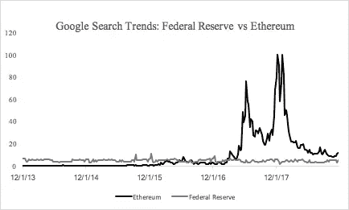
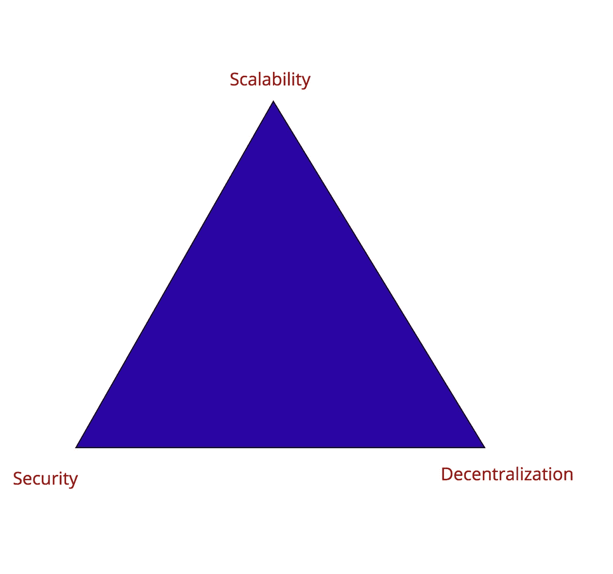
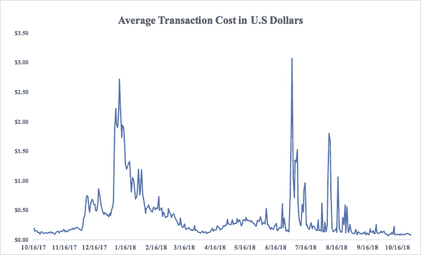

# 以太坊落回地球。它能重新上升吗？

> 原文：<https://medium.com/hackernoon/ethereum-falls-back-to-earth-can-it-re-ascend-8410cf96b1de>


**A Long Way Down from the Ethereal Realm**

# **概述**

以太坊今年的失宠在更广泛的加密和金融社区中是一个没有得到很好保护的秘密。首次发行硬币的受欢迎程度下降是一个明显的因素，但相关的是以太坊已被证明无法以有效的方式处理其网络上的交易。在这篇文章中，我使用 Google Bigquery 提供的数据来探究以太坊的交易成本。本文假设读者对工作证明区块链(以太坊和比特币所基于的核心创新)和 SQL 的机制有基本的理解。人们可以很容易地跟踪以太坊网络最近的可扩展性低效率，这提供了一个令人信服的测试案例，有利于区块链促进更透明的经济领域的承诺。

# **大局**

在 2017 年 12 月和 2018 年 1 月的加密热潮中，每天都有价值数十亿美元的以太通过以太坊网络传输。在这几个月里，开放金融体系的承诺似乎即将实现。如果比特币将披上 21 世纪黄金形式的外衣，以太坊虚拟机将成为 21 世纪的美联储——尽管独立于既得利益集团。事实上，与其让我们的货币政策闭门造车，从现在开始，我们应该把我们的集体信任放在一个虚拟机上，这个虚拟机的源代码已经向所有人开放，其 24 岁的神童创始人通过他的推特账号@ [维塔利克·布特林](https://medium.com/u/587a00dbce51?source=post_page-----8410cf96b1de--------------------------------)参与公共知识辩论。



Ethereum Captures the World’s Imagination. The Fed? Not so much.

随着金融的未来与公共区块链联系在一起，以及以太坊成为这些平台中最强大的平台，无数创始人争相在以太坊虚拟机上构建金融产品；MakerDAO 成功推出了稳定的硬币，Compound 获得了一些知名投资者的资金，以开发分散化的货币市场，DyDx 构建了分散化衍生品的平台，0x 设计了无数资产的点对点交换协议。此外，新的金融工具通过以太坊看起来似乎是合理的——象征性的房地产和艺术或预测市场，如在占卜和灵知中。

几个月后，以太坊及其相关的“价值互联网”的图景完全不同了。尽管一些分布式应用程序在黑客类型中获得了吸引力，但很少有人能够保持广泛的用户基础。2018 年 10 月，网络交易的美元价值已降至平均每日 2 亿美元左右。尽管如此，以太坊的吞吐能力上限还是会定期测试。以太坊的支持者认为，这项技术将像互联网一样具有基础性，但为了实现这一结果，该系统需要扩展到每小时处理数百万甚至数十亿次复杂交易。它没有扩大规模。

# **问题**

以太坊创始人 Vitalik 指出，分布式网络面临三重困境:系统的安全性和去中心化是以牺牲其可扩展性为代价的。随着向 PoW 区块链添加更多节点，处理整个分类帐中的数据所需的工作量也会增加。为了补偿以太坊网络，参与者必须为每笔交易支付被称为“气体”的加密货币。在以太坊的早期，这些成本对于参与者来说可以忽略不计，但是随着越来越多复杂的计算任务被传输到网络中，以及随着更多的节点被添加到系统中，燃气成本也同样上升。



**Pick Your Favorite Two**

虽然 PoW 架构使网络更加安全——更多的节点降低了 sybil 攻击的脆弱性——但它确实是以牺牲效率为代价的。Visa 每秒可以验证多达 56，000 笔交易，而以太坊只能处理大约 15 笔。因此，基于工作证明的智能合约平台不适合处理大量计算任务，更不适合作为整个货币系统的基础。如果这样一个体系无法与根深蒂固的现任者竞争，它显然必须继续向下坠落。

**用可查询的区块链数据验证以太坊的可扩展性问题**

我们已经确定了以太坊这样的分布式网络所面临的概念困境，接下来让我们通过展示数据来验证以太坊确实存在可扩展性问题。平均每日燃气成本提供了一个有用的代理来衡量可扩展性瓶颈，这种成本可以从每个以太坊块中包含的数据中导出。公共区块链倡议声称，跟踪整个分类账的交易是容易和透明的。这在历史上是错误的。直到最近，监控以太坊网络上的交易还需要启动一个完整的节点和深厚的技术专业知识。不再是了。在将以太坊和比特币区块链[的全部内容上传到其云平台后，](https://cloud.google.com/blog/products/data-analytics/ethereum-bigquery-public-dataset-smart-contract-analytics)谷歌的 BigQuery 允许我们通过 SQL 查询轻松跟踪比特币和以太坊区块链数据。只需通过你的谷歌账户注册谷歌的 BigQuery。接下来创建一个 Sql 实例，并将其绑定到 BiqQuery 的以太坊数据集。BigQuery 的以太坊数据集包含了以太坊 genesis 块启动以来的所有相关信息，包括每个块的时间戳、hash、父 hash 以及其中包含的所有事务。将数据映射到传统的关系数据库结构后，我们可以运行如下查询:

```
SELECT 
  sum(transactions.value/POWER(10,18)) as value, AVG(gas_price*(receipt_gas_used/POWER(10,18))) AS avg_gas_cost, date( blocks.timestamp) as date
FROM 
  `bigquery-public-data.ethereum_blockchain.transactions` AS transactions,
  `bigquery-public-data.ethereum_blockchain.blocks` AS blocks
WHERE TRUE
  AND transactions.block_number = blocks.number
  AND receipt_status = 1
  AND value > 0 
GROUP BY date 
HAVING date >= '2017-10-16' AND date <= '2018-12-31'
ORDER BY date, value
```

该查询提供了三个输出:升序排列的日期、当天以太坊在网络上的交易总额，以及当天以太坊的平均交易成本。从 Google 的 Biquery 中，用户可以将 csv 文件导出到 Excel，然后将以太网的日平均交易成本乘以以太网的日平均价格，得出在给定日期以美元计算的每笔以太网交易的平均成本:



# 以太坊遇到瓶颈

2017 年 12 月底，以太坊的第一款热门 dApp crypto kitties 堵塞了网络[一些交易连续几个小时未经确认，而运行简单合同的成本急剧上升]。对于一个旨在作为开源“价值互联网”基石的系统来说，人们在圣诞节期间简单地发送(可爱的)数字猫就可以测试网络的吞吐能力，这破坏了分布式金融系统的承诺。这不是以太坊生态系统面临的第一次，甚至不是最可怕的危机。2016 年，DAO hack 将导致硬分叉。在 Dao 入侵之前，智能合约还没有经过实战检验。这次黑客攻击表明，围绕智能合约——建立在以太坊基础上的应用程序——需要增强安全性。突然间，对更安全、更可伸缩的分布式分类账的需求变得显而易见。

7 月，尽管乙醚的美元价格下降，天然气价格再次飙升。这一次，罪魁祸首是中国交易所推出的新功能 FCoin。Fcoin 使用编程拙劣的智能合约，让参与者投票决定向其交易所发行的新代币。以太坊显然需要可扩展性解决方案来更新其平台。


**Someone is salty..**

最佳解决方案将保护公共区块链的最佳特性(即安全性、透明性和不变性)，同时消除那些使其不适合全球商业的特性，如过度的能源消耗、糟糕的用户界面和吞吐量问题。

# **从地球上看到的景象**

对以太坊和公共区块链未来的一些预测如下:

*   **可扩展性和安全性将优先于分散化。**“价值储存”加密货币，如比特币和 Monero，将保持工作证明共识机制，但领先的智能合约平台将需要过渡到替代共识机制。这些协议将对参与节点设置更高的准入门槛，削弱此类系统的分散性。这是一件好事，因为事实上，自比特币早期以来，区块链战俘就没有真正去中心化过。尽管 PoW 系统中的所有节点都必须处理事务，但在现实中，降低 PoW 系统中 sybil 攻击几率的相同博弈论机制也在 PoS 系统中发挥作用。当区块链的分散受到 sybil 攻击时，它最小化了令牌值，从而最小化了所有节点的支出。此外，在赌注证明网络中，一个人可以根据他们持有多少硬币来验证块。因此，损害区块链邮政机构的独立性不符合代币持有者的利益。P [防止分布式系统中≥ 51%的节点的不诚实行为是一个密码资产的纳什均衡](https://arxiv.org/pdf/1607.02420.pdf)。
*   其他智能合约平台将抢占智能合约市场份额。以太坊将致力于集成可扩展性解决方案，如利益相关共识机制和分片。然而，其他平台，如 EoS 和 Tezos，已经实现了授权的利益证明，因此已经可以扩展，将获得智能合同市场的份额。
*   **区块链的透明性和不变性将受到威胁**。我们西方的民主政治体系基本上是透明的，选举的结果是不可改变的。此外，与公共区块链类似，民主政治体系受益于公共领域中的对立力量。一些协议，如 EoS，建立了模仿民主制度中的权力划分的机制。运营包含重要经济信息的节点的各方需要透明地运营。因此，它将依靠公共互联网论坛来让这些智能合约平台的守护者承担责任。

总之:公共区块链让我们能够实时、透明地集体跟踪经济效率低下的情况，而不是“事后”跟踪，这种能力使得这项技术值得我们耐心等待。一个鼓励参与并招致批评的系统就是为什么即使投机者逃离市场，开发者仍继续在以太坊上构建应用程序，一代人温习一些更世俗的密码学和计算机科学主题。奖品将是一个更透明的经济体系，让所有人都可以分析，所有人都可以批评。