# 以太坊区块链的现状

> 原文：<https://medium.com/hackernoon/ethereum-in-a-state-9218d34b0659>

在加密资产领域，以太坊一直是热门话题。其中和周围从来不缺少刺激和/或戏剧性。无论是其治理困境，以太坊 2.0 的交付，还是 Vitalik 的 t 恤，总有一些东西可以抓住贡献者和专家的想象力。

从根本上来说，以太坊吸引了如此多的注意力这一事实是不合理的；它是密码领域无可争议的第二号人物，单枪匹马地将智能合约的概念引入生产，并诞生了(至少)三个迷人的现象 ICO、NFTs 和 DeFi。然而，随着我们慢慢走出加密的冬天，以太坊似乎已经有些伤痕累累，其未来有许多问号。在接下来的部分中，我将试图通过查看各种关键的链上和链下指标来揭示以太坊的现状。

# 链上数据

我们通过关键的链上指标来了解以太坊区块链的状态。

**有效地址**

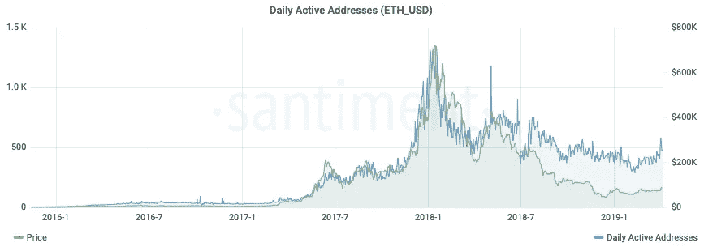

Source: Santiment

活跃地址被定义为在过去 24 小时内任何时间点参与加密货币交易的地址。在经历了大约 9 个月的持续下跌(以及 ETH 的价格)后，活跃地址的趋势似乎已经转向上行，这反映了比特币的活跃程度。此外，自 2018 年底以来，我们正在观察价格和活跃地址趋势之间的分歧。价格会追溯到活跃地址吗？鉴于历史趋势，这并非不可能。

**代币流通速度&交易量**

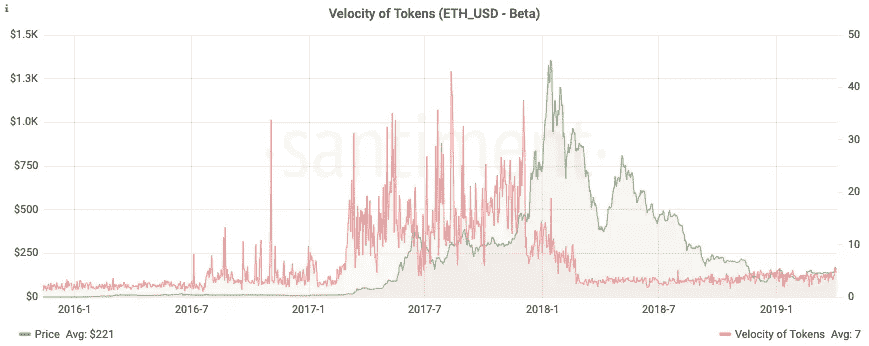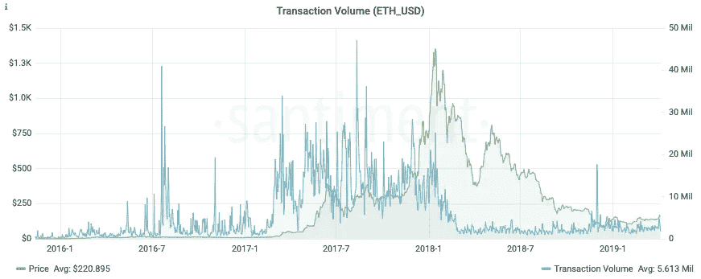

Source: Santiment

速度指的是代币每天更换钱包的平均次数。简而言之，更高的令牌速度意味着令牌在交易中的使用频率更高。

扣除臭名昭著的以太坊混合器的活动，速度和交易量似乎都在线性增长，这一趋势可以追溯到 2016 年初——这可以说是一个积极的迹象，表明网络利用率增加。

Source: Bloxy

这可能还意味着，交易量的指数阶段(S 曲线)在未来仍然是可能的——尽管鉴于以太坊当前的性能限制，很难想象。

**交易价值中位数(美元)**

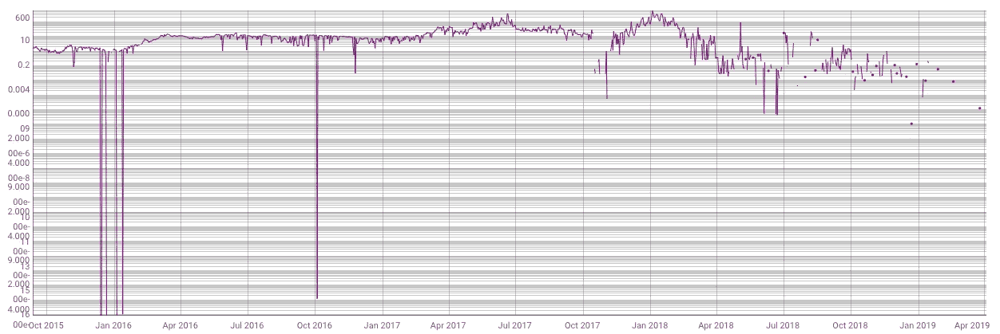

Source: Coinmetrics

如果数据确实反映了现实，那么随着网络的成熟，交易价值中值下降的事实可能会让人感到惊讶。然而，转念一想，这真的一点也不奇怪。记得以太坊=！比特币；它实际上是出于不同的目的而建造和使用的。鉴于目前网络上约 50%的互动是合同对合同的(根据[令牌分析师](/tokenanalyst/under-the-hood-of-the-world-computer-caf957fb8a4c))，中值下降可能是合理的——特别是随着 ERC 20 令牌数量从 2017 年的几十个爆炸式增长到今天的 4000 多个。总的来说，我们可以把这解释为一个成熟网络的标志，以及对 ETH 越来越多地用于的交易类型的认可。说到这个…

**DeFi 领养**

Source: Mike McDonnald

Source: DeFi Pulse

DeFi(去中心化金融的简写)是以太坊目前正在探索的第二大用例(仅次于通过私人资金筹资),并找到了产品市场的契合点。尽管迄今为止记录的增长令人印象深刻，但爆炸性的部分似乎暂时停滞了。这其中有多少是由于戴的挂钩困境和 Maker 的稳定费从 0.5%上调至 7.5%(使其对持有 CDP 的吸引力下降)，有多少是由于空间目前已达到结构性上限，仍有待观察。我猜——两者都有一点吧！毕竟，我们需要让下一批用户更容易地进入这个生态系统。

**按 ERC 类型划分的代币数量**

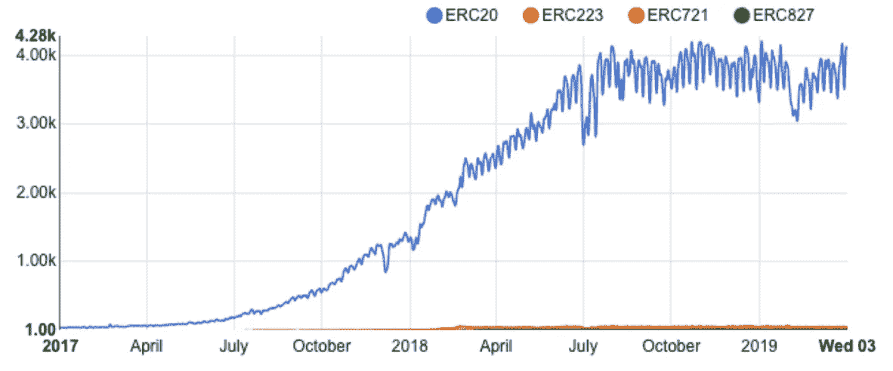

Source: Bloxy

关于将以太坊引入加密资产万神殿的第一个主要用例，我们来看看在“世界计算机”下的令牌世界中发生了什么。目前，以太坊网络的大部分被 ERC-20 类型的合同所控制；尽管 ERC-721(NFTs)和其他新兴标准很有前途，但它们仍然代表着网络上少量的活动。此外，大约 4k 似乎是网络上活动令牌的平衡数量——暂时由缺乏进一步的需求和缺乏网络容量驱动。

**聚合网络利用率**

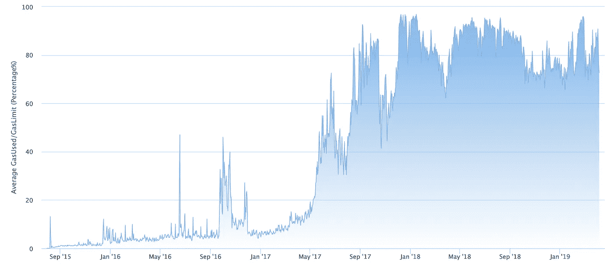

Source: Etherscan

该指标表示任何给定时间点的平均用气量/用气量限制，并作为比较利用率和产能的替代指标。有趣的是，这里的图片似乎验证了上述关于网络容量的假设，并指出这个特殊的 S 曲线已经达到稳定状态的事实。

**智能合约动态**

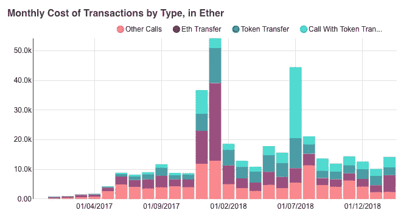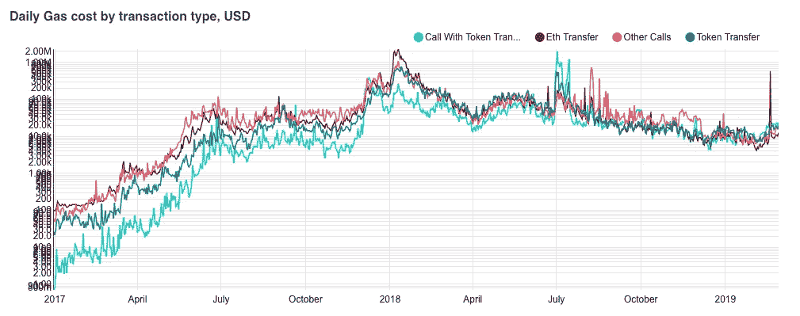

Source: Bloxy

上面的三个图表一起描述了以太坊网络上智能合约的状态——在一个高层次上。从 2 月到今天，智能合约需求总量(与智能合约的互动)已经增加，并接近历史最高水平。鉴于我们正处于后投机狂热时期，ICO 活动处于多年来的低点，至少，这意味着以太坊的效用与投机价值之比正在改善——这种活动的迹象与 DeFi 的上升密切相关。

现在就燃气成本而言，整个 2018 年的水平一直保持稳定——2018 年 7 月除外，当时 F-coin 向以太坊网络发送垃圾邮件(因此“使用令牌转移的呼叫”和“令牌转移”成本爆炸)。同样，这里的稳定性可能意味着我们正在接近网络容量的情况下运行。最后，当考虑以美元计算的每日天然气成本时，事情变得有点奇怪，因为在过去的 12 个月中，所有 4 种智能合同呼叫的美元成本都相同，这种现象在 2018 年 4 月之前没有观察到。又一个成熟的标志，和/或网络已满负荷的事实？有可能！

# 市场数据

链上只是故事的一半。在本节中，我们将通过查看与市场最相关的链上指标来逐步了解市场数据，然后过渡到纯粹以市场为中心的指标。

**价格与通货膨胀**

Source: Coinmetrics

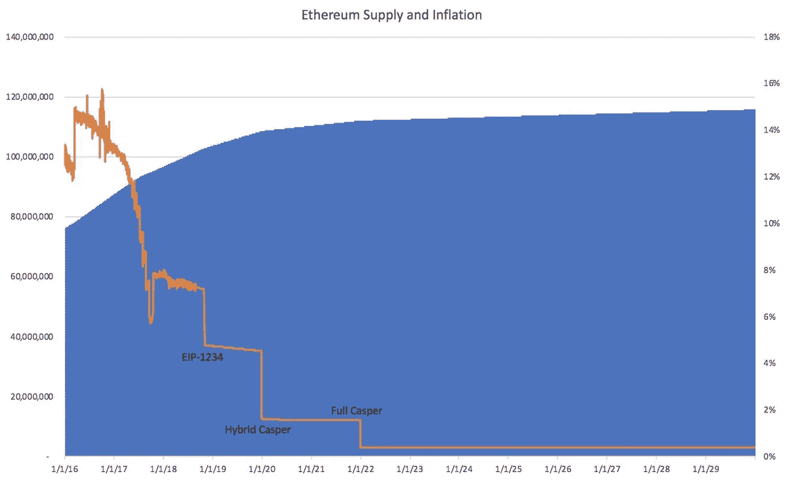

Source: Eric Conner

与比特币一样，通货膨胀的降低似乎对价格有类似的影响(向上推动)。展望 2020 年和 2022 年，还会有两次大的通胀调整，其中最剧烈的一次是在 2020 年。结合比特币价格减半，这是一个结构性的利好发展——假设对该资产的需求至少保持不变。

**消耗令牌年龄**

Source: Santiment

此指标显示在特定日期更改地址的令牌数量，乘以自上次移动以来在区块链上创建的块数。我们可以解释这一点的一种方式，是作为长期霍德勒硬币移动的代理，潜在的清算。

这里的活动反映了比特币的情况——在 11 月份的抛售之后，大多数代币再次出现波动，表明长期持有者正在投降，其中暂时包括一批早期 ICO 国债和一批不盈利的矿商。

**智能合同集群的相对市场份额**

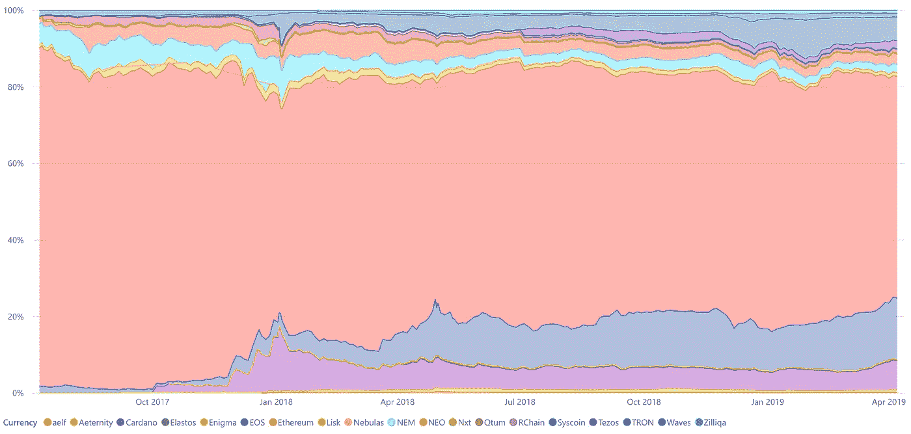

Source: Coinmartketcap

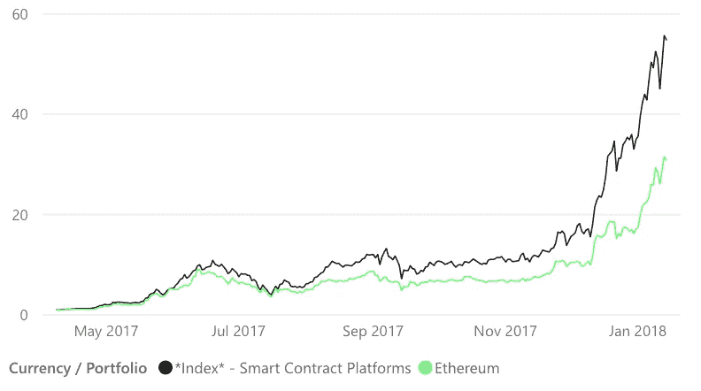

Source: Coinmartketcap

虽然以太坊几乎创造了这个类别，但其主导地位已经从 2017 年年中的约 90%下降到智能合同集群的约 58%。此外，自 2017 年 4 月以来，它在牛市条件下的表现一直低于该集群，并在熊市条件下跟踪该集群的表现(或者更有可能相反)，而指数和 ETH 之间的回报相关性超过 90%！随着竞争对手如 Cosmos、Dfinity、Polkadot 和 Hashgraph(以及其他公司)最近推出或即将推出，以太坊 2.0 还有很长的路要走，很难看到这种趋势逆转甚至稳定下来。

**60 天波动率(日收益率的标准差)**

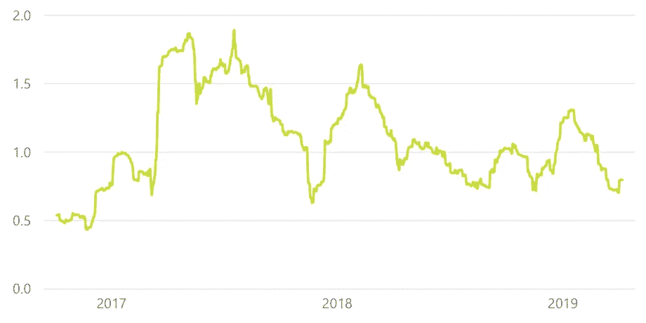

Source: Coinmarketcap

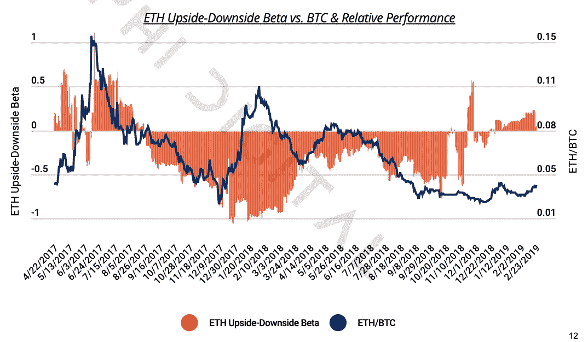

Source: Delphi Digital

鉴于 ETH 与比特币的高度相关性，比特币的回归波动性意味着 ETH 的波动性也在回归——从 60 天波动性图表来看，这已经成为现实。考虑到这是摆脱熊市趋势的一个重大举措——许多人持有这一观点，并且基于许多不同的数据点——中短期可能有很大的上行空间。Delphi digital 最近对 ETH/BTC 及其与上下波动 beta 关系的分析表明，情况可能确实如此。

# 矿工数据

请注意，以太坊仍然是一个工作证明硬币…

**哈希拉特**

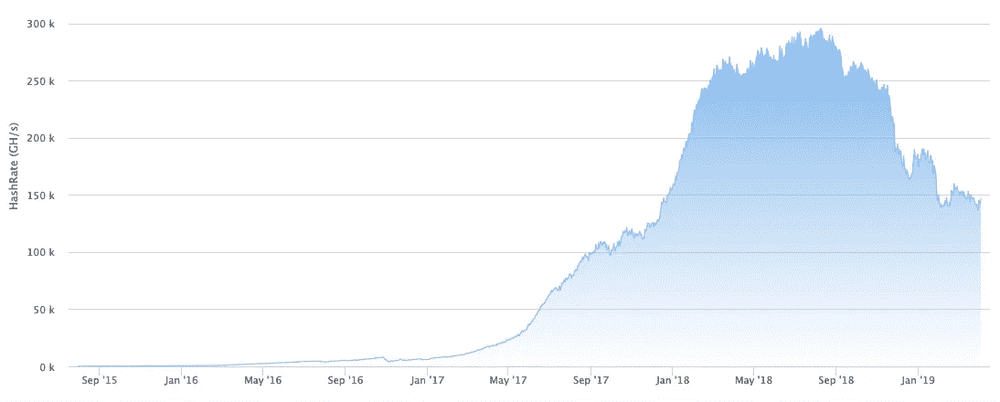

Source: Etherscan

与比特币相反，以太坊网络中的 Hashrate 似乎正在遵循一种负面趋势，并且尚未回升。这意味着，网络还没有达到平衡，当前的价格使得 ETH 矿业对许多人来说无利可图。有报道称，ETH 矿商的盈亏平衡点约为每 ETH 150-200 美元。

为什么会出现这种情况有几个原因，其中包括(I)以太坊正计划迁移到 PoS 的事实，(ii)以太坊采矿利用 GPU 芯片组的事实，以及(iii)与比特币相比，以太坊的通货膨胀率仍然很高的事实。

**矿工分布**

Source: Santiment

Source: Etherscan

以太坊生态系统相对积极的一点是，价格从约 1.4k 美元的顶部跌至当前水平的直接结果是，较小矿商占据的相对空间增加了——以前 3 名至前 10 名矿商为代价，因此现在有更多较小矿商参与进来。

与此同时，前三大联营体的份额有所增长，因为它们可能是唯一具备所需运营优势(廉价电力、低管理费用等)的联营体，能够充分承受价格下跌。

# 发展数据

在这一节中，我将介绍以太坊生态系统中开发活动的几个代理。

**Github 库**

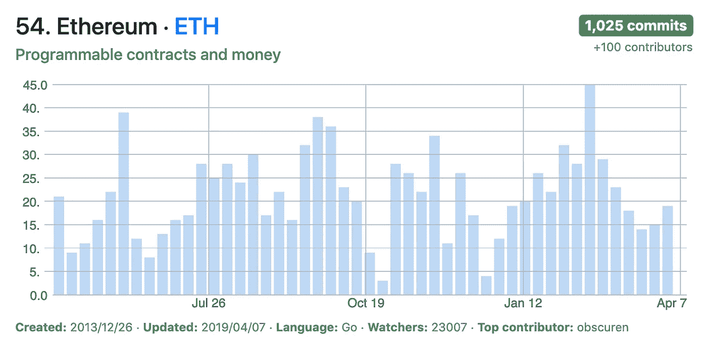

Source: Cryptomiso

快速向下滚动 [cryptomiso](https://decentralpark.us18.list-manage.com/track/click?u=9a68e4e5747a7e6c8d8516308&id=24c83045b2&e=20c738a8d2) 描绘了一幅非常积极的画面。在 Github 活动排名的前 100 个项目中，以太坊可能排在中间，但它是活动模式最一致的项目之一。如果缓慢和稳定赢得了比赛，并考虑到以太坊已经获得的思想份额，那么这应该算作基础资产的净正面。

**松露框架下载**

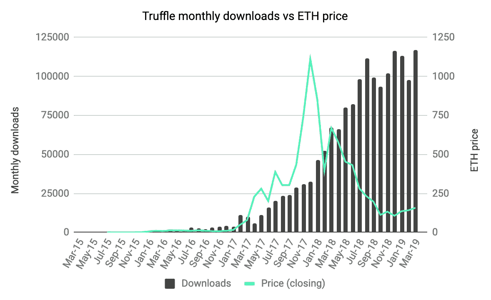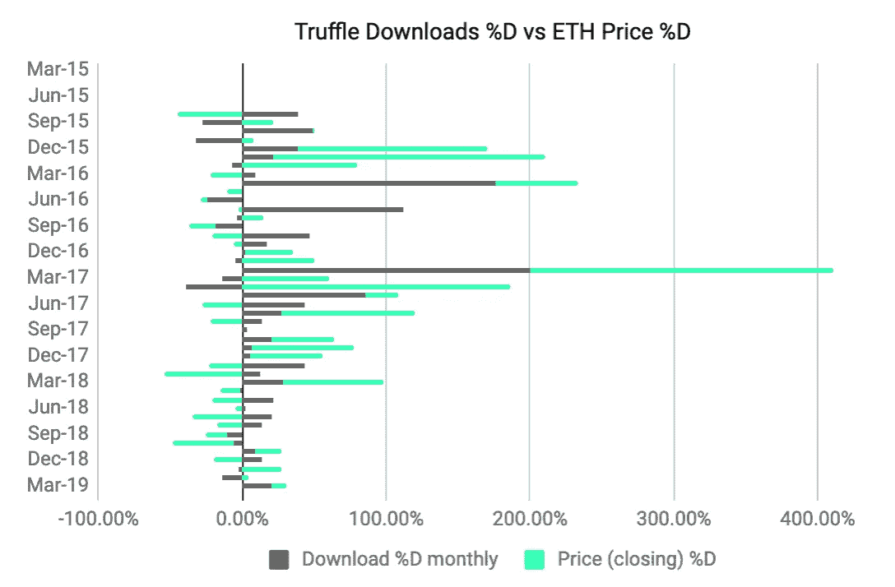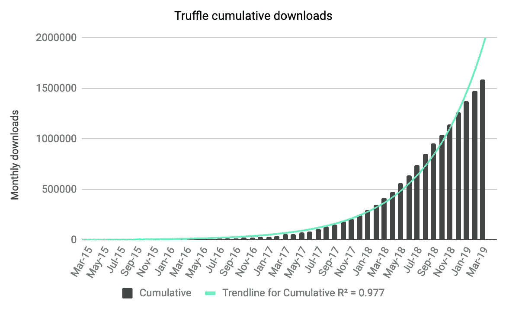

Source: truffleframework.com

以太坊作为 Web 3 开发平台的受欢迎程度是毋庸置疑的，部分原因是在该平台上构建工具的可用性。这里有一些有趣的笔记要记；(I)以太坊在 H1 2017 年的价格上涨是以太坊作为开发平台的最大广告，(ii)ETH 的价格波动与 Truffle 框架中的下载量之间存在较低的正相关性，以及(iii)截至 1 月份观察到的下载量指数增长率显示出放缓的迹象。也许是以太坊达到开发者带宽容量的标志(re: SAM)？也许吧。然而，另一方面，以太坊波动性的降低与下载量增长的降低是一致的。会不会是波动性越小，头条新闻就越少，从而导致接触到的人越少？如果我们看到 ETH 的价格上涨，下载量会怎么样？

# 松散的末端

没有特定的类别，但仍然值得考虑。

**节点分散**

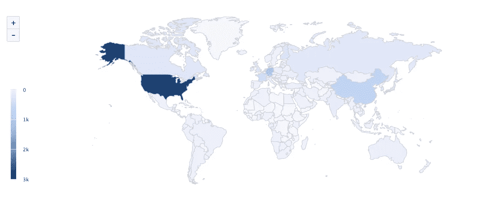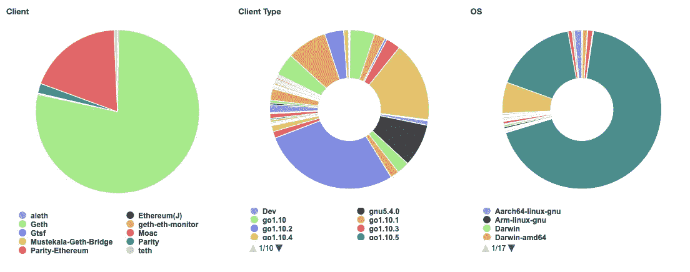

Source: Etherscan

上面的图显示了(I)节点的地理分布和(ii)跨客户端和操作系统的节点隔离。以太坊网络的绝大部分节点位于美国——这似乎与第二高的集中度(中国)有所不同，而 Geth 是迄今为止最受欢迎的客户端类型(超过 75%的节点)，Web 3 的对等性位居第二(约 12%的节点)。同样值得注意的是，有超过 9600 个节点运行比特币，比以太坊多 18%。

**打桩产量比较**

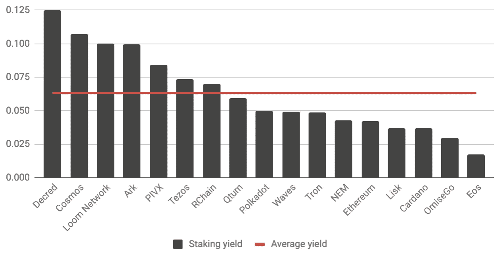

Source: stakingrewards.com

从 PoW 到 PoS 的过渡意味着 ETH 持有人将能够持有他们的 ETH(最低要求:32 ETH)并获得 validator 的奖励，这将使网络更加分散和健壮。尽管如此，以太坊将会很晚才出现在赌注派对上，而且赌注收益低于平均水平。尽管如此，有些钱总是比没有钱好，对于长期的 ETH 信徒和潜在的信徒来说，这是一个有趣的激励，可以促使政党增加拨款。

# **离别的思念**

这里百感交集。一方面，技术指标显示中短期价格有上涨空间，而发展活动支持这一点。然而，另一方面，各种链上指标强调了可扩展性问题是一个非常现实的问题，并且网络目前正在非常接近容量的情况下运行。这里有两种相反的动力在起作用；(I)投机价值与基本面价值(价格正)的替代，然而，这发生在(ii)网络容量限制(价格负，通过气费等)。以下是来自前面分析的主要方法:

*   将 DeFi 的上升以及 ETH 的活跃地址的上升和交易价值中值的下降作为基本面价值的指标，随着新发行(ico)的急剧减少，人们可以认为低质量、投机性价值与高质量基本面价值之间存在替代效应。
*   结合最近通货膨胀时间表的减少和 2020 年即将到来的通货膨胀，以及最近的长期持有清算，意味着我们可能找到了底部，这给以太坊价格升值带来了一些不错的进展。
*   hash-power 向更平衡分布的重新洗牌，以及即将到来的 PoS 激励，都指向一个更安全的长期网络。
*   开发者活动一如既往地健康。也就是说，在过去的几个月里，我们看到了活动放缓的迹象。也许价格的急剧上涨会创造必要的上涨。
*   有明显的迹象表明，网络正在满负荷运行，网络资源的需求/供应处于平衡状态。如果更多的需求冲击以太网，我们将可能处于过度需求状态；*中短期*，这应该是一个积极的价格，但*长期*，考虑到现有的和新出现的竞争，以目前的产能水平运营是一个净负面——因为开发商包装更绿色的牧场，更低的费用和更清晰的路线图。

但是，还有这个…

*像这样？何拉对着我* [*碎碎念*](https://twitter.com/es21e8) 🙋🏻‍♂️