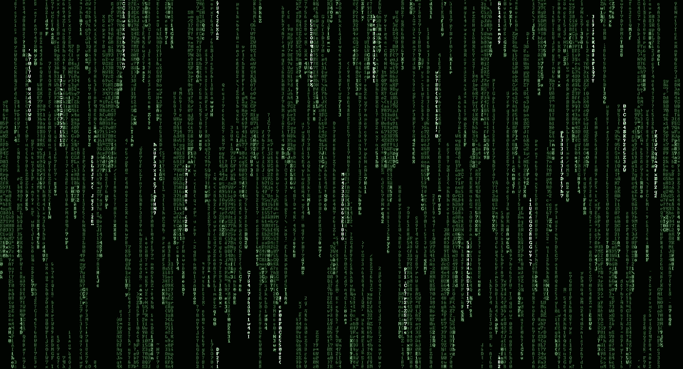

# 量子人工智能中一种新的梯度计算算法

> 原文：<https://medium.com/hackernoon/evaluating-gradients-with-a-new-algorithm-in-quantum-ai-9e4087cf9f56>

## 一种算法可以清除评估梯度的瓶颈，为量子神经网络铺平道路。

A new algorithm is designed to unleash the digital rain of quantum AI.

如果量子人工智能是一条丝绸之路，有朝一日将量子计算的力量与当今一些最重要问题和最大机会的解决方案联系起来，那么评估梯度就是沿途令人生畏的开伯尔山口。

现在，一名研究人员表示，他开发的一种算法是一种很有前途的评估梯度的新方法，这对希望开发量子人工智能的团队来说是一个关键的技术挑战。

在 GitHub 上的一篇[论文中，拥有理论物理学博士学位的研究人员 Robert Tucci 表示，他的算法代表了一种新的、潜在富有成效的评估量子成本函数梯度的方法，他称之为量子人工智能创建中的一个主要瓶颈。梯度评估是神经网络用于学习的关键步骤之一。](https://github.com/artiste-qb-net/qubiter/raw/master/adv_applications/threaded_grad.pdf)

正如反向传播在经典计算中广泛用于梯度评估一样，Tucci 表示，这种方法可以作为量子人工智能应用中反向传播的对应方法来实现。

解决方案可能在于多线程，也称为线程化，这是一种已经在经典计算中使用的技术，但作为量子计算策略是新颖的，Tucci 说，他是一位开创性的量子程序员，发明了量子软件工具，包括 Qubiter 和 Quantum Fog。

“我所说的线程化是指，它是一种将 gate 模型量子计算机中的量子位划分为小的、不相交的集合——或“岛”——的策略，这些集合彼此不相关，并同时运行，”Tucci 说。“这些岛中的一个岛内的量子位是强相关的，但来自不同岛的量子位在概率上是独立的。”

最终测量后，每个量子位岛给出一个平均值。然后，所有岛的平均值导致梯度。

当算法到位时，Tucci 说它开始看起来像 Matrix fame 的数字雨。

Evaluating gradients is like the Khyber Pass in quantum AI, according to a researcher. A new algorithm is designed to help straighten out that path to new quantum AI applications.

Tucci 补充说，这种方法对于新兴的量子计算机系统来说是理想的，例如嘈杂的中等规模量子和混合量子经典计算机，这些量子计算机设计仍然容易受到影响其性能的噪声的影响。

例如，[加州量子计算机公司 Rigetti](https://www.rigetti.com/) 采用了混合量子经典设计。

量子计算的力量在于量子位同时处于多种状态的巨大潜力，不像经典位可以处于 1 状态或 0 状态。随着越来越多的量子比特连接在一起——纠缠在一起——它们处理数据的能力呈指数级增长。然而，量子计算机容易受到环境或噪音的干扰。

科学家和企业家已经在研究量子计算机器学习技术在应用中的使用，如药物发现和材料研究。例如，量子人工智能系统可以分析数百万种可能的药物化合物组合，以找到针对疾病或状况的最佳配方。

Tucci 说他的算法可能是一个突破。为了验证这一点，这种计算量子成本函数梯度的数字雨方法目前是 Tucci qu biter 的一部分，这是一整套在经典计算机上设计和模拟量子电路的工具。在 [GitHub](https://github.com/artiste-qb-net/qubiter) 上有。

“我相信 Qubiter，加上它计算量子成本函数梯度的新功能，将成为该领域的一项开创性工作，”Tucci 在他的博客 [QB-Nets](https://qbnets.wordpress.com/) 上写道。

Tucci 获得了麻省理工学院的数学学士学位和物理学学士学位。他在威斯康星大学获得了理论物理博士学位。作为一名独立研究员，他发表了 50 多篇论文。