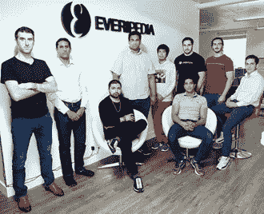
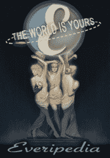

# Everipedia 会给在线百科全书界带来尊严吗？

> 原文：<https://medium.com/hackernoon/everipedia-brings-respectability-back-to-the-world-of-digital-encyclopedias-80cd6da95cdb>

## Everipedia 是维基百科的扩展分支，是一个总部位于区块链的百科全书，它向互联网上的主题回归诚信和民主化。

Photo Credit: *Everipedia*

大英百科全书、Encarta 和维基百科——我们这个时代的三大数字百科全书——结合起来——为我们提供了丰富的信息和知识。

《大英百科全书》已有超过 244 年的历史，收录了超过 10 万篇文章，以及*韦氏词典的美国词典和同义词库*，但价格不菲。它为像 *Encarta* (现已停产)和*维基百科*这样的竞争对手搭建了舞台。毫无疑问，维基百科已经成为大英百科全书最主要的替代品。

我们在这里:在 21 世纪，坐在过多的黑色镜子、屏幕和电子设备前收集和存档尽可能多的信息。

为什么？

成本、格式和可访问性。

# 维基百科的遗产

根据其[项目页面](https://en.wikipedia.org/wiki/Wikipedia:Purpose) , *维基百科*的构建是为了通过作为一个免费的在线百科全书，或者包含所有知识分支信息的全面书面纲要，来使读者受益。每篇文章或每一页的目标都是以一种直截了当、“实事求是”的风格，公平准确地呈现现有主流知识的中立的书面总结。文章需要有百科全书式的风格和正式的语气，而不是散文式的、议论文式的、推销式的或自以为是的写作。

它的创始人吉米·多纳尔·威尔士和拉里·桑格(2002 年)设想了一个世界，在这个世界里，地球上的每一个人都可以自由获取人类所有知识的总和。

桑格在公司工作期间，希望维基百科成为一个可靠的资源。

回到 2001 年，桑格与本·科维茨共进晚餐，了解到任何人都可以编辑网页——维基。

桑格想到用维基来补充 Nupedia 的文章创作过程，最终成为该公司的主编。Nupedia 是一个免费的在线百科全书，包含了经过严格审查并在学术上受到尊重的文章，完全由志愿者创建。

桑格的想法形成并诞生了我们现在所知的*维基百科*。

# 混乱状态

你可能会认为，在多年看起来像一个过时的搜索引擎——同时被学术界和学者称为“不可靠”——之后，该公司将迈出重大步伐，以适应数字时代。

大学和学术机构明确或含蓄地警告学生不要在论文、议论文中引用或参考*维基百科*，甚至不要将其作为资源的基础。

十八年过去了，人们开始理解维基百科已经超越了其项目页面上概述的最基本的目的——提供可靠可信的信息。

# 今天的财富是知识，知识存在于百科全书中

Photo Credit: *Everipedia*

截至 2019 年 1 月， [Everipedia](https://everipedia.org) 已经成为有史以来最大的免费英语百科全书，收录了维基百科上包含的 600 多万个条目，加上原创内容。

由歌词注释和媒体网站 Genius 的联合创始人萨姆·卡泽米安(Sam Kazemian)和维基百科(Wikipedia)的前联合创始人拉里·桑格创建，Everipedia 是有史以来第一个总部位于区块链的百科全书，现在是维基百科蓬勃发展的竞争对手。

根据维基百科的说法，其内容受三项核心内容政策管辖: **(1)中立观点**、 **(2)可验证性**、 **(3)无原创研究**。

然而，对许多人来说，维基百科已经成为“假新闻”和错误信息的危险地带，除了公司编辑团队的人之外，任何人都无法纠正。

## **#1:保持中立的观点**

虽然仍然被广泛使用和浏览，维基百科并不羞于公开其缺点——维基数据库将其页面限制在那些被认为“受欢迎”、“公众人物”或“足够重要”的页面上

在今天的政治气候下，受美国宪法第一修正案保护的言论自由再合适不过了，让编辑在这个被美化的基座上决定什么值得列出，什么不值得，超出了他们的管辖范围。抱歉不抱歉，伙计们。

## **#2:维护信息完整性**

多年来，维基百科已经向全世界含蓄地表明，它真的不在乎作者身份或页面主题。但是为什么呢？

在莫哈达姆和桑格离开各自职位后的这些年里，他们至少在一个事实上达成了一致——如果历史表明了什么，那么挑战维基百科绝非易事。

对于注册用户，几乎任何人都可以进入一个页面并编辑其内容；使得它很难被改变回来，除非被报告。

## **#3:通过研究进行尽职调查**

无论你是公司高管、律师、企业家，还是某个运动部件的必要部分，好的研究就是一切。更重要的是，对你提供给别人的信息进行尽职调查是人生的成败关键。不需要再有假新闻了，因为我们都有能力自己验证什么是真的，什么是假的。 ***但是:*** 应该相信百科全书和其他有利于研究的网站是可靠和完整的，信息真实准确。

到目前为止，还没有一家初创公司试图甚至接近对这家在线数据库巨头构成威胁。

Everipedia 的使命和团队提供了一个新的积极威胁水平，旨在将在线信息世界带回一个受尊重和可靠的氛围。

# 正面威胁#1:区块链列车

与维基百科不同，任何人和任何事都可以在 Everipedia 数据库上拥有一个页面。

## **IPFS 代币托管**

根据 Moghadam 的说法，这两个平台之间最重要的区别是，Everipedia 将通过星际文件系统(IPFS)托管和存储信息，这使得几乎不可能像维基百科等某些网站在中国、土耳其、俄罗斯等国家面临的那样审查内容。

## **奖励用户“互联网知识货币”**

此外，用户因创造有价值的内容而非误导性信息而获得平台的原生令牌(IQ)，或“互联网知识货币”。

这个想法是用户的智商越高，他们就越聪明！莫格达姆强调道。该公司还告诉我，它正计划推出更多使用令牌的 DApps，如 IQ & A(去中心化 Quora)，允许用户最终在互联网上的任何地方创造知识。

# **正面威胁#2:拉里·桑格保护著作权的眼光**

Photo Credit: Larry Sanger

2002 年，桑格离开维基百科[，承认](https://thenextweb.com/contributors/2018/04/21/wikipedia-co-founders-8000-word-essay-build-better-wikipedia/)存在“严重的管理问题”和“功能失调的社区”:

## **①旧的 Nupedia 编辑系统被打破了。**

正是桑格的想法将维基软件用于他的项目，使得*成为*维基百科。

> “我可能是第一个从任何深层次理解正在发生的事情的人，这在很大程度上是因为我推行的政策是其成功的一部分。”

## **(2)专家要有低-中度的控制力。**

正如桑格以前多次说过的，专家应该被赋予一个适度、低调的角色，一个与他们对维基百科这样的项目的适度价值相称的角色。

> “我认为像这样的合作项目应该以民主的方式进行管理——我一直都是这样认为的。”

## **(3)文章和编辑不应需要事先批准**

虽然该公司没有编辑委员会或算法来审查它发布的每一页，但用户自己被赋予了编辑权，并不断寻找不正确的链接或引用材料。

Everipedia 如此令人难忘的美丽是因为它做了没有人有勇气或能力做的事情——复制和分流维基百科的文章，成为最大的在线英语词典，允许页面创建者保留最强大的工具——作者身份。

桑格认为，开源软件或平台背后的整个哲学是，材料应该“尽早发布，并经常发布”

“*我对这个想法的热情就是为什么我在第一次了解维基百科的那个晚上就提议创建一个维基百科。”*

”*万物皆有署名权；没有匿名可言。*

该公司努力给予每个人公平的认可，即使他们不被认为是“公众人物”或“受欢迎的人”，无论这在今天意味着什么。

> “你必须为你写的东西感到自豪，而且还有令牌桩，这使得向其他用户发送垃圾邮件非常困难。这是因为没有匿名用户；我们知道每个人是谁。我们不会因为错误的性别或种族而删除网页；我们更关注被恰当引用和参考的内容。”

**(4)内容成熟度不够**

这位前维基联合创始人还认为，维基百科发布的材料，只是没有深入到学者和其他专业学术界认为重要的许多主题中。

维基百科删除了太多的文章……在我离开后,‘删除派’赢了；我一直是一个“包容主义者”。

虽然在 2017 年 10 月加入该公司，但桑格的参与直到 2017 年 12 月才公开，当时他宣布担任该公司的首席信息官(CIO)。

# 正面威胁#3:布洛克·皮尔斯的符号化理论

Photo Credit: PETER RUPRECHT

巩固 Everipedia 给信息世界带来的实力和力量的是加密货币教父， [Brock Pierce](https://everipedia.org/wiki/lang_en/Brock_Pierce/) 。Pierce 曾是一名儿童演员，最著名的是《T2》中的《强大的鸭子》( The Mighty Ducks ),他还是比特币基金会的主席，实际上，他改变了 Everipedia 现在最大的销售策略。

2017 年初，莫格达姆给皮尔斯发了以下脸书消息——“*哟，布洛克，Everipedia 应该做个 ICO！*

皮尔斯的回应？

*“你应该令牌化*。”

Kazemian 和 Everipedia 团队一点也不知道，将该项目变成自己的加密货币或令牌，将为维基百科永远无法上演的表演创造条件。通过分散这种在线百科全书，信息可以在俄罗斯和中国这样的国家完全访问，而这些信息通常会受到审查。

当我问 Pierce 为什么建议符号化时，他告诉我在开源运动中加入一个经济模型将有助于将 Everipedia 作为优于 Wikipedia 的产品和资源:

皮尔斯说:“回头看看维基百科，它是互联网上最重要的网站之一，尽管它看起来像是 20 世纪 90 年代的网站。其老式设计的原因是因为它是一个非营利组织，通常在这种情况下，其背后的团队不够大。

“像大多数开源项目一样，它完全依赖于免费贡献者，”他解释道。

> “尽管我们都承认开源软件是一种优越的模式，但它在过去的 20 多年里一直没有大规模的发展，这是因为缺乏经济激励。人们只能在空闲时间从事开源项目，因为他们必须有自己的工作，必须赚钱。[……]区块链和令牌化正在为开源运动添加一个经济模型，这意味着今天你在开源项目上工作可以比在谷歌或脸书工作赚得更多。所以，如果你把维基百科这样的系统符号化，你应该能够创建一个系统，在这个系统中，用户——贡献者，能够分享这个平台的经济利益，激励他们继续创造内容。因为这种模式，这个系统应该是比维基百科更好的产品。”

# 把互联网留给*维基百科*，让区块链运行 *Everipedia*

最终，该团队认真考虑了 Pierce 的建议，将互联网留给了*维基百科、*而将区块链留给了 *Everipedia* 。

具体来说，该团队将采用类似于 *Steemit、*的系统，允许用户创建一个页面，以换取用户张贴令牌。所有这些都是正确创建和管理内容的动机。

Everipedia 无疑已经开始运行，向维基百科社区表明它是认真的。

目前， *Everipedia* 有超过 7000 人帮助编辑和创建网站。