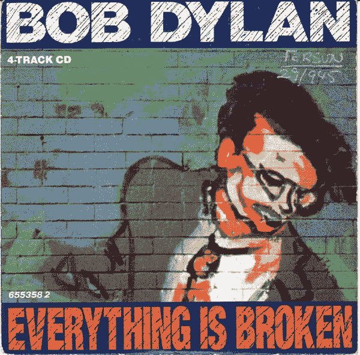

# 一切都坏了

> 原文：<https://medium.com/hackernoon/everything-is-broken-dd0d9c8d946>

我以前的写作老师托尼·厄尔利住在纳什维尔一条绿树成荫的街道上的一栋漂亮的小房子里。他在后面有个写作的小屋。他有几个孩子，一个好妻子，美好的生活。

几年前我最后一次见到他时，当我告诉他我在网上看到的东西时，他心中燃起了一丝怒火。

“这些人并没有获得它，”他在谈到所有自助出版的作者、博客作者和那些在传统出版界之外获得或旨在获得名利的作家时说。他自己是幸运的。他在互联网兴起之前的那段令人兴奋的日子里声名鹊起，那时出版商会让你去巡回售书，印刷页面是神圣不可侵犯的，当一份糟糕的工作带来的新薪水意味着去 Borders 或 Barnes & Noble 收集一堆新想法。

现在，他写得——[优美](https://amzn.to/2Xy2YyW)——教书，过着精神生活。但是，在古腾堡的第一滴墨水和最新的特朗普色彩的像素之间，我们都失去了什么？什么使他如此生气？这么沮丧？最终，是什么让今天的媒体疯狂？

媒体，作为一个有机体，生病了，而且自从它在 21 世纪初感染了博客病毒以来就一直生病。浏览量，一个像关注者数量一样充满虚荣心的指标，统治了这一天，因为没有更好的，我们就跟着去了。非作者通常认为作者想要创建 clickbait。除了少数唯利是图的骗子，这是不真实的。Clickbait 之所以成为 clickbait，是因为它有趣，而不是因为它是为了最大限度地吸引眼球而设计的。

但是，这一指标引发了对 clickbait 的呼吁，造成了相当大的损害。它贬低了读者。理论上，浏览量是一次读者访问，在过去的报纸和广播时代，这些读者“访问”意味着一些事情。在印刷中，它意味着你有一个订户或订户。在广播中，它意味着有人在你的地理附近，通过某种方式听到你的声音。通过这些旧的工具，你立刻与你的观众亲密地纠缠在一起，同时又分离开来。你有一个奇怪的怪人，他会写信抱怨一个故事，并威胁要取消他们的订阅，但大多数时候你成了一个小镇的小名人，与读者分开，但也微妙地交织在一起。

然而，就基于互联网的内容而言，贬值的媒介就是贬值的信息。它贬低了读者和创作者的价值。当我们从一个标题跳到另一个标题时，智能手机只鼓励了快速注射催产素。读者并不存在，或者正如威廉·吉布森所描述的那样，“最好的形象化为一个邪恶、懒惰、极度无知、永远饥饿的有机体，渴望着受膏者温暖的神肉。”这种阅读器毫无价值，广告商每买一个只付一便士或更少。

这反过来又迫使出版商以奇怪的方式快速扩张。一个成功的博主要么一天发两次，要么一天发六十次。没有中间地带。一些网站以简洁取胜，因为它们的寿命和受众。其他人的成功在于成为读者耳中的一只小昆虫，在有趣的事物中一遍又一遍地出现。一天发表十件事是不够的。一个月出版一本等于自杀。

多石的中间地带是事物崩溃的地方。浏览量的价值在一定数量以下是不可能量化的。即使是唯一的访问者也不会提供任何信息。此外，脸书和 Twitter 占据了大部分长尾广告流量，确保了那些寻找奇怪和有趣东西的人不会在某人的写作中找到它，而是在一个关于特朗普和血月的咆哮下面。简而言之，托尼·厄尔利曾经愤怒过的那些人现在将要遭受巨大的惩罚。

我们已经看到了。新记者就像椰子水盒子一样被买来扔去。媒体就像一个摇摇晃晃的自行车轮胎，被营销人员无形的手拉着转动。脸书给了流量，又拿走了流量。来自琼斯妈妈:

> 但是脸书不仅仅给宣传者帮助和安慰。它伤害了假新闻的解药——真实新闻。简要回顾一下我们行业的近期历史。首先，从 21 世纪初开始，广告收入从出版商向脸书和谷歌大举转移。今天，这两家公司控制了美国数字广告市场大约 58%的份额，亚马逊、微软等瓜分了剩下的份额，出版商代表了微不足道的误差。
> 
> 这在很大程度上造成了这样的结果，现在大约有 24，000 名记者在美国的日报编辑部工作，而在 21 世纪初，这个数字是 56，000。而且[越来越多的](https://www.wsj.com/articles/hedge-fund-backed-media-group-prepares-bid-for-gannett-11547427720)和[越来越多的](https://www.bloomberg.com/news/articles/2018-05-22/the-hard-truth-at-newspapers-across-america-hedge-funds-are-in-charge)为对冲基金老板工作，他们榨取报纸的剩余利润——主要是通过裁员——同时进一步降低报道质量。在湾区，除了《旧金山纪事报》之外，所有的日报都归对冲基金奥尔登全球资本所有。曾经有 1000 多名记者为这些报纸工作，其中包括 440 名在圣何塞的水星报工作的记者，水星报是当时美国最强的地区媒体之一。如今，有 145 种存在于 20 多种出版物中，覆盖了 760 万人口。

也许我是老式的，钩针编织。“现代媒体是一个全新的男人游戏，我担心你的旧偏见，”有人上周告诉我。也许那是真的。

但是观众是有价值的。尊重他们的注意力是最初的创造者建立更好的新闻机构的动力。对思想的尊重是最初出版的动力。

我们正处在媒体的十字路口。有很多解决方案被提出来——[勇敢](https://brave.com)是目前最受欢迎的——但它们都是由不了解受众或媒体的人构建的。此外，普遍的共识是，记者在撒谎或愚蠢，或者两者兼而有之。最后，还有托尼·厄尔利的问题:如果每个人都可以出版，那还有什么值得一读的呢？即使创作受到怀疑，策展也成了一种犯罪。

我在媒体上写这个，因为我知道我有一个观众。我不认识你们中的大多数人，但我有时更喜欢它，因为它是通过我的写作获得的，而不是通过任何试图获得浏览量的外部实体的努力。但是除了的观众，我从这个帖子*中什么也得不到。我不愿创造，因为创造不受重视。想象一下试图在媒体上建立一个企业？还是在脸书？还是在推特上？还是在 Instagram 上？为了赢得观众，你将不得不放弃什么？为了赢得观众，你将绕过什么伦理界限？*

事情会改变，但它需要一些东西。第一，内容不能免费。其次，广告和媒体必须重新开始重视观众。第三，我们必须认识到，事情已经发生了巨大的变化，旧的模式、旧的格式和“老人”需要以不同的方式思考。我正在努力。

我们生活在一个不断宣传的时代。新闻——我们现在称之为媒体——是真理的来源。我们已经把它束缚到几乎无法回头的地步了。当一切都破碎了，还剩下什么？

就我个人而言，我不想知道，但我认为我们现在看到了这次休息的结果，这并不美好。

我是一名作家兼企业家。我正在做一个名为 HypeHop.com**的新项目，我想这个项目可能能够修复一些媒体。如果你想帮忙，可以在 Twitter 上 Ping 我*[*@ John biggs*](http://twitter.com/johnbiggs)*。**