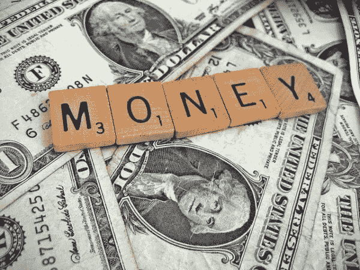
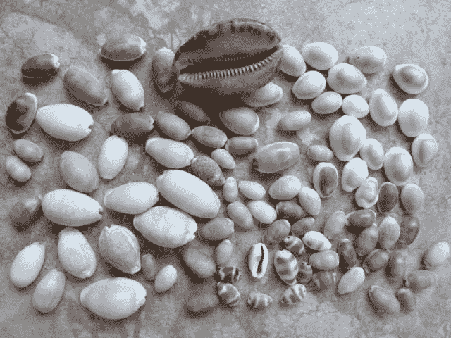

# 货币的演变。第一集:很久以前…

> 原文：<https://medium.com/hackernoon/evolution-of-money-the-past-the-present-and-the-future-chapter-1-21c2196c998f>

“Money makes the world go round…”

在这一系列文章中，我们将深入挖掘细节，通过研究货币是如何产生的来揭示货币的奥秘，并有希望预测它在不久的将来将如何演变。首先，我们必须了解什么是钱，钱最初是用在什么地方的。

金钱可以创造文明，也可以毁灭文明。不可否认的是，金钱在当今每个人的生活中扮演着核心角色——不管他们承认与否。货币的引入可以被看作是把世界带到今天这个地步的最后一步。

> 从我们使用的技术到我们打的战争，金融的力量无处不在。

每个人都想得到一个简单答案的大问题是，自易货贸易时代以来，货币是如何产生的，货币的未来是什么？加密货币真的是数字货币之后的货币未来吗，还是只是一种时尚？

> "美国人民不了解我们的银行和货币体系，这是很好的，因为如果他们了解，我相信在明天早上之前会有一场革命"。—亨利·福特

我们引用这个是因为它概括了可能会让你们大多数人感到不安的系列内容。我们觉得有必要写这个系列，因为我们已经研究金融世界好几年了，所以它肯定给了我们一个更完整的世界观。

**货币的易货起源**

大约 3000 年前，历史成为人类历史的一部分，但是根据货币的定义，可以说它的使用时间比这稍长。当人们发现他们可以用多余的商品如谷物和皮革来交换他们缺少的东西，如盐和锄头时，金钱实际上是我们的一部分。

当大约 11000 年前早期人类开始驯化牲畜和植物时，这意味着狩猎和采集生活方式的死亡，并为更永久的定居铺平了道路。物物交换为货币创造了舞台，因为它最重要的属性:价值交换。

在货币出现之前，它变得如此受欢迎，以至于在 9000 年前，它成为了埃及经济的支柱。例如，对于一个种植小麦的人来说，与另一个养羊的人交换几包小麦是很容易的。然而，易货贸易的最大弱点是很难量化，只有当卖方能够找到一个买方，并提供他们正在寻找的正确数量的货物时，交易才有可能。是的，物物交换是伟大的，但它的局限性太大，不方便。这些缺点导致了一种新的交换媒介的逐渐引入，取代了物物交换。

**输入贝壳**

Primitive means of payment — cowrie shells

大约在公元前 1200 年，印度洋沿岸的社会通过引入一种更加标准化的货币——贝壳解决了这个问题。这种货币就像现代货币一样工作，它简化了商业。作为交换的媒介，贝壳比易货更有效。这种货币在非洲、东亚和南亚流行开来。

然而，问题是贝壳不值钱，而且它没有中央控制机构。没过多久，一种新的交换媒介诞生了，取代了它。公元前 1100 年，中国人开始使用青铜铸造的小复制品作为货币。由于实际原因，这种货币可能没有流行起来，但他们诞生了第一种黄金货币，标记为“应元”，应是使用这些硬币的城市的名称。

这些钱币，现在被称为“楚金块钱”，是由大约 3 到 5 毫米厚的金片制成的，有不同的尺寸来代表不同的价值。这种货币被认为是有史以来第一种真正的货币。

在硬币出现之前，欧洲和亚洲依赖贵金属货币，尤其是黄金和白银。旅行者和商人在世界各地随身携带贵金属条(锭)和戒指，虽然它们存储价值，也是交换的媒介，但它们非常笨重和不方便。

每次交易时，必须由专家对它们进行称重和质量检验。这些商品货币虽然珍贵，但也有很大的缺点，最明显的是它们容易受到价值波动的影响，它们不紧凑，并且不能在所有市场上直接兑换。

**第一枚硬币**

Lydian Stater

公元前 7 世纪统治吕底亚帝国(今天的土耳其)的国王阿里亚特斯被认为是他的帝国中第一个引入功能性硬币的人。这枚硬币被称为 Stater，是一个巨大的成功，因为它是由一个管理机构发行的，这意味着它可以被政府的臣民和外国商人所信任。

当时，没有要求硬币由特定的金属制成，但吕底亚国家满足了被认为是“钱”的基本要求。

吕底亚斯塔特硬币的影响在其推出后仅仅几年就可以观察到。商业迅速发展，成为帝国文化的一部分。希罗多德甚至记录到吕底亚人是世界上第一批真正的连接东西方(欧洲)的商人，这要归功于“吕底亚当地人所拥有的商业活动精神”。

不久，该地区的商业繁荣起来，随着帝国与邻国(包括希腊和波斯)之间的停战，不久国王阿利亚特斯就“技术上”将其帝国扩张到了海伦斯彭和博斯普鲁斯海峡(今天的达尔代内勒斯海峡和黑海)。

**货币的属性**

吕底亚斯塔特硬币是一种独特的货币形式，原因有很多。

1.  **吕底亚州由一个中央管理机构颁发**；因此，它是标准化的法定货币。虽然它们的形状有些不规则，但大多数硬币是豆状或椭圆形的，但它们的重量相当一致。这个设计是不会弄错的，因为它们是在首都萨尔迪斯(帝国的首都)用银金矿金属铸造的。
2.  **它储存价值**:也许货币最重要的特性就是它必须能够储存价值。当你口袋里有一定数量的钱时，你应该上床睡觉，早上醒来时，这些钱的价值还是一样的。这是吕底亚货币具有的一个特征，而当时使用的大多数其他货币都没有。有了这枚硬币，持有货币就成了最有效的储值方式。
3.  这是一种记账单位:随着斯塔特硬币的引入，商业在吕底亚繁荣起来，原因很简单:硬币是衡量经济交易的尺度。来自各地的商人可以带着他们的商品来到萨迪斯，他们完全知道如果找到买家会得到什么样的回报。他们还知道，他们可以用收到的硬币购买其他物品，而不必担心如何进行换算。
4.  这是一种便携式的交易媒介:随着斯塔特硬币的流行，它在吕底亚帝国内外的需求都在增长。用现代的术语来说，硬币变得更有价值，因为它是稀缺的。要使货币有用，它必须便于携带，而且必须在一个司法管辖区内外都能被广泛接受。吕底亚货币被认为是人类历史上第一种真正的货币，因为它具有这些特征。
5.  **Stater 搭桥代币和法定货币**:代币本质上是一种代币或凭证，可以用来换取基础商品。例如，在欧洲，商人将他们的黄金或白银存放在第三方的金库中，而不是用证明支付，证明显示他们在交易中转移了多少。另一方面，法定货币不代表资产，没有内在价值。吕底亚货币是一个天才的发明，因为它既具有当时在欧洲和亚洲使用的代表性货币的特性，又具有被管理当局宣布为法定货币的法定特征。

现代货币的出现尽管吕底亚货币具有功能性和革命性，但它也有缺点，但却是我们今天使用的货币的起点。Stater 在可分性方面受到限制，这意味着尽管其价值因稀缺而增加，但很难进行大型交易，因为人们必须携带大量椭圆形硬币，这些硬币必须经过计数甚至称重才能确定价值。也是在这个时候，第一批伪钞制造者进入了商业领域——铸造容易复制的硬币，然后冒充真的银金矿硬币。

在这一系列文章中，我们将深入了解这是为什么，以及新货币带来了哪些改变历史进程的特性——商业、生活方式、全球化，甚至治理和权力。我们还将发现，为什么第一个中间人对于商业发展超过硬币所允许的程度是必要的，以及为什么银行出现了并且从未离开。

***免责声明*** *:* *由*[*@ cryptomedics*](https://steemit.com/@cryptomedics)*提供的信息不构成投资建议、财务建议、交易建议或任何其他类型的建议，您不应将本网站的任何内容视为此类建议。做好自己的尽职调查，并在投资前做好自己的研究。如果你喜欢我们的内容，给我们点爱，upvote，分享一下，加入我们的* [*电报讨论*](https://t.me/cryptomedicsdiscussion) *或者主* [*密码医生频道*](https://t.me/cryptomedics) *。*