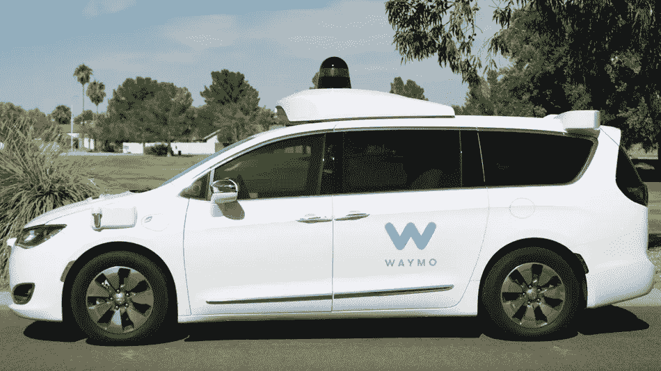

# 人工智能在交通领域的应用实例

> 原文：<https://medium.com/hackernoon/examples-of-ai-implementation-in-transport-c1a451b90fb7>

人工智能正在扰乱许多行业，其影响可以在整个运输行业感受到。汽车行业已经开始在自动驾驶汽车、交通管理等关键任务中应用人工智能。其中安全性和可靠性是主要关注点。尽管这项技术还没有大规模实施，但感觉交通的未来就在眼前。从[特斯拉的自动半卡车](https://futurism.com/teslas-autonomous-semi-truck-spotted-california-highway)到自组织车队，人工智能已经在这个领域显示出有希望的结果。

行业领导者正在专注于自动驾驶技术的优化，他们在人工智能上投入了大量资金。[优步已经为自动驾驶汽车部门筹集了 10 亿美元](https://www.wsj.com/articles/uber-clinches-1-billion-investment-in-self-driving-car-unit-11555635651)。谷歌现在也在致力于开发自动驾驶汽车。还有更多人工智能被部署在汽车行业的例子。以下是人工智能将如何彻底改变运输行业的概述:

# 无人驾驶汽车

自动驾驶汽车不再是梦想。据预测，到 2020 年将有[1000 万辆](https://www.forbes.com/sites/oliviergarret/2017/03/03/10-million-self-driving-cars-will-hit-the-road-by-2020-heres-how-to-profit/#1720e38b7e50)自动驾驶汽车上路。特斯拉、奔驰、宝马等公司已经发布或即将发布自动驾驶汽车。特斯拉承诺在 2020 年底前带来 level-5 autonomy(全自动驾驶汽车)。得益于机器学习和人工智能，Waymo 的无人驾驶机器人出租车已经在美国上市。

近年来，世界取得了如此大的进步。无人驾驶汽车取代传统汽车的日子已经不远了。

# 交通管理

在机器学习的帮助下，人工智能系统可以预测和防止交通堵塞。人工智能算法已经被开发出来，可以战胜世界上最严重的交通堵塞。2018 年，美国人在交通拥堵上花费了[870 亿美元](http://inrix.com/press-releases/scorecard-2018-us/)。人工智能可以简化交通流量，减少拥堵。智能交通灯系统可以更有效地管理交通，从而节省大量资金。有了人工智能，你就不太可能陷入交通堵塞。此外，人工智能可以处理复杂的数据，并向司机建议最佳路线。

# 无人驾驶公交车

人工智能将扰乱公共交通。无人驾驶公交车在欧洲街头随处可见。早在 2016 年，[世界上第一辆无人驾驶公交车](https://www.telegraph.co.uk/news/2016/09/03/worlds-first-driverless-bus-service-begins-carrying-passengers-i/)在法国城市里昂推出，从那以后就有了很大的进步。2018 年，斯德哥尔摩还推出了无人驾驶公交车，时速可达 20 英里。使用传感器、摄像头、GPS 技术和人工智能，这些公共汽车能够将乘客运送到目的地。德国也引进了一种水陆两用巴士，这是独一无二的。所以，下次你对和家人乘船旅行感到困惑，或者你想在德国租一辆巴士，你可能会选择水陆两用巴士。无人驾驶巴士也成为主流只是时间问题。

# 飞行无人机出租车

虽然像亚马逊这样的公司正在考虑为客户提供无人机送货，但我们不妨在未来见证无人机出租车。2017 年，迪拜的无人机出租车进行了首航。优步还与美国国家航空航天局签署了一份合同，开发一款飞行出租车软件。波音公司也在从事类似的项目。有了飞行出租车，你可以避开车流，很快到达目的地。乘坐飞行出租车上下班将会更有趣。

# 数字车牌

甚至像车牌这样简单的东西都有可能受到人工智能的影响。迪拜正计划推出带有数字屏幕、全球定位系统和发射器的智能车辆牌照。这些车牌会在发生事故时通知紧急服务部门。此外，这些车牌可以连接到你的银行账户，并支付你的停车罚款。该技术还允许与其他司机进行实时通信，并将对他们有很大帮助。美国也计划在汽车上安装智能车牌。

# 航班延误预测

如果航空公司及时通知你，航班延误提醒会很有帮助。老实说，航空公司经常很晚才通知你航班延误。AI 可以帮助解决这个问题。科技巨头谷歌甚至在航空公司之前就已经在使用人工智能[预测航班延误](https://www.engadget.com/2018/01/31/google-flights-predicts-delays/)。谷歌航班使用历史航班数据和机器学习来预测延误。只有当谷歌航班对其猜测至少有 80%的把握时，你才会收到通知。它还会告诉你某张票包含哪些优惠。在未来，我们可以期待人工智能以 100%的准确率预测延误。

# 无船员货船

人工智能被用来制造无人驾驶的货船来安全运输货物。罗尔斯·罗伊斯已经与谷歌合作制造[自动驾驶船](https://www.forbes.com/sites/bernardmarr/2017/10/23/rolls-royce-and-google-partner-to-create-smarter-autonomous-ships-based-on-ai-and-machine-learning/#766b6aa6dfe9)来完成这项工作。将于 2020 年推出。这个想法是取代 20 多名船员的工作，让船负责所有的任务。这些船只将会有传感器来追踪船只引擎的性能。货物的装卸也将在没有人力的情况下完成。这项技术将使运输更快，船只不会在恶劣天气、暴风雨等中迷路。

我们可以肯定地说，在未来的未来，交通运输行业将由人工智能主导。看看这项技术在未来几年里会带来什么将会很有趣。